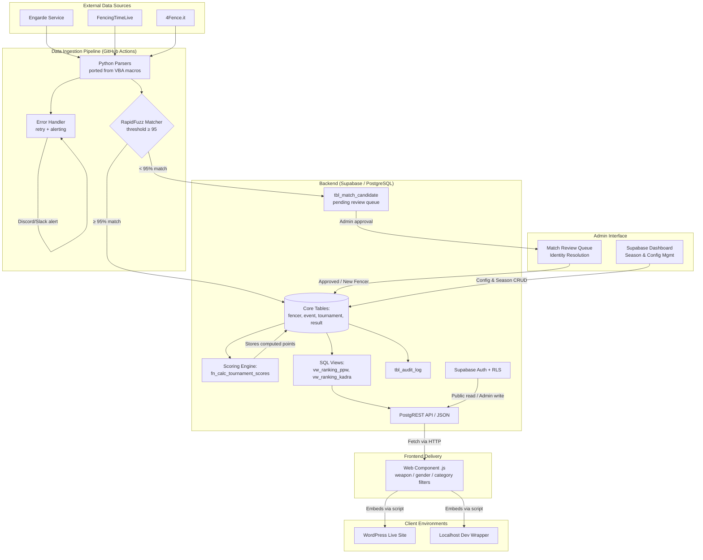
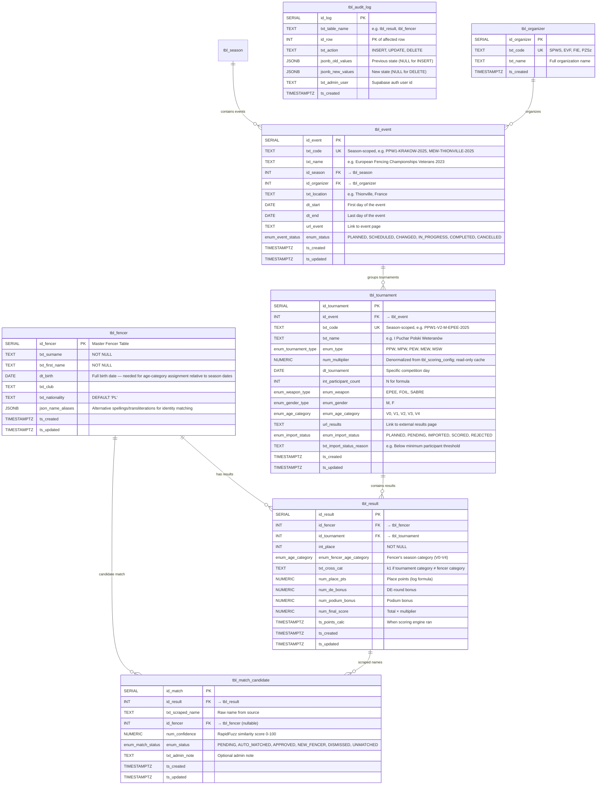
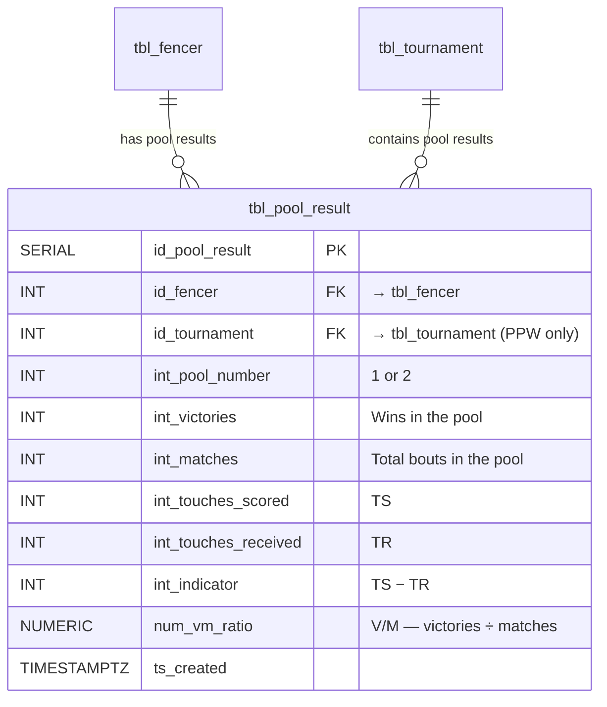

# Project Specification: SPWS Automated Ranklist System

## 1. Problem Statement
The Stowarzyszenie Polskich Weteranów Szermierki (SPWS) currently manages its complex, multi-layered ranking system (PPW Ranking, Kadra Ranking) using manual Excel spreadsheets and VBA macros. This legacy approach presents several critical challenges:
* **High Operational Overhead:** Administrators must manually trigger macros, resolve fencer identities, and copy-paste results after every tournament.
* **Mathematical Limitations:** Excel struggles to efficiently calculate dynamic, rolling timeframes (e.g., "Best 4 of 5 results in the last 12 months"), forcing the organization to rely on rigid "analogous tournament" season mappings.
* **Poor Web Integration:** Displaying Excel data on the official WordPress CMS is clunky, hard to style, and not responsive for mobile users.
* **Risk of Data Loss/Corruption:** Storing canonical national sports data in individual spreadsheet files creates a single point of failure and version control issues.

## 2. Goal & Vision
To engineer a platform-independent, fully automated data pipeline and ranking engine. The system will ingest tournament results from external web platforms, perform algorithmic identity resolution, execute complex ranking mathematics at the database level, and seamlessly expose a "Live" ranklist via a decoupled Web Component on the SPWS website.

## 3. Core Use Cases

### 3.1 Data Ingestion & Scoring

| ID | Phase | Actor | Action / Description | Acceptance Criteria |
| :- | :---- | :---- | :------------------- | :------------------ |
| **UC1** | 1 | **System (Scraper)** | **Automated Data Ingestion:** System polls specified FencingTimeLive / Engarde / 4Fence URLs, extracts placement data, and standardizes the output. One tournament is imported at a time, within one event at a time. | (a) Scraper produces a standardized result set (fencer name, place, participant count) for a given tournament URL. (b) Raw results inserted into `tbl_result` with `num_final_score = NULL`. (c) `tbl_tournament.enum_import_status` set to `IMPORTED`. (d) On failure, GitHub Actions workflow posts alert to Discord/Slack and logs error details. |
| **UC2** | 1 | **Admin** | **Manual Result Upload:** When results are only available as PDF/email or from an unsupported platform, admin uploads results via CSV or manual entry form. | (a) Admin uploads a CSV file or enters results manually via the Admin UI. (b) Rows are inserted into `tbl_result` identically to UC1 output. (c) `tbl_tournament.enum_import_status` set to `IMPORTED`. |
| **UC3** | 1 | **System (Matcher)** | **Identity Resolution:** System compares scraped names to the Master Fencer Table using RapidFuzz. Confident matches (score ≥ 95) are auto-linked. Uncertain matches are flagged for admin review (UC4). | (a) Each imported name is compared against `tbl_fencer` + `json_name_aliases`. (b) Match ≥ 95 → `tbl_result.id_fencer` set automatically, `tbl_match_candidate` row created with `enum_status = 'AUTO_MATCHED'`. (c) Match < 95 → `tbl_match_candidate` row with status `PENDING`, `id_fencer = NULL` on `tbl_result`. (d) No match candidates → status `UNMATCHED`. |
| **UC4** | 1 | **Admin** | **Manual Identity Review:** Admin views flagged fencer identities from UC3 and clicks to approve a suggested match, create a new fencer record, or dismiss. | (a) Admin UI shows all `PENDING` / `UNMATCHED` rows from `tbl_match_candidate`. (b) Admin can approve (links `id_fencer`), create new fencer, or dismiss. (c) Approved rows update `tbl_result.id_fencer`. (d) `tbl_match_candidate.enum_status` updated to `APPROVED` / `NEW_FENCER` / `DISMISSED`. |
| **UC5** | 1 | **System (Scoring)** | **Score Calculation:** After results are imported and identities resolved, the scoring engine (`fn_calc_tournament_scores`) computes all point components using the active `tbl_scoring_config` parameters and stores them in `tbl_result`. This is an explicit step — not automatic on insert. | (a) All four point columns (`num_place_pts`, `num_de_bonus`, `num_podium_bonus`, `num_final_score`) populated for every result row in the tournament. (b) `ts_points_calc` set to `NOW()`. (c) `tbl_tournament.enum_import_status` set to `SCORED`. (d) Multiplier sourced from `tbl_scoring_config` (not from `tbl_tournament.num_multiplier`). |
| **UC6** | 2 | **Admin** | **Manual Recalculation:** Admin corrects a result (place, participant count) and explicitly triggers a recalculation for the affected tournament. `ts_points_calc` updates to reflect the new calculation date. | (a) Admin edits `int_place` or `int_participant_count` via Admin UI. (b) Change recorded in `tbl_audit_log`. (c) Admin clicks "Recalculate" → scoring engine re-runs for the tournament. (d) `ts_points_calc` updated; old scores overwritten. |

### 3.2 Season & Configuration Management

| ID | Phase | Actor | Action / Description | Acceptance Criteria |
| :- | :---- | :---- | :------------------- | :------------------ |
| **UC7** | 1 | **Admin** | **Season Setup:** Admin creates a new season (start date, end date, code like "2025-2026") and its associated scoring configuration (`tbl_scoring_config`), defining all formula parameters, best-of counts, multipliers, and minimum participant thresholds. | (a) `tbl_season` row created with `txt_code`, `dt_start`, `dt_end`. (b) Corresponding `tbl_scoring_config` row created with all defaults. (c) Only one season can have `bool_active = TRUE` at a time (enforced by partial unique index). |
| **UC8** | 1 | **Admin** | **Season Calendar — Add Event:** Admin adds an event to the season (e.g., "European Veterans Championship — Thionville"). An event groups multiple tournaments under a single organizer, location, and date range. | (a) `tbl_event` row created with `id_season`, `id_organizer`, `txt_name`, `dt_start`, `dt_end`. (b) `enum_status` defaults to `PLANNED`. |
| **UC9** | 1 | **Admin** | **Season Calendar — Add Tournament to Event:** Admin adds individual tournament entries within an event (e.g., "Men Epee V2" at the Thionville event), specifying weapon, gender, age category, tournament type (PPW/MPW/PEW/MEW/MSW), and the results URL. | (a) `tbl_tournament` row created with season-scoped `txt_code` (e.g., `PPW1-V2-M-EPEE-2025`). (b) `enum_import_status` defaults to `PLANNED`. (c) `num_multiplier` auto-populated from `tbl_scoring_config` based on `enum_type`. |
| **UC10** | 1 | **Admin** | **Tournament Lifecycle Management:** Admin updates tournament/event status as it progresses: PLANNED → SCHEDULED → IN_PROGRESS → COMPLETED. Date and location changes are tracked. Cancellation is supported. | (a) Status transitions follow the defined lifecycle (§9.7). (b) Invalid transitions rejected with error message. (c) Date/location changes logged in `tbl_audit_log`. |
| **UC11** | 1 | **Admin** | **Scoring Config Tuning:** Admin modifies scoring parameters for the active season (e.g., changing `int_ppw_best_count` from 4 to 3 during POC). Changes apply to future scoring runs only — already-calculated scores are not automatically affected (§9.5 principle). | (a) Admin can edit any `tbl_scoring_config` field via Admin UI or `fn_import_scoring_config`. (b) `ts_updated` reflects the change time. (c) Existing `num_final_score` values are NOT automatically recalculated. |

### 3.3 Public-Facing

| ID | Phase | Actor | Action / Description | Acceptance Criteria |
| :- | :---- | :---- | :------------------- | :------------------ |
| **UC12** | 1 | **End User (Fencer)** | **Public Ranklist Browsing:** User views the live ranklist, filtering by Weapon (epee/foil/sabre), Gender (M/F), Age Category (V0–V4), and Season. | (a) Web Component loads ranking data from PostgREST API. (b) Four filter dropdowns: weapon, gender, category, season. (c) Table shows rank, fencer name, total score, tournament breakdown columns. (d) Default view: active season, sorted by total descending. |
| **UC13** | 1 | **End User (Fencer)** | **Audit/Drill-down View:** User clicks on their total score to view a transparent breakdown of which tournaments, DE wins, and multipliers contributed to their rank. | (a) Click on a fencer row expands or navigates to detail view. (b) Detail shows each tournament: name, date, place, N, place points, DE bonus, podium bonus, multiplier, final score. (c) Data sourced from `vw_score`. |
| **UC14** | 2 | **End User (Fencer)** | **Historical Season View:** User selects a past season to view the archived final rankings for that season. | (a) Season selector dropdown populated from `tbl_season`. (b) Selecting a past season loads its frozen ranking snapshot. (c) Current season shows live calculated rankings. |

### 3.4 Data Corrections & Maintenance

| ID | Phase | Actor | Action / Description | Acceptance Criteria |
| :- | :---- | :---- | :------------------- | :------------------ |
| **UC15** | 2 | **Admin** | **Result Correction:** Admin edits a fencer's placement or participant count for a tournament after import. The correction is logged and requires explicit re-scoring (UC6). | (a) Admin edits result via Admin UI. (b) Old values logged in `tbl_audit_log` with timestamp and admin identity. (c) `tbl_tournament.enum_import_status` reverts to `IMPORTED` until re-scored. |
| **UC16** | 2 | **Admin** | **Fencer Master Table Update:** Admin adds a new fencer, corrects a name/alias, or merges duplicate records. Previously unmatched results are then re-processed by the identity matcher to link them to the correct `id_fencer`. | (a) Admin can add/edit fencers and their `json_name_aliases`. (b) Merge operation re-points all `tbl_result.id_fencer` references from the duplicate to the canonical fencer. (c) Unmatched `tbl_match_candidate` rows are re-evaluated against updated Master Table. |
| **UC17** | 2 | **Admin** | **Reprocessing:** Admin triggers a bulk re-import of a tournament's data (e.g., after a scraper fix or Master Table update). The system re-runs identity resolution and optionally re-scores. | (a) Admin selects a tournament and triggers "Re-import". (b) Existing `tbl_result` rows for that tournament are soft-deleted or overwritten. (c) Identity resolution re-runs. (d) Optionally re-scores if admin confirms. |

### 3.5 Scoring Configuration Workflow

| ID | Phase | Actor | Action / Description | Acceptance Criteria |
| :- | :---- | :---- | :------------------- | :------------------ |
| **UC18** | 1 | **Admin / Developer** | **Export Scoring Config as JSON:** Admin exports the active season's scoring configuration to a local JSON file via `fn_export_scoring_config` (called via Python helper or Supabase SQL editor). The JSON file can be edited in any text editor and version-controlled in Git. See §8.6.3 for the SQL function and §8.6.4 for the Python helper. | (a) `fn_export_scoring_config(id_season)` returns a valid JSON object containing all 17 parameters (16 typed columns + `json_extra`) plus `id_season` and `season_code` metadata. (b) Python helper `calibrate_config.py export` writes the JSON to a local file. (c) Exported JSON is human-readable (indented, named keys matching §8.6.1). (d) Export is idempotent — repeated calls return the same data if config unchanged. |
| **UC19** | 1 | **Admin / Developer** | **Import Scoring Config from JSON:** Admin imports a locally-edited JSON config file back into the database via `fn_import_scoring_config` (called via Python helper or Supabase SQL editor). The function validates and upserts the config, updating `ts_updated`. See §8.6.3. | (a) `fn_import_scoring_config(json)` upserts all 16 typed columns + `json_extra` into `tbl_scoring_config`. (b) `ts_updated` is set to `NOW()`. (c) Missing JSON keys use existing DB values (partial update supported). (d) Invalid types (e.g., string for `mp_value`) raise a clear error. (e) Python helper `calibrate_config.py import` reads a local file and calls the RPC. |
| **UC20** | 1 | **Admin / Developer** | **Calibration — Compare Scoring Output vs Excel:** Developer runs the comparison script (`calibrate_compare.py`) to verify that the database scoring output matches the reference Excel spreadsheet row-by-row. Mismatches are reported with fencer name, tournament, expected vs actual values, and the diff. See §8.6.4–§8.6.5. | (a) Script loads Excel reference data and DB scores for the same season. (b) Each fencer × tournament score is compared within a configurable tolerance (default 0.01). (c) Mismatches printed as structured output (fencer, tournament, excel value, db value, diff). (d) Zero mismatches prints a success message. (e) Missing fencers or scores are reported separately. |

## 4. Solution Assumptions

### Business & Operational Assumptions
* **Scope:** The ranking system is strictly limited to Polish Veterans Fencing Association tournament participants.
* **Data Availability:** The "Master Fencer Table" (list of active Polish veterans and their birth dates) will be provided and maintained by SPWS admins.
* **Human-in-the-Loop:** While the goal is 95% automation, an SPWS administrator will periodically review the 5% of unmatched/misspelled names.

### Target Platforms

The system must scrape tournament results from the following platforms:

| Platform | URL | Notes |
|----------|-----|-------|
| FencingTimeLive | https://fencingtimelive.com | Primary platform for many SPWS domestic tournaments |
| Engarde Service | https://engarde-service.com | Widely used in European veterans fencing |
| 4Fence | https://www.4fence.it | Italian platform, used by some EVF events |

> **Starting point:** Existing VBA macros (from the legacy Excel system) contain working parsing logic for these platforms. These macros will be translated into Python as the basis for the scraper scripts, preserving proven field-mapping and edge-case handling while modernizing the implementation.

### Technical Assumptions
* **Scraping Feasibility:** Target platforms (FencingTimeLive, Engarde, 4Fence) will not implement aggressive anti-bot measures (like Captchas) that block basic Python HTTP requests.
* **Scraper Versioning:** External platforms will change their HTML structure or API responses over time. When a scraper breaks due to a format change, a **new version** of the parsing script must be created to handle the updated format. Old scraper versions are retained for re-processing historical data if needed. The automated alerting system (§7) will notify admins immediately when an import fails, triggering the development of the new scraper version.
* **Cloud Constraints:** The system will operate comfortably within the Supabase Free Tier limits (500MB DB storage, sufficient API requests), Github.
* **CMS Independence:** The WordPress site allows the embedding of custom `<script>` tags and HTML custom elements (Web Components). WordPress CMS may be changed in a future iteration to an alternative solution. Therefore the Automated Ranklist System must be independent, separate, and ready to be ported to another site.

## 5. High-Level Architecture
The system utilizes a **Decoupled (Headless) Micro-Frontend Architecture**.

1.  **Ingestion Layer:** Python scripts running on scheduled serverless functions (e.g., GitHub Actions).
2.  **Database & Logic Layer:** PostgreSQL (Supabase) serving as the single source of truth. A scoring engine function computes points at import time and stores them alongside raw results. SQL Views aggregate stored points into rankings.
3.  **API Layer:** PostgREST automatically exposes the SQL Views as secure, read-only JSON endpoints.
4.  **Presentation Layer:** A Svelte or React application compiled into a framework-agnostic Web Component utilizing a Shadow DOM to prevent CSS bleeding from the host CMS.




## 6. Implementation Phasing & Solution Approach

To manage complexity, the system will be built iteratively, ensuring value is delivered at each stage while keeping the final, holistic requirements in mind.

### Phase 1: Proof of Concept (POC)

- **Goal:** Validate the core math, scraping viability, admin workflow, and UI portability.

- **Scope:** Male Epee V2 (50+) category only.

- **Use Cases:** UC1–UC5 (ingestion, matching, scoring), UC7–UC11 (season/config management), UC12–UC13 (public ranklist + drill-down), UC18–UC20 (scoring config export/import/calibration).

- **Deliverables:**

    - Python scrapers for FencingTimeLive, Engarde, and 4Fence — logic ported from existing VBA macros.

    - Full PostgreSQL schema: `tbl_fencer`, `tbl_organizer`, `tbl_event`, `tbl_tournament`, `tbl_result`, `tbl_season`, `tbl_scoring_config`, `tbl_match_candidate`, `tbl_audit_log`.

    - Scoring engine (`fn_calc_tournament_scores`) implementing the EVF/SPWS Log Formula (§8.1).

    - SQL Views: `vw_score` (denormalised drill-down), `vw_ranking_ppw` (PPW ranking with configurable best-of + conditional MPW drop).

    - Season & scoring configuration management via Admin UI (Supabase Dashboard for POC).

    - **Hybrid scoring config workflow (§8.6):** `fn_export_scoring_config` and `fn_import_scoring_config` SQL functions enabling JSON export/import for rapid local editing. Python helpers (`calibrate_config.py`, `calibrate_compare.py`) for the calibration loop.

    - Supabase Auth with RLS policies: public read on ranking views, admin write on all tables.

    - Identity resolution pipeline (RapidFuzz matcher + `tbl_match_candidate` for admin review).

    - GitHub Actions pipeline with error handling, retries, and Discord/Slack alerting.

    - DB migration scripts (Supabase CLI migrations) and seed data for one test season (including default `tbl_scoring_config` with calibrated parameters).

    - Web Component running locally in a "Shadow Wrapper" mimicking WordPress CSS, featuring the Ranklist View (with weapon/gender/category filters) and Drill-down Audit View.

### Phase 2: Minimum Viable Product (MVP)

- **Goal:** Replace the Excel system for domestic + international rankings across all categories.

- **Scope:** All 30 sub-rankings (3 Weapons × 2 Genders × 5 Categories). Note: V0 (30–39) is a domestic SPWS category with no EVF international equivalent, so V0 fencers have PPW rankings only (no Kadra ranking).

- **Use Cases:** UC6 (manual recalculation), UC14 (historical seasons), UC15–UC17 (corrections, master table updates, reprocessing).

- **Deliverables:**

    - Scale scrapers to handle all weapon/gender/category combinations across all 3 platforms.

    - Implement the continuous age-category migration logic (automatic movement between V0–V4 based on fencer's age at `dt_start` of the active `tbl_season`).

    - **MSW Tournament Type:** Recognise MSW (World Veterans Championship) results with a configurable multiplier (default 2.0). MSW-specific Kadra aggregation rules are deferred to Phase 3.

    - **Kadra Ranking View:** Implement `vw_ranking_kadra` combining domestic PPW totals with best international PEW/MEW/MSW results per the configurable aggregation rules (§8.3.2).

    - **Historical Season View:** Season selector with frozen JSON snapshots for past seasons.

    - **Result corrections & reprocessing workflow** with full audit trail.

    - Deploy Web Component to the live WordPress site.

### Phase 3: Advanced Integrations

- **Goal:** Pool-level tracking and Kadra tier automation.

- **Deliverables:**

    - **SuperFive Ranking:** Upgrade scrapers to pull V/M (victories/matches), TS (touches scored), and Ind (indicator) metrics from PPW pool rounds. Implement `tbl_pool_result` (see §9.8) and a separate `vw_ranking_superfive` view. SuperFive relates only to PPW pool-round data, not DE results.

    - **Kadra Tier Classification:** Add `vw_kadra_tiers` view that classifies fencers into Kadra A, B, C, or D based on configurable thresholds (start counts and point thresholds stored in `tbl_scoring_config.json_extra`). This is used only for National Team nomination discussions and is kept as a separate view from `vw_ranking_kadra`.

### Future Enhancements (Post-Phase 3)

- **National Team Builder:** An algorithmic tool that suggests legal 4-person team lineups optimizing for total points while strictly adhering to the EVF age-balance rules (requiring specific ratios of Cat 2 and Cat 4 fencers).
    

## 7. Elegance & Optimization considerations (Making it Better)

To ensure the solution is not just functional, but professional and resilient:

- **API Caching:** Because historical rankings rarely change, we should implement stale-while-revalidate caching on the API calls. This ensures the WordPress UI loads instantly and reduces the load on the Supabase free tier.
    
- **Automated Alerting:** Integrate a Discord or Slack Webhook into the Python GitHub Actions. If a scraper fails (e.g., Engarde changes their HTML structure), the admin gets a message immediately rather than realizing data is missing weeks later.
    
- **Historical Snapshots:** At end-of-season, a trigger saves a static JSON snapshot of the final rankings. This preserves history immutably before the new season begins.
    
- **Skeleton Loaders in UI:** The Web Component will display a highly polished "shimmering" skeleton layout matching the table structure while data is being fetched, preventing layout shift on the WordPress page.

## 8. Detailed Scoring Mathematics (Derived from Legacy Excel)

> **Source:** Analysis of `SZPADA-2-2024-2025.xlsx` (Men's Epee Cat.2 / 50+).
> These formulas must be faithfully reproduced by the scoring engine (`fn_calc_tournament_scores`).

### 8.1 Per-Tournament Score Components

A fencer's total points at a single tournament are the sum of three independent components:

$$\text{Total} = \text{PlacePoints} + \text{DE\_Bonus} + \text{PodiumBonus}$$

#### 8.1.1 Place Points (Log Formula)

$$\text{PlacePoints} = MP - (MP - 1) \times \frac{\log(place)}{\log(N)}$$

| Symbol | Meaning | Default |
|--------|---------|---------|
| $MP$ | Maximum points (awarded to 1st place) | 50 |
| $place$ | Fencer's final placement (1-based) | — |
| $N$ | Total number of participants in the tournament | — |

**Edge cases:**
- If $N = 1$: the single fencer receives $MP = 50$ points (special case bypassing the formula).
- If $place > N$: the fencer receives no points (empty string / excluded).

> **Note:** The spec previously contained a typographical error with a double-log: $\log(\log(place))$. The correct formula from the Excel uses a single $\log(place)$.

#### 8.1.2 DE (Direct Elimination) Round Bonus

The number of DE rounds a fencer survived is computed as:

$$\text{DE\_rounds} = \lfloor \log_2(N) \rfloor - \lceil \log_2(place) \rceil + c$$

Where the correction factor $c$:
- $c = 0$ if $N$ is an exact power of 2 (i.e., $N \in \{1, 2, 4, 8, 16, 32, 64, 128, 256\}$)
- $c = 1$ otherwise

The bonus per DE round is derived from the cube root of participant count:

$$\text{bonus\_per\_round} = 3 \times N^{1/3}$$

> **Note:** The constant **3** corresponds to the number of podium places (1st, 2nd, 3rd) and is intentionally hardcoded — it is not a configurable parameter.

$$\text{DE\_Bonus} = \text{DE\_rounds} \times \text{bonus\_per\_round}$$

#### 8.1.3 Podium Bonus

Only the top 3 finishers receive a podium bonus, scaled by the per-round bonus:

| Place | Podium Bonus |
|-------|-------------|
| 1st   | $3 \times \text{bonus\_per\_round}$ |
| 2nd   | $2 \times \text{bonus\_per\_round}$ |
| 3rd   | $1 \times \text{bonus\_per\_round}$ |
| 4th+  | 0 |

### 8.2 Tournament Multipliers

Certain tournament types apply a multiplier to the **total** tournament score (PlacePoints + DE_Bonus + PodiumBonus):

| Tournament Type | Multiplier | Config Column | Final Score |
|----------------|-----------|---------------|-------------|
| PPW (Puchar Polski Weteranów) | **1.0** | `num_ppw_multiplier` | Total × 1.0 |
| MPW (Mistrzostwa Polski Weteranów) | **1.2** | `num_mpw_multiplier` | Total × 1.2 |
| PEW (International EVF circuit) | **1.0** | `num_pew_multiplier` | Total × 1.0 |
| MEW (Mistrzostwa Europy Weteranów — European Veterans Championship, odd years only) | **2.0** | `num_mew_multiplier` | Total × 2.0 |
| MSW (Mistrzostwa Świata Weteranów — World Veterans Championship, yearly Oct/Nov) | **2.0** | `num_msw_multiplier` | Total × 2.0 |

> **Note:** All multipliers are configurable via `tbl_scoring_config`. PPW and PEW default to 1.0 but are stored as explicit columns to allow future adjustment without code changes. MSW is Phase 2+ — the scoring engine recognises the tournament type but MSW-specific Kadra aggregation rules are deferred.

### 8.3 Ranking Aggregation Rules

There are **two distinct ranking sheets** with different aggregation logic:

#### 8.3.1 PPW Ranking (Domestic Ranking — "Ranking" sheet)

Considers up to 6 domestic tournament slots: PPW1–PPW5 + MPW.

A season typically has **5 PPW rounds** and **1 MPW** (National Championship). The aggregation uses a configurable "best-of" rule (see §9.3):

$$\text{PPW\_Total} = \text{best } K \text{ of PPW1…PPW5} + \text{MPW (if MPW ≥ worst-included PPW, else replaced by next-best PPW)}$$

Where $K$ = `int_ppw_best_count` from `tbl_scoring_config` (default 4).

**Drop logic (configurable):** The system selects the best $K$ PPW scores. It then checks whether the MPW score exceeds the lowest of those $K$ selected PPW scores. If yes, MPW is added to the total. If no, the MPW is dropped and the $(K+1)$-th best PPW is used instead — effectively best $(K+1)$ of all PPW rounds.

**Example:**
- PPW scores: 89, 102, 76, 55, 92 → best 4 = 102, 92, 89, 76 (drop 55)
- MPW: 36 → 36 < 76 (worst included PPW) → MPW dropped, take 5th PPW (55) instead
- Total = 102 + 92 + 89 + 76 + 55 = **414**

Alternatively, if MPW were 80:
- 80 ≥ 76 → MPW included
- Total = 102 + 92 + 89 + 76 + 80 = **439**

#### 8.3.2 Kadra Ranking (National Team Selection — "Kadra" sheet)

Combines domestic and international results:

$$\text{Kadra\_Total} = \text{PPW\_Total} + \text{best } J \text{ of PEW scores} + \text{MEW (conditional)}$$

Where $J$ = `int_pew_best_count` from `tbl_scoring_config` (default 3).

The same conditional logic as the domestic ranking applies to the MEW (European Championship) score: the system selects the best $J$ PEW scores, then checks whether MEW ≥ the lowest included PEW. If yes, MEW is added. If no, MEW is dropped and the $(J+1)$-th best PEW replaces it.

**PEW pool:** EVF organizes a variable number of international circuit events each season (typically up to 12). The system considers all available PEW results and selects the best $J$.

**MEW frequency:** The European Veterans Championship (MEW) occurs every **odd-numbered** year. In even years, no MEW score exists for the Kadra calculation — only PEW results contribute.

**Example (odd year, MEW exists):**
- Best 3 PEW: 95, 88, 72
- MEW: 60 → 60 < 72 → MEW dropped, take 4th PEW instead
- International contribution = best 4 PEW scores

**Example (even year, no MEW):**
- International contribution = best 3 PEW scores only

### 8.4 Tournament Type Taxonomy

The Excel reveals a structured tournament classification not fully documented previously:

| Code | Full Name | Type | Multiplier | Count per Season |
|------|-----------|------|-----------|-----------------|
| PPW1–PPW5 | Puchar Polski Weteranów (rounds I–V) | Domestic Cup | 1.0 | 5 (typical) |
| MPW | Mistrzostwa Polski Weteranów | National Championship | 1.2 | 1 |
| PEW1–PEW12 | International EVF circuit events | International | 1.0 | variable, up to ~12 |
| MEW | Mistrzostwa Europy Weteranów (European Veterans Championship) | International | 2.0 | 0 or 1 (odd years only) |
| MSW | Mistrzostwa Świata Weteranów (World Veterans Championship) | International | 2.0 | 1 (yearly, Oct/Nov) |

> **Note:** Earlier Excel sheets used "PP" as a tab name for some PPW rounds — this was merely a naming inconsistency in the spreadsheet. PP and PPW are the same tournament type. The system uses only **PPW** as the canonical code.

### 8.5 Additional Implementation Requirements (from Excel analysis)

1. **Minimum-participant threshold (international only):** When a PEW/MEW/MSW tournament has fewer than the configured minimum number of participants (default: 5), its results are imported but flagged with `enum_import_status = 'REJECTED'` and a reason text. Rejected tournaments are excluded from ranking views. PPW/MPW domestic tournaments have no minimum — any participant count > 0 is valid.

2. **Cross-category participation ("k1" notation):** A fencer's age category is determined at `dt_start` of the active season (§9.2). When a fencer ages into a new category (e.g., V1 → V2), they compete in their new category for the entire season. However, results from a tournament whose `enum_age_category` differs from the fencer's season category are marked `txt_cross_cat = 'k1'` in `tbl_result`. Cross-category results count toward the **tournament's** category ranking (not the fencer's home category), ensuring the fencer is ranked among peers they actually competed against. The `enum_fencer_age_category` column records the fencer's own season category for auditing purposes.

3. **International participant filtering:** PEW and MEW sheets include non-Polish fencers (marked with 'x' in club column or identified by country code). Only fencers in the SPWS fencers table should be added to the rankings. The scraper/importer must filter the results based on the SPWS fencers content.

4. **Fencer name format:** Names in the Excel follow `SURNAME FirstName` format (e.g., "ATANASSOW Aleksander"). The identity resolution system must handle this format consistently.

5. **Reprocessing after Master Table updates:** When a new fencer is added to the Master Fencer Table (or a name alias is corrected), the system must support re-importing / reprocessing previously ingested tournament data so that the newly recognized fencer's results are linked and their ranking recalculated.

### 8.6 Scoring Configuration: What, Why, and How

Every number in the scoring formulas (§8.1–§8.3) that isn't derived from live data (`int_place`, `int_participant_count`) is a **tunable parameter** stored in `tbl_scoring_config`. This section documents what each parameter controls, why configuration matters, and how the hybrid table + JSON workflow enables rapid calibration during POC.

#### 8.6.1 Parameter Inventory

| # | DB Column | Controls | Default | Formula Reference |
|---|-----------|----------|---------|-------------------|
| 1 | `int_mp_value` | Ceiling of the place-points formula ($MP$) | 50 | $MP - (MP-1) \times \frac{\log(place)}{\log(N)}$ (§8.1.1) |
| 2 | `int_podium_gold` | 1st-place multiplier of bonus_per_round | 3 | $3 \times \text{bonus\_per\_round}$ (§8.1.3) |
| 3 | `int_podium_silver` | 2nd-place multiplier | 2 | $2 \times \text{bonus\_per\_round}$ (§8.1.3) |
| 4 | `int_podium_bronze` | 3rd-place multiplier | 1 | $1 \times \text{bonus\_per\_round}$ (§8.1.3) |
| 5 | `num_ppw_multiplier` | Domestic cup score multiplier | 1.0 | Total × 1.0 (§8.2) |
| 6 | `int_ppw_best_count` | How many of ~5 PPW rounds count ($K$) | 4 | best $K$ of PPW1–PPW5 (§8.3.1) |
| 7 | `int_ppw_total_rounds` | Expected PPW events in season | 5 | Validation / UI hint |
| 8 | `num_mpw_multiplier` | National championship score multiplier | 1.2 | Total × 1.2 (§8.2) |
| 9 | `bool_mpw_droppable` | Can MPW be replaced by next-best PPW? | TRUE | Conditional drop logic (§8.3.1) |
| 10 | `num_pew_multiplier` | International EVF circuit score multiplier | 1.0 | Total × 1.0 (§8.2) |
| 11 | `int_pew_best_count` | How many international PEW rounds count ($J$) | 3 | best $J$ of PEW scores (§8.3.2) |
| 12 | `num_mew_multiplier` | European championship score multiplier | 2.0 | Total × 2.0 (§8.2) |
| 13 | `bool_mew_droppable` | Can MEW be replaced by next-best PEW? | TRUE | Conditional drop logic (§8.3.2) |
| 14 | `num_msw_multiplier` | World championship score multiplier | 2.0 | Total × 2.0 (§8.2) — Phase 2+ |
| 15 | `int_min_participants_evf` | Minimum $N$ for PEW/MEW/MSW to count | 5 | Eligibility filter (§8.5) |
| 16 | `int_min_participants_ppw` | Minimum $N$ for PPW/MPW to count | 1 | Eligibility filter (§8.5) |
| 17 | `json_extra` | Overflow JSONB for future parameters | `{}` | Phase 3 Kadra tier thresholds, etc. |

**Complexity note:** The individual parameters are simple numbers and booleans. The complexity arises from three factors:
1. **Per-season versioning** — Season 2024-25 might use $K=4$, while 2025-26 switches to $K=3$.
2. **Parameter interaction** — Changing `int_mp_value` from 50→100 doubles place points without affecting DE bonus, shifting the ratio of place-to-bonus contribution.
3. **Calibration against the spreadsheet** — During POC, output must match the existing Excel row-by-row. Fast iteration is essential: change a value → re-run scoring → compare → repeat.

#### 8.6.2 Hybrid Configuration Approach (Table + JSON Export/Import)

The system uses a **hybrid** approach that combines the engineering rigour of a database table with the editing convenience of a JSON file:

**Production truth** lives in `tbl_scoring_config` (the database table):
- Scoring engine functions join directly to it during calculation
- Per-season versioning via FK to `tbl_season`
- Typed columns provide schema validation
- RLS protects it in production
- `ts_updated` provides change tracking

**Local editing** is enabled via export/import functions:
- `fn_export_scoring_config(id_season)` returns the full config row as a JSON object
- `fn_import_scoring_config(json)` validates and upserts the JSON back into the table
- The exported JSON can be edited in VS Code, diffed in Git, and shared between developers

**Why not a pure JSON file?**
- A file on disk isn't queryable by SQL — the scoring engine can't `SELECT` it
- Two sources of truth (file + DB) inevitably drift
- The deployed app can't read a local file
- No schema validation unless you build it yourself

**Why not a pure database table (edit via Supabase UI only)?**
- The Supabase Table Editor is clunky for rapid iteration during calibration
- Every tweak requires a browser round-trip
- No local diff/history in your editor

**The hybrid gives both:** Edit locally in JSON for speed → import into the DB for truth.

#### 8.6.3 Export/Import SQL Functions

```sql
-- Export: returns current config for a season as JSON
CREATE OR REPLACE FUNCTION fn_export_scoring_config(p_id_season INT)
RETURNS JSONB
LANGUAGE sql STABLE SECURITY DEFINER
AS $$
  SELECT jsonb_build_object(
    'id_season',              sc.id_season,
    'season_code',            s.txt_code,
    'mp_value',               sc.int_mp_value,
    'podium_gold',            sc.int_podium_gold,
    'podium_silver',          sc.int_podium_silver,
    'podium_bronze',          sc.int_podium_bronze,
    'ppw_multiplier',         sc.num_ppw_multiplier,
    'ppw_best_count',         sc.int_ppw_best_count,
    'ppw_total_rounds',       sc.int_ppw_total_rounds,
    'mpw_multiplier',         sc.num_mpw_multiplier,
    'mpw_droppable',          sc.bool_mpw_droppable,
    'pew_multiplier',         sc.num_pew_multiplier,
    'pew_best_count',         sc.int_pew_best_count,
    'mew_multiplier',         sc.num_mew_multiplier,
    'mew_droppable',          sc.bool_mew_droppable,
    'msw_multiplier',         sc.num_msw_multiplier,
    'min_participants_evf',   sc.int_min_participants_evf,
    'min_participants_ppw',   sc.int_min_participants_ppw,
    'extra',                  sc.json_extra
  )
  FROM tbl_scoring_config sc
  JOIN tbl_season s ON s.id_season = sc.id_season
  WHERE sc.id_season = p_id_season;
$$;

-- Import: upserts a JSON config into the table (supports partial updates —
-- missing keys in the JSON preserve the existing DB value via COALESCE)
CREATE OR REPLACE FUNCTION fn_import_scoring_config(p_config JSONB)
RETURNS VOID
LANGUAGE plpgsql SECURITY DEFINER
AS $$
DECLARE
  v_season INT := (p_config->>'id_season')::INT;
BEGIN
  IF v_season IS NULL THEN
    RAISE EXCEPTION 'id_season is required in the config JSON';
  END IF;

  -- Ensure the season exists
  IF NOT EXISTS (SELECT 1 FROM tbl_season WHERE id_season = v_season) THEN
    RAISE EXCEPTION 'Season % does not exist', v_season;
  END IF;

  INSERT INTO tbl_scoring_config (
    id_season,
    int_mp_value,
    int_podium_gold, int_podium_silver, int_podium_bronze,
    num_ppw_multiplier, int_ppw_best_count, int_ppw_total_rounds,
    num_mpw_multiplier, bool_mpw_droppable,
    num_pew_multiplier, int_pew_best_count,
    num_mew_multiplier, bool_mew_droppable,
    num_msw_multiplier,
    int_min_participants_evf, int_min_participants_ppw,
    json_extra, ts_updated
  ) VALUES (
    v_season,
    COALESCE((p_config->>'mp_value')::INT,              50),
    COALESCE((p_config->>'podium_gold')::INT,            3),
    COALESCE((p_config->>'podium_silver')::INT,          2),
    COALESCE((p_config->>'podium_bronze')::INT,          1),
    COALESCE((p_config->>'ppw_multiplier')::NUMERIC,     1.0),
    COALESCE((p_config->>'ppw_best_count')::INT,         4),
    COALESCE((p_config->>'ppw_total_rounds')::INT,       5),
    COALESCE((p_config->>'mpw_multiplier')::NUMERIC,     1.2),
    COALESCE((p_config->>'mpw_droppable')::BOOLEAN,      TRUE),
    COALESCE((p_config->>'pew_multiplier')::NUMERIC,     1.0),
    COALESCE((p_config->>'pew_best_count')::INT,         3),
    COALESCE((p_config->>'mew_multiplier')::NUMERIC,     2.0),
    COALESCE((p_config->>'mew_droppable')::BOOLEAN,      TRUE),
    COALESCE((p_config->>'msw_multiplier')::NUMERIC,     2.0),
    COALESCE((p_config->>'min_participants_evf')::INT,   5),
    COALESCE((p_config->>'min_participants_ppw')::INT,   1),
    COALESCE(p_config->'extra', '{}'::JSONB),
    NOW()
  )
  ON CONFLICT (id_season) DO UPDATE SET
    int_mp_value              = COALESCE((p_config->>'mp_value')::INT,              tbl_scoring_config.int_mp_value),
    int_podium_gold           = COALESCE((p_config->>'podium_gold')::INT,            tbl_scoring_config.int_podium_gold),
    int_podium_silver         = COALESCE((p_config->>'podium_silver')::INT,          tbl_scoring_config.int_podium_silver),
    int_podium_bronze         = COALESCE((p_config->>'podium_bronze')::INT,          tbl_scoring_config.int_podium_bronze),
    num_ppw_multiplier        = COALESCE((p_config->>'ppw_multiplier')::NUMERIC,     tbl_scoring_config.num_ppw_multiplier),
    int_ppw_best_count        = COALESCE((p_config->>'ppw_best_count')::INT,         tbl_scoring_config.int_ppw_best_count),
    int_ppw_total_rounds      = COALESCE((p_config->>'ppw_total_rounds')::INT,       tbl_scoring_config.int_ppw_total_rounds),
    num_mpw_multiplier        = COALESCE((p_config->>'mpw_multiplier')::NUMERIC,     tbl_scoring_config.num_mpw_multiplier),
    bool_mpw_droppable        = COALESCE((p_config->>'mpw_droppable')::BOOLEAN,      tbl_scoring_config.bool_mpw_droppable),
    num_pew_multiplier        = COALESCE((p_config->>'pew_multiplier')::NUMERIC,     tbl_scoring_config.num_pew_multiplier),
    int_pew_best_count        = COALESCE((p_config->>'pew_best_count')::INT,         tbl_scoring_config.int_pew_best_count),
    num_mew_multiplier        = COALESCE((p_config->>'mew_multiplier')::NUMERIC,     tbl_scoring_config.num_mew_multiplier),
    bool_mew_droppable        = COALESCE((p_config->>'mew_droppable')::BOOLEAN,      tbl_scoring_config.bool_mew_droppable),
    num_msw_multiplier        = COALESCE((p_config->>'msw_multiplier')::NUMERIC,     tbl_scoring_config.num_msw_multiplier),
    int_min_participants_evf  = COALESCE((p_config->>'min_participants_evf')::INT,   tbl_scoring_config.int_min_participants_evf),
    int_min_participants_ppw  = COALESCE((p_config->>'min_participants_ppw')::INT,   tbl_scoring_config.int_min_participants_ppw),
    json_extra                = COALESCE(p_config->'extra',                          tbl_scoring_config.json_extra),
    ts_updated                = NOW();
END;
$$;
```

> **Constraint note:** `fn_import_scoring_config` uses `ON CONFLICT (id_season)` which requires a unique constraint on `tbl_scoring_config.id_season`. This is already implied by the one-config-per-season design.

#### 8.6.4 Python Calibration Helpers

The following Python scripts support the POC calibration workflow — exporting config, tweaking it locally, importing it back, and comparing scoring output against the legacy Excel:

```python
# calibrate_config.py — Export / Import scoring config via Supabase RPC
"""
Usage:
  python calibrate_config.py export --season 1 --output scoring_config.json
  python calibrate_config.py import --input scoring_config.json
"""

import argparse
import json
import os
from pathlib import Path
from supabase import create_client

SUPABASE_URL = os.environ["SUPABASE_URL"]
SUPABASE_KEY = os.environ["SUPABASE_KEY"]

sb = create_client(SUPABASE_URL, SUPABASE_KEY)


def export_config(season_id: int, output_path: Path) -> None:
    """Export scoring config for a season to a local JSON file."""
    result = sb.rpc("fn_export_scoring_config", {"p_id_season": season_id}).execute()
    config = result.data
    output_path.write_text(json.dumps(config, indent=2, ensure_ascii=False))
    print(f"Exported config for season {season_id} → {output_path}")


def import_config(input_path: Path) -> None:
    """Import a local JSON config file into the database."""
    config = json.loads(input_path.read_text())
    sb.rpc("fn_import_scoring_config", {"p_config": config}).execute()
    print(f"Imported config from {input_path} → season {config['id_season']}")


if __name__ == "__main__":
    parser = argparse.ArgumentParser(description="Scoring config export/import")
    sub = parser.add_subparsers(dest="command")

    exp = sub.add_parser("export")
    exp.add_argument("--season", type=int, required=True, help="Season ID")
    exp.add_argument("--output", type=Path, default=Path("scoring_config.json"))

    imp = sub.add_parser("import")
    imp.add_argument("--input", type=Path, default=Path("scoring_config.json"))

    args = parser.parse_args()
    if args.command == "export":
        export_config(args.season, args.output)
    elif args.command == "import":
        import_config(args.input)
```

```python
# calibrate_compare.py — Compare DB scoring output against Excel reference
"""
Usage:
  python calibrate_compare.py --season 1 --excel reference/SZPADA-2-2024-2025.xlsx
"""

import argparse
import json
import os
from pathlib import Path

import openpyxl
from supabase import create_client

SUPABASE_URL = os.environ["SUPABASE_URL"]
SUPABASE_KEY = os.environ["SUPABASE_KEY"]

sb = create_client(SUPABASE_URL, SUPABASE_KEY)


def load_excel_scores(excel_path: Path, sheet_name: str = "Ranking") -> dict:
    """
    Parse the reference Excel file and return a dict of
    {fencer_name: {tournament_code: final_score, ...}, ...}
    Adapt column indices to match your specific Excel layout.
    """
    wb = openpyxl.load_workbook(excel_path, data_only=True)
    ws = wb[sheet_name]
    scores = {}
    # TODO: Map column indices to tournament codes based on header row
    # This is a skeleton — adapt to your Excel structure
    for row in ws.iter_rows(min_row=2, values_only=True):
        name = row[0]  # e.g. "ATANASSOW Aleksander"
        if not name:
            continue
        scores[name] = {
            "total": row[-1],  # Adjust index for total column
        }
    wb.close()
    return scores


def load_db_scores(season_id: int) -> dict:
    """Fetch scored results from DB via vw_score."""
    result = sb.table("vw_score").select("*").eq("id_season", season_id).execute()
    scores = {}
    for row in result.data:
        name = f"{row['txt_surname']} {row['txt_first_name']}"
        if name not in scores:
            scores[name] = {}
        scores[name][row["txt_code"]] = float(row["num_final_score"])
    return scores


def compare(excel_scores: dict, db_scores: dict, tolerance: float = 0.01) -> None:
    """Compare Excel vs DB scores and report mismatches."""
    mismatches = []
    for name, excel_data in excel_scores.items():
        db_data = db_scores.get(name, {})
        if not db_data:
            mismatches.append({"fencer": name, "issue": "MISSING_IN_DB"})
            continue
        for key, excel_val in excel_data.items():
            db_val = db_data.get(key)
            if db_val is None:
                mismatches.append({"fencer": name, "tournament": key, "issue": "MISSING_SCORE"})
            elif excel_val is not None and abs(float(excel_val) - db_val) > tolerance:
                mismatches.append({
                    "fencer": name,
                    "tournament": key,
                    "excel": excel_val,
                    "db": db_val,
                    "diff": round(float(excel_val) - db_val, 4),
                })

    if not mismatches:
        print("✅ All scores match within tolerance!")
    else:
        print(f"❌ {len(mismatches)} mismatches found:")
        for m in mismatches:
            print(f"  {json.dumps(m)}")


if __name__ == "__main__":
    parser = argparse.ArgumentParser(description="Compare DB scores vs Excel reference")
    parser.add_argument("--season", type=int, required=True)
    parser.add_argument("--excel", type=Path, required=True)
    parser.add_argument("--sheet", default="Ranking")
    parser.add_argument("--tolerance", type=float, default=0.01)
    args = parser.parse_args()

    excel = load_excel_scores(args.excel, args.sheet)
    db = load_db_scores(args.season)
    compare(excel, db, args.tolerance)
```

#### 8.6.5 Calibration Workflow (POC)

The typical calibration loop during Phase 1 development:

```
1. Export current config:
   python calibrate_config.py export --season 1

2. Edit scoring_config.json in VS Code
   (e.g., change mp_value from 50 to 60)

3. Import updated config:
   python calibrate_config.py import

4. Re-score a tournament:
   -- via Supabase SQL editor or Admin UI
   SELECT fn_calc_tournament_scores(<tournament_id>);

5. Compare against Excel:
   python calibrate_compare.py --season 1 --excel reference/SZPADA-2-2024-2025.xlsx

6. If mismatches → adjust config and repeat from step 2
   If all match → config is calibrated ✅
```

> **Tip:** Most parameters are independent. If PlacePoints are off, tweak `int_mp_value`. If podium bonuses are off, tweak `int_podium_gold/silver/bronze`. The DE bonus scaling factor (3) is hardcoded as the podium-place count — it is not configurable. The only interplay is in the aggregation rules (best-of, drop logic) which affect ranking totals, not individual tournament scores.

## 9. Database Schema Design

The schema must store enough raw data to compute **both** the PPW Ranking and the Kadra Ranking from a single set of tables, using SQL Views for each ranking perspective.

### 9.1 Naming Convention

#### Artefact prefixes

All database artefacts carry a **prefix** that identifies their type at a glance:

| Prefix | Artefact type | Example |
|--------|--------------|---------|
| `tbl_` | Table | `tbl_fencer` |
| `vw_`  | View | `vw_score` |
| `idx_` | Index | `idx_result_fencer` |
| `fn_`  | Function | `fn_calc_place_points` |
| `trg_` | Trigger | `trg_result_updated` |

Table names are **singular** (the row represents one entity).

#### Column prefixes

Every column name carries a **type prefix** so the data type is immediately visible in queries, API payloads, and code:

| Prefix | Data type | Examples |
|--------|-----------|---------|
| `id_`  | Primary key / foreign key (integer) | `id_fencer`, `id_tournament` |
| `txt_` | Text / varchar | `txt_surname`, `txt_code` |
| `int_` | Integer | `int_place`, `int_participant_count` |
| `num_` | Numeric / decimal | `num_multiplier`, `num_place_pts` |
| `dt_`  | Date | `dt_start`, `dt_tournament` |
| `ts_`  | Timestamp with time zone | `ts_created`, `ts_updated` |
| `url_` | URL (stored as text, semantic prefix) | `url_results` |
| `bool_`| Boolean | `bool_active` |
| `enum_`| Enum value | `enum_type`, `enum_weapon` |
| `json_`| JSONB (structured data) | `json_name_aliases`, `json_extra` |
| `jsonb_`| JSONB (audit/diff payloads) | `jsonb_old_values`, `jsonb_new_values` |

Column names use `snake_case` after the prefix. The `id_` prefix is used for **both** the table's own PK (`id_fencer` in `tbl_fencer`) and for foreign keys referencing it (`id_fencer` in `tbl_result`), making join columns immediately obvious.

#### 9.1.1 Enum Type Definitions

All enum columns use PostgreSQL `CREATE TYPE` enums for type safety:

```sql
-- Tournament classification
CREATE TYPE enum_weapon_type AS ENUM ('EPEE', 'FOIL', 'SABRE');
CREATE TYPE enum_gender_type AS ENUM ('M', 'F');
CREATE TYPE enum_tournament_type AS ENUM ('PPW', 'MPW', 'PEW', 'MEW', 'MSW');
CREATE TYPE enum_age_category AS ENUM ('V0', 'V1', 'V2', 'V3', 'V4');

-- Lifecycle statuses
CREATE TYPE enum_event_status AS ENUM (
    'PLANNED', 'SCHEDULED', 'CHANGED', 'IN_PROGRESS', 'COMPLETED', 'CANCELLED'
);
CREATE TYPE enum_import_status AS ENUM (
    'PLANNED', 'PENDING', 'IMPORTED', 'SCORED', 'REJECTED'
);
CREATE TYPE enum_match_status AS ENUM (
    'PENDING', 'AUTO_MATCHED', 'APPROVED', 'NEW_FENCER', 'DISMISSED', 'UNMATCHED'
);
```

> **Note:** `enum_age_category` values correspond to age brackets relative to the season start date (`dt_start`): **V0** (30–39), **V1** (40–49), **V2** (50–59), **V3** (60–69), **V4** (70+). The `enum_age_category` columns on `tbl_tournament` and `tbl_result` use this enum type.

### 9.2 Core Tables



**Unique constraints:**
- `UNIQUE(id_fencer, id_tournament)` on `tbl_result` — one result per fencer per tournament.
- `UNIQUE(id_result, txt_scraped_name)` on `tbl_match_candidate` — one match candidate per scraped name per result.

> **Global uniqueness assumption:** The `txt_code` columns on `tbl_event`, `tbl_tournament`, `tbl_organizer`, and `tbl_season` are enforced as **globally unique** (not just per-season). This simplifies lookups and URL routing — a code like `PPW1-V2-M-EPEE-2025` unambiguously identifies one tournament across the entire database. The year suffix in the code convention naturally prevents cross-season collisions.

> **`num_multiplier` cache column:** The `tbl_tournament.num_multiplier` column is a **denormalized read-only cache** populated by the application layer (Admin UI or API) at tournament creation time (UC9). The app resolves the multiplier from `tbl_scoring_config` based on `enum_type` and writes it to `num_multiplier` for display convenience. The scoring engine does **not** use this column — it always reads the authoritative multiplier from `tbl_scoring_config` via a `CASE` on `enum_type` (see UC5(d) and §9.5.2). The exact population mechanism (trigger, API middleware, or Admin UI logic) will be specified during the MVP stage (Phase 2).

**Stored point columns in `tbl_result`:**

| Column | Description |
|--------|-------------|
| `num_place_pts` | Place points from the log formula: $MP − (MP−1) × \log(place)/\log(N)$ |
| `num_de_bonus` | DE-round bonus: $DE\_rounds × bonus\_per\_round$ where $bonus\_per\_round = 3 × N^{1/3}$ (hardcoded constant; see §8.1.2) |
| `num_podium_bonus` | Podium bonus: $\{3,2,1\} × bonus\_per\_round$ for gold/silver/bronze (see §8.1.3) |
| `num_final_score` | `(num_place_pts + num_de_bonus + num_podium_bonus) × multiplier` |
| `ts_points_calc` | Timestamp of when points were calculated — the scoring snapshot |

These columns are populated by the **scoring engine** immediately after tournament data is imported (see §9.5). The participant count $N$ used in all formulas is `tbl_tournament.int_participant_count` — accessed via JOIN through the `id_tournament` FK on `tbl_result`, not recounted from result rows.

**Key indexes:**

| Index | Columns | Notes |
|-------|---------|-------|
| `idx_result_fencer` | `tbl_result (id_fencer)` | FK lookup |
| `idx_result_tournament` | `tbl_result (id_tournament)` | FK lookup |
| `idx_result_fencer_tourn` | `tbl_result (id_fencer, id_tournament)` | Backs UNIQUE |
| `idx_tournament_event` | `tbl_tournament (id_event)` | FK lookup |
| `idx_tournament_code` | `tbl_tournament (txt_code)` | Backs UNIQUE |
| `idx_event_code` | `tbl_event (txt_code)` | Backs UNIQUE |
| `idx_event_season` | `tbl_event (id_season)` | Season filtering |
| `idx_event_organizer` | `tbl_event (id_organizer)` | FK lookup |
| `idx_fencer_name` | `tbl_fencer (txt_surname, txt_first_name)` | Name search |
| `idx_organizer_code` | `tbl_organizer (txt_code)` | Backs UNIQUE |
| `idx_match_result` | `tbl_match_candidate (id_result)` | FK lookup |
| `idx_match_fencer` | `tbl_match_candidate (id_fencer)` | FK lookup |
| `idx_match_status` | `tbl_match_candidate (enum_status)` | Filter PENDING for admin queue |
| `idx_audit_table_row` | `tbl_audit_log (txt_table_name, id_row)` | Audit trail lookup |
| `idx_audit_created` | `tbl_audit_log (ts_created)` | Chronological audit queries |
| `idx_season_active` | `tbl_season (bool_active) WHERE bool_active = TRUE` | Partial unique — enforces single active season |
| `idx_scoring_config_season` | `tbl_scoring_config (id_season)` | Backs UNIQUE (one config per season) |
| `idx_season_code` | `tbl_season (txt_code)` | Backs UNIQUE |

```sql
-- Partial unique index: only one season can be active at a time
CREATE UNIQUE INDEX idx_season_active
    ON tbl_season (bool_active)
    WHERE bool_active = TRUE;
```

### 9.2.1 Authentication & Row-Level Security

The system uses **Supabase Auth** (free built-in) with **Row-Level Security (RLS)** policies:

| Role | Access | Details |
|------|--------|---------|
| **anon** (public) | `SELECT` on ranking views | `vw_score`, `vw_ranking_ppw`, `vw_ranking_kadra`. No access to raw tables. |
| **authenticated** (admin) | Full CRUD on all tables | Season setup, fencer management, match candidate review, result corrections. |
| **service_role** | Full access (bypasses RLS) | Used by GitHub Actions ingestion pipeline. API key stored as GH Actions secret. |

**RLS policy pattern:**

```sql
-- Public read on views (views bypass RLS, so grant SELECT on underlying tables via security-definer functions)
ALTER TABLE tbl_result ENABLE ROW LEVEL SECURITY;
CREATE POLICY "Public read results" ON tbl_result FOR SELECT USING (true);
CREATE POLICY "Admin write results" ON tbl_result FOR ALL USING (auth.role() = 'authenticated');

-- Audit log is append-only for service_role, read-only for admin
CREATE POLICY "Admin read audit" ON tbl_audit_log FOR SELECT USING (auth.role() = 'authenticated');
```

> **Design note:** During POC (Phase 1), a single admin account is sufficient. The Supabase Dashboard acts as the admin UI for season/config management. If multi-admin support is needed later, Supabase supports custom claims and role-based policies.

### 9.3 Season & Scoring Configuration

```mermaid
erDiagram
    tbl_season {
        SERIAL id_season PK
        TEXT txt_code UK "e.g. 2024-2025"
        DATE dt_start "Season start (e.g. late August)"
        DATE dt_end "Season end (e.g. July next year)"
        BOOLEAN bool_active "Only one season active at a time"
        TIMESTAMPTZ ts_created
    }

    tbl_scoring_config {
        SERIAL id_config PK
        INT id_season FK UK "→ tbl_season (one config per season, UNIQUE)"
        INT int_mp_value "DEFAULT 50 — max place points"
        INT int_podium_gold "DEFAULT 3 — gold podium multiplier"
        INT int_podium_silver "DEFAULT 2 — silver podium multiplier"
        INT int_podium_bronze "DEFAULT 1 — bronze podium multiplier"
        NUMERIC num_ppw_multiplier "DEFAULT 1.0 — domestic cup multiplier"
        INT int_ppw_best_count "DEFAULT 4 — best K of PPW rounds to sum"
        INT int_ppw_total_rounds "DEFAULT 5 — total PPW rounds in season"
        NUMERIC num_mpw_multiplier "DEFAULT 1.2"
        BOOLEAN bool_mpw_droppable "DEFAULT TRUE — drop MPW if worse than worst included PPW"
        NUMERIC num_pew_multiplier "DEFAULT 1.0 — international circuit multiplier"
        INT int_pew_best_count "DEFAULT 3 — best J of PEW events"
        NUMERIC num_mew_multiplier "DEFAULT 2.0"
        BOOLEAN bool_mew_droppable "DEFAULT TRUE — drop MEW if worse than worst included PEW"
        NUMERIC num_msw_multiplier "DEFAULT 2.0 — world championship multiplier (Phase 2+)"
        INT int_min_participants_evf "DEFAULT 5 — minimum N for PEW/MEW/MSW import"
        INT int_min_participants_ppw "DEFAULT 1 — minimum N for PPW/MPW import"
        JSONB json_extra "Overflow for future parameters"
        TIMESTAMPTZ ts_created
        TIMESTAMPTZ ts_updated
    }

    tbl_season ||--|| tbl_scoring_config : "has config"
```

> **Design rationale — Hybrid Configuration (Table + JSON Export/Import):** The system uses a hybrid approach combining a database table with JSON export/import for local editing. The database table is the **single source of truth** because: (1) the config is per-season, so it naturally belongs alongside the season row; (2) the scoring engine function can join directly to it during calculation; (3) it's version-controlled via `ts_updated` timestamps; (4) admins can tweak parameters via the same Supabase dashboard used for other data; (5) RLS protects it in production. The `json_extra` JSONB column provides an escape hatch for ad-hoc parameters without schema migrations.
>
> **Local editing** is enabled via `fn_export_scoring_config(id_season)` (returns config as JSON) and `fn_import_scoring_config(json)` (validates and upserts). During POC calibration, the developer exports → edits JSON in VS Code → imports → re-scores → compares against the reference Excel. This gives the speed and familiarity of editing a JSON file while the database remains the authority. See §8.6 for the full parameter inventory, SQL function definitions, Python calibration helpers, and the step-by-step calibration workflow. Use cases: UC18 (export), UC19 (import), UC20 (calibration comparison).

> **Age-category assignment:** A fencer's category (V0–V4) is determined by their age on `dt_start` of the active season: `age = dt_start.year − dt_birth.year − (1 if dt_birth has not yet occurred by dt_start)`. The boundaries are: **V0** 30–39, **V1** 40–49, **V2** 50–59, **V3** 60–69, **V4** 70+. Because seasons span calendar years (e.g., Aug 2024 – Jul 2025), the full `dt_birth` date is required — birth year alone cannot resolve boundary cases.
>
> **EVF eligibility rules (from EVF Handbook):** To be eligible for EVF Veterans competitions, a fencer must hold the citizenship of the country they represent. If a fencer holds dual citizenship, they may fence for either country but must choose one per season. Additionally, a fencer must have resided in the country they represent for at least 12 months prior to the competition, unless granted an exemption by the EVF Executive Committee. National federations are responsible for verifying passport and residency documentation.

### 9.4 SQL Views (Ranking Aggregation)

The views now **read pre-computed point values** from `tbl_result` rather than deriving them. This makes the SQL simpler and guarantees rankings reflect the officially recorded scores.

**`vw_score`** — denormalised convenience view:
- Joins `tbl_result` with `tbl_tournament`, `tbl_event`, `tbl_season`, and `tbl_fencer`
- Exposes `id_season`, `txt_season_code`, fencer name, tournament name/date, weapon, gender, age category, all four point columns, and `ts_points_calc`
- One row per fencer per tournament — the primary data source for the UI drill-down
- `id_season` enables client-side or server-side filtering by season

**`vw_ranking_ppw`** — PPW Ranking (§8.3.1):
- **Parameterized by:** `enum_weapon` (epee/foil/sabre), `enum_gender` (M/F), `enum_age_category` (V0–V4)
- Filters to domestic tournaments (PPW, MPW) for the active season via `tbl_event.id_season`
- Selects best $K$ PPW scores per fencer (where $K$ = `int_ppw_best_count` from `tbl_scoring_config`)
- Applies the conditional MPW inclusion rule: include MPW if it beats the worst selected PPW, otherwise replace with next-best PPW
- Orders by total descending

**`vw_ranking_kadra`** — Kadra Ranking (§8.3.2):
- **Parameterized by:** `enum_weapon`, `enum_gender`, `enum_age_category` (same 3 filters)
- **Excludes V0:** V0 (30–39) is a domestic SPWS category with no EVF international equivalent — V0 fencers have PPW rankings only, no Kadra ranking (see Phase 2 scope)
- Starts from `vw_ranking_ppw` totals
- Adds best $J$ PEW `num_final_score` values (where $J$ = `int_pew_best_count`)
- Applies the conditional MEW inclusion rule (same logic as MPW)
- **MSW (Phase 3):** MSW tournament scores are calculated and stored (§8.2), but MSW-specific Kadra aggregation rules are deferred to Phase 3. Until then, MSW results appear in `vw_score` but are not included in the Kadra total.
- Orders by grand total descending

> **Implementation note — view parameterization:** Since PostgreSQL views cannot accept parameters, the ranking views will be implemented as **security-definer functions** (e.g., `fn_ranking_ppw(p_weapon, p_gender, p_category)`) that return table types. These are exposed via PostgREST as RPC endpoints and called by the Web Component with the user's filter selections. The `vw_score` view remains a standard view (no parameters needed — the UI filters client-side for drill-down).

**Web Component filter UI:** The ranklist page exposes 4 dropdown filters:
1. **Weapon:** Epee, Foil, Sabre
2. **Gender:** Male, Female
3. **Age Category:** V0 (30–39), V1 (40–49), V2 (50–59), V3 (60–69), V4 (70+)
4. **Season:** Populated from `tbl_season`; defaults to the active season (`bool_active = TRUE`)

Changing any filter triggers a new RPC call to refresh the ranking table.

### 9.5 Scoring Workflow — Calculate Once, Store Forever

Points are computed **once** at import time and persisted in `tbl_result`. This is a deliberate design choice:

1. **Historical integrity** — The multiplier, MP value, or even the formula itself may change between seasons. Once a competition's points are calculated and recorded, they represent the **official score under the rules in effect at that moment**. Recalculating later with changed parameters would silently rewrite history.

2. **Audit trail** — `ts_points_calc` records exactly when the scoring happened. An admin or auditor can see that a tournament's points were awarded on a specific date, using the formula and parameters valid at that time.

3. **Decoupled import pipeline** — The import process has two explicit steps:
   - **Step 1 — Import raw results:** Scrape/upload place data into `tbl_result` (point columns remain NULL).
   - **Step 2 — Run scoring engine:** A dedicated function (`fn_calc_tournament_scores`) reads the formula inputs from `tbl_tournament`, `tbl_event`, `tbl_season`, and `tbl_scoring_config`, computes all four point columns, and sets `ts_points_calc = NOW()`.

4. **Explicit recalculation** — If an admin corrects `int_participant_count` or `int_place` after the fact, they must **explicitly** trigger a recalculation for the affected tournament. This is intentional — accidental recalcs are prevented. The `ts_points_calc` timestamp updates to reflect the new calculation date.

> **Rule:** `num_final_score IS NULL` means the result has been imported but not yet scored. The ranking views should exclude such rows (WHERE `num_final_score IS NOT NULL`), or the UI should flag them as "pending scoring".

### 9.5.1 Ingestion Pipeline Error Handling (GitHub Actions)

The GitHub Actions pipeline must be robust against transient and permanent failures:

| Concern | Strategy |
|---------|----------|
| **Transient network errors** | Retry up to 3 times with exponential backoff (2s, 8s, 32s). |
| **Source unavailable** | Log error, skip the source, continue with remaining platforms. Mark affected tournaments as `PENDING` (not `REJECTED`). |
| **Partial scrape** | If a tournament page is reachable but data is incomplete (e.g., missing fencer names), abort that tournament's import and log a structured error. Do not import partial data. |
| **Identity resolution failures** | Unmatched names create `tbl_match_candidate` rows with `enum_status = 'PENDING'`. The pipeline continues — unmatched results await admin review. |
| **Duplicate detection** | Before inserting, check `UNIQUE(id_fencer, id_tournament)` on `tbl_result`. On conflict, skip (idempotent re-runs). |
| **Alerting** | On any pipeline failure or when new `PENDING` match candidates are created, send a notification via Discord webhook (configurable, Slack as alternative). |
| **Run summary** | Each pipeline run produces a structured JSON summary: tournaments processed, results imported, matches pending, errors encountered. Stored as a GitHub Actions artifact. |
| **Idempotency** | The entire pipeline is safe to re-run. Re-importing an already-imported tournament skips existing results and only processes new/changed data. |

### 9.5.2 Scoring Engine Function

```sql
CREATE OR REPLACE FUNCTION fn_calc_tournament_scores(p_tournament_id INT)
RETURNS VOID
LANGUAGE plpgsql
SECURITY DEFINER
AS $$
DECLARE
  v_n             INT;      -- participant count (N)
  v_type          enum_tournament_type;
  v_multiplier    NUMERIC;
  v_mp            INT;
  v_gold          INT;
  v_silver        INT;
  v_bronze        INT;
  v_id_season     INT;
  v_is_power_of_2 BOOLEAN;
BEGIN
  -- 1. Fetch tournament metadata: N and type
  SELECT t.int_participant_count, t.enum_type, e.id_season
    INTO v_n, v_type, v_id_season
    FROM tbl_tournament t
    JOIN tbl_event e ON e.id_event = t.id_event
   WHERE t.id_tournament = p_tournament_id;

  IF v_n IS NULL OR v_n < 1 THEN
    RAISE EXCEPTION 'Tournament % has no participant count', p_tournament_id;
  END IF;

  -- 2. Fetch scoring config for the season
  SELECT sc.int_mp_value,
         sc.int_podium_gold,
         sc.int_podium_silver,
         sc.int_podium_bronze,
         CASE v_type
           WHEN 'PPW' THEN sc.num_ppw_multiplier
           WHEN 'MPW' THEN sc.num_mpw_multiplier
           WHEN 'PEW' THEN sc.num_pew_multiplier
           WHEN 'MEW' THEN sc.num_mew_multiplier
           WHEN 'MSW' THEN sc.num_msw_multiplier
         END
    INTO v_mp, v_gold, v_silver, v_bronze, v_multiplier
    FROM tbl_scoring_config sc
   WHERE sc.id_season = v_id_season;

  -- 3. Determine if N is an exact power of 2
  v_is_power_of_2 := (v_n & (v_n - 1)) = 0;

  -- 4. Compute and store all four point columns for every result row
  UPDATE tbl_result r
     SET num_place_pts = CASE
           WHEN v_n = 1 THEN v_mp
           WHEN r.int_place > v_n THEN 0
           ELSE ROUND(v_mp - (v_mp - 1) * LN(r.int_place) / LN(v_n), 2)
         END,

         num_de_bonus = CASE
           WHEN v_n <= 1 THEN 0
           ELSE ROUND(
             GREATEST(0,
               FLOOR(LN(v_n) / LN(2))
               - CEIL(LN(r.int_place) / LN(2))
               + CASE WHEN v_is_power_of_2 THEN 0 ELSE 1 END
             ) * (3 * POWER(v_n, 1.0/3))
           , 2)
         END,

         num_podium_bonus = CASE
           WHEN r.int_place = 1 THEN ROUND(v_gold   * (3 * POWER(v_n, 1.0/3)), 2)
           WHEN r.int_place = 2 THEN ROUND(v_silver * (3 * POWER(v_n, 1.0/3)), 2)
           WHEN r.int_place = 3 THEN ROUND(v_bronze * (3 * POWER(v_n, 1.0/3)), 2)
           ELSE 0
         END,

         num_final_score = ROUND((
           -- place_pts + de_bonus + podium_bonus, repeated inline for single-pass UPDATE
           CASE
             WHEN v_n = 1 THEN v_mp
             WHEN r.int_place > v_n THEN 0
             ELSE v_mp - (v_mp - 1) * LN(r.int_place) / LN(v_n)
           END
           +
           CASE
             WHEN v_n <= 1 THEN 0
             ELSE GREATEST(0,
               FLOOR(LN(v_n) / LN(2))
               - CEIL(LN(r.int_place) / LN(2))
               + CASE WHEN v_is_power_of_2 THEN 0 ELSE 1 END
             ) * (3 * POWER(v_n, 1.0/3))
           END
           +
           CASE
             WHEN r.int_place = 1 THEN v_gold   * (3 * POWER(v_n, 1.0/3))
             WHEN r.int_place = 2 THEN v_silver * (3 * POWER(v_n, 1.0/3))
             WHEN r.int_place = 3 THEN v_bronze * (3 * POWER(v_n, 1.0/3))
             ELSE 0
           END
         ) * v_multiplier, 2),

         ts_points_calc = NOW()

   WHERE r.id_tournament = p_tournament_id;

  -- 5. Update tournament import status to SCORED
  UPDATE tbl_tournament
     SET enum_import_status = 'SCORED',
         ts_updated = NOW()
   WHERE id_tournament = p_tournament_id;
END;
$$;
```

> **Implementation notes:**
> - Uses `LN()` (natural log) which is PostgreSQL's built-in. The legacy Excel used `LOG()` which is `LN()` equivalent (base-e). Any logarithmic base works because the ratio $\frac{\log(place)}{\log(N)}$ is base-independent.
> - `int_participant_count` (N) is read from `tbl_tournament` via the `p_tournament_id` parameter — it is **not** recounted from `tbl_result` rows. The admin-entered N is the authoritative value.
> - The multiplier is resolved via a `CASE` on `enum_type`, reading the corresponding column from `tbl_scoring_config`. This avoids using the denormalized `tbl_tournament.num_multiplier` cache column, per UC5(d).
> - DE bonus uses `CEIL(LN(place)/LN(2))` for $\lceil \log_2(place) \rceil$. For `place = 1`, `LN(1) = 0` so `CEIL(0) = 0`, correctly awarding all DE rounds to the winner.
> - **Minimum-participant validation** is an **import-time** concern, not a scoring-engine concern. The import pipeline checks `int_participant_count` against `int_min_participants_evf` / `int_min_participants_ppw` (§8.5) and sets `enum_import_status = 'REJECTED'` before scoring is ever invoked. The scoring engine assumes all tournaments it receives have already passed this gate.

### 9.6 Design Rationale — Identity by FK, not by Name

The Excel workbook uses **name-based lookups** (XLOOKUP on fencer name strings) to cross-reference a fencer's result across tournament sheets. This is fragile — a typo or name variation breaks the link silently.

The database replaces this with an **`id_fencer` foreign key** in `tbl_result` pointing to `tbl_fencer`. This means:
- A fencer is identified by a stable numeric ID, not by string matching
- The Master Fencer Table (`tbl_fencer`) is the single source of truth for identity
- When the admin adds a new fencer or corrects a name, the `id_fencer` link in `tbl_result` remains valid
- The ranking views join on `id_fencer` (an integer key join) — fast, unambiguous, and immune to name spelling variations
- Re-importing tournament data after a Master Table update simply means re-running the identity matcher to assign `id_fencer` to any previously unmatched rows

### 9.7 Event & Tournament Lifecycle

Events and tournaments follow a defined lifecycle tracked by `enum_status` / `enum_import_status`:

**Event lifecycle** (`tbl_event.enum_status`):

```
PLANNED → SCHEDULED → IN_PROGRESS → COMPLETED
                ↕                        ↘
            CHANGED                   CANCELLED
```

| Status | Meaning |
|--------|---------|
| `PLANNED` | Event is expected for the season but dates/location not yet confirmed |
| `SCHEDULED` | Date and location confirmed; tournaments defined |
| `CHANGED` | Date or location has changed after scheduling; returns to `SCHEDULED` once the update is recorded |
| `IN_PROGRESS` | Event is currently happening (multi-day events) |
| `COMPLETED` | Event finished; all tournaments within are either COMPLETED or CANCELLED |
| `CANCELLED` | Event will not take place |

**Tournament lifecycle** (`tbl_tournament.enum_import_status`):

```
PLANNED → PENDING → IMPORTED → SCORED → REJECTED
```

| Status | Meaning |
|--------|---------|
| `PLANNED` | Tournament is registered but tournament date has not yet arrived |
| `PENDING` | Tournament date is today or has passed; results not yet available or import not yet started |
| `IMPORTED` | Raw results scraped/uploaded; `num_final_score` is still NULL |
| `SCORED` | Scoring engine has computed all point columns |
| `REJECTED` | Import rejected (e.g., participant count below configured minimum); `txt_import_status_reason` explains why |

> **Transitions:** A tournament's `enum_import_status` can move backwards (e.g., SCORED → IMPORTED) when an admin triggers a re-score after correcting data. The `ts_points_calc` timestamp always reflects the most recent scoring run. An event's `CHANGED` status is a transient flag — once the admin records the new date/location, the event returns to `SCHEDULED`. This status may be removed in a future iteration if a simpler audit-based approach suffices.

### 9.8 SuperFive Pool Results (Phase 3 — Placeholder)

SuperFive is a separate ranking based on **pool-round performance** (not DE/placement results). It relates only to PPW pool rounds (Pool 1 and Pool 2). A dedicated table will store pool-level metrics:



**`vw_ranking_superfive`** — SuperFive Ranking (Phase 3):
- Filters to PPW tournaments only
- Aggregates pool metrics across the season
- Ranking criteria and aggregation rules to be defined during Phase 3 implementation

> **Note:** SuperFive scraping requires different parsing logic than DE/placement results. Separate scraper modules will be developed in Phase 3.

### 9.9 Database Migration & Seed Data Strategy

**Migration tool:** Supabase CLI migrations (`supabase migration new`, `supabase db push`). All schema changes are version-controlled SQL files in a `supabase/migrations/` directory within the repository.

**Migration workflow:**

| Step | Action |
|------|--------|
| 1 | Developer creates migration: `supabase migration new <name>` |
| 2 | Write SQL DDL in generated file |
| 3 | Test locally: `supabase db reset` (drops + replays all migrations + seeds) |
| 4 | Apply to remote: `supabase db push` |

**Seed data (`supabase/seed.sql`):**

| Seed | Description |
|------|-------------|
| `tbl_organizer` | Pre-populate SPWS, EVF, FIE, PZSz with codes and names |
| `tbl_season` | One test season (e.g., 2024–2025) with `bool_active = TRUE` |
| `tbl_scoring_config` | Default config for the test season (MP=50, PPW best-of=4, multipliers per §8.2) |
| `tbl_fencer` | Import from existing SPWS Excel Master Table (CSV → SQL INSERT) |

**Historical data import (Phase 2):**

Past seasons' data will be imported from the existing Excel workbooks using a one-time Python migration script:
1. Parse each season's Excel file (multiple sheets per weapon/gender/category)
2. Create `tbl_season` + `tbl_scoring_config` rows for each historical season
3. Create `tbl_event` + `tbl_tournament` entries from sheet metadata
4. Import `tbl_result` rows with pre-computed `num_final_score` values from the Excel (not re-calculated, to preserve historical accuracy)
5. Set `ts_points_calc` to the original season end date as a best-effort timestamp

> **Rollback policy:** Each migration file must be paired with a reverse migration comment block documenting the rollback SQL. For POC, `supabase db reset` is the primary rollback mechanism.

## 10. Code & Naming Conventions

### 10.1 Event Code Convention

Events use the pattern `<TYPE><N>-<LOCATION>-<YEAR>`:

| Component | Description | Examples |
|-----------|-------------|---------|
| `<TYPE>` | Tournament type prefix (PPW, PEW, MEW, MSW) | `PPW1`, `MEW`, `PEW3` |
| `<N>` | Round number (omitted for one-off championships) | `1`–`5` for PPW, `1`–`12` for PEW |
| `<LOCATION>` | City name (uppercase, no diacritics) | `KRAKOW`, `THIONVILLE` |
| `<YEAR>` | Calendar year of the event | `2025` |

**Examples:** `PPW1-KRAKOW-2025`, `MEW-THIONVILLE-2025`, `PEW3-TAUBERBISCHOFSHEIM-2025`

### 10.2 Tournament Code Convention

Tournaments use the pattern `<TYPE><N>-<AGE_CAT>-<GENDER>-<WEAPON>-<YEAR>`:

| Component | Description | Examples |
|-----------|-------------|---------|
| `<TYPE><N>` | Same as event code | `PPW1`, `MPW`, `PEW3` |
| `<AGE_CAT>` | Age category enum value | `V0`, `V1`, `V2`, `V3`, `V4` |
| `<GENDER>` | Gender code | `M`, `F` |
| `<WEAPON>` | Weapon type (uppercase) | `EPEE`, `FOIL`, `SABRE` |
| `<YEAR>` | Calendar year | `2025` |

**Examples:** `PPW1-V2-M-EPEE-2025`, `MPW-V1-F-SABRE-2025`, `MEW-V3-M-FOIL-2025`

## 11. Non-Functional Requirements

| Category | Requirement | Target |
|----------|-------------|--------|
| **Performance** | Ranklist API response time | < 500ms (P95) for PostgREST queries on Supabase free tier |
| **Performance** | Scoring engine execution | < 2s per tournament (up to 256 participants) |
| **Availability** | Supabase uptime | 99.9% (Supabase SLA for free tier is best-effort; acceptable for POC) |
| **Storage** | Database size | < 100MB for 5 seasons of data (well within Supabase 500MB free tier) |
| **Scalability** | Concurrent users | Up to 50 simultaneous ranklist viewers (sufficient for SPWS community) |
| **Security** | API access | RLS enforced; `anon` role has read-only access to views only |
| **Security** | Admin credentials | Supabase Auth; service_role key stored as GitHub Actions secret |
| **Compatibility** | Web Component | Works in Chrome, Firefox, Safari, Edge (last 2 major versions) |
| **Compatibility** | Responsive design | Ranklist table readable on mobile (≥ 375px width) |
| **Observability** | Pipeline monitoring | GitHub Actions run logs + Discord/Slack alerts on failure |
| **Maintainability** | Migration strategy | All schema changes via Supabase CLI migrations, version-controlled |
| **Data integrity** | Backup | Supabase daily automated backups (free tier: 7-day retention) |

## Appendix A — Glossary

| Abbreviation | Full Name | Description |
|-------------|-----------|-------------|
| **SPWS** | Stowarzyszenie Polskich Weteranów Szermierki | Polish Veterans Fencing Association — the organisation operating this ranking system |
| **EVF** | European Veterans Fencing | The European governing body for veterans (age 30+) fencing competitions |
| **FIE** | Fédération Internationale d'Escrime | International Fencing Federation — the global governing body |
| **PZSz** | Polski Związek Szermierczy | Polish Fencing Association — the national federation |
| **PPW** | Puchar Polski Weteranów | Polish Veterans Cup — domestic circuit with ~5 rounds per season |
| **MPW** | Mistrzostwa Polski Weteranów | Polish Veterans Championship — single national championship per season |
| **PEW** | International EVF circuit events | European veterans fencing circuit — up to ~12 events per season |
| **MEW** | Mistrzostwa Europy Weteranów | European Veterans Championship — held in odd-numbered years |
| **MSW** | Mistrzostwa Świata Weteranów | World Veterans Championship — held yearly in Oct/Nov (Phase 2+) |
| **DE** | Direct Elimination | The knockout bracket phase of a fencing tournament |
| **V0–V4** | Veteran age categories | V0 (30–39), V1 (40–49), V2 (50–59), V3 (60–69), V4 (70+) |
| **Kadra** | National Team Selection Ranking | Combined domestic + international ranking used for team nomination |
| **POC** | Proof of Concept | Phase 1 deliverable — Male Epee V2 only |
| **MVP** | Minimum Viable Product | Phase 2 deliverable — all 30 sub-rankings |
| **RLS** | Row-Level Security | PostgreSQL/Supabase access control mechanism |
| **PostgREST** | — | Auto-generated REST API from PostgreSQL schema (built into Supabase) |
