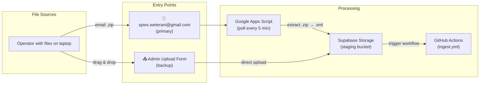
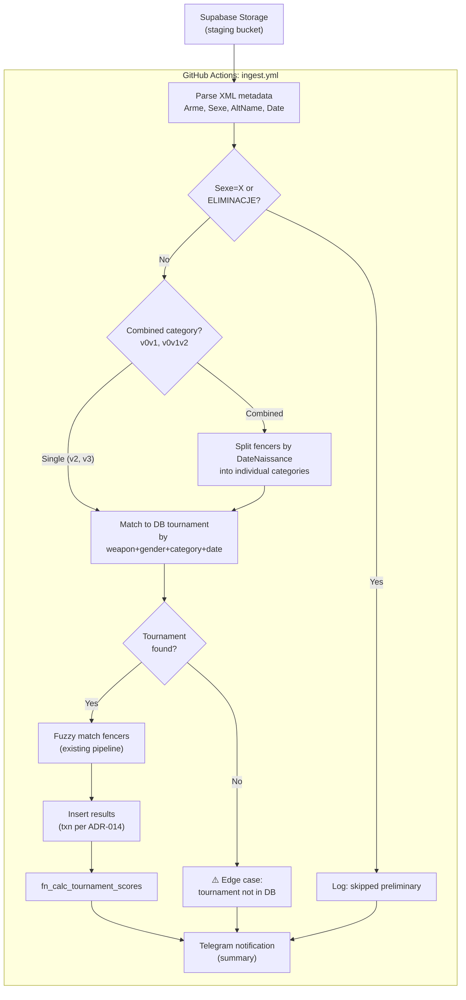
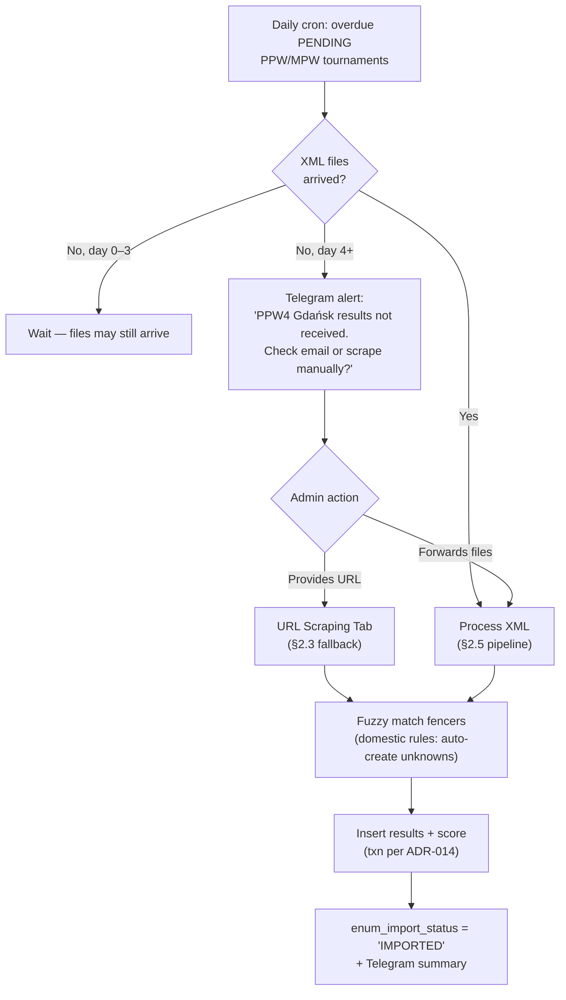
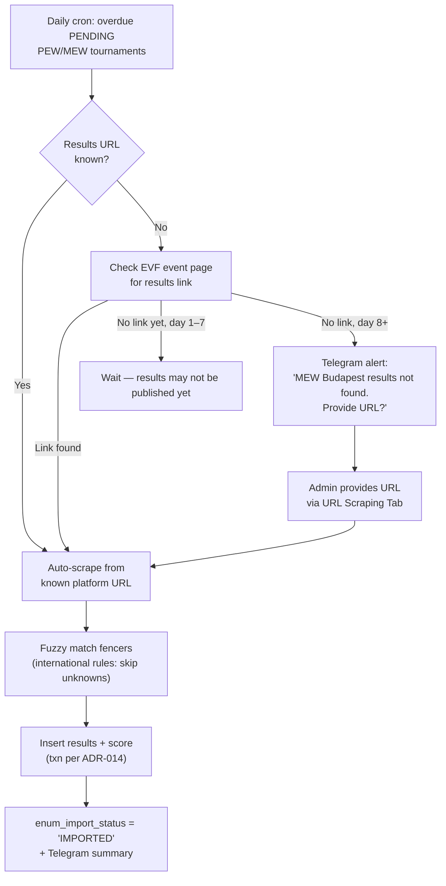
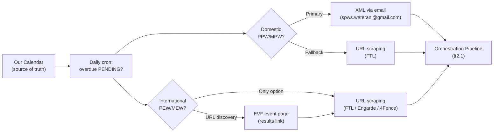
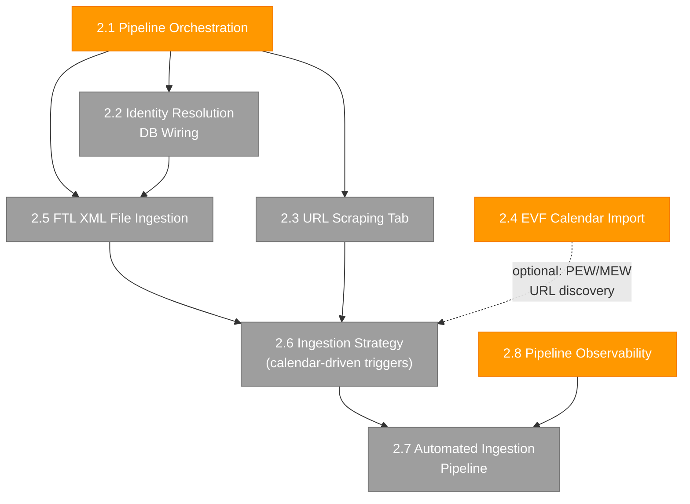

# Go-to-PROD Plan — SPWS Automated Ranklist System

**Status:** In Progress
**Date:** 2026-04-05 (updated)
**Predecessor:** [MVP Development Plan](MVP_development_plan.md) (M8–M10, completed 2026-04-04)

## 1. Overview

The MVP phase delivered 544 test assertions across 3 milestones (M8, M9, M10), covering:
- All 30 sub-rankings with rolling score for active season
- Admin auth (Supabase Auth + TOTP MFA), CRUD UI for seasons/events/tournaments
- Identity resolution admin UI (frontend only), file import parsers
- Calendar view, scoring config editor, seed generator tooling (ADR-019, ADR-020)
- Release pipeline: LOCAL → CERT → PROD with schema fingerprinting

This document tracks scope deferred from MVP that is required for full production readiness.

## 2. Deferred Scope

Items below were originally planned for M9b but deferred to keep the MVP focused on what's deployed and working.

### 2.1 Pipeline Orchestration (T9.11) — PHASE 3 COMPLETE, PHASE 5-8 IN PROGRESS

**FRs:** FR-51, FR-70–78 (Phase 3), FR-79–85 (Phase 5-8)
**ADRs:** ADR-022, ADR-023, ADR-024, ADR-025 (event-centric ingestion + Telegram admin)
**Depends on:** File import parsers (T9.10, done), CRUD SQL (T9.1, done), scrapers (POC, done)

End-to-end flow: parse uploaded file → fuzzy match against master fencer list → insert results → call `fn_calc_tournament_scores`. Must run in a single DB transaction per ADR-014 (delete + reimport).

**What exists:**
- `python/scrapers/` — FTL, Engarde, 4Fence, CSV upload scrapers (all tested)
- `python/matcher/pipeline.py` — scrape + match pipeline with domestic/international rules
- `python/matcher/fuzzy_match.py` — RapidFuzz matching, alias support, disambiguation
- `python/file_import/` — .xlsx/.xls/.json/.csv parsers (T9.10)
- CRUD SQL functions with SECURITY DEFINER (T9.1)

**Phase 3 (COMPLETE — 2026-04-05):**
- `fn_ingest_tournament_results` — atomic delete+insert+score (ADR-022)
- `python/pipeline/` — orchestrator, db_connector, storage_handler, ingest_cli
- `python/pipeline/notifications.py` — TelegramNotifier (13 use cases)
- GAS email polling → Supabase Storage → GitHub Actions ingest workflow
- 594 total assertions (199 pgTAP + 222 pytest + 173 vitest)
- PPW4 Gdańsk data successfully ingested into CERT

**Phase 5-8 (IN PROGRESS — ADR-025):**
- Event-centric ingestion: match XML → existing event → create tournaments on-the-fly
- Event lifecycle: PLANNED → IN_PROGRESS → COMPLETED with rollback
- Telegram command interface (16 commands)
- CERT → PROD promotion via Telegram
- ADR-024 PENDING fix for unknown DOB
- Admin UI: tournament management accordion + identity resolution
- E2E test with PPW4.5 dummy event

### 2.2 Identity Resolution DB Wiring (FR-56, FR-57)

**What exists:**
- `IdentityManager.svelte` — match candidate queue with status filter, confidence coloring (T9.7)
- `DisambiguationModal.svelte` — fencer selection with radio buttons, birth year display (T9.7)
- `pipeline.py` — `approve_match`, `dismiss_match`, `create_new_fencer` pure functions (M4)
- 10 vitest assertions (9.68–9.77) for UI behavior

**What's needed:**
- ~~DB persistence for admin actions~~ — Done: `fn_approve_match`, `fn_dismiss_match`, `fn_create_fencer_from_match` (migration 20260406000003)
- ~~Match candidate query~~ — Done: `vw_match_candidates` (migration 20260406000004)
- Wire `onapprove`, `oncreatenew`, `ondismiss` callbacks to Supabase RPC via `api.ts`
- Add 3 API functions: `approveMatch()`, `dismissMatch()`, `createFencerFromMatch()`
- pgTAP tests for 3 RPCs (11.1–11.12, 12 assertions)
- vitest integration tests (9.78–9.82, 5 assertions)

### 2.3 URL Scraping Tab (FR-53, FR-54 partial)

**What exists:**
- TournamentImportModal + EventImportModal with file drop zones (T9.5, T9.6)
- All 4 scrapers tested and working (FTL, Engarde, 4Fence, CSV)

**What's needed:**
- Second tab in import modals: "Z adresu URL" (from URL) — designed in mockup `m8_tournaments.html`
- URL input field → auto-detect scraper platform → scrape → feed into orchestration pipeline
- Frontend validation (URL format, platform detection feedback)

### 2.4 EVF Calendar Import (FR-58, T9.12–T9.13)

**What exists:**
- UI mockup: `m8_evf_import.html` (gold "Import EVF" button on Calendar, checklist modal)
- `tbl_event` schema with all needed columns (country, venue, weapons, entry fee)

**What's needed:**
- Scraper for veteransfencing.eu calendar page
- Deduplication logic: match scraped events against existing DB events by date + location
- Create `tbl_event` + child `tbl_tournament` entries for each imported event
- Admin review modal (checklist with dedup warnings)
- Tests: scraper unit tests, dedup logic, integration

### 2.5 FencingTime Live XML File Ingestion

**FRs:** FR-51 (partial), new FRs TBD
**Depends on:** Pipeline Orchestration (2.1), Identity Resolution DB Wiring (2.2)

Automated ingestion of FencingTime Live XML result files — the primary data format for Polish domestic tournaments (PPW/MPW).

#### 2.5.1 XML Format

Root element: `<CompetitionIndividuelle>` with attributes:
- `Arme` — weapon: `E` (Epee), `F` (Foil), `S` (Sabre)
- `Sexe` — gender: `M` (Male), `F` (Female), `X` (Mixed = preliminary, skip)
- `AltName` — contains age category: `v0`, `v1`, `v2`, `v3`, `v4`, or combined `v0v1`, `v0v1v2`
- `Annee` — season: `2025/2026`
- `Date` — tournament date: `21.02.2026`
- `TitreLong` — event name: `IV Puchar Polski Weteranów Gdańsk 2026`

Fencer elements: `<Tireur>` with `Nom`, `Prenom`, `DateNaissance`, `Classement` (final place), `Nation`, `Club`.

#### 2.5.2 Entry Points

Two paths for files to reach the system:



**Email path (primary):** Operator emails zip archive to `spws.weterani@gmail.com`. Google Apps Script polls inbox every 5 minutes, extracts `.xml` files from `.zip` attachments, uploads to Supabase Storage staging bucket, triggers GitHub Actions `ingest.yml`.

**Upload form (backup):** Admin drags & drops `.zip` or individual `.xml` files into the Admin UI upload form. Files go directly to Supabase Storage staging bucket, triggering the same pipeline.

#### 2.5.3 Processing Pipeline



#### 2.5.4 Combined Category Splitting

Some tournaments combine age categories (e.g., `v0v1` = V0 + V1 fencing together). One XML file produces results for multiple DB `tbl_tournament` records:

1. Parse `AltName` to extract combined categories (e.g., `v0v1` → `[V0, V1]`)
2. For each `<Tireur>`, use `DateNaissance` to determine actual age category via `birth_year_matches_category()`
3. Group fencers by resolved category
4. Import each group as a separate tournament result set, preserving relative placement within each category group

**Edge case:** If a fencer's `DateNaissance` is missing or doesn't match any of the combined categories → flag for admin review.

#### 2.5.5 Edge Cases Requiring Admin Intervention

| Edge Case | Detection | Admin Action | Telegram Alert |
|-----------|-----------|-------------|----------------|
| **Tournament not in DB** | No matching `tbl_tournament` for weapon+gender+category+date | Create event/tournament via CRUD UI, then re-trigger import | "⚠️ No DB tournament for: Epee M V3 2026-02-21 (Gdańsk). Create it and re-run." |
| **Missing DateNaissance in combined category** | `<Tireur>` has no `DateNaissance` in a `v0v1`/`v0v1v2` file | Assign fencer to correct category manually | "⚠️ 2 fencers without birth date in v0v1 file — can't split. Review needed." |
| **DateNaissance outside all combined categories** | Birth year doesn't match any of `v0`, `v1`, etc. in the combined set | Verify fencer data, assign category | "⚠️ KOWALSKI Jan (1995) doesn't fit v2/v3/v4 in combined file. Assign manually." |
| **Duplicate import** | Same event+date+weapon+gender+category already has `IMPORTED` status | Confirm re-import (ADR-014 delete+reimport) or skip | "ℹ️ Epee M V2 Gdańsk already imported. Re-import? (reply YES to confirm)" |
| **Unrecognized XML format** | Root element is not `<CompetitionIndividuelle>` or missing required attributes | Forward original file to admin for manual inspection | "❌ Unrecognized XML file: filename.xml — not FTL format." |
| **Zip contains non-XML files** | Files with extensions other than `.xml` in the archive | Log and skip non-XML; process valid XMLs | "ℹ️ Skipped 2 non-XML files from archive. Processed 15 XML files." |
| **Low fuzzy match confidence** | Existing pipeline behavior: match score 50–94 → PENDING | Review in Identity Manager UI (existing) | "⚠️ 3 fencers need identity review from Gdańsk import." |
| **Event exists, tournament missing** | Event found by date+name, but specific weapon/gender/category tournament not created | Create missing tournament(s) under existing event | "⚠️ Event 'PPW4 Gdańsk' exists but missing tournament: Foil F V1. Create it." |

### 2.6 Ingestion Strategy — Calendar-Driven Triggers

Our calendar (`tbl_event` / `tbl_tournament`) is the source of truth. Excel files are retired from the active pipeline — all new results come in via FTL XML file import or URL scraping.

A daily scheduled GitHub Actions cron job (e.g., 08:00 UTC) queries for overdue tournaments:

```sql
SELECT t.*, e.date_start, e.txt_name
FROM tbl_tournament t
JOIN tbl_event e ON t.id_event = e.id
WHERE t.enum_import_status = 'PENDING'
  AND e.date_start < CURRENT_DATE
ORDER BY e.date_start;
```

For each overdue tournament, the system follows one of two paths based on tournament type.

#### 2.6.1 Domestic PPW/MPW — XML File Import (Primary) + URL Scraping (Fallback)

SPWS organizes these tournaments. The organizer has the FTL XML files and emails them to `spws.weterani@gmail.com`.



**Timeline:**
| Day | Action |
|-----|--------|
| 0 | Event takes place. Organizer may email XML files same day or next. |
| 1–3 | System waits. If XML arrives → auto-process via §2.5 pipeline. |
| 4 | Telegram alert to admin: "Results not received for [event]. Check email or provide URL." |
| 4+ | Admin either forwards the missing files or provides the FTL results URL as fallback. |

#### 2.6.2 International PEW/MEW — URL Scraping Only

SPWS does not organize these. No XML files will arrive. Results are published on external platforms (FTL, Engarde, or 4Fence).



**Timeline:**
| Day | Action |
|-----|--------|
| 0 | Event takes place abroad. |
| 1–7 | Daily check: look for results URL in `tbl_event` or on EVF event page. If found → auto-scrape. |
| 8 | Telegram alert to admin: "Results not found for [event]. Provide URL?" |
| 8+ | Admin pastes URL into URL Scraping Tab → scrape → import (international rules: skip unknown fencers). |

#### 2.6.3 Summary: Two-Track Ingestion Model



> **Excel retired.** The `generate_season_seed.py` tool and Excel parsers remain in the repo for historical seed data but are not part of the active ingestion pipeline.

### 2.7 Automated Ingestion Pipeline (T9.14)

**What exists:**
- GitHub Actions CI/CD pipeline for deployment (LOCAL → CERT → PROD)
- Telegram alerting on pipeline failure (FR-32, tested)

**What's needed:**
- `ingest.yml` GitHub Actions workflow: daily cron (08:00 UTC) + manual dispatch + Supabase Storage webhook trigger
- Implements the two-track ingestion strategy (§2.6): domestic XML-first, international scrape-only
- Configurable grace periods: 4 days (domestic), 8 days (international) before Telegram escalation
- Error handling + Telegram notifications on failure/success
- Admin reply handling for interactive edge cases (Telegram bot listens for YES/NO replies)

### 2.8 Pipeline Observability (NFR-10 partial)

**What exists:**
- Telegram alerting for pipeline failures (FR-32, test 3.6)

**What's needed:**
- Structured logging (JSON format) for all pipeline operations
- Log levels: INFO for normal flow, WARNING for skipped fencers, ERROR for failures
- Aggregated run summary (tournaments processed, fencers matched/skipped/created)

## 3. Architecture

### 3.1 Dependency Graph



**Legend:** 🟠 Ready (no dependencies) · ⬜ Blocked (waiting on predecessors) · Dashed = optional enhancement

### 3.2 Recommended Order

```
Phase A:  2.1 Pipeline Orchestration  +  2.8 Pipeline Observability  (parallel, no deps)
Phase B:  2.2 Identity Resolution DB Wiring  (needs 2.1)
Phase C:  2.5 FTL XML File Ingestion  +  2.3 URL Scraping Tab  (need 2.1 + 2.2)
Phase D:  2.6 Ingestion Strategy  +  2.7 Automated Ingestion Pipeline  (needs 2.5 + 2.3)
Phase E:  2.4 EVF Calendar Import  (independent — enhances PEW/MEW URL discovery in 2.6)
```

## 4. Current Test Baseline

| Suite | Count | Files |
|-------|-------|-------|
| pgTAP | 189 | `supabase/tests/` (10 files) |
| pytest | 175 | `python/tests/` (7 files) |
| vitest | 173 | `frontend/tests/` (20 files) |
| Playwright | 7 | `frontend/e2e/` (1 file) |
| **Total** | **544** | |

## 5. RTM Coverage Summary

| Status | Count | FRs |
|--------|-------|-----|
| Covered | 55 | FR-01–FR-50, FR-52, FR-55, FR-59–FR-67 |
| Partial | 5 | FR-53, FR-54, FR-56, FR-57, NFR-10 |
| Deferred | 2 | FR-51, FR-58 |
| Not tested (NFR) | 4 | NFR-01, NFR-03, NFR-04, NFR-08 |
| Infrastructure | 2 | NFR-02, NFR-12 |

Full RTM: [Project Specification Appendix C](Project%20Specification.%20SPWS%20Automated%20Ranklist%20System.md#appendix-c--requirements-traceability-matrix)
