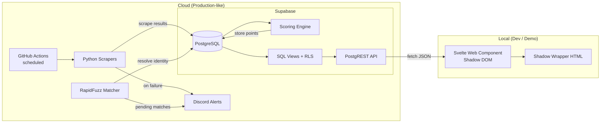
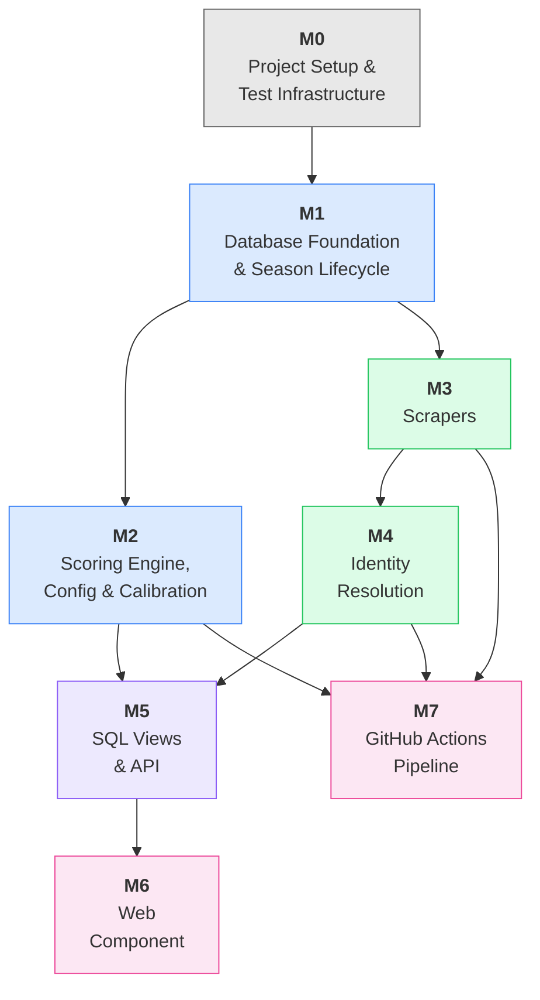

# POC Development Plan — SPWS Automated Ranklist System

## 1. POC Overview

### 1.1 Goals

Validate the four pillars of the system before scaling to all 30 sub-rankings:

1. **Core Math** — Scoring engine reproduces the legacy Excel formulas (Log Formula, DE bonus, podium bonus, multipliers, best-K aggregation) with row-level accuracy.
2. **Scraping Viability** — Python scrapers successfully extract tournament results from FencingTimeLive, Engarde, and 4Fence.
3. **Admin Workflow** — Season setup, scoring config tuning, identity resolution review, and tournament lifecycle management work end-to-end.
4. **UI Portability** — A Web Component renders the ranklist independently of any CMS, ready for future WordPress embedding.

### 1.2 Scope

**Single category only: Male Epee V2 (50+).**

All architecture, schema, and code are designed for the full 30-category system, but POC validation is limited to one category to reduce variables during calibration.

### 1.3 Use Cases in Scope

| UC | Name | Phase 1 |
|----|------|---------|
| UC1 | Automated Data Ingestion | Yes |
| UC2 | Manual Result Upload (CSV) | Yes |
| UC3 | Identity Resolution (auto-match) | Yes |
| UC4 | Manual Identity Review | Yes |
| UC5 | Score Calculation | Yes |
| UC7 | Season Setup | Yes |
| UC8 | Season Calendar — Add Event | Yes |
| UC9 | Season Calendar — Add Tournament | Yes |
| UC10 | Tournament Lifecycle Management | Yes |
| UC11 | Scoring Config Tuning | Yes |
| UC12 | Public Ranklist Browsing | Yes |
| UC13 | Audit/Drill-down View | Yes |
| UC18 | Export Scoring Config as JSON | Yes |
| UC19 | Import Scoring Config from JSON | Yes |
| UC20 | Calibration — Compare vs Excel | Yes |

### 1.4 Success Criteria

- All acceptance tests pass across all test suites (pgTAP, pytest, Vitest/Playwright).
- Scoring output matches the reference Excel (`SZPADA-2-2024-2025.xlsx`) within a tolerance of 0.01 per score.
- End-to-end pipeline demonstrated: GitHub Actions scrapes → Supabase stores & scores → local Web Component displays the ranking.

### 1.5 Tech Stack

| Layer | Technology |
|-------|-----------|
| Database | PostgreSQL 15 (Supabase — free tier) |
| Scoring Engine | PL/pgSQL functions |
| API | PostgREST (built into Supabase) |
| Scrapers | Python 3.11+, httpx, BeautifulSoup4 |
| Identity Resolution | RapidFuzz |
| Calibration | Python (openpyxl, supabase-py) |
| Frontend | Svelte → Web Component (Shadow DOM) |
| CI/CD | GitHub Actions |
| Alerting | Discord Webhook |
| DB Tests | pgTAP |
| Python Tests | pytest |
| Frontend Tests | Vitest + Playwright |

### 1.6 Methodology — Test-Driven Development

Every milestone follows the **Red-Green-Refactor** cycle:

1. **RED** — Write acceptance tests derived from the use case acceptance criteria. Tests must fail initially (the feature doesn't exist yet).
2. **GREEN** — Implement the minimum code to make all tests pass.
3. **REFACTOR** — Clean up without changing behaviour. All tests must still pass.

Tests are the living specification. If a test doesn't exist for a requirement, the requirement isn't verified.

---

## 2. POC End State

### 2.1 Architecture



### 2.2 What the POC Delivers

- **Cloud backend** on Supabase free tier: full schema, scoring engine, ranking views, RLS policies.
- **Automated pipeline** via GitHub Actions: scheduled scraping, identity resolution, scoring, Discord alerts on failure.
- **Local Web Component** in a Shadow Wrapper HTML page mimicking WordPress CSS, fetching live data from the Supabase PostgREST API.
- **Calibration tooling**: Python CLI scripts for config export/import and Excel comparison.

### 2.3 What the POC Does NOT Include

- WordPress deployment (Phase 2).
- Categories beyond Male Epee V2 (Phase 2).
- Kadra ranking view (Phase 2).
- Historical season snapshots (Phase 2).
- Result corrections & reprocessing workflow (Phase 2 — UC6, UC14–UC17).
- SuperFive / pool-level data (Phase 3).

---

## 3. Milestones

### Milestone 0: Project Setup & Test Infrastructure

**Purpose:** Establish the repo, tooling, and test frameworks so that all subsequent milestones can start with RED (failing tests).

**Deliverables:**
- Repository structure:
  ```
  /
  ├── supabase/              # Supabase CLI project
  │   ├── migrations/        # SQL migration files
  │   ├── seed.sql           # Seed data
  │   └── tests/             # pgTAP test files
  ├── python/
  │   ├── scrapers/          # Scraper modules
  │   ├── matcher/           # Identity resolution
  │   ├── calibration/       # Config export/import, Excel comparison
  │   ├── pipeline/          # Orchestration for GH Actions
  │   └── tests/             # pytest test files
  │       └── fixtures/      # Saved HTML fixtures for scraper tests
  ├── frontend/
  │   ├── src/               # Svelte source
  │   ├── public/            # Shadow Wrapper HTML
  │   └── tests/             # Vitest + Playwright tests
  ├── reference/             # Reference Excel file(s)
  ├── doc/                   # Project documentation
  ├── .github/
  │   └── workflows/         # GitHub Actions
  ├── pyproject.toml
  ├── package.json
  └── .gitignore
  ```
- Supabase project created (free tier) with local dev environment via Supabase CLI.
- Test frameworks installed and configured:
  - **pgTAP** for PostgreSQL schema and function tests (runs against local Supabase instance).
  - **pytest** for Python scraper, matcher, and calibration tests.
  - **Vitest** for Svelte component unit tests; **Playwright** for browser integration tests.
- CI pipeline (`.github/workflows/ci.yml`) that runs all three test suites on every push/PR.
- Empty test files created as placeholders for each milestone's test suite.

**Acceptance Criteria:**
- `supabase start` launches a local PostgreSQL instance.
- `pytest`, pgTAP runner, and `vitest` all execute successfully (zero tests, zero failures).
- CI workflow runs and passes on push to main.

---

### Milestone 1: Database Foundation & Season Lifecycle

**Use Cases:** UC7, UC8, UC9, UC10

**Purpose:** Build the complete database layer — schema, constraints, lifecycle logic, audit logging, and RLS — in a single milestone. This avoids splitting database work across milestones and eliminates UC overlap.

**Acceptance Tests (RED):**

| # | Test | Derives From |
|---|------|-------------|
| 1.1 | All 7 enum types exist with correct values (`enum_weapon_type`, `enum_gender_type`, `enum_tournament_type`, `enum_age_category`, `enum_event_status`, `enum_import_status`, `enum_match_status`) | §9.1.1 |
| 1.2 | All 9 core tables exist with correct column names, types, and NOT NULL constraints | §9.2 |
| 1.3 | Foreign key constraints enforced: inserting a `tbl_result` row with a non-existent `id_fencer` fails | §9.2 |
| 1.4 | Unique constraint on `(id_fencer, id_tournament)` in `tbl_result`: duplicate insert rejected | §9.2 |
| 1.5 | Unique constraint on `(id_result, txt_scraped_name)` in `tbl_match_candidate` enforced | §9.2 |
| 1.6 | Global uniqueness on `txt_code` columns (`tbl_event`, `tbl_tournament`, `tbl_organizer`, `tbl_season`) | §9.2 |
| 1.7 | Partial unique index on `tbl_season(bool_active) WHERE bool_active = TRUE`: second active season rejected | §9.3 |
| 1.8 | Unique constraint on `tbl_scoring_config(id_season)`: one config per season | §9.3 |
| 1.9 | All indexes from §9.2 exist | §9.2 |
| 1.10 | RLS enabled: anonymous role can SELECT from `tbl_result`, cannot INSERT | §9.2.1 |
| 1.11 | RLS enabled: authenticated role can INSERT/UPDATE/DELETE on all tables | §9.2.1 |
| 1.12 | Seed data (one test season, sample fencers, sample organizers) loads without errors | — |
| 1.13 | Create season: `tbl_season` row with `txt_code`, `dt_start`, `dt_end` | UC7(a) |
| 1.14 | Create season: corresponding `tbl_scoring_config` row created with all defaults | UC7(b) |
| 1.15 | Enforce single active season: activating a second season fails | UC7(c) |
| 1.16 | Create event: `tbl_event` row with `id_season`, `id_organizer`, defaults to `PLANNED` | UC8(a,b) |
| 1.17 | Create tournament: `tbl_tournament` row with season-scoped `txt_code` (e.g., `PPW1-V2-M-EPEE-2025`) | UC9(a) |
| 1.18 | Create tournament: `enum_import_status` defaults to `PLANNED` | UC9(b) |
| 1.19 | Create tournament: `num_multiplier` auto-populated from `tbl_scoring_config` based on `enum_type` | UC9(c) |
| 1.20 | Valid event transition: `PLANNED` → `SCHEDULED` → `IN_PROGRESS` → `COMPLETED` succeeds | UC10(a) |
| 1.21 | Invalid event transition: `PLANNED` → `COMPLETED` rejected with error message | UC10(b) |
| 1.22 | Event status change: old and new values logged in `tbl_audit_log` | UC10(c) |
| 1.23 | Event cancellation: `SCHEDULED` → `CANCELLED` succeeds | UC10(a) |

**Implementation (GREEN):**
- Supabase CLI migration files: enums, tables, indexes, constraints, RLS policies.
- Seed data SQL (`seed.sql`): season "2024-2025", scoring config with defaults, sample fencers for Male Epee V2, sample organizers (SPWS, EVF).
- Lifecycle validation function or trigger: `fn_validate_event_transition(old_status, new_status)`.
- Audit log trigger: `trg_audit_log` on key tables (captures old/new values on UPDATE/DELETE).
- Season creation helper that auto-creates `tbl_scoring_config` with defaults.
- Tournament creation logic that resolves `num_multiplier` from `tbl_scoring_config`.

**Verification:**
- All pgTAP tests pass against local Supabase instance.
- `supabase db reset` runs cleanly (migrations + seed).
- Manual test: create a season, add events and tournaments via Supabase Dashboard, verify lifecycle transitions.

---

### Milestone 2: Scoring Engine, Configuration & Calibration

**Use Cases:** UC5, UC11, UC18, UC19, UC20

**Purpose:** Build the scoring engine, config export/import functions, and calibration tooling in a single milestone. This allows end-to-end scoring validation (score → export → compare against Excel) without a milestone boundary in between.

**Acceptance Tests (RED):**

| # | Test | Derives From |
|---|------|-------------|
| 2.1 | `fn_calc_tournament_scores`: known tournament (N=24, PPW type) → all four point columns match Excel reference values for every fencer | UC5(a) |
| 2.2 | Edge case: N=1 → single fencer receives MP (50) points | §8.1.1 |
| 2.3 | Edge case: place > N → fencer gets 0 points | §8.1.1 |
| 2.4 | Power-of-2 N (e.g., N=16): DE bonus correction factor c=0 | §8.1.2 |
| 2.5 | Non-power-of-2 N (e.g., N=24): DE bonus correction factor c=1 | §8.1.2 |
| 2.6 | Podium bonus: 1st gets gold×bonus_per_round, 2nd silver×, 3rd bronze×, 4th+ gets 0 | §8.1.3 |
| 2.7 | Multiplier: PPW tournament uses `num_ppw_multiplier` (1.0), MPW uses `num_mpw_multiplier` (1.2) | §8.2, UC5(d) |
| 2.8 | After scoring: `ts_points_calc` is set to a recent timestamp | UC5(b) |
| 2.9 | After scoring: `tbl_tournament.enum_import_status` = 'SCORED' | UC5(c) |
| 2.10 | Scoring reads multiplier from `tbl_scoring_config`, NOT from `tbl_tournament.num_multiplier` | UC5(d) |
| 2.11 | Changing `int_mp_value` in `tbl_scoring_config` does NOT change already-scored `num_final_score` values | UC11(c) |
| 2.12 | `fn_export_scoring_config(season_id)` returns JSON with all 17 parameters + `id_season` + `season_code` | UC18(a) |
| 2.13 | Export is idempotent: two consecutive calls return identical JSON | UC18(d) |
| 2.14 | `fn_import_scoring_config(json)` upserts all 16 typed columns + `json_extra`, sets `ts_updated` | UC19(a,b) |
| 2.15 | Partial import: JSON with only `mp_value` preserves all other existing values | UC19(c) |
| 2.16 | Import with invalid type (e.g., string for `mp_value`) raises exception | UC19(d) |
| 2.17 | Import without `id_season` raises exception | UC19 |
| 2.18 | Import for non-existent season raises exception | UC19 |
| 2.19 | `calibrate_compare.py` with matching DB and Excel data → prints success message | UC20(d) |
| 2.20 | With a deliberate 0.05 mismatch and tolerance 0.01 → mismatch reported with fencer, tournament, expected, actual, diff | UC20(c) |
| 2.21 | With a mismatch within tolerance (0.005, tolerance 0.01) → no mismatch reported | UC20(b) |
| 2.22 | Fencer present in Excel but missing from DB → reported as MISSING_IN_DB | UC20(e) |
| 2.23 | Tournament score present in Excel but missing from DB → reported as MISSING_SCORE | UC20(e) |
| 2.24 | `calibrate_config.py export` writes a valid JSON file with all parameters | UC18 |
| 2.25 | `calibrate_config.py import` reads a JSON file and calls the RPC successfully | UC19 |

**Implementation (GREEN):**
- `fn_calc_tournament_scores(p_tournament_id)` — PL/pgSQL function per §9.5.2.
- `fn_export_scoring_config(p_id_season)` — SQL function per §8.6.3.
- `fn_import_scoring_config(p_config)` — PL/pgSQL function per §8.6.3.
- `python/calibration/calibrate_config.py` — CLI for export/import via Supabase RPC (§8.6.4).
- `python/calibration/calibrate_compare.py` — Excel vs DB comparison script (§8.6.4).
- Reference Excel file placed in `reference/` directory.

**Verification:**
- All pgTAP tests pass (scoring engine, config functions).
- All pytest tests pass (calibration scripts).
- Full calibration loop executed manually: export → edit → import → re-score → compare → zero mismatches.

---

### Milestone 3: Data Ingestion — Scrapers

**Use Cases:** UC1, UC2

**Acceptance Tests (RED):**

| # | Test | Derives From |
|---|------|-------------|
| 3.1 | FencingTimeLive parser: given fixture HTML → returns list of `(fencer_name, place, participant_count)` | UC1(a) |
| 3.2 | Engarde parser: given fixture HTML → returns standardized result set | UC1(a) |
| 3.3 | 4Fence parser: given fixture HTML → returns standardized result set | UC1(a) |
| 3.4 | After import: `tbl_result` rows inserted with `num_final_score = NULL` | UC1(b) |
| 3.5 | After import: `tbl_tournament.enum_import_status` = 'IMPORTED' | UC1(c) |
| 3.6 | Scraper failure: Discord webhook called with error details (mocked) | UC1(d) |
| 3.7 | CSV upload: rows inserted identically to scraper output format | UC2(a,b) |
| 3.8 | CSV upload: `tbl_tournament.enum_import_status` = 'IMPORTED' | UC2(c) |
| 3.9 | Idempotency: re-importing the same tournament skips existing `(id_fencer, id_tournament)` pairs | §9.5.1 |
| 3.10 | Minimum participant threshold: PEW tournament with N=3 (< 5) → `enum_import_status` = 'REJECTED', `txt_import_status_reason` populated | §8.5 |
| 3.11 | Minimum participant threshold: PPW tournament with N=3 → imported normally (no minimum for domestic) | §8.5 |
| 3.12 | Retry logic: transient HTTP failure → retried up to 3 times with exponential backoff | §9.5.1 |
| 3.13 | Partial scrape (incomplete data on page) → import aborted for that tournament, error logged | §9.5.1 |

**Implementation (GREEN):**
- `python/scrapers/ftl.py` — FencingTimeLive parser (ported from VBA).
- `python/scrapers/engarde.py` — Engarde parser (ported from VBA).
- `python/scrapers/fourfence.py` — 4Fence parser (ported from VBA).
- `python/scrapers/csv_upload.py` — CSV upload handler.
- `python/scrapers/base.py` — Shared result format, retry logic, error handling.
- `python/tests/fixtures/` — Saved HTML pages from each platform.

**Verification:**
- All pytest tests pass using fixture HTML (no live network calls).
- Manual test: run a scraper against a real tournament URL, inspect `tbl_result` rows.

---

### Milestone 4: Identity Resolution

**Use Cases:** UC3, UC4

**Acceptance Tests (RED):**

| # | Test | Derives From |
|---|------|-------------|
| 4.1 | Exact name match ("KOWALSKI Jan" vs "KOWALSKI Jan") → score ≥95, `id_fencer` set, `AUTO_MATCHED` | UC3(b) |
| 4.2 | Close match via alias ("KOWALSKI J." in `json_name_aliases`) → score ≥95, `AUTO_MATCHED` | UC3(a,b) |
| 4.3 | Uncertain match (score 80) → `PENDING` candidate created, `id_fencer = NULL` on `tbl_result` | UC3(c) |
| 4.4 | No match candidates at all → `UNMATCHED` status | UC3(d) |
| 4.5 | "SURNAME FirstName" format parsed and compared correctly | §8.5 |
| 4.6 | Admin approves a PENDING match → `id_fencer` linked, status `APPROVED`, `tbl_result.id_fencer` updated | UC4(b,c) |
| 4.7 | Admin creates new fencer → `tbl_fencer` row created, status `NEW_FENCER`, `tbl_result.id_fencer` linked | UC4(b) |
| 4.8 | Admin dismisses a match → status `DISMISSED` | UC4(b) |
| 4.9 | International fencer (not in `tbl_fencer`) is excluded from ranking results | §8.5 |

**Implementation (GREEN):**
- `python/matcher/fuzzy_match.py` — RapidFuzz-based matcher comparing scraped names against `tbl_fencer` + `json_name_aliases`.
- `python/matcher/pipeline.py` — Orchestrates matching for all unmatched results in a tournament.
- Admin review endpoints — Supabase Edge Functions or direct PostgREST PATCH on `tbl_match_candidate` + `tbl_result`.

**Verification:**
- All pytest tests pass.
- Manual test: import a tournament with known fencers, verify auto-match rate, review pending matches.

---

### Milestone 5: SQL Views & API

**Use Cases:** UC12, UC13

**Acceptance Tests (RED):**

| # | Test | Derives From |
|---|------|-------------|
| 5.1 | `vw_score`: returns one row per fencer per tournament with all expected columns (fencer name, tournament name/date, weapon, gender, category, all four point columns, multiplier, `ts_points_calc`) | UC13(b,c) |
| 5.2 | `fn_ranking_ppw('EPEE', 'M', 'V2', NULL)`: returns correct ranking for known test data (NULL season = active season) | UC12 |
| 5.3 | `fn_ranking_ppw('EPEE', 'M', 'V2', <season_id>)`: explicit season parameter returns results for that season only | UC12 |
| 5.4 | Best-K selection: with K=4 and 5 PPW scores, only top 4 are summed | §8.3.1 |
| 5.5 | MPW included: MPW score (80) ≥ worst included PPW (76) → total includes MPW | §8.3.1 |
| 5.6 | MPW dropped: MPW score (36) < worst included PPW (76) → total uses 5th-best PPW instead | §8.3.1 |
| 5.7 | Ranking ordered by total descending | UC12(d) |
| 5.8 | Filter by weapon: passing 'FOIL' excludes EPEE results | UC12(b) |
| 5.9 | Filter by gender: passing 'F' excludes male results | UC12(b) |
| 5.10 | Filter by category: passing 'V2' excludes V1/V3 results | UC12(b) |
| 5.11 | Only scored results included (`num_final_score IS NOT NULL`) | §9.5 |
| 5.12 | International fencer (unlinked `id_fencer`) does not appear in ranking output | §8.5 |
| 5.13 | PostgREST RPC endpoint `/rpc/fn_ranking_ppw` returns valid JSON array | UC12(a) |

**Implementation (GREEN):**
- `vw_score` — standard SQL view joining `tbl_result`, `tbl_tournament`, `tbl_event`, `tbl_season`, `tbl_fencer`.
- `fn_ranking_ppw(p_weapon, p_gender, p_category, p_season UUID DEFAULT NULL)` — security-definer function returning a table type. When `p_season` is NULL, uses the active season. Implements best-K PPW selection + conditional MPW drop logic per §8.3.1.
- PostgREST configuration: API key setup, public schema exposure.

**Verification:**
- All pgTAP tests pass.
- Manual test: call PostgREST endpoint from curl/browser, verify JSON response matches expected ranking.

---

### Milestone 6: Web Component (Local UI)

**Use Cases:** UC12, UC13 (presentation layer)

**Acceptance Tests (RED):**

| # | Test | Derives From |
|---|------|-------------|
| 6.1 | Component renders a table with columns: rank, fencer name, total score, tournament breakdown | UC12(c) |
| 6.2 | Four filter dropdowns rendered: weapon, gender, age category, season | UC12(b) |
| 6.3 | Default view loads active season, sorted by total descending | UC12(d) |
| 6.4 | Changing weapon filter refreshes the ranking table with filtered data | UC12(b) |
| 6.5 | Clicking a fencer row expands to show drill-down detail | UC13(a) |
| 6.6 | Drill-down shows per-tournament breakdown: name, date, place, N, place points, DE bonus, podium bonus, multiplier, final score | UC13(b) |
| 6.7 | Shadow DOM isolation: component styles do not leak to host page | §5 |
| 6.8 | Skeleton loader visible while API data is loading | §7 |
| 6.9 | Component is responsive (usable on mobile viewport widths) | §5 |

**Implementation (GREEN):**
- Svelte application compiled to a custom element (Web Component) with Shadow DOM.
- Shadow Wrapper (`public/index.html`): standalone HTML page with sample WordPress-like CSS to test isolation.
- API client module: fetches from Supabase PostgREST (configurable URL via attribute/env).
- Components: RanklistTable, FilterBar, DrilldownPanel, SkeletonLoader.
- Build tooling: Vite + Svelte plugin, outputs a single `.js` bundle.

**Verification:**
- Vitest unit tests pass for component logic.
- Playwright E2E tests pass (renders table, filters work, drill-down opens).
- Manual test: open Shadow Wrapper in browser, verify ranklist loads with real data from Supabase.

---

### Milestone 7: GitHub Actions Pipeline

**Use Cases:** UC1 (automation), §7 (alerting)

**Purpose:** Wire everything together into an automated scheduled pipeline. Tests here focus on orchestration logic — individual scraper, matcher, and scoring behaviors are already tested in M3, M4, and M2 respectively.

**Acceptance Tests (RED):**

| # | Test | Derives From |
|---|------|-------------|
| 7.1 | Workflow YAML parses without errors and defines both `schedule` and `workflow_dispatch` triggers | UC1 |
| 7.2 | Pipeline orchestration script calls scraper for each configured tournament URL | UC1 |
| 7.3 | After scraping: identity resolution runs for all newly imported results | UC3 |
| 7.4 | After identity resolution: scoring engine runs for tournaments where all results are matched | UC5 |
| 7.5 | Source unavailable: skip and continue with remaining platforms, mark tournament `PENDING` | §9.5.1 |
| 7.6 | Partial scrape failure: abort that tournament, continue others | §9.5.1 |
| 7.7 | Discord webhook called on any pipeline failure | §7, UC1(d) |
| 7.8 | Discord webhook called when new PENDING match candidates are created | §9.5.1 |
| 7.9 | Run summary JSON artifact: tournaments processed, results imported, matches pending, errors | §9.5.1 |

**Implementation (GREEN):**
- `.github/workflows/ingest.yml` — scheduled workflow (cron) + manual dispatch.
- `python/pipeline/orchestrate.py` — main pipeline script:
  1. Fetch tournament URLs from `tbl_tournament` where `enum_import_status` IN ('PLANNED', 'PENDING').
  2. Run appropriate scraper per URL pattern.
  3. Run identity resolution for imported results.
  4. Run scoring engine for fully-matched tournaments.
  5. Send Discord notification on failure or new pending matches.
  6. Produce run summary artifact.
- `python/pipeline/discord.py` — Discord webhook integration.
- GitHub Actions secrets: `SUPABASE_URL`, `SUPABASE_KEY` (service_role), `DISCORD_WEBHOOK_URL`.

**Verification:**
- All pytest tests pass (pipeline logic tested with mocked DB and HTTP calls).
- Manual test: trigger workflow via `workflow_dispatch`, verify end-to-end data flow.

---

## 4. Dependency Graph



**Parallelism opportunities:**
- After M1, two tracks can proceed in parallel: M2 (scoring + calibration) and M3 (scrapers).
- M4 (identity resolution) can start as soon as M3 is done.
- M5 (views & API) requires M2 + M4 to be complete.
- M6 (web component) depends on M5.
- M7 (pipeline) depends on M2 + M3 + M4, but is independent of M5 and M6.

---

## 5. Risk Register

| # | Risk | Likelihood | Impact | Mitigation |
|---|------|-----------|--------|------------|
| R1 | Scraper breakage due to external site HTML changes | High | Medium | Fixture-based tests decouple CI from external sites. Versioned scraper modules allow old parsers to be retained. Discord alerting surfaces breakage immediately. |
| R2 | Anti-bot measures (CAPTCHAs, rate limiting) on target platforms | Low | High | Start with simple HTTP requests. If blocked, investigate headless browser fallback (Playwright). Manual CSV upload (UC2) as permanent workaround. |
| R3 | Supabase free tier limits (500MB storage, API rate limits) | Low | Medium | POC scope is single category — data volume is minimal. Monitor usage via Supabase dashboard. Upgrade tier if needed. |
| R4 | RapidFuzz accuracy below 95% on real fencer names | Medium | Medium | Tune threshold during calibration. Expand `json_name_aliases` based on real mismatches. Admin review queue (UC4) catches all uncertain matches. |
| R5 | Reference Excel data quality issues (formula errors, missing rows) | Medium | Medium | Cross-validate Excel against known tournament results. Document and resolve discrepancies before calibration. |
| R6 | Scoring formula edge cases not covered by Excel reference | Medium | Low | Comprehensive edge-case tests (N=1, place>N, power-of-2). Manual verification of boundary values. |
| R7 | pgTAP setup complexity on Supabase local dev | Low | Low | Supabase CLI supports extensions. Fallback: run pgTAP tests via `psql` directly. |

---

## 6. Definition of Done — POC Complete

The POC is considered complete when ALL of the following are true:

- [ ] All acceptance tests pass across all three test suites (pgTAP, pytest, Vitest/Playwright).
- [ ] CI pipeline (GitHub Actions) runs all tests on push and reports green.
- [ ] Scoring engine output matches the reference Excel (`SZPADA-2-2024-2025.xlsx`) for Male Epee V2 within 0.01 tolerance per score.
- [ ] Calibration loop demonstrated: export config → edit → import → re-score → compare → zero mismatches.
- [ ] At least one tournament successfully scraped from each platform (FencingTimeLive, Engarde, 4Fence).
- [ ] Identity resolution demonstrated: auto-match, pending review, admin approve/create/dismiss.
- [ ] Season and tournament lifecycle management working via Supabase Dashboard.
- [ ] Public ranking view accessible via PostgREST API (anonymous read).
- [ ] Web Component renders ranking table with working filters and drill-down in the local Shadow Wrapper.
- [ ] GitHub Actions pipeline runs on schedule, scrapes → matches → scores, and sends Discord alert on failure.
- [ ] All 15 Phase 1 use cases (UC1–5, UC7–13, UC18–20) have at least one passing acceptance test.
