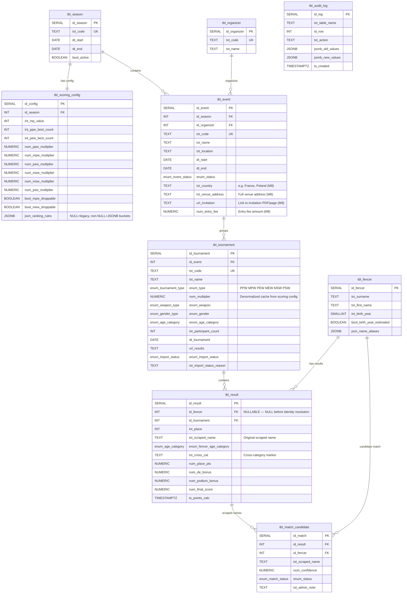
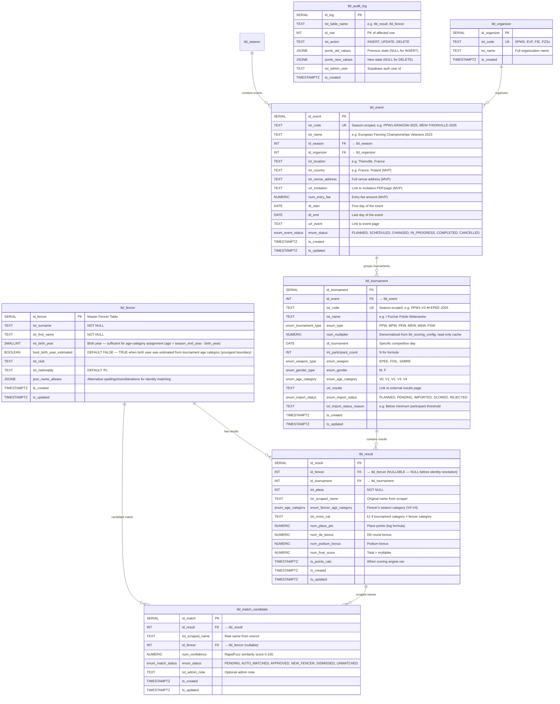
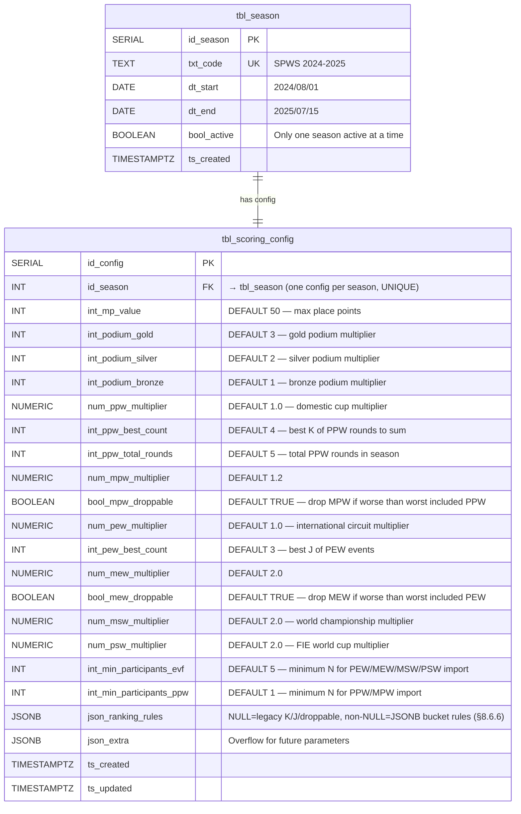
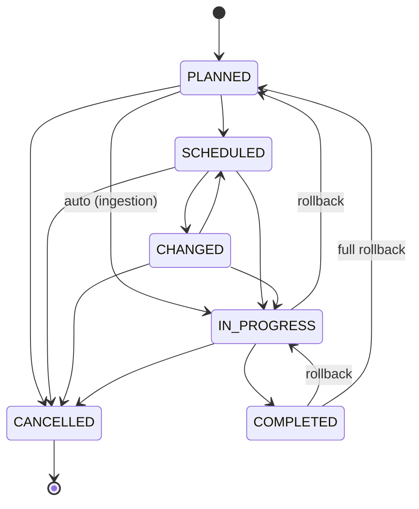

# Project Specification: SPWS Automated Ranklist System

## 1. Problem Statement
The Stowarzyszenie Polskich Weteranów Szermierki (SPWS) currently manages its complex, multi-layered ranking system (PPW Ranking, Kadra Ranking) using manual Excel spreadsheets and VBA macros. This legacy approach presents several critical challenges:
* **High Operational Overhead:** Administrators must manually trigger macros, resolve fencer identities, and copy-paste results after every tournament.
* **Mathematical Limitations:** Excel struggles to efficiently calculate dynamic, rolling timeframes (e.g., "Best 4 of 5 results in the last 12 months"), forcing the organization to rely on rigid "analogous tournament" season mappings.
* **Poor Web Integration:** Displaying Excel data on the official WordPress CMS is clunky, hard to style, and not responsive for mobile users.
* **Risk of Data Loss/Corruption:** Storing canonical national sports data in individual spreadsheet files creates a single point of failure and version control issues.

## 2. Goal & Vision
To engineer a platform-independent, fully automated data pipeline and ranking engine. The system will ingest tournament results from external web platforms, perform algorithmic identity resolution, execute complex ranking mathematics at the database level, and seamlessly expose a "Live" ranklist via a decoupled Web Component on the SPWS website.

## 3. Core Use Cases

### 3.1 Data Ingestion & Scoring

> ⚠ ADR-050 (Phase 6) drops `tbl_match_candidate`; provenance moves to `tbl_result.{txt_scraped_name, num_match_confidence, enum_match_method}`. UC3/UC4 acceptance criteria below describe the pre-rebuild model.

| ID | Phase | Actor | Action / Description | Acceptance Criteria |
| :- | :---- | :---- | :------------------- | :------------------ |
| **UC1** | 1 | **System (Scraper)** | **Automated Data Ingestion:** System polls specified FencingTimeLive / Engarde / 4Fence URLs, extracts placement data, and standardizes the output. One tournament is imported at a time, within one event at a time. | (a) Scraper produces a standardized result set (fencer name, place, participant count) for a given tournament URL. (b) Raw results inserted into `tbl_result` with `num_final_score = NULL`. (c) `tbl_tournament.enum_import_status` set to `IMPORTED`. (d) On failure, GitHub Actions workflow posts alert to Telegram and logs error details. |
| **UC2** | 1 | **Admin** | **Manual Result Upload:** When results are only available as PDF/email or from an unsupported platform, admin uploads results via CSV or manual entry form. | (a) Admin uploads a CSV file or enters results manually via the Admin UI. (b) Rows are inserted into `tbl_result` identically to UC1 output. (c) `tbl_tournament.enum_import_status` set to `IMPORTED`. |
| **UC3** | 1 | **System (Matcher)** | **Identity Resolution:** System compares scraped names to the Master Fencer Table using RapidFuzz. Behavior depends on tournament type. **PPW/MPW (domestic):** all results always enter the ranklist — confident matches are auto-linked, uncertain matches are provisionally linked, and completely unmatched fencers are auto-created in the master data with an estimated birth year. **PEW/MEW (international):** only results for fencers already in the master data are imported — confident and uncertain matches are linked, but completely unmatched fencers are skipped entirely. **Duplicate name disambiguation:** When multiple fencers share the same surname+first_name (e.g., KRAWCZYK Paweł born 1954 vs 1989), the tournament's `enum_age_category` is used as a tiebreaker — the fencer whose `int_birth_year` falls within the category's age range is selected. If disambiguation fails (neither or both candidates fit the category, or birth years are NULL), the match is forced to `PENDING` for admin review regardless of name confidence score. | (a) Each imported name is compared against `tbl_fencer` + `json_name_aliases`. (b) Match ≥ 95 → `tbl_result.id_fencer` set automatically, `tbl_match_candidate` row created with `enum_status = 'AUTO_MATCHED'`. (c) Match 50–94 → `tbl_result.id_fencer` provisionally set to best match, `tbl_match_candidate` row with status `PENDING` (flagged for admin review in UC4). (d) Match < 50 and **PPW/MPW** → new fencer auto-created in `tbl_fencer` with `bool_birth_year_estimated = TRUE` (birth year estimated from youngest boundary of tournament age category), `tbl_result.id_fencer` linked, `tbl_match_candidate` status `NEW_FENCER`. (e) Match < 50 and **PEW/MEW** → result skipped entirely (not imported into `tbl_result`). (f) **Duplicate tiebreaker:** When multiple fencers tie at the same name-match score, the system checks `birth_year_matches_category(int_birth_year, enum_age_category, tournament_year)` — exactly one match → disambiguated; zero or 2+ matches → forced `PENDING`. |
| **UC4** | 1 | **Admin** | **Manual Identity Review:** Admin views flagged fencer identities from UC3 and clicks to approve a suggested match, correct a provisional link, create a new fencer record, or dismiss. For PPW/MPW, provisionally linked and auto-created fencers are already scored — admin corrections trigger a re-link. | (a) Admin UI shows all `PENDING` / `NEW_FENCER` rows from `tbl_match_candidate`. (b) Admin can approve (confirms provisional `id_fencer` link), re-link (corrects to a different fencer), create new fencer, or dismiss. (c) Approved/re-linked rows update `tbl_result.id_fencer`. (d) `tbl_match_candidate.enum_status` updated to `APPROVED` / `NEW_FENCER` / `DISMISSED`. (e) Auto-created fencers with `bool_birth_year_estimated = TRUE` are flagged for admin to verify and correct the birth year. |
| **UC5** | 1 | **System (Scoring)** | **Score Calculation:** After results are imported and identities resolved, the scoring engine (`fn_calc_tournament_scores`) computes all point components using the active `tbl_scoring_config` parameters and stores them in `tbl_result`. This is an explicit step — not automatic on insert. | (a) All four point columns (`num_place_pts`, `num_de_bonus`, `num_podium_bonus`, `num_final_score`) populated for every result row in the tournament. (b) `ts_points_calc` set to `NOW()`. (c) `tbl_tournament.enum_import_status` set to `SCORED`. (d) Multiplier sourced from `tbl_scoring_config` (not from `tbl_tournament.num_multiplier`). |
| **UC6** | 2 | **Admin** | **Manual Recalculation:** Admin corrects a result (place, participant count) and explicitly triggers a recalculation for the affected tournament. `ts_points_calc` updates to reflect the new calculation date. | (a) Admin edits `int_place` or `int_participant_count` via Admin UI. (b) Change recorded in `tbl_audit_log`. (c) Admin clicks "Recalculate" → scoring engine re-runs for the tournament. (d) `ts_points_calc` updated; old scores overwritten. |

### 3.2 Season & Configuration Management

| ID | Phase | Actor | Action / Description | Acceptance Criteria |
| :- | :---- | :---- | :------------------- | :------------------ |
| **UC7** | 1 | **Admin** | **Season Setup:** Admin creates a new season (start date, end date, code like "2025-2026") and its associated scoring configuration (`tbl_scoring_config`), defining all formula parameters, best-of counts, multipliers, and minimum participant thresholds. | (a) `tbl_season` row created with `txt_code`, `dt_start`, `dt_end`. (b) Corresponding `tbl_scoring_config` row created with all defaults. (c) Only one season can have `bool_active = TRUE` at a time (enforced by partial unique index). |
| **UC8** | 1 | **Admin** | **Season Calendar — Add Event:** Admin adds an event to the season (e.g., "European Veterans Championship — Thionville"). An event groups multiple tournaments under a single organizer, location, and date range. | (a) `tbl_event` row created with `id_season`, `id_organizer`, `txt_name`, `dt_start`, `dt_end`. (b) `enum_status` defaults to `PLANNED`. |
| **UC9** | 1 | **Admin** | **Season Calendar — Add Tournament to Event:** Admin adds individual tournament entries within an event (e.g., "Men Epee V2" at the Thionville event), specifying weapon, gender, age category, tournament type (PPW/MPW/PEW/MEW/MSW), and the results URL. | (a) `tbl_tournament` row created with season-scoped `txt_code` (e.g., `PPW1-V2-M-EPEE-2025`). (b) `enum_import_status` defaults to `PLANNED`. (c) `num_multiplier` auto-populated from `tbl_scoring_config` based on `enum_type`. |
| **UC10** | 1 | **Admin** | **Tournament Lifecycle Management:** Admin updates tournament/event status as it progresses: PLANNED → SCHEDULED → IN_PROGRESS → COMPLETED. Date and location changes are tracked. Cancellation is supported. | (a) Status transitions follow the defined lifecycle (§9.7). (b) Invalid transitions rejected with error message. (c) Date/location changes logged in `tbl_audit_log`. |
| **UC11** | 1 | **Admin** | **Scoring Config Tuning:** Admin modifies scoring parameters for the active season (e.g., changing `int_ppw_best_count` from 4 to 3 during POC). Changes apply to future scoring runs only — already-calculated scores are not automatically affected (§9.5 principle). | (a) Admin can edit any `tbl_scoring_config` field via Admin UI or `fn_import_scoring_config`. (b) `ts_updated` reflects the change time. (c) Existing `num_final_score` values are NOT automatically recalculated. |

### 3.3 Public-Facing

| ID | Phase | Actor | Action / Description | Acceptance Criteria |
| :- | :---- | :---- | :------------------- | :------------------ |
| **UC12** | 1 | **End User (Fencer)** | **Public Ranklist Browsing:** User views the live ranklist, filtering by Weapon (epee/foil/sabre), Gender (M/F), Age Category (V0–V4), and Season. | (a) Web Component loads ranking data from PostgREST API. (b) Four filter dropdowns: weapon, gender, category, season. (c) Table shows rank, fencer name, total score, tournament breakdown columns. (d) Default view: active season, sorted by total descending. |
| **UC13** | 1 | **End User (Fencer)** | **Audit/Drill-down View:** User clicks on their total score to view a transparent breakdown of which tournaments, DE wins, and multipliers contributed to their rank. | (a) Click on a fencer row expands or navigates to detail view. (b) Detail shows each tournament: name, date, place, N, place points, DE bonus, podium bonus, multiplier, final score. (c) Data sourced from `vw_score`. |
| **UC14** | 2 | **End User (Fencer)** | **Historical Season View:** User selects a past season to view the archived final rankings for that season. | (a) Season selector dropdown populated from `tbl_season`. (b) Selecting a past season loads its frozen ranking snapshot. (c) Current season shows live calculated rankings. |

### 3.4 Data Corrections & Maintenance

| ID | Phase | Actor | Action / Description | Acceptance Criteria |
| :- | :---- | :---- | :------------------- | :------------------ |
| **UC15** | 2 | **Admin** | **Result Correction:** Admin edits a fencer's placement or participant count for a tournament after import. The correction is logged and requires explicit re-scoring (UC6). | (a) Admin edits result via Admin UI. (b) Old values logged in `tbl_audit_log` with timestamp and admin identity. (c) `tbl_tournament.enum_import_status` reverts to `IMPORTED` until re-scored. |
| **UC16** | 2 | **Admin** | **Fencer Master Table Update:** Admin adds a new fencer, corrects a name/alias, or merges duplicate records. Previously unmatched results are then re-processed by the identity matcher to link them to the correct `id_fencer`. | (a) Admin can add/edit fencers and their `json_name_aliases`. (b) Merge operation re-points all `tbl_result.id_fencer` references from the duplicate to the canonical fencer. (c) Unmatched `tbl_match_candidate` rows are re-evaluated against updated Master Table. |
| **UC17** | 2 | **Admin** | **Reprocessing:** Admin triggers a bulk re-import of a tournament's data (e.g., after a scraper fix or Master Table update). The system re-runs identity resolution and optionally re-scores. Superseded by UC23 for the transactional re-import workflow — see [ADR-014](adr/014-delete-reimport-strategy.md). | (a) Admin selects a tournament and triggers "Re-import". (b) Existing `tbl_result` rows for that tournament are deleted and re-imported in a single transaction. (c) Identity resolution re-runs. (d) Scoring re-runs. (e) On failure, transaction rolls back (old data preserved). |

### 3.5 Scoring Configuration Workflow

| ID | Phase | Actor | Action / Description | Acceptance Criteria |
| :- | :---- | :---- | :------------------- | :------------------ |
| **UC18** | 1 | **Admin / Developer** | **Export Scoring Config as JSON:** Admin exports the active season's scoring configuration to a local JSON file via `fn_export_scoring_config` (called via Python helper or Supabase SQL editor). The JSON file can be edited in any text editor and version-controlled in Git. See §8.6.3 for the SQL function and §8.6.4 for the Python helper. | (a) `fn_export_scoring_config(id_season)` returns a valid JSON object containing all 17 parameters (16 typed columns + `json_extra`) plus `id_season` and `season_code` metadata. (b) Python helper `calibrate_config.py export` writes the JSON to a local file. (c) Exported JSON is human-readable (indented, named keys matching §8.6.1). (d) Export is idempotent — repeated calls return the same data if config unchanged. |
| **UC19** | 1 | **Admin / Developer** | **Import Scoring Config from JSON:** Admin imports a locally-edited JSON config file back into the database via `fn_import_scoring_config` (called via Python helper or Supabase SQL editor). The function validates and upserts the config, updating `ts_updated`. See §8.6.3. | (a) `fn_import_scoring_config(json)` upserts all 16 typed columns + `json_extra` into `tbl_scoring_config`. (b) `ts_updated` is set to `NOW()`. (c) Missing JSON keys use existing DB values (partial update supported). (d) Invalid types (e.g., string for `mp_value`) raise a clear error. (e) Python helper `calibrate_config.py import` reads a local file and calls the RPC. |
| **UC20** | 1 | **Admin / Developer** | **Calibration — Compare Scoring Output vs Excel:** Developer runs the comparison script (`calibrate_compare.py`) to verify that the database scoring output matches the reference Excel spreadsheet row-by-row. Mismatches are reported with fencer name, tournament, expected vs actual values, and the diff. See §8.6.4–§8.6.5. | (a) Script loads Excel reference data and DB scores for the same season. (b) Each fencer × tournament score is compared within a configurable tolerance (default 0.01). (c) Mismatches printed as structured output (fencer, tournament, excel value, db value, diff). (d) Zero mismatches prints a success message. (e) Missing fencers or scores are reported separately. |

### 3.6 MVP UI & Admin Workflow

| ID | Phase | Actor | Action / Description | Acceptance Criteria |
| :- | :---- | :---- | :------------------- | :------------------ |
| **UC21** | 2 | **End User (Fencer)** | **Calendar View:** User browses events in a vertical chronological list, filtering by season and past/future/all. Each event shows date, name, location, and tournament count. | (a) Vertical scrollable list of events, ordered chronologically. (b) Season filter dropdown. (c) Past/future/all toggle. (d) Each event card shows date, name, location, and number of tournaments. (e) Mobile-friendly layout (≥ 375 px). (f) Accessible as `<spws-calendar>` custom element. |
| **UC22** | 2 | **Admin** | **Admin CRUD:** Admin creates, edits, and deletes seasons, events, and tournaments via an authenticated web UI ([ADR-016](adr/016-supabase-auth-totp-mfa.md)). Replaces Supabase Dashboard as the admin interface. **Two import paths:** event-level batch import (multi-select modal using event URL) and tournament-level single import (using tournament's own URL or file upload). Both support URL scraping and file upload (Excel/JSON/CSV). Manual tournament creation supported via "+ Dodaj turniej". | (a) Admin authentication via Supabase Auth (email + password) with mandatory TOTP MFA ([ADR-016](adr/016-supabase-auth-totp-mfa.md)). Write functions REVOKE'd from `anon`; require `authenticated` JWT. Multiple admins supported. 59-minute inactivity timeout. (b) Season CRUD with automatic `tbl_scoring_config` creation. (c) Event CRUD with 4 new fields (`txt_country`, `txt_venue_address`, `url_invitation`, `num_entry_fee`). (d) Tournament CRUD nested under events, including manual creation. (e) Delete cascades to child records (event → tournaments → results). (f) All changes logged in `tbl_audit_log`. (g) Event-level import: modal with tournament checklist, multi-select, uses event URL. (h) Tournament-level import: modal for single tournament, editable URL field or file upload. (i) File import supports .xlsx, .xls, .json, .csv formats. |
| **UC23** | 2 | **Admin** | **Tournament Re-import:** Admin triggers a re-import for a tournament via either the event-level batch import modal or the tournament-level single import modal. The system deletes existing results and re-imports from the source URL or uploaded file in a single database transaction ([ADR-014](adr/014-delete-reimport-strategy.md)). | (a) Admin triggers re-import for a specific tournament (event-level or tournament-level). (b) Existing `tbl_result` and `tbl_match_candidate` rows deleted. (c) Scraper re-runs for the tournament's `url_results`, or results parsed from uploaded file. (d) Identity resolution re-runs for new results. (e) Scoring engine re-runs. (f) On failure, transaction rolls back — original data preserved. (g) REIMPORT status tag shown in import modal when tournament has existing results. |

### 3.7 Automated Pipeline & Operations

| ID | Phase | Actor | Action / Description | Acceptance Criteria |
| :- | :---- | :---- | :------------------- | :------------------ |
| **UC24** | 3 | **System (Pipeline)** | **Orchestrated Results Ingestion:** System receives FTL XML files (via email or upload), parses metadata, splits combined categories by DOB, resolves fencer identities via fuzzy matching, and ingests results atomically. | (a) FTL XML parsed: weapon, gender, category, date extracted. (b) Combined categories (v0v1, v0v1v2) split by birth year with re-ranking. (c) Fencer identities resolved: auto-match ≥85%, PENDING 50–84%, auto-create domestic <50%. (d) `fn_ingest_tournament_results` atomic: delete old + insert new + score in single transaction. (e) Telegram notification with summary counts. |
| **UC25** | 3 | **System (Scraper)** | **EVF Calendar + Results Import:** System scrapes veteransfencing.eu for PEW/MEW event calendar and individual results via JSON API. Creates events and tournaments automatically. | (a) Calendar HTML scraped (past + future pages), deduplicated by date proximity + fuzzy name. (b) JSON API at `api.veteransfencing.eu/fe` queried for individual results. (c) Events and tournaments auto-created via `fn_import_evf_events`. (d) Polish fencers matched against SPWS fencer DB with diacritic folding. (e) Cron every 3 days via `evf-sync.yml`. |
| **UC26** | 3 | **Admin / Organizer** | **Email-Based Result Submission:** Tournament organizer sends .zip of XML result files to `spws.weterani@gmail.com`. GAS extracts, uploads to Supabase Storage, triggers ingestion pipeline. | (a) GAS polls Gmail every 5 minutes for unread attachments (.zip or .xml). (b) Files uploaded to Supabase Storage `staging/` bucket. (c) GitHub Actions `ingest.yml` triggered automatically. (d) Processed emails marked read + labelled PROCESSED. (e) Telegram notification on file receipt. |
| **UC27** | 3 | **Admin** | **Telegram Admin Command Interface:** Admin manages the system via 20+ Telegram bot commands for lifecycle, review, storage, season, PROD, URL operations, and emergency controls. | (a) Bot polls `getUpdates` every 5 minutes. (b) Only authorized chat ID accepted. (c) Lifecycle: status, complete, rollback, delete, promote. (d) Review: results, pending, missing. (e) PROD: status-prod, results-prod, evf-status-prod. (f) URLs: populate-urls, populate-urls-prod, t-scrape. (g) Emergency: pause, resume. (h) HTML-formatted responses. (i) `delete <prefix>` is stricter than `rollback` — removes the `tbl_event` row too (FR-95, ADR-025 amendment 2026-04-21). |
| **UC28** | 3 | **Admin** | **CERT → PROD Promotion:** Admin promotes validated event data from CERT to PROD via Telegram command or Admin UI. Per-tournament transfer with `url_results` carry. | (a) Reads event + tournaments + results from CERT via Management API. (b) Creates/finds tournaments on PROD via `fn_find_or_create_tournament`. (c) Ingests results on PROD via `fn_ingest_tournament_results`. (d) Copies `url_results` to PROD tournaments. (e) Per-tournament error recovery — one failure doesn't block others. (f) Telegram summary on completion. |
| **UC29** | 3 | **System** | **Season Data Snapshot Export:** On event completion or rollback, system exports full-season seed SQL files from CERT and commits to git repository. | (a) Exports `tbl_fencer` + per-category result files + event metadata. (b) Name-based fencer lookups (survives `db reset`). (c) Overwrites existing seed files (no duplicates). (d) Auto-commits to git with `[skip ci]` flag. (e) Triggered by `complete`, `rollback`, or `export-seed` commands. |
| **UC30** | 3 | **Admin** | **Tournament URL Auto-Population:** Admin triggers URL discovery from event page. System detects platform (FTL/Engarde/4Fence), discovers competition URLs, and populates `url_results` on matching tournaments. | (a) FTL: scrape event schedule HTML for `/events/view/{UUID}` links. (b) Engarde: XML API at `/prog/getCompeForDisplay.php`, multilingual (EN/ES/HU). (c) 4Fence: deterministic URL generation from weapon/gender/category params. (d) Matched to DB tournaments by weapon+gender+category. (e) Supports CERT and PROD targets. (f) Admin UI ⬇ button or Telegram `populate-urls`. |
| **UC31** | 3 | **Admin** | **Tournament Admin CRUD (Event Accordion):** Admin creates, edits, and deletes tournaments via inline forms in the Event Admin accordion. Includes code editing, URL management, status updates, and result import. | (a) Inline edit form: txt_code, url_results, import_status, status_reason. (b) Inline create form: weapon, gender, category, type, url. (c) Delete with confirmation dialog. (d) Import ⬇ button triggers `scrape-tournament.yml` via GitHub Actions API. (e) Event ⬇ button triggers `populate-urls.yml`. (f) Translated tooltips on all buttons (PL + EN). |

## 4. Solution Assumptions

### Business & Operational Assumptions
* **Scope:** The ranking system is strictly limited to Polish Veterans Fencing Association tournament participants.
* **Data Availability:** The "Master Fencer Table" (list of active Polish veterans and their birth dates) will be provided and maintained by SPWS admins.
* **Human-in-the-Loop:** While the goal is 95% automation, an SPWS administrator will periodically review the 5% of unmatched/misspelled names.

### Target Platforms

The system must scrape tournament results from the following platforms:

| Platform | URL | Notes |
|----------|-----|-------|
| FencingTimeLive | https://fencingtimelive.com | Primary platform for many SPWS domestic tournaments |
| Engarde Service | https://engarde-service.com | Widely used in European veterans fencing |
| 4Fence | https://www.4fence.it | Italian platform, used by some EVF events |

> **Starting point:** Existing VBA macros (from the legacy Excel system) contain working parsing logic for these platforms. These macros will be translated into Python as the basis for the scraper scripts, preserving proven field-mapping and edge-case handling while modernizing the implementation.

### Technical Assumptions
* **Scraping Feasibility:** Target platforms (FencingTimeLive, Engarde, 4Fence) will not implement aggressive anti-bot measures (like Captchas) that block basic Python HTTP requests.
* **Scraper Versioning:** External platforms will change their HTML structure or API responses over time. When a scraper breaks due to a format change, a **new version** of the parsing script must be created to handle the updated format. Old scraper versions are retained for re-processing historical data if needed. The automated alerting system (GitHub Actions pipeline, §9.5) will notify admins immediately when an import fails, triggering the development of the new scraper version.
* **Cloud Constraints:** The system will operate comfortably within the Supabase Free Tier limits (500MB DB storage, sufficient API requests), Github.
* **CMS Independence:** The WordPress site allows the embedding of custom `<script>` tags and HTML custom elements (Web Components). WordPress CMS may be changed in a future iteration to an alternative solution. Therefore the Automated Ranklist System must be independent, separate, and ready to be ported to another site.

## 5. High-Level Architecture
The system utilizes a **Decoupled (Headless) Micro-Frontend Architecture**.

1.  **Ingestion Layer:** Python scripts running on scheduled serverless functions (e.g., GitHub Actions).
2.  **Database & Logic Layer:** PostgreSQL (Supabase) serving as the single source of truth. A scoring engine function computes points at import time and stores them alongside raw results. SQL Views aggregate stored points into rankings.
3.  **API Layer:** PostgREST automatically exposes the SQL Views as secure, read-only JSON endpoints.
4.  **Presentation Layer:** A Svelte or React application compiled into a framework-agnostic Web Component utilizing a Shadow DOM to prevent CSS bleeding from the host CMS.

> ⚠ Architecture is in flux during the active rebuild — see ADR-050 (Phase 6 of `/Users/aleks/.claude/plans/now-we-have-a-precious-wren.md`). Notably: `tbl_match_candidate` is dropped; provenance moves to `tbl_result.{txt_scraped_name, num_match_confidence, enum_match_method}`. The pipeline is being unified across 8 source mouths (XML, FTL, Engarde, 4Fence, Dartagnan, EVF API, CSV/XLSX/JSON, Ophardt) into a normalized intermediate representation with stages 0-11.

**Data flow (steady-state):** External fencing platforms → Python parsers (GitHub Actions) → fuzzy-match → atomic ingest into Supabase Postgres → SQL scoring engine writes computed points → SQL views → PostgREST exposes JSON → Web Components consume via HTTP → render in WordPress + localhost. Admin operations flow Admin UI → Supabase RPCs (auth-gated) → DB.

For the full data-flow diagram (steady-state and rebuild-active), parser registry, matcher contract, and infrastructure breakdown, see [doc/claude/architecture.md](claude/architecture.md).

### 5.1 Architecture Decision Log

Architecture decisions are catalogued in **Appendix C § Architecture Decisions**. ADR files live at [`doc/adr/`](adr/).

## 6. Implementation Phasing & Solution Approach

Development phases POC, MVP, and Go-to-PROD are chronicled in [doc/development_history.md](development_history.md) (see the "Implementation Phasing & Solution Approach" appendix). Active rebuild plan: `/Users/aleks/.claude/plans/now-we-have-a-precious-wren.md` (master) with phase subplans at [doc/plans/rebuild/](plans/rebuild/).

<!-- §6 detail moved to development_history.md in Phase 0.5 (2026-05-01). Original content preserved as appendix there. -->

## 7. Future Enhancements

- **National Team Builder:** An algorithmic tool that suggests legal 4-person team lineups optimizing for total points while strictly adhering to the EVF age-balance rules (requiring specific ratios of Cat 2 and Cat 4 fencers).

- **API Caching:** Implement stale-while-revalidate caching on PostgREST API calls. Historical rankings rarely change, so caching reduces Supabase free-tier load and ensures instant UI loads.

- **Historical Snapshots:** At end-of-season, save a static JSON snapshot of the final rankings, preserving history immutably before the new season begins.

## 8. Detailed Scoring Mathematics

> **Scoring method:** Originally developed by **British Veterans Fencing (BVF)** and adopted by the **European Veterans Fencing (EVF)** ranking system. The same method is used by the Polish Veterans Fencing Association (SPWS) for domestic and international rankings.
> These formulas are faithfully reproduced by the scoring engine (`fn_calc_tournament_scores`).

### 8.1 Per-Tournament Score Components

A fencer's total points at a single tournament are the sum of three independent components:

$$\text{Total} = \text{PlacePoints} + \text{DE\_Bonus} + \text{PodiumBonus}$$

#### 8.1.1 Place Points (Log Formula)

$$\text{PlacePoints} = MP - (MP - 1) \times \frac{\log(place)}{\log(N)}$$

| Symbol | Meaning | Default |
|--------|---------|---------|
| $MP$ | Maximum points (awarded to 1st place) | 50 |
| $place$ | Fencer's final placement (1-based) | — |
| $N$ | Total number of participants in the tournament | — |

**Edge cases:**
- If $N = 1$: the single fencer receives $MP = 50$ points (special case bypassing the formula).
- If $place > N$: the fencer receives no points (empty string / excluded).

> **Note:** The spec previously contained a typographical error with a double-log: $\log(\log(place))$. The correct formula from the Excel uses a single $\log(place)$.

#### 8.1.2 DE (Direct Elimination) Round Bonus

The number of DE rounds a fencer survived is computed as:

$$\text{DE\_rounds} = \lfloor \log_2(N) \rfloor - \lceil \log_2(place) \rceil + c$$

Where the correction factor $c$:
- $c = 0$ if $N$ is an exact power of 2 (i.e., $N \in \{1, 2, 4, 8, 16, 32, 64, 128, 256\}$)
- $c = 1$ otherwise

The bonus per DE round won is a **fixed value of 10 points**, matching the SPWS Excel scoring parameter `Bonus za rundę = 10`:

$$\text{DE\_Bonus} = \text{DE\_rounds} \times 10$$

#### 8.1.3 Podium Bonus

Only the top 3 finishers receive a podium bonus, scaled by the per-round bonus:

| Place | Podium Bonus |
|-------|-------------|
| 1st   | $3 \times \text{bonus\_per\_round}$ |
| 2nd   | $2 \times \text{bonus\_per\_round}$ |
| 3rd   | $1 \times \text{bonus\_per\_round}$ |
| 4th+  | 0 |

### 8.2 Tournament Multipliers

Tournament types and their multipliers are defined in §8.4 Tournament Type Taxonomy.

### 8.3 Ranking Aggregation Rules

There are **two distinct ranking sheets** with different aggregation logic:

#### 8.3.1 PPW Ranking (Domestic Ranking — "Ranking" sheet)

Considers up to 6 domestic tournament slots: PPW1–PPW5 + MPW.

A season typically has **5 PPW rounds** and **1 MPW** (National Championship). The aggregation uses a configurable "best-of" rule (see §9.3):

$$\text{PPW\_Total} = \text{best } K \text{ of PPW1…PPW5} + \text{MPW (if MPW ≥ worst-included PPW, else replaced by next-best PPW)}$$

Where $K$ = `int_ppw_best_count` from `tbl_scoring_config` (default 4).

**Drop logic (configurable):** The system selects the best $K$ PPW scores. It then checks whether the MPW score exceeds the lowest of those $K$ selected PPW scores. If yes, MPW is added to the total. If no, the MPW is dropped and the $(K+1)$-th best PPW is used instead — effectively best $(K+1)$ of all PPW rounds.

**Example:**
- PPW scores: 89, 102, 76, 55, 92 → best 4 = 102, 92, 89, 76 (drop 55)
- MPW: 36 → 36 < 76 (worst included PPW) → MPW dropped, take 5th PPW (55) instead
- Total = 102 + 92 + 89 + 76 + 55 = **414**

Alternatively, if MPW were 80:
- 80 ≥ 76 → MPW included
- Total = 102 + 92 + 89 + 76 + 80 = **439**

#### 8.3.2 Kadra Ranking (National Team Selection — "Kadra" sheet)

Combines domestic and international results:

$$\text{Kadra\_Total} = \text{PPW\_Total} + \text{best } J \text{ of (PEW + MEW + MSW [+ PSW]) scores}$$

Where $J$ is defined in `json_ranking_rules` (default 3; see §8.6.6) and the international pool contains all results of types PEW, MEW, MSW, and — when applicable — PSW.

**International pool:** Results from PEW, MEW, MSW, and PSW are pooled together. The system selects the best $J$ scores from the combined pool, ranked by `num_final_score` descending. Because each tournament type's multiplier is already embedded in `num_final_score` at calculation time (MEW × 2.0, MSW × 2.0, PSW × 2.0, PEW × 1.0), a single high MEW or MSW score naturally ranks above lower PEW scores — no separate conditional-drop algorithm is needed.

**MEW frequency:** The European Veterans Championship (MEW) occurs every **odd-numbered** year. In even years, no MEW result exists — only PEW (and MSW/PSW if applicable) contribute to the pool.

**Example (MEW and PEW results both available):**
- PEW scores (after × 1.0 multiplier): 95, 88, 72
- MEW score (after × 2.0 multiplier): 144
- Combined pool, sorted: 144, 95, 88, 72
- Best 3 selected: 144 + 95 + 88 = **327**

**Example (PEW results only, no MEW/MSW/PSW):**
- Best 3 PEW: 95 + 88 + 72 = **255**

> **Legacy behavior (SPWS-2023-2024):** When `json_ranking_rules` is `NULL`, the system uses the original separate-bucket algorithm: best $J$ PEW scores + conditional MEW drop (MEW is dropped and replaced by the $(J+1)$-th PEW if MEW < worst included PEW). This path is preserved for historical seasons and not used for SPWS-2024-2025 onwards. See §8.6.6.

### 8.4 Tournament Type Taxonomy

The Excel reveals a structured tournament classification not fully documented previously. Multipliers apply to the **total** tournament score (PlacePoints + DE_Bonus + PodiumBonus). All multipliers are configurable via `tbl_scoring_config` — PPW and PEW default to 1.0 but are stored as explicit columns to allow future adjustment without code changes.

| Code | Full Name | Type | Multiplier | Config Column | Count per Season |
|------|-----------|------|-----------|---------------|-----------------|
| PPW1–PPW5 | Puchar Polski Weteranów (rounds I–V) | Domestic Cup | **1.0** | `num_ppw_multiplier` | 5 (typical) |
| MPW | Mistrzostwa Polski Weteranów | National Championship | **1.2** | `num_mpw_multiplier` | 1 |
| PEW1–PEW12 | International EVF circuit events | International | **1.0** | `num_pew_multiplier` | variable, up to ~12 |
| MEW | Mistrzostwa Europy Weteranów (European Veterans Championship) | International | **2.0** | `num_mew_multiplier` | 0 or 1 (odd years only) |
| MSW | Mistrzostwa Świata Weteranów (FIE Veterans World Championships) | International | **2.0** | `num_msw_multiplier` | 1 (yearly, Oct/Nov) |
| PSW | Puchar Świata Weteranów (FIE Veterans World Cup) | International | **2.0** | `num_psw_multiplier` | variable — not yet held; future |

> MSW and PSW are included in the international ranking pool via `json_ranking_rules` (§8.6.6); see [ADR-008](adr/008-psw-msw-international-pool.md) for rationale.

> **Note:** Earlier Excel sheets used "PP" as a tab name for some PPW rounds — this was merely a naming inconsistency in the spreadsheet. PP and PPW are the same tournament type. The system uses only **PPW** as the canonical code.

> **MSW vs PSW:** MSW (Mistrzostwa Świata — World Championships) is a single annual FIE event held Oct/Nov. PSW (Puchar Świata — World Cup) is a FIE circuit series that had not yet occurred as of the 2025-26 season. Both types are in `enum_tournament_type` and both use multiplier 2.0. PSW results are included in the international ranking pool via `json_ranking_rules` the moment they are added to that season's config file (§8.6.6).

### 8.5 Additional Implementation Requirements (from Excel analysis)

1. **Minimum-participant threshold (international only):** When a PEW/MEW/MSW/PSW tournament has fewer than the configured minimum number of participants (default: 5), its results are imported but flagged with `enum_import_status = 'REJECTED'` and a reason text. Rejected tournaments are excluded from ranking views. PPW/MPW domestic tournaments have a configurable minimum (default: 1 via `int_min_participants_ppw`).

2. **Cross-category participation and point carryover:** A fencer's age category (home category) is determined by the **season end year**: `age = EXTRACT(YEAR FROM tbl_season.dt_end) - int_birth_year`. When a fencer ages into a new category (e.g., V2 → V3), their home category is fixed for the entire season. Results from tournaments whose `enum_age_category` differs from the fencer's home category are marked `txt_cross_cat = 'k1'` in `tbl_result`. **Cross-category results count toward the fencer's home category ranking**, not the tournament's category. This means a V3 fencer who competed in V2 tournaments earlier in the season (or before category update) has those V2 results appear in the V3 ranking. The ranking function `fn_ranking_ppw` uses `fn_age_category(birth_year, season_end_year)` to compute each fencer's home category. Fencers with NULL birth year fall back to the tournament's `enum_age_category`. The `enum_fencer_age_category` column on `tbl_result` records the fencer's home category for auditing.

3. **Tournament-type-based intake rules:** Result intake behavior differs by tournament type:
   - **PPW/MPW (domestic):** All results **always** enter the ranklist. If a scraped fencer name is not found in the master data (`tbl_fencer`), the system auto-creates a new fencer record with: (i) name parsed from the scraped result, (ii) birth year estimated from the tournament's age category using the youngest boundary (e.g., V2 in 2024 → birth year 1974), (iii) `bool_birth_year_estimated = TRUE` flag so admin can verify later. Points are always awarded. PENDING matches (50–94% confidence) are provisionally linked to the best match candidate and scored immediately; admin can correct the link later.
   - **PEW/MEW (international):** Only results for fencers **already in the master data** are imported. Confident matches (≥95%) and PENDING matches (50–94%, provisionally linked) are imported and scored. Completely unmatched fencers (<50% confidence) are **skipped entirely** — their results are not inserted into `tbl_result`. This ensures non-Polish international fencers do not pollute the domestic ranking.
   - **Birth-year estimation:** youngest-boundary computation per age category — see canonical table at §9.1.1a.

4. **Fencer name format:** Names in the Excel follow `SURNAME FirstName` format (e.g., "ATANASSOW Aleksander"). The identity resolution system must handle this format consistently.

5. **Duplicate name disambiguation:** The SPWS master data contains fencers who share the same surname and first name but are different people (e.g., KRAWCZYK Paweł born 1954 vs 1989; MŁYNEK Janusz born 1951 vs 1984). When a scraped name matches multiple fencers with the same score, the tournament's `enum_age_category` is used as a tiebreaker:
   - The system checks each tied candidate's `int_birth_year` against the category's age range (`birth_year_matches_category(birth_year, category, season_end_year)`).
   - **Age ranges:** See §9.1.1a for V0–V4 bracket definitions.
   - If **exactly one** candidate's birth year falls within the range → that fencer is selected (disambiguated).
   - If **zero or multiple** candidates fit (or birth years are NULL) → match is forced to `PENDING` for admin review, regardless of name-match confidence score.
   - This mechanism is applied transparently by `find_best_match()` when `age_category` and `season_end_year` parameters are provided.

6. **Reprocessing after Master Table updates:** When a new fencer is added to the Master Fencer Table (or a name alias is corrected), the system must support re-importing / reprocessing previously ingested tournament data so that the newly recognized fencer's results are linked and their ranking recalculated.

7. **Domestic-participation requirement:** A fencer must have at least one scored domestic result (PPW or MPW) with `total_score > 0` to appear in any ranking view. Fencers who only participated in international tournaments (PEW/MEW/MSW/PSW) are excluded from both `fn_ranking_ppw` and `fn_ranking_kadra` output. Their results remain in `tbl_result` for audit purposes.

### 8.6 Scoring Configuration: What, Why, and How

Every number in the scoring formulas (§8.1–§8.3) that isn't derived from live data (`int_place`, `int_participant_count`) is a **tunable parameter** stored in `tbl_scoring_config`. This section documents what each parameter controls, why configuration matters, and how the hybrid table + JSON workflow enables rapid calibration during POC.

#### 8.6.1 Parameter Inventory

| # | DB Column | Controls | Default | Formula Reference |
|---|-----------|----------|---------|-------------------|
| 1 | `int_mp_value` | Ceiling of the place-points formula ($MP$) | 50 | $MP - (MP-1) \times \frac{\log(place)}{\log(N)}$ (§8.1.1) |
| 2 | `int_podium_gold` | 1st-place multiplier of bonus_per_round | 3 | $3 \times \text{bonus\_per\_round}$ (§8.1.3) |
| 3 | `int_podium_silver` | 2nd-place multiplier | 2 | $2 \times \text{bonus\_per\_round}$ (§8.1.3) |
| 4 | `int_podium_bronze` | 3rd-place multiplier | 1 | $1 \times \text{bonus\_per\_round}$ (§8.1.3) |
| 5 | `num_ppw_multiplier` | Domestic cup score multiplier | 1.0 | Total × 1.0 (§8.2) |
| 6 | `int_ppw_best_count` | How many of ~5 PPW rounds count ($K$) | 4 | best $K$ of PPW1–PPW5 (§8.3.1) |
| 7 | `int_ppw_total_rounds` | Expected PPW events in season | 5 | Validation / UI hint |
| 8 | `num_mpw_multiplier` | National championship score multiplier | 1.2 | Total × 1.2 (§8.2) |
| 9 | `bool_mpw_droppable` | Can MPW be replaced by next-best PPW? | TRUE | Conditional drop logic (§8.3.1) |
| 10 | `num_pew_multiplier` | International EVF circuit score multiplier | 1.0 | Total × 1.0 (§8.2) |
| 11 | `int_pew_best_count` | How many international PEW rounds count ($J$) | 3 | best $J$ of PEW scores (§8.3.2) |
| 12 | `num_mew_multiplier` | European championship score multiplier | 2.0 | Total × 2.0 (§8.2) |
| 13 | `bool_mew_droppable` | Can MEW be replaced by next-best PEW? | TRUE | Conditional drop logic (§8.3.2) |
| 14 | `num_msw_multiplier` | World Championships score multiplier | 2.0 | Total × 2.0 (§8.2) |
| 15 | `num_psw_multiplier` | World Cup score multiplier | 2.0 | Total × 2.0 (§8.2) — PSW (§8.4) |
| 16 | `int_min_participants_evf` | Minimum $N$ for PEW/MEW/MSW/PSW to count | 5 | Eligibility filter (§8.5) |
| 17 | `int_min_participants_ppw` | Minimum $N$ for PPW/MPW to count | 1 | Eligibility filter (§8.5) |
| 18 | `json_ranking_rules` | JSONB per-season bucket rules | NULL | NULL = legacy K/J logic; populated = JSONB-driven pool logic. See §8.6.6. |
| 19 | `json_extra` | Overflow JSONB for future parameters | `{}` | Phase 3 Kadra tier thresholds, etc. Distinct from `json_ranking_rules`. |

**Complexity note:** The individual parameters are simple numbers and booleans. The complexity arises from three factors:
1. **Per-season versioning** — Season 2024-25 might use $K=4$, while 2025-26 switches to $K=3$.
2. **Parameter interaction** — Changing `int_mp_value` from 50→100 doubles place points without affecting DE bonus, shifting the ratio of place-to-bonus contribution.
3. **Calibration against the spreadsheet** — During POC, output must match the existing Excel row-by-row. Fast iteration is essential: change a value → re-run scoring → compare → repeat.

#### 8.6.2 Hybrid Configuration Approach (Table + JSON Export/Import)

The system uses a **hybrid** approach: production truth lives in `tbl_scoring_config` (typed columns, FK to season, RLS-protected), while local editing is enabled via `fn_export_scoring_config` / `fn_import_scoring_config` SQL functions that convert the row to/from JSON.

> For the full rationale (why not pure JSON, why not pure DB table), see [ADR-001](adr/001-hybrid-scoring-config.md).

#### 8.6.3 Export/Import SQL Functions

> **Implementation:** `fn_export_scoring_config(p_id_season)` returns the full config as JSONB. `fn_import_scoring_config(p_config)` validates and upserts with partial update support (missing JSON keys preserve existing DB values via COALESCE). See `supabase/migrations/` for the authoritative SQL.

#### 8.6.4 Python Calibration Helpers

> **Implementation:** `python/calibration/calibrate_config.py` (export/import via Supabase RPC) and `python/calibration/calibrate_compare.py` (row-by-row comparison against reference Excel). See those files for the authoritative code.

#### 8.6.5 Calibration Workflow (POC)

The typical calibration loop during Phase 1 development:

```
1. Export current config:
   python calibrate_config.py export --season 1

2. Edit scoring_config.json in VS Code
   (e.g., change mp_value from 50 to 60)

3. Import updated config:
   python calibrate_config.py import

4. Re-score a tournament:
   -- via Supabase SQL editor or Admin UI
   SELECT fn_calc_tournament_scores(<tournament_id>);

5. Compare against Excel:
   python calibrate_compare.py --season 1 --excel reference/SZPADA-2-2024-2025.xlsx

6. If mismatches → adjust config and repeat from step 2
   If all match → config is calibrated ✅
```

> **Tip:** Most parameters are independent. If PlacePoints are off, tweak `int_mp_value`. If podium bonuses are off, tweak `int_podium_gold/silver/bronze`. The DE bonus is a fixed 10 pts per round — it is not configurable. The only interplay is in the aggregation rules (best-of, drop logic) which affect ranking totals, not individual tournament scores.

#### 8.6.6 Per-Season Ranking Rules (`json_ranking_rules`)

Starting from SPWS-2024-2025, the **structural logic** of how tournament results are grouped and counted in the ranking is expressed as a JSONB value in `tbl_scoring_config.json_ranking_rules`.

When `json_ranking_rules` is `NULL` (as for SPWS-2023-2024), the system falls back to the legacy hardcoded K/J logic described in §8.3.1–§8.3.2. All seasons from SPWS-2024-2025 onwards carry an explicit JSONB value.

##### Format

```json
{
  "domestic": [
    {"types": ["PPW"], "best": 4},
    {"types": ["MPW"], "always": true}
  ],
  "international": [
    {"types": ["PPW"], "best": 4},
    {"types": ["MPW"], "always": true},
    {"types": ["PEW", "MEW", "MSW"], "best": 3}
  ]
}
```

The top-level keys `"domestic"` and `"international"` correspond to `fn_ranking_ppw` and `fn_ranking_kadra` respectively. Each value is an ordered array of **buckets** — groups of tournament types with a selection rule.

**Bucket fields:**

| Field | Type | Required | Meaning |
|-------|------|----------|---------|
| `types` | string array | yes | Tournament type codes from `enum_tournament_type` — e.g. `["PPW"]`, `["PEW","MEW","MSW"]` |
| `best` | integer | one of `best`/`always` | Take the top N results (by `num_final_score` DESC) from this bucket per fencer |
| `always` | boolean | one of `best`/`always` | Include **all** results of these types regardless of score — equivalent to `best = ∞` |

Each fencer's ranking total = sum of selected scores across all buckets. Multipliers are already embedded in `num_final_score` at tournament-score-calculation time — they do not appear in the bucket rules. When multiple tournament types are listed in the same bucket (e.g. `["PEW","MEW","MSW"]`), results from all listed types compete together and the top N are selected from the combined pool.

##### Where Rules Are Stored on Disk

Each season that uses JSONB rules has a dedicated config file co-located with its tournament data:

```
supabase/data/
  2023_24/
      v2_m_epee.sql          ← no season_config.sql → json_ranking_rules = NULL (legacy)
  2024_25/
      season_config.sql      ← sets json_ranking_rules for SPWS-2024-2025
      v2_m_epee.sql
  2025_26/
      season_config.sql      ← sets json_ranking_rules for SPWS-2025-2026
      v2_m_epee.sql
```

These files are loaded automatically via the `data/**/*.sql` glob in `supabase/config.toml` every time `supabase db reset` runs. Alphabetically, `season_config.sql` loads before `v2_m_epee.sql` (`s` < `v`), ensuring the config is set before tournament data is inserted.

##### How to Change Counting Rules

**Option A — Change rules before a database reset (typical for local dev):**

1. Open `supabase/data/{season_folder}/season_config.sql`.
2. Edit the `json_ranking_rules` JSONB value. For example, to reduce the international pool to best 2:
   ```sql
   {"types": ["PEW", "MEW", "MSW"], "best": 2}
   ```
3. Run `supabase db reset` — the new rules apply immediately to all ranking queries.
4. Commit `season_config.sql` — the change is version-controlled alongside the season's tournament data.

**Option B — Change rules on a live/running database (no reset):**

Execute in the Supabase SQL editor or via `fn_import_scoring_config`:

```sql
UPDATE tbl_scoring_config
SET json_ranking_rules = '{
  "domestic": [
    {"types": ["PPW"], "best": 4},
    {"types": ["MPW"], "always": true}
  ],
  "international": [
    {"types": ["PPW"], "best": 4},
    {"types": ["MPW"], "always": true},
    {"types": ["PEW", "MEW", "MSW"], "best": 3}
  ]
}'::JSONB
WHERE id_season = (SELECT id_season FROM tbl_season WHERE txt_code = 'SPWS-2025-2026');
```

Then **also update the disk file** (`season_config.sql`) to keep it in sync for the next reset.

**Option C — Add a new tournament type to the international pool (e.g. PSW):**

No schema migration required — add the type code to the `types` array in `season_config.sql`:

```sql
{"types": ["PEW", "MEW", "MSW", "PSW"], "best": 3}
```

This takes effect the next time `supabase db reset` runs (or immediately via Option B). PSW results that were already scored will be included automatically — the pool query reads `num_final_score` from whichever types are listed in `types`.

**Option D — Change the number of best results to count:**

Edit the `"best"` value in the relevant bucket. For example, to count best 4 from the international pool instead of 3:
```json
{"types": ["PEW", "MEW", "MSW"], "best": 4}
```

**Option E — Make a tournament type always count (no drop):**

Replace `"best"` with `"always": true`:
```json
{"types": ["MPW"], "always": true}
```

##### Notes on Historical Seasons

`json_ranking_rules` is a regular column — there is no automatic lock preventing edits to historical seasons. By convention:
- Historical seasons (e.g. SPWS-2023-2024) have `json_ranking_rules = NULL`, relying on the legacy code path.
- No `season_config.sql` file is created for historical seasons unless rules need to change.
- Any rule change to a completed historical season retroactively changes the published ranking — this must be deliberate and communicated to stakeholders.

##### How Ranking Functions Consume Rules

At query time, `fn_ranking_ppw` and `fn_ranking_kadra` read `json_ranking_rules` from `tbl_scoring_config` for the requested season. A dual code path handles both legacy (`NULL`) and JSONB-driven seasons. No redeployment is required when rules change.

> For the full rationale, dual code path details, and consequences, see [ADR-006](adr/006-jsonb-ranking-rules.md).

##### Season Code Path Summary

| Season | `json_ranking_rules` | Code Path | Notes |
|--------|---------------------|-----------|-------|
| SPWS-2023-2024 | `NULL` | Legacy (K/J/droppable) | Historical season; no `season_config.sql` |
| SPWS-2024-2025+ | JSONB value | JSONB bucket selection | `season_config.sql` sets rules per season |

## 9. Database Schema Design

The schema must store enough raw data to compute **both** the PPW Ranking and the Kadra Ranking from a single set of tables, using SQL Views for each ranking perspective.

### 9.0 Full Database Overview

> ⚠ ADR-050 (Phase 6) drops `tbl_match_candidate`; provenance moves to `tbl_result.{txt_scraped_name, num_match_confidence, enum_match_method}`. The ER diagrams in §9.0 and §9.2 still depict the pre-rebuild table.



### 9.1 Naming Convention

#### Artefact prefixes

All database artefacts carry a **prefix** that identifies their type at a glance:

| Prefix | Artefact type | Example |
|--------|--------------|---------|
| `tbl_` | Table | `tbl_fencer` |
| `vw_`  | View | `vw_score` |
| `idx_` | Index | `idx_result_fencer` |
| `fn_`  | Function | `fn_calc_place_points` |
| `trg_` | Trigger | `trg_result_updated` |

Table names are **singular** (the row represents one entity).

#### Column prefixes

Every column name carries a **type prefix** so the data type is immediately visible in queries, API payloads, and code:

| Prefix | Data type | Examples |
|--------|-----------|---------|
| `id_`  | Primary key / foreign key (integer) | `id_fencer`, `id_tournament` |
| `txt_` | Text / varchar | `txt_surname`, `txt_code` |
| `int_` | Integer | `int_place`, `int_participant_count` |
| `num_` | Numeric / decimal | `num_multiplier`, `num_place_pts` |
| `dt_`  | Date | `dt_start`, `dt_tournament` |
| `ts_`  | Timestamp with time zone | `ts_created`, `ts_updated` |
| `url_` | URL (stored as text, semantic prefix) | `url_results` |
| `bool_`| Boolean | `bool_active` |
| `enum_`| Enum value | `enum_type`, `enum_weapon` |
| `json_`| JSONB (structured data) | `json_name_aliases`, `json_extra` |
| `jsonb_`| JSONB (audit/diff payloads) | `jsonb_old_values`, `jsonb_new_values` |

Column names use `snake_case` after the prefix. The `id_` prefix is used for **both** the table's own PK (`id_fencer` in `tbl_fencer`) and for foreign keys referencing it (`id_fencer` in `tbl_result`), making join columns immediately obvious.

#### 9.1.1 Enum Type Definitions

All enum columns use PostgreSQL `CREATE TYPE` enums for type safety:

- **Tournament classification:** `enum_weapon_type` (EPEE, FOIL, SABRE), `enum_gender_type` (M, F), `enum_tournament_type` (PPW, MPW, PEW, MEW, MSW, PSW), `enum_age_category` (V0, V1, V2, V3, V4)
- **Lifecycle statuses:** `enum_event_status` (PLANNED, SCHEDULED, CHANGED, IN_PROGRESS, COMPLETED, CANCELLED), `enum_import_status` (PLANNED, PENDING, IMPORTED, SCORED, REJECTED), `enum_match_status` (PENDING, AUTO_MATCHED, APPROVED, NEW_FENCER, DISMISSED, UNMATCHED)

> **Implementation:** See `supabase/migrations/` for the CREATE TYPE statements.

#### 9.1.1a Age Category Brackets (Canonical)

Age category is computed relative to the **season end year** `Y` (`EXTRACT(YEAR FROM tbl_season.dt_end)`). A fencer enters a category if they turn the minimum age during that year. The single SQL implementation is `fn_age_category(birth_year, season_end_year)` (see ADR-010).

| Category | Age Range | Birth-Year Range (season end year `Y`) | Estimated Birth Year (youngest boundary) |
|----------|-----------|----------------------------------------|------------------------------------------|
| **V0** | 30–39 | `Y−39` … `Y−30` | `Y−30` |
| **V1** | 40–49 | `Y−49` … `Y−40` | `Y−40` |
| **V2** | 50–59 | `Y−59` … `Y−50` | `Y−50` |
| **V3** | 60–69 | `Y−69` … `Y−60` | `Y−60` |
| **V4** | 70+ | ≤ `Y−70` | `Y−70` |

> The "Estimated Birth Year" column is used by the auto-create flow (§8.5 #3) when a domestic PPW/MPW result has no master-data match — birth year is estimated from the youngest boundary so the fencer remains eligible across the season.

This canonical table is referenced from §8.5 #3 (intake rules) and §9.1.3 (tournament code convention).

#### 9.1.2 Event Code Convention

Events use the pattern `<TYPE><N>-<LOCATION>-<YEAR>`:

| Component | Description | Examples |
|-----------|-------------|---------|
| `<TYPE>` | Tournament type prefix (PPW, PEW, MEW, MSW) | `PPW1`, `MEW`, `PEW3` |
| `<N>` | Round number (omitted for one-off championships) | `1`–`5` for PPW, `1`–`12` for PEW |
| `<LOCATION>` | City name (uppercase, no diacritics) | `KRAKOW`, `THIONVILLE` |
| `<YEAR>` | Calendar year of the event | `2025` |

**Examples:** `PPW1-KRAKOW-2025`, `MEW-THIONVILLE-2025`, `PEW3-TAUBERBISCHOFSHEIM-2025`

#### 9.1.3 Tournament Code Convention

Tournaments use the pattern `<TYPE><N>-<AGE_CAT>-<GENDER>-<WEAPON>-<YEAR>`:

| Component | Description | Examples |
|-----------|-------------|---------|
| `<TYPE><N>` | Same as event code | `PPW1`, `MPW`, `PEW3` |
| `<AGE_CAT>` | Age category enum value | `V0`, `V1`, `V2`, `V3`, `V4` |
| `<GENDER>` | Gender code | `M`, `F` |
| `<WEAPON>` | Weapon type (uppercase) | `EPEE`, `FOIL`, `SABRE` |
| `<YEAR>` | Calendar year | `2025` |

**Examples:** `PPW1-V2-M-EPEE-2025`, `MPW-V1-F-SABRE-2025`, `MEW-V3-M-FOIL-2025`

> **Note:** `enum_age_category` values (V0–V4) correspond to age brackets defined canonically in §9.1.1a. The `enum_age_category` columns on `tbl_tournament` and `tbl_result` use this enum type.

### 9.2 Core Tables



**Audit log trigger (`fn_audit_log`):**

A generic `AFTER UPDATE OR DELETE` trigger function is attached to `tbl_event`, `tbl_tournament`, `tbl_result`, `tbl_fencer`, and `tbl_season`. The PK column name is passed as `TG_ARGV[0]` (e.g., `'id_event'`), and the PK value is extracted dynamically via `to_jsonb(OLD)->>pk_col`. This avoids referencing table-specific columns in the function body (PostgreSQL evaluates all `CASE` branches, so `OLD.id_event` would fail when the trigger fires on `tbl_result`). The `txt_admin_user` is populated from `current_setting('request.jwt.claims')::JSONB->>'sub'`.

**Unique constraints:**
- `UNIQUE(id_fencer, id_tournament)` on `tbl_result` — one result per fencer per tournament.
- `UNIQUE(id_result, txt_scraped_name)` on `tbl_match_candidate` — one match candidate per scraped name per result.

> **Global uniqueness assumption:** The `txt_code` columns on `tbl_event`, `tbl_tournament`, `tbl_organizer`, and `tbl_season` are enforced as **globally unique** (not just per-season). This simplifies lookups and URL routing — a code like `PPW1-V2-M-EPEE-2025` unambiguously identifies one tournament across the entire database. The year suffix in the code convention naturally prevents cross-season collisions.

> **`num_multiplier` cache column:** The `tbl_tournament.num_multiplier` column is a **denormalized read-only cache** populated automatically by a `BEFORE INSERT` trigger (`fn_auto_populate_multiplier`) at tournament creation time (UC9). The trigger resolves the season via the event FK, looks up `tbl_scoring_config`, and applies a `CASE` on `enum_type` to set the appropriate multiplier (`num_ppw_multiplier`, `num_mpw_multiplier`, `num_pew_multiplier`, `num_mew_multiplier`, `num_msw_multiplier`, or `num_psw_multiplier`). The scoring engine does **not** use this column — it always reads the authoritative multiplier from `tbl_scoring_config` via a `CASE` on `enum_type` (see UC5(d) and §9.5.2).

**Stored point columns in `tbl_result`:**

| Column | Description |
|--------|-------------|
| `num_place_pts` | Place points from the log formula: $MP − (MP−1) × \log(place)/\log(N)$ |
| `num_de_bonus` | DE-round bonus: $DE\_rounds × 10$ (fixed 10 pts/round; see §8.1.2) |
| `num_podium_bonus` | Podium bonus: $\{3,2,1\} × bonus\_per\_round$ for gold/silver/bronze (see §8.1.3) |
| `num_final_score` | `(num_place_pts + num_de_bonus + num_podium_bonus) × multiplier` |
| `ts_points_calc` | Timestamp of when points were calculated — the scoring snapshot |

These columns are populated by the **scoring engine** immediately after tournament data is imported (see §9.5). The participant count $N$ used in all formulas is `tbl_tournament.int_participant_count` — accessed via JOIN through the `id_tournament` FK on `tbl_result`, not recounted from result rows.

**Key indexes:**

| Index | Columns | Notes |
|-------|---------|-------|
| `idx_result_fencer` | `tbl_result (id_fencer)` | FK lookup |
| `idx_result_tournament` | `tbl_result (id_tournament)` | FK lookup |
| `idx_result_fencer_tourn` | `tbl_result (id_fencer, id_tournament)` | Backs UNIQUE |
| `idx_tournament_event` | `tbl_tournament (id_event)` | FK lookup |
| `idx_tournament_code` | `tbl_tournament (txt_code)` | Backs UNIQUE |
| `idx_event_code` | `tbl_event (txt_code)` | Backs UNIQUE |
| `idx_event_season` | `tbl_event (id_season)` | Season filtering |
| `idx_event_organizer` | `tbl_event (id_organizer)` | FK lookup |
| `idx_fencer_name` | `tbl_fencer (txt_surname, txt_first_name)` | Name search |
| `idx_organizer_code` | `tbl_organizer (txt_code)` | Backs UNIQUE |
| `idx_match_result` | `tbl_match_candidate (id_result)` | FK lookup |
| `idx_match_fencer` | `tbl_match_candidate (id_fencer)` | FK lookup |
| `idx_match_status` | `tbl_match_candidate (enum_status)` | Filter PENDING for admin queue |
| `idx_audit_table_row` | `tbl_audit_log (txt_table_name, id_row)` | Audit trail lookup |
| `idx_audit_created` | `tbl_audit_log (ts_created)` | Chronological audit queries |
| `idx_season_active` | `tbl_season (bool_active) WHERE bool_active = TRUE` | Partial unique — enforces single active season |
| `idx_scoring_config_season` | `tbl_scoring_config (id_season)` | Backs UNIQUE (one config per season) |
| `idx_season_code` | `tbl_season (txt_code)` | Backs UNIQUE |

A partial unique index (`idx_season_active`) ensures only one season can have `bool_active = TRUE` at a time.

### 9.2.1 Authentication & Row-Level Security

The system uses **Supabase Auth** (free built-in) with **Row-Level Security (RLS)** policies:

| Role | Access | Details |
|------|--------|---------|
| **anon** (public) | `SELECT` on public tables and ranking views | `tbl_season`, `tbl_scoring_config`, `tbl_fencer`, `tbl_organizer`, `tbl_event`, `tbl_tournament`, `tbl_result`, and ranking views (`vw_score`, `vw_ranking_ppw`, `vw_ranking_kadra`). No access to `tbl_match_candidate` or `tbl_audit_log`. |
| **authenticated** (admin) | Full CRUD on all tables | Season setup, fencer management, match candidate review, result corrections. |
| **service_role** | Full access (bypasses RLS) | Used by GitHub Actions ingestion pipeline. API key stored as GH Actions secret. |

**RLS policy pattern:**

RLS is enabled on all 9 tables. Public (anon) tables get a `FOR SELECT USING (true)` policy. Authenticated admin policies use `FOR ALL` with both `USING` and `WITH CHECK` clauses. The `tbl_match_candidate` and `tbl_audit_log` tables are not publicly readable (admin-only data). Audit log is read-only for admin (writes are via SECURITY DEFINER triggers only).

> **Implementation:** See `supabase/migrations/` for the RLS policy definitions.

> **Design note:** See [ADR-016](adr/016-supabase-auth-totp-mfa.md) for the Supabase Auth + TOTP MFA decision (supersedes [ADR-004](adr/004-single-admin-account.md)). Admin access requires email + password + 6-digit TOTP code. Write functions are REVOKE'd from `anon`/`PUBLIC` and GRANT'd to `authenticated` only. Multiple admins supported — each with independent credentials and MFA enrollment. 59-minute inactivity timeout; no token refresh logic.

### 9.3 Season & Scoring Configuration



> **Auto-creation:** When a new `tbl_season` row is inserted, an `AFTER INSERT` trigger (`fn_auto_create_scoring_config`) automatically creates a corresponding `tbl_scoring_config` row with all default values. This ensures every season always has a scoring configuration, preventing orphan seasons without config.

> **Hybrid Configuration (Table + JSON Export/Import):** The database table is the single source of truth; local JSON editing enables rapid calibration. See §8.6.2 for rationale, §8.6.3–§8.6.5 for SQL functions and Python helpers. Use cases: UC18 (export), UC19 (import), UC20 (calibration comparison).

> **Age-category assignment:** Computed via `fn_age_category(birth_year, season_end_year)` — see §9.1.1a for bracket definitions. Example: season SPWS-2024-2025 (`dt_end = 2025-07-15`), fencer born 1975 turns 50 in 2025 → V2. Birth year alone is sufficient — no full birth date needed. Fencers with NULL birth year fall back to the tournament's `enum_age_category` in ranking functions.
>
> **EVF eligibility rules (from EVF Handbook):** To be eligible for EVF Veterans competitions, a fencer must hold the citizenship of the country they represent. If a fencer holds dual citizenship, they may fence for either country but must choose one per season. Additionally, a fencer must have resided in the country they represent for at least 12 months prior to the competition, unless granted an exemption by the EVF Executive Committee. National federations are responsible for verifying passport and residency documentation.

### 9.4 SQL Views (Ranking Aggregation)

The views now **read pre-computed point values** from `tbl_result` rather than deriving them. This makes the SQL simpler and guarantees rankings reflect the officially recorded scores.

**`vw_score`** — denormalised convenience view:
- Joins `tbl_result` with `tbl_tournament`, `tbl_event`, `tbl_season`, and `tbl_fencer`
- Exposes `id_season`, `txt_season_code`, fencer name, tournament name/date, weapon, gender, age category, all four point columns, and `ts_points_calc`
- One row per fencer per tournament — the primary data source for the UI drill-down
- `id_season` enables client-side or server-side filtering by season

**`fn_ranking_ppw`** — PPW Ranking (§8.3.1):
- **Parameters:** `p_weapon`, `p_gender`, `p_category`, `p_season` (defaults to active season), `p_rolling BOOLEAN DEFAULT FALSE` (ADR-018)
- **Category filtering by fencer, not tournament:** Uses `fn_age_category(birth_year, season_end_year)` for cross-category carryover (see §8.5 item 2). NULL birth year falls back to tournament category.
- **Returns:** `(rank, id_fencer, fencer_name, ppw_score, mpw_score, total_score, bool_has_carryover)`
- **Legacy path** (`json_ranking_rules` IS NULL): Best $K$ PPW + conditional MPW drop (§8.3.1)
- **JSONB path** (`json_ranking_rules` non-NULL): Bucket-based selection from `json_ranking_rules->'domestic'` (§8.6.6)
- **Rolling mode** (`p_rolling = TRUE`): Eligible results CTE expanded to UNION previous-season results for positions that are declared but not yet completed in the active season. Position extracted via `fn_event_position(txt_code)`. Category crossing uses current season's end year. `bool_has_carryover = TRUE` when any carried-over scores contributed to the fencer's total.

**`fn_ranking_kadra`** — Kadra Ranking (§8.3.2):
- **Parameters:** same as `fn_ranking_ppw` (including `p_rolling`)
- **Excludes V0:** V0 is a domestic SPWS category with no EVF international equivalent — returns empty for V0.
- **Returns:** `(rank, id_fencer, fencer_name, ppw_total, pew_total, total_score, bool_has_carryover)`
- **Legacy path** (`json_ranking_rules` IS NULL): Calls `fn_ranking_ppw` for domestic totals + best $J$ PEW + conditional MEW drop
- **JSONB path** (`json_ranking_rules` non-NULL): Fully self-contained — processes `json_ranking_rules->'international'` buckets without calling `fn_ranking_ppw`. Domestic-type buckets (PPW/MPW) → `ppw_total`; international-type buckets (PEW/MEW/MSW/PSW) → `pew_total`
- **Rolling mode** (`p_rolling = TRUE`): Same carry-over logic as `fn_ranking_ppw`, applied to both domestic AND international positions (PEW, MEW, MSW).
- Orders by grand total descending

**`fn_fencer_scores_rolling`** — Rolling Drilldown Data (ADR-018):
- **Parameters:** `p_fencer`, `p_weapon`, `p_gender`, `p_category`, `p_season`
- **Returns:** `ScoreRow` columns + `bool_carried_over BOOLEAN` + `txt_source_season_code TEXT`
- Current-season scores: `bool_carried_over = FALSE`
- Previous-season scores where position is declared but not completed: `bool_carried_over = TRUE`, `txt_source_season_code = previous season code`
- Previous-season scores where position has no counterpart in active season: **excluded entirely**
- Same `declared_positions` / `completed_positions` logic as the ranking functions

**`fn_event_position`** — Position Helper (ADR-018):
- **Parameters:** `p_code TEXT`
- **Returns:** `TEXT` — `split_part(p_code, '-', 1)` (e.g., `PP1`, `MPW`, `PEW1`)

> **Implementation note — view parameterization:** Since PostgreSQL views cannot accept parameters, the ranking views will be implemented as **security-definer functions** (e.g., `fn_ranking_ppw(p_weapon, p_gender, p_category)`) that return table types. These are exposed via PostgREST as RPC endpoints and called by the Web Component with the user's filter selections. The `vw_score` view remains a standard view (no parameters needed — the UI filters client-side for drill-down).

**Web Component filter UI:** The ranklist page exposes 4 dropdown filters and a ranking mode toggle:
1. **Season:** Populated from `tbl_season`; defaults to the active season (`bool_active = TRUE`). Placed in the header row.
2. **PPW/Kadra toggle:** Two-way radio switch controlling ranking mode. PPW (default) shows domestic rankings only; Kadra shows combined domestic + international. V0 category disables Kadra (grayed out — no EVF equivalent).
3. **Weapon:** Epee, Foil, Sabre
4. **Gender:** Male, Female
5. **Age Category:** V0–V4 (see §9.1.1a for brackets)

Changing any filter or the toggle triggers a new RPC call to refresh the ranking table.

**ODS Export:** A print button [⎙] on both the main ranking view and the drill-down modal exports the current content as an Open Document Format (.ods) spreadsheet file.

**Ranking modes:**
- **PPW mode:** Calls `fn_ranking_ppw`. Shows domestic tournaments only (PPW + MPW). Columns: Rank, Fencer, Best-K PPW, MPW, Total.
- **Kadra mode:** Calls `fn_ranking_kadra`. Shows domestic + international (PPW + MPW + PEW + MEW). Columns: Rank, Fencer, PPW(K), MPW, PEW(J), MEW, Total.

**Season scope:** For active seasons, tournaments within the season timeframe (dt_start to current date) are counted. For completed past seasons, tournaments within dt_start to dt_end are counted.

**UI Layout — Full-Width Table + Modal Drill-Down with PPW/Kadra Toggle:**

PPW mode (default):
```
┌──────────────────────────────────────────────────────────────────────────────────┐
│  SPWS Ranklist                                   Season: [SPWS-2024-2025 ▾]    │
├──────────────────────────────────────────────────────────────────────────────────┤
│  [PPW ●│Kadra]  Weapon: [EPEE ▾]  Gender: [Male ▾]  Category: [V2 (50+) ▾]   │
├──────────────────────────────────────────────────────────────────────────────────┤
│  Rank │ Fencer              │ Best-4 PPW │ MPW    │ Total                 [⎙]  │
│ ──────┼─────────────────────┼────────────┼────────┼───────                     │
│    1  │ ATANASSOW Aleksander│       375  │  +45   │   420                      │
│    2  │ DUDEK Jarosław      │       375  │   —    │   375                      │
│    3  │ BAZAK Piotr         │       280  │   —    │   280                      │
├──────────────────────────────────────────────────────────────────────────────────┤
│  3 fencers │ PPW Ranking │ Male Epee V2 │ Updated: 2025-03-01                  │
└──────────────────────────────────────────────────────────────────────────────────┘
```

Kadra mode:
```
┌──────────────────────────────────────────────────────────────────────────────────┐
│  SPWS Ranklist                                   Season: [SPWS-2024-2025 ▾]    │
├──────────────────────────────────────────────────────────────────────────────────┤
│  [PPW│Kadra ●]  Weapon: [EPEE ▾]  Gender: [Male ▾]  Category: [V2 (50+) ▾]   │
├──────────────────────────────────────────────────────────────────────────────────┤
│  Rank │ Fencer              │ PPW(4) │ MPW  │ PEW(3) │ MEW  │ Total      [⎙]  │
│ ──────┼─────────────────────┼────────┼──────┼────────┼──────┼───────           │
│    1  │ ATANASSOW Aleksander│   375  │ +45  │   310  │ +180 │   910           │
│    2  │ DUDEK Jarosław      │   375  │  —   │   220  │  —   │   595           │
│    3  │ BAZAK Piotr         │   280  │  —   │    —   │  —   │   280           │
├──────────────────────────────────────────────────────────────────────────────────┤
│  3 fencers │ Kadra Ranking │ Male Epee V2 │ Updated: 2025-03-01                │
└──────────────────────────────────────────────────────────────────────────────────┘
```

- **Row highlight** when drill-down modal is open for that fencer
- **Footer** shows fencer count, active filter/mode summary, and last-updated timestamp from `ts_points_calc`
- **Empty state** when filter combination has no results

**Drill-Down Modal — PPW mode (on fencer row click):**

```
  ┌─── Drill-Down ─────────────────────────────────────────────────────────────┐
  │  ATANASSOW Aleksander                                  [PPW ●│Kadra] [✕]  │
  │  Rank #1 │ V2 (born 1969, age 56) │ PPW Total: 420 pts              [⎙]  │
  │                                                                            │
  │  Score Breakdown                                                           │
  │  ┌─────────────────────────────────────────────┐                           │
  │  │ 120 ██████████████████████████ ★ PPW1       │                           │
  │  │ 105 ██████████████████████   ★ PPW2         │                           │
  │  │ 100 █████████████████████    ★ PPW4         │                           │
  │  │  95 ████████████████████     ★ PPW3         │                           │
  │  │  60 █████████████              PPW5         │                           │
  │  │  45 █████████              ✓ MPW1           │                           │
  │  └─────────────────────────────────────────────┘                           │
  │  ★ Best-4 PPW: 420  │  ✓ MPW: 45 (included)  │  Total: 420               │
  │                                                                            │
  │  Tournaments                                                               │
  │  ┌──────────┬────────────┬────────┬─────┬──────┬──────┬────────┐           │
  │  │ Code 🔗  │ Location   │ Date   │ Plc │ Part │ ×    │ Score  │           │
  │  │ VW-PPW1  │ Warszawa   │ 24.Sep │  1  │  32  │ 1.0  │ 120 ★  │          │
  │  │ VW-PPW2  │ Kraków     │ 24.Oct │  2  │  28  │ 1.0  │ 105 ★  │          │
  │  │ VW-PPW4  │ Wrocław    │ 25.Jan │  1  │  30  │ 1.0  │ 100 ★  │          │
  │  │ VW-PPW3  │ Gdańsk     │ 24.Nov │  3  │  35  │ 1.0  │  95 ★  │          │
  │  │ VW-PPW5  │ Poznań     │ 25.Mar │  5  │  25  │ 1.0  │  60    │          │
  │  │ VW-MPW1  │ Budapest   │ 25.Feb │  2  │  40  │ 1.2  │  45 ✓  │          │
  │  └──────────┴────────────┴────────┴─────┴──────┴──────┴────────┘           │
  └────────────────────────────────────────────────────────────────────────────┘
```

**Drill-Down Modal — Kadra mode:**

```
  ┌─── Drill-Down ─────────────────────────────────────────────────────────────┐
  │  ATANASSOW Aleksander                                  [PPW│Kadra ●] [✕]  │
  │  Rank #1 │ V2 (born 1969, age 56) │ Kadra Total: 910 pts            [⎙]  │
  │                                                                            │
  │  Score Breakdown                                                           │
  │  ┌─────────────────────────────────────────────────────────────────────┐   │
  │  │  Domestic (PPW + MPW)              International (PEW + MEW)        │   │
  │  │  120 ██████████████████ ★ PPW1     180 █████████████████████████ ✓  │   │
  │  │  105 ████████████████   ★ PPW2     120 ██████████████████ ★ PEW1   │   │
  │  │  100 ███████████████    ★ PPW4     100 ████████████████   ★ PEW2   │   │
  │  │   95 ██████████████     ★ PPW3      90 █████████████      ★ PEW3   │   │
  │  │   60 █████████            PPW5      65 █████████            PEW4   │   │
  │  │   45 ███████            ✓ MPW1                                      │   │
  │  │                                                                     │   │
  │  │  ★ Best-4 PPW: 420       ★ Best-3 PEW: 310                         │   │
  │  │  ✓ MPW: 45 (included)    ✓ MEW: 180 (×2.0, included)               │   │
  │  │  Domestic: 420+45 = 465  │  International: 310+180 = 490            │   │
  │  │                          Grand Total: 910                           │   │
  │  └─────────────────────────────────────────────────────────────────────┘   │
  │                                                                            │
  │  Domestic Tournaments                                                      │
  │  ┌──────────┬────────────┬────────┬─────┬──────┬──────┬──────────────────┐ │
  │  │ Code 🔗  │ Location   │ Date   │ Plc │ Part │ ×    │ Score            │ │
  │  │ VW-PPW1  │ Warszawa   │ 24.Sep │  1  │  32  │ 1.0  │ 120  ★           │ │
  │  │ VW-PPW2  │ Kraków     │ 24.Oct │  2  │  28  │ 1.0  │ 105  ★           │ │
  │  │ VW-PPW4  │ Wrocław    │ 25.Jan │  1  │  30  │ 1.0  │ 100  ★           │ │
  │  │ VW-PPW3  │ Gdańsk     │ 24.Nov │  3  │  35  │ 1.0  │  95  ★           │ │
  │  │ VW-PPW5  │ Poznań     │ 25.Mar │  5  │  25  │ 1.0  │  60              │ │
  │  │ VW-MPW1  │ Budapest   │ 25.Feb │  2  │  40  │ 1.2  │  45  ✓           │ │
  │  └──────────┴────────────┴────────┴─────┴──────┴──────┴──────────────────┘ │
  │                                                                            │
  │  International Tournaments (EVF)                                           │
  │  ┌──────────┬────────────┬────────┬─────┬──────┬──────┬──────────────────┐ │
  │  │ Code 🔗  │ Location   │ Date   │ Plc │ Part │ ×    │ Score            │ │
  │  │ EVF-PEW1 │ Keszthely  │ 24.Oct │  5  │  48  │ 1.0  │ 120  ★           │ │
  │  │ EVF-PEW2 │ Porec      │ 25.Jan │  8  │  52  │ 1.0  │ 100  ★           │ │
  │  │ EVF-PEW3 │ Vichy      │ 25.Mar │ 12  │  60  │ 1.0  │  90  ★           │ │
  │  │ EVF-PEW4 │ Plovdiv    │ 25.Apr │ 15  │  55  │ 1.0  │  65              │ │
  │  │ EVF-MEW1 │ Krems      │ 25.May │  3  │  45  │ 2.0  │ 180  ✓           │ │
  │  └──────────┴────────────┴────────┴─────┴──────┴──────┴──────────────────┘ │
  └────────────────────────────────────────────────────────────────────────────┘
```

- **PPW/Kadra toggle** in both main view and drill-down modal, synced
- **Tournament code** is a clickable link to `url_results` (external FTL/Engarde/4Fence page); plain text if no URL
- **Location** from `tbl_event.txt_location`
- **★** marks scores counted in best-K; **✓** marks MPW/MEW included; unmarked = not counted
- **Bar chart** shows score distribution; single column in PPW mode, side-by-side in Kadra mode
- **Fencer metadata** in header: rank, age category, birth year, computed age, total (adapts to mode)
- **[⎙] ODS export** in both main view and drill-down modal

### 9.5 Scoring Workflow — Calculate Once, Store Forever

Points are computed **once** at import time by `fn_calc_tournament_scores` and persisted in `tbl_result` (`num_place_pts`, `num_de_bonus`, `num_podium_bonus`, `num_final_score`). The import pipeline has two explicit steps:

- **Step 1 — Import raw results:** Scrape/upload place data into `tbl_result` (point columns remain NULL).
- **Step 2 — Run scoring engine:** `fn_calc_tournament_scores` reads formula inputs, computes all four point columns, and sets `ts_points_calc = NOW()`.

> **Rule:** `num_final_score IS NULL` means the result has been imported but not yet scored. The ranking views exclude such rows (`WHERE num_final_score IS NOT NULL`).

> For the full rationale (historical integrity, audit trail, explicit recalculation), see [ADR-002](adr/002-calculate-once-store-forever.md).

### 9.5.1 Ingestion Pipeline Error Handling (GitHub Actions)

The GitHub Actions pipeline must be robust against transient and permanent failures:

| Concern | Strategy |
|---------|----------|
| **Transient network errors** | Retry up to 3 times with exponential backoff (2s, 8s, 32s). |
| **Source unavailable** | Log error, skip the source, continue with remaining platforms. Mark affected tournaments as `PENDING` (not `REJECTED`). |
| **Partial scrape** | If a tournament page is reachable but data is incomplete (e.g., missing fencer names), abort that tournament's import and log a structured error. Do not import partial data. |
| **Identity resolution failures** | Unmatched names create `tbl_match_candidate` rows with `enum_status = 'PENDING'`. The pipeline continues — unmatched results await admin review. |
| **Duplicate detection** | Before inserting, check `UNIQUE(id_fencer, id_tournament)` on `tbl_result`. On conflict, skip (idempotent re-runs). |
| **Alerting** | On any pipeline failure or when new `PENDING` match candidates are created, send a notification via Telegram Bot API. |
| **Run summary** | Each pipeline run produces a structured JSON summary: tournaments processed, results imported, matches pending, errors encountered. Stored as a GitHub Actions artifact. |
| **Idempotency** | The entire pipeline is safe to re-run. Re-importing an already-imported tournament skips existing results and only processes new/changed data. |

### 9.5.2 Scoring Engine Function

`fn_calc_tournament_scores(p_tournament_id)` computes all four point columns (`num_place_pts`, `num_de_bonus`, `num_podium_bonus`, `num_final_score`) for every result row in a tournament, then sets `enum_import_status = 'SCORED'`.

> **Implementation:** See `supabase/migrations/` for the authoritative SQL. Key implementation notes:
> - Uses `LN()` (natural log) — any logarithmic base works because the ratio `log(place)/log(N)` is base-independent.
> - `N` is read from `tbl_tournament.int_participant_count`, not recounted from result rows.
> - Multiplier resolved via `CASE` on `enum_type` from `tbl_scoring_config` (not the denormalized `tbl_tournament.num_multiplier` cache column).
> - `ROUND(value, 2)` requires `::NUMERIC` cast since `LN()`, `POWER()`, `CEIL()`, `FLOOR()` return `double precision`.
> - Minimum-participant validation is an import-time concern, not a scoring-engine concern.

### 9.6 Design Rationale — Identity by FK, not by Name

The database replaces the legacy Excel XLOOKUP (name-string matching) with an **`id_fencer` foreign key** in `tbl_result` pointing to `tbl_fencer`. A fuzzy matching pipeline (RapidFuzz) resolves scraped names to fencer IDs at import time.

> For the full rationale, alternatives considered, and consequences, see [ADR-003](adr/003-identity-by-fk-not-name.md).

### 9.7 Event & Tournament Lifecycle

Events and tournaments follow a defined lifecycle tracked by `enum_status` / `enum_import_status`:

**Event lifecycle** (`tbl_event.enum_status`):

Enforced by `fn_validate_event_transition()` — a `BEFORE UPDATE OF enum_status` trigger on `tbl_event`. Invalid transitions raise an exception.



> **Admin UI rule:** Status changes are only available for future events (`dt_start >= today`). Past events have their status locked in the UI; the DB trigger remains the authoritative validator for all transitions.

| Status | Meaning |
|--------|---------|
| `PLANNED` | Event is expected for the season but dates/location not yet confirmed |
| `SCHEDULED` | Date and location confirmed; tournaments defined |
| `CHANGED` | Date or location has changed after scheduling; returns to `SCHEDULED` once the update is recorded |
| `IN_PROGRESS` | Event is currently happening (multi-day events) |
| `COMPLETED` | Event finished; all tournaments within are either COMPLETED or CANCELLED |
| `CANCELLED` | Event will not take place; reachable from any pre-completion state |

**Tournament lifecycle** (`tbl_tournament.enum_import_status`):

```
PLANNED → PENDING → IMPORTED → SCORED → REJECTED
```

| Status | Meaning |
|--------|---------|
| `PLANNED` | Tournament is registered but tournament date has not yet arrived |
| `PENDING` | Tournament date is today or has passed; results not yet available or import not yet started |
| `IMPORTED` | Raw results scraped/uploaded; `num_final_score` is still NULL |
| `SCORED` | Scoring engine has computed all point columns |
| `REJECTED` | Import rejected (e.g., participant count below configured minimum); `txt_import_status_reason` explains why |

> **Transitions:** A tournament's `enum_import_status` can move backwards (e.g., SCORED → IMPORTED) when an admin triggers a re-score after correcting data. The `ts_points_calc` timestamp always reflects the most recent scoring run. An event's `CHANGED` status is a transient flag — once the admin records the new date/location, the event returns to `SCHEDULED`. This status may be removed in a future iteration if a simpler audit-based approach suffices.

### 9.8 SuperFive Pool Results

> Phase 3 backlog — proposed `tbl_pool_result` schema and `vw_ranking_superfive` view live at [doc/backlog/superfive-phase-3.md](backlog/superfive-phase-3.md).

### 9.9 Database Migration & Seed Data Strategy

**Migration tool:** Supabase CLI migrations (`supabase migration new`, `supabase db push`). All schema changes are version-controlled SQL files in a `supabase/migrations/` directory within the repository.

**Migration workflow:**

| Step | Action |
|------|--------|
| 1 | Developer creates migration: `supabase migration new <name>` |
| 2 | Write SQL DDL in generated file |
| 3 | Test locally: `supabase db reset` (drops + replays all migrations + seeds) |
| 4 | Apply to remote: `supabase db push` |

**Seed data — file layout and load order:**

`supabase/config.toml` controls loading via `[db.seed] sql_paths`. Every `supabase db reset` loads these files in order:

| # | File / Glob | Content |
|---|-------------|---------|
| 1 | `supabase/seed.sql` | Bootstrap: seasons (`tbl_season`), organizers (`tbl_organizer`). Scoring config auto-created by trigger. |
| 2 | `supabase/seed_tbl_fencer.sql` | SPWS master fencer list — 270 members, birth year only. Includes name aliases for identity resolution. |
| 3 | `supabase/data/**/*.sql` | Season data — one file per age category per season (auto-discovered by glob, loaded alphabetically). |

**Season data file layout:**

```
supabase/data/
  2024_25/
    v2_m_epee.sql          ← Season 2024-25, Male Epee V2
    v0_m_epee.sql          ← added as each category is scraped
    ...                    ← 30 files total when complete
  2025_26/
    v2_m_epee.sql
    ...
  2023_24/                 ← historical seasons added over time
    ...
```

File naming: `{age_cat}_{gender}_{weapon}.sql` (e.g. `v2_m_epee.sql`, `v1_f_sabre.sql`).
Season folder naming: `{start_year}_{end_year_short}` (e.g. `2024_25`).

Each file contains: `UPDATE tbl_season` (season-level adjustments), then `INSERT` blocks for `tbl_event`, `tbl_tournament`, `tbl_result`, and `SELECT fn_calc_tournament_scores(...)` calls for that category.

**Generating season data files:**

Use `python/tools/generate_season_seed.py` — one invocation per age category:

```bash
python python/tools/generate_season_seed.py \
    --xlsx reference/SZPADA-2-2024-2025.xlsx \
    --season SPWS-2024-2025 \
    --weapon EPEE \
    --gender M \
    --age-cat V2
# → writes supabase/data/2024_25/v2_m_epee.sql
```

The script reads the Excel workbook, fuzzy-matches scraped names against `tbl_fencer`, and generates idempotent SQL. Output path is derived from the CLI arguments.

**Scale:** 30 age categories × N seasons → 30 files per season folder, all auto-loaded by `db reset`. No config changes required when adding new files.

> **Rollback policy:** Each migration file must be paired with a reverse migration comment block documenting the rollback SQL. For POC, `supabase db reset` is the primary rollback mechanism.

## 10. Non-Functional Requirements

| Category | Requirement | Target |
|----------|-------------|--------|
| **Performance** | Ranklist API response time | < 500ms (P95) for PostgREST queries on Supabase free tier |
| **Performance** | Scoring engine execution | < 2s per tournament (up to 256 participants) |
| **Availability** | Supabase uptime | 99.9% (Supabase SLA for free tier is best-effort; acceptable for POC) |
| **Storage** | Database size | < 100MB for 5 seasons of data (well within Supabase 500MB free tier) |
| **Scalability** | Concurrent users | Up to 50 simultaneous ranklist viewers (sufficient for SPWS community) |
| **Security** | API access | RLS enforced; `anon` role has read-only access to views only |
| **Security** | Admin credentials | Supabase Auth; service_role key stored as GitHub Actions secret |
| **Compatibility** | Web Component | Works in Chrome, Firefox, Safari, Edge (last 2 major versions) |
| **Compatibility** | Responsive design | Ranklist table readable on mobile (≥ 375px width) |
| **Observability** | Pipeline monitoring | GitHub Actions run logs + Telegram alerts on failure |
| **Maintainability** | Migration strategy | All schema changes via Supabase CLI migrations, version-controlled |
| **Data integrity** | Backup | Supabase daily automated backups (free tier: 7-day retention) |

## 11. Internationalisation

### 11.1 Overview

The Web Component UI supports two display languages: **English (EN)** — the default — and **Polish (PL)**. A visible `[EN][PL]` pill toggle is rendered in every modal header and in the main application header. The language selection is global and reactive: switching locale immediately re-renders all visible strings without a page reload.

Export files (ODS spreadsheets) always use English column headers regardless of the active UI locale. They are data-format labels consumed by external tools, not UI text.

### 11.2 Architecture

| Layer | Technology | Rationale |
|-------|-----------|-----------|
| Locale store | Svelte 5 module-level `$state` in `locale.svelte.ts` | Zero extra dependencies; reactive by default in Svelte 5 template expressions |
| Translation source | Two flat JSON files (`en.json`, `pl.json`) | Plain-text files are hand-editable by a non-developer terminology owner |
| Translation function | `t(key, vars?)` | Signature intentionally mirrors i18next — call sites are portable if the store is replaced |
| Toggle component | `LangToggle.svelte` (reusable) | Placed once in the app header and once in every modal header |
| Date localisation | `toLocaleString(locale, { month: 'short' })` | Month abbreviations switch automatically (e.g., "Sep" → "wrz") |

> For key decisions, tradeoffs, and migration path rationale, see [ADR-005](adr/005-svelte-state-i18n.md).

### 11.3 Locale Key Inventory (46 keys)

Keys are grouped by the component that uses them. All keys exist in both `en.json` and `pl.json`.

| Group | Keys |
|-------|------|
| FilterBar | `weapon`, `gender`, `category`, `ranking`, `epee`, `foil`, `sabre`, `men`, `women`, `kadra_title`, `kadra_disabled_title` |
| App | `season_active`, `export_to_ods` |
| RanklistTable | `col_fencer`, `col_best4_ppw`, `col_mpw`, `col_ppw_total`, `col_pew_total`, `col_total`, `no_results` |
| DrilldownModal subheader | `rank`, `born`, `age`, `ppw_total_label`, `kadra_total_label`, `pts` |
| DrilldownModal body | `loading`, `no_tournament_results`, `points_breakdown`, `domestic_ppw_mpw`, `international_evf` |
| DrilldownModal breakdown | `domestic_summary`, `international_summary` *(interpolated: `{J}`)*, `international_summary_legacy`, `grand_total` |
| DrilldownModal tables | `domestic_tournaments`, `international_tournaments_evf`, `col_tournament`, `col_date`, `col_type`, `col_place`, `col_mult`, `col_points` |
| Legends | `legend_ppw`, `legend_mpw`, `legend_pew`, `legend_mew`, `legend_msw` |
| Footer | `footer_n`, `footer_mult` |

### 11.4 Future Migration Path

If the project outgrows the current approach, the migration path is:

1. Install `i18next` + `i18next-resources-to-backend` (or equivalent).
2. Replace `locale.svelte.ts` with a thin adapter that wraps `i18next.t`.
3. The existing `en.json` / `pl.json` files are already valid i18next resource files.
4. All `t(key, vars?)` call sites require no changes.

---

## Appendix A — Glossary

| Abbreviation | Full Name | Description |
|-------------|-----------|-------------|
| **SPWS** | Stowarzyszenie Polskich Weteranów Szermierki | Polish Veterans Fencing Association — the organisation operating this ranking system |
| **EVF** | European Veterans Fencing | The European governing body for veterans (age 30+) fencing competitions |
| **FIE** | Fédération Internationale d'Escrime | International Fencing Federation — the global governing body |
| **PZSz** | Polski Związek Szermierczy | Polish Fencing Association — the national federation |
| **PPW** | Puchar Polski Weteranów | Polish Veterans Cup — domestic circuit with ~5 rounds per season |
| **MPW** | Mistrzostwa Polski Weteranów | Polish Veterans Championship — single national championship per season |
| **PEW** | International EVF circuit events | European veterans fencing circuit — up to ~12 events per season |
| **MEW** | Mistrzostwa Europy Weteranów | European Veterans Championship — held in odd-numbered years |
| **MSW** | Mistrzostwa Świata Weteranów | World Veterans Championship — held yearly in Oct/Nov (Phase 2+) |
| **DE** | Direct Elimination | The knockout bracket phase of a fencing tournament |
| **V0–V4** | Veteran age categories | V0 (30–39), V1 (40–49), V2 (50–59), V3 (60–69), V4 (70+) — see §9.1.1a |
| **Kadra** | National Team Selection Ranking | Combined domestic + international ranking used for team nomination |
| **POC** | Proof of Concept | Phase 1 deliverable — Male Epee V2 only |
| **MVP** | Minimum Viable Product | Phase 2 deliverable — all 30 sub-rankings |
| **RLS** | Row-Level Security | PostgreSQL/Supabase access control mechanism |
| **PostgREST** | — | Auto-generated REST API from PostgreSQL schema (built into Supabase) |

## Appendix B — SuperFive Pool Results (Phase 3)

Moved to [doc/backlog/superfive-phase-3.md](backlog/superfive-phase-3.md) in Phase 0.5 (2026-05-01).

## Appendix C — Architecture Decision Registry

The full Requirements Traceability Matrix (functional + non-functional requirements with source / tests / coverage status) is externalized to [doc/requirements-traceability-matrix.md](requirements-traceability-matrix.md). This appendix retains the ADR registry only.

<!-- FR + NFR tables and Coverage Summary moved to doc/requirements-traceability-matrix.md in Phase 0.5 (2026-05-01). -->

### Architecture Decisions

| ADR | Title | Source Section |
|-----|-------|---------------|
| [ADR-001](adr/001-hybrid-scoring-config.md) | Hybrid Scoring Configuration | §8.6.2 |
| [ADR-002](adr/002-calculate-once-store-forever.md) | Calculate Once, Store Forever | §9.5 |
| [ADR-003](adr/003-identity-by-fk-not-name.md) | Identity by FK, not by Name | §9.6 |
| [ADR-004](adr/004-single-admin-account.md) | ~~Single Admin Account for POC~~ (Superseded by ADR-016) | §9.2.1 |
| [ADR-016](adr/016-supabase-auth-totp-mfa.md) | Supabase Auth + TOTP MFA for Admin Access | §9.2.1 |
| [ADR-005](adr/005-svelte-state-i18n.md) | Svelte 5 $state for i18n | §11.2 |
| [ADR-006](adr/006-jsonb-ranking-rules.md) | JSONB Bucket-Based Ranking Rules | §8.6.6 |
| [ADR-007](adr/007-shadow-dom-deferred.md) | Shadow DOM (Implemented M8) | §6 Phase 2 |
| [ADR-008](adr/008-psw-msw-international-pool.md) | PSW and MSW in International Pool | §8.2 |
| [ADR-009](adr/009-cert-prod-runtime-toggle.md) | CERT/PROD Runtime Toggle (Single Site) | §2.2 |
| [ADR-010](adr/010-age-category-by-birth-year.md) | Age Category by Birth Year (Cross-Category Carryover) | §8.5(2) |
| [ADR-011](adr/011-artifact-release-pipeline.md) | Three-Tier Artifact Release Pipeline with Schema Fingerprinting | §2.2 |
| [ADR-012](adr/012-sql-pre-deploy-snapshots.md) | SQL-Level Pre-Deploy Snapshots for PROD (Deferred) | §9.9 |
| [ADR-013](adr/013-poc-mvp-transition.md) | POC-to-MVP Transition | §6 |
| [ADR-014](adr/014-delete-reimport-strategy.md) | Delete + Re-import in Transaction | UC23 |
| [ADR-015](adr/015-m8-ui-design-decisions.md) | M8 UI Design Decisions | §6.2 M8 |
| [ADR-017](adr/017-season-configurable-evf-toggle.md) | Season-Configurable EVF Toggle | §6.2 M9, FR-34, FR-44, FR-64 |
| [ADR-018](adr/018-rolling-score.md) | Rolling Score for Active Season | §8.3.1, §8.3.2, FR-15, FR-16, FR-65, FR-66 |
| [ADR-019](adr/019-domestic-only-fencer-seed.md) | Domestic-Only Fencer Seed | §7.1, seed_tbl_fencer.sql |
| [ADR-020](adr/020-seed-generator-domestic-auto-create.md) | ~~Seed Generator Domestic Auto-Create~~ (Superseded by ADR-036) | §7.1, generate_season_seed.py |
| [ADR-021](adr/021-imew-biennial-carry-over.md) | IMEW Biennial Carry-Over | ADR-018, FR-65, FR-68 |
| [ADR-022](adr/022-ingestion-db-transaction.md) | Ingestion DB Transaction Strategy (single RPC) | FR-73, ADR-014 |
| [ADR-023](adr/023-email-ingestion-gas-storage.md) | Email Ingestion via GAS + Supabase Storage | FR-75, FR-76, FR-77 |
| [ADR-024](adr/024-combined-category-splitting.md) | Combined Category Splitting Strategy | FR-71, ADR-010 |
| [ADR-025](adr/025-event-centric-ingestion-telegram.md) | Event-Centric Ingestion + Telegram Admin | FR-79–85, ADR-022/023/024 |
| [ADR-026](adr/026-cert-prod-promotion.md) | CERT → PROD Event Promotion via Python (amended 2026-04-20 — calendar promote mode; see [evf_calendar_promote_plan.md](archive/evf_calendar_promote_plan.md)) | FR-86, FR-58, ADR-025, ADR-028 |
| [ADR-027](adr/027-full-season-seed-export.md) | ~~Full-Season Seed Export from CERT~~ (Superseded by ADR-036) | FR-88, FR-89, ADR-025/026 |
| [ADR-028](adr/028-evf-calendar-results-import.md) | EVF Calendar + Results Import (rev 2 2026-04-20: URL refresh path + admin-edit protection + deadline harvest disabled) | FR-58, ADR-025, ADR-029, ADR-030 |
| [ADR-029](adr/029-tournament-url-auto-population.md) | Tournament URL Auto-Population + Admin CRUD | FR-53, FR-54, ADR-025 |
| [ADR-030](adr/030-event-registration-url-deadline.md) | Event Registration URL + Deadline | UC21, FR-90, FR-91 |
| [ADR-031](adr/031-auto-active-season.md) | Auto-Active Season by Date | FR-21, FR-22 |
| [ADR-032](adr/032-drilldown-mobile-card-layout.md) | Drilldown Mobile Card Layout | NFR-09, FR-36, FR-66 |
| [ADR-033](adr/033-fencer-gender-identity-enhancements.md) | Fencer Gender Column + Identity Manager Enhancement | FR-07, FR-56, FR-92 |
| [ADR-034](adr/034-cross-gender-tournament-scoring.md) | Cross-Gender Tournament Scoring (Implemented) | FR-92, ADR-024, ADR-033 |
| [ADR-035](adr/035-fencers-view-tabs.md) | Fencers View with Tabs (Identity + Birth Year Review) | FR-56, FR-93, UC4, UC16 |
| [ADR-036](adr/036-prod-export-local-mirror.md) | PROD Export & Local Mirror (Single Monolithic Dump) | ADR-027, ADR-026 |
| [ADR-037](adr/037-derived-display-status-awaiting-results.md) | Derived Display Status — "Awaiting Results" (view-layer, preserves ADR-018 rolling carry-over) | ADR-018, ADR-025, ADR-028 |
| [ADR-038](adr/038-evf-intake-polish-only.md) | EVF-Organized Tournaments Ingest POL-Only Rows | FR-54, ADR-019, ADR-020, ADR-025 |
| [ADR-039](adr/039-stale-event-gate.md) | EVF Scraper Dedup Algorithm + Stale-Event Gate (amends ADR-028) | FR-58, FR-96, FR-97, ADR-028 |
| [ADR-040](adr/040-multi-slot-event-urls.md) | Multi-Slot Event Result URLs with Compact-on-Save | FR-48, FR-98, ADR-028, ADR-029, ADR-030, ADR-036 |
| [ADR-041](adr/041-edge-function-dispatch.md) | Server-Side Workflow Dispatch via Supabase Edge Function (no PAT in browser) | FR-99, ADR-029, ADR-025, ADR-026 |
| [ADR-042](adr/042-carryover-engine-dispatcher.md) | Per-season carry-over engine selection via dispatcher pattern (Phase 1A; amended Phase 3 — engine now admin-configurable, default flipped to FK; supersedes prefix-only mechanism in ADR-018) | ADR-018, ADR-021, ADR-044, ADR-045 |
| [ADR-043](adr/043-evf-event-allocator.md) | EVF event code allocator + classifier (Phase 2; amends ADR-028: drops MEW kind, EVF organizer, FK auto-link via 3-step ladder) | FR-58, ADR-021, ADR-028, ADR-039, ADR-042 |
| [ADR-044](adr/044-phase3-wizard.md) | Phase 3 Admin UI + Season-Init Wizard (atomic transaction model; supersedes carry-over admin runbook §3, §4, §5, §6, §9) | FR-100, ADR-018, ADR-021, ADR-042, ADR-043 |
| [ADR-045](adr/045-engine-selector-default-flip.md) | Carry-over Engine Selectable Per-Season via Admin UI; Default Flipped to FK | FR-101, ADR-042, ADR-044 |
| [ADR-046](adr/046-pew-weapon-suffix.md) | PEW event codes carry weapon-letter suffix (`PEW{N}{efs}-{season}`); one event = one physical weekend; splitter migration unbundles bundled events | ADR-043, ADR-044 |
| [ADR-047](adr/047-vcat-invariant-trigger-and-splitter-consolidation.md) | V-cat invariant trigger (`trg_assert_result_vcat`) + combined-pool splitter consolidation across all ingestion paths (FTL/Engarde/4Fence/Dartagnan/CSV) | ADR-022, ADR-024 |
| [ADR-048](adr/048-source-vs-db-audit-and-phantom-rows.md) | Source-vs-DB audit tooling + phantom-row policy (deletion/recovery rules for result rows missing from source) | ADR-024, ADR-047 |
| [ADR-049](adr/049-joint-pool-split-flag.md) | `bool_joint_pool_split` flag on `tbl_tournament` to drive per-V-cat splitting on joint-pool events; backfill function + pytest-enforced ingester contract | ADR-024, ADR-038, ADR-047, ADR-048 |
| [ADR-050](adr/050-unified-ingestion-pipeline.md) | Unified Ingestion Pipeline (rebuild, Phases 0-6) — single IR + 8 source mouths + draft tables + per-result provenance on `tbl_result` (replaces `tbl_match_candidate`); supersedes ADR-024, ADR-025, ADR-039, ADR-049 | FR-71, FR-72, FR-79, ADR-024, ADR-025, ADR-039, ADR-049 |
| [ADR-055](adr/055-ingest-traceability.md) | Ingest traceability: `enum_parser_kind` + per-parser stamp columns on `tbl_event`/`tbl_tournament` + bounded (cap-6) history tables `tbl_event_ingest_history` / `tbl_tournament_ingest_history`; complements ADR-050 identity provenance | ADR-050 |

## Appendix D — Test Baseline

<!-- CI coherence check (Gate 3) reads the pgTAP total from this line -->
- pgTAP total: 427 assertions (4 smoke + 69 M1 + 28 M2 + 27 M5/M6 views + 6 T8.1 + 10 T8.2 + 5 T8.3 + 5 T9.0 + 30 T9.1 + 21 M10 rolling + 33 ingest pipeline + 21 identity resolution + 13 EVF import + 5 fencer birth year + 9 cross-gender scoring + 7 ADR-040 multi-slot URLs + 8 ADR-042 dispatcher + 28 ADR-042 FK carryover + 15 ADR-043 EVF allocator + 23 Phase 3a wizard backend + 10 ADR-046 PEW weapon-suffix + 9 EVF FK columns/ingestion + 11 ADR-047 V-cat invariant trigger + view + 7 ADR-049 joint-pool split + 23 ADR-055 ingest traceability).

| Suite | Count | Files | Location |
|-------|-------|-------|----------|
| pgTAP | 427 | 27 | `supabase/tests/` |
| pytest | 402 | 25 | `python/tests/` |
| vitest | 332 | 26 | `frontend/tests/` |
| Playwright | 7 | 1 | `frontend/e2e/` |
| **Total** | **1168** | | |

<!-- Coverage Summary moved to doc/requirements-traceability-matrix.md in Phase 0.5 (2026-05-01). -->
