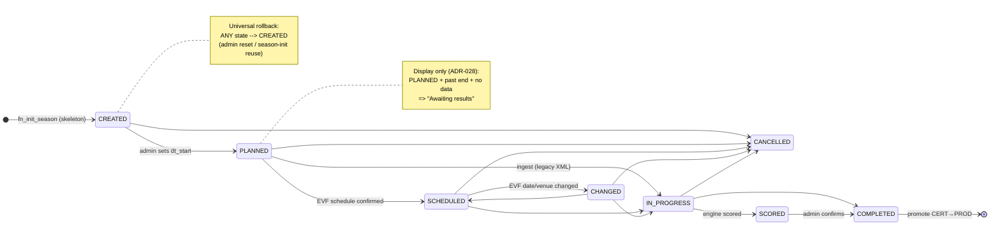
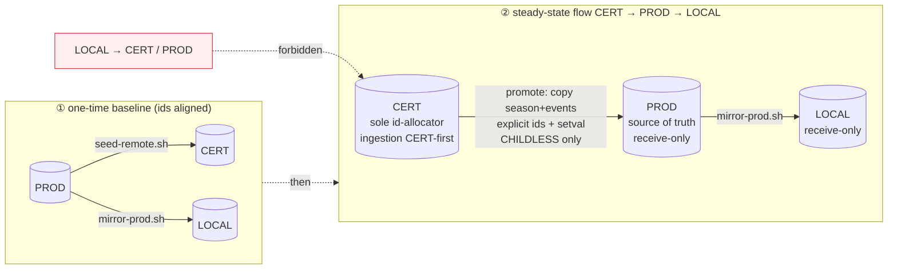
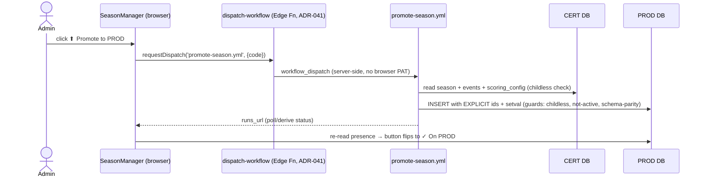

# ADR-077: Event lifecycle, season-skeleton provisioning & CERT→PROD calendar promotion

**Status:** Accepted · **Date:** 2026-06-28

**Relates to:** **narrows** ADR-050's supersession of **ADR-025** to its *ingestion mechanism* only
(the event-status lifecycle + Telegram admin surface live on **here**); **ADR-044** (wizard introduced
`CREATED`), **ADR-054** (`CREATED`/`SCORED` enum values + validator extension), **ADR-028** (date-aware
display "Awaiting results"), **ADR-039** (EVF-sync status flips), **ADR-053** (score-provenance is a
*separate* axis), **ADR-073/050** (consuming ingest flows), **ADR-076** (re-ingest / keep-rule),
**ADR-036** (env data-flow — *refined* here for empty-calendar promotion).

## Context

Three drifts forced this ADR:

1. **The lifecycle silently grew 3 → 8 states** with no ADR of record. ADR-025 documented
   `PLANNED → IN_PROGRESS → COMPLETED`; the real `enum_event_status` is 8 states governed by a **live
   trigger** `fn_validate_event_transition`. The display layer and the admin dropdown both lag it.
2. **Ingestion is now URL-primary** (`ingest <prefix> <url>` → one authoritative, re-runnable fetch,
   ADR-076 keep-rule). ADR-025's whole model — `IN_PROGRESS` as multi-day, multi-email XML
   accumulation — is now the minority path.
3. **Seasons are provisioned as childless skeletons** and must be **promoted CERT→PROD** as an empty
   calendar, reversibly, with **identical ids** — a flow ADR-036 didn't contemplate.

Bugs surfaced while writing this: the status **display map omits `CREATED` + `SCORED`** (both render
as "Planned"); the **admin dropdown offers transitions the validator rejects**; and `EVF_PUBLISHED`
was being conflated with the lifecycle when it is a *different axis*.

## Decision

### 1 · The canonical event lifecycle (8 states, validator-backed)

`fn_validate_event_transition` (trigger on `tbl_event`, [20250301000003] + extended [20260425000005])
is the **single source of truth** for legal transitions. Every status exists because it is a node in
this machine:

*Rollback edges (omitted from the diagram for clarity, all validator-permitted):*
`IN_PROGRESS→PLANNED`, `SCORED→IN_PROGRESS`, `COMPLETED→{SCORED,IN_PROGRESS,PLANNED}`, and the
universal `* → CREATED`.

| Status | Regime | Why it exists | Set by | Public calendar? | Display badge |
|---|---|---|---|---|---|
| **CREATED** | skeleton | Childless, date-less calendar placeholder; the pre-existing event ingestion matches against (ADR-025 §1). Revertible reset target. | `fn_init_season` (ADR-044/054) | **Hidden** until dated | ⚠ *missing → "Planned"* — **fix** |
| **PLANNED** | calendar | Dated event, no results yet. The default working state. | admin `CREATED→PLANNED`; original (ADR-025) | Shown | Planned / **Awaiting results** if past+empty |
| **SCHEDULED** | calendar | EVF-calendar-confirmed date/venue — firmer than PLANNED. | EVF sync (ADR-039) | Shown | Scheduled |
| **CHANGED** | calendar | A SCHEDULED event whose date/venue changed on re-scrape — flags admin attention. | EVF sync (ADR-039) | Shown | Changed |
| **IN_PROGRESS** | ingest | ≥1 tournament ingested; legacy multi-XML accumulation. **Transient** under URL ingestion. | `fn_ingest_tournament_results` (ADR-025) | Shown | In progress |
| **SCORED** | ingest | Results ingested **and** engine-scored, pre-sign-off. Separates "scored" from "admin-final". | pipeline `Commit` (ADR-054/073) | Shown | ⚠ *missing → "Planned"* — **fix** |
| **COMPLETED** | final | Admin-confirmed final; promotable. | admin `complete` (Telegram) | Shown | Completed |
| **CANCELLED** | exit | Event cancelled (EVF/admin). | EVF sync / admin | Shown | Cancelled |

**State-transition matrix** — every non-blank cell is a `WHEN OLD=… AND NEW=…` branch in
`fn_validate_event_transition`; a **blank cell is rejected** at the trigger
(`RAISE 'Invalid event status transition: X → Y'`). Legend: **✓** forward · **↩** rollback · **—** self.

| FROM ↓ \ TO → | CREATED | PLANNED | SCHEDULED | CHANGED | IN_PROGRESS | SCORED | COMPLETED | CANCELLED |
|---|:--:|:--:|:--:|:--:|:--:|:--:|:--:|:--:|
| **CREATED**     | — | ✓ |   |   |   |   |   | ✓ |
| **PLANNED**     | ↩ | — | ✓ |   | ✓ |   |   | ✓ |
| **SCHEDULED**   | ↩ |   | — | ✓ | ✓ |   |   | ✓ |
| **CHANGED**     | ↩ |   | ✓ | — | ✓ |   |   | ✓ |
| **IN_PROGRESS** | ↩ | ↩ |   |   | — | ✓ | ✓ | ✓ |
| **SCORED**      | ↩ |   |   |   | ↩ | — | ✓ |   |
| **COMPLETED**   | ↩ | ↩ |   |   | ↩ | ↩ | — |   |
| **CANCELLED**   | ↩ |   |   |   |   |   |   | — |

- The entire **`CREATED` column** (the `↩` cells) is the *universal reset-to-skeleton* rule —
  `NEW='CREATED' AND OLD IN (every other state)` — used by admin reset and season-init reuse.
- **Forward spine:** `CREATED → PLANNED → SCHEDULED ⇄ CHANGED → IN_PROGRESS → SCORED → COMPLETED`.
- **CANCELLED** is reachable from every *pre-scoring* state and only exits via reset to CREATED.
- **Dropdown bug (see §6):** the admin `<select>` currently offers all 7 other states from any row,
  but only the ticked cells save — every blank cell throws at the trigger.

### 2 · Two axes, not one — `EVF_PUBLISHED` is provenance, not lifecycle

| Axis | Column · enum | Values | Meaning |
|---|---|---|---|
| **Lifecycle** | `enum_status` · `enum_event_status` | the 8 above | *where the event is in its life* |
| **Provenance** | `txt_source_status` · `enum_source_status` (ADR-053) | `ENGINE_COMPUTED`, `EVF_PUBLISHED` | *whose numbers the scores are* (engine vs EVF-API verbatim, EVF events only) |

`fn_promote_evf_published` flips the **provenance** axis on EVF parity-pass — it never touches
`enum_status`. Keep the two axes strictly separate.

### 3 · Season-skeleton provisioning (multi-event)

A season is provisioned by `fn_init_season` as a **set of childless `CREATED` events** — PPW1-n, the
PEW circuit, MPW, MSW, optional IMEW/DMEW — each `id_prior_event`-linked to its prior-season
counterpart. This **is** the ADR-025/050 "events must pre-exist before ingestion" calendar; the event
**codes are the addressable handles** for `ingest <prefix> <url>`. **Childless is doctrine**, not a new
idea: ADR-025 §1 always said *tournaments are created on-the-fly at ingestion*; the old
`_fn_create_skeleton_children` pre-creating 6 tournaments/event was the deviation, corrected by
migration `20260627000003`. Season provisioning is a one-shot DB/admin action — **not** a pipeline flow.

### 4 · URL-primary ingestion doctrine

One authoritative, fully re-runnable fetch (keep-rule ADR-076). Consequences:
- **"Awaiting results"** (PLANNED + past end + no data) is the *canonical pre-ingest state*.
- **`IN_PROGRESS` demoted** to transient / legacy-XML.
- **Re-ingest-from-URL is the default correction path.** `rollback` / `delete` and the full Telegram
  lifecycle surface (`status` `complete` `rollback` `delete` `promote` `ingest`) are **retained as the
  escape hatch** for genuine errors — demoted from "the way" to "the exception," never removed.

### 5 · Environment data-flow & CERT→PROD calendar promotion

**CERT is the sole allocator of new season/event ids — ingestion is always CERT-first, then promoted
(this is the reason CERT and PROD exist).** PROD and LOCAL only ever *receive* copies, so ids stay
**identical across all three**, which makes `id_prior_event` (a numeric FK) valid everywhere and lets
promotion be a verbatim **row copy with explicit ids**, not a re-run.

**Promotion contract (`fn_promote_season_skeleton`, CERT→PROD):**

| Guard | Rule |
|---|---|
| **Childless** | Refuse if **any** event in the season has ≥1 `tbl_tournament` child. (Empty calendar carries no results — the only thing ADR-036 protects — so promoting it up is safe.) |
| **Schema parity** | Target PROD must already have migration `20260627000003` (childless init) — else children get created. Verify fingerprint first. |
| **Id identity** | INSERT season + events + scoring_config **with explicit ids** (OVERRIDING SYSTEM VALUE) + `setval` PROD sequences past them. |
| **Idempotency** | Refuse if the season already exists on PROD (revert-then-repromote to retry). |

**Reversibility (`fn_delete_season_skeleton`, symmetric on CERT *and* PROD):**

| Guard | Rule |
|---|---|
| **Childless** | Delete the whole season (events → scoring_config → season) only while **no event has children**. Once results land, refuse — that protects the live ranklist. |
| **Not active** | Refuse if it is the active season (deleting it would blank the live ranklist). |

This **refines ADR-036**: ADR-036's "data flows PROD→down only / LOCAL→PROD never" stands for
**results**; **empty-calendar provisioning flows CERT→PROD** as the single sanctioned upward hop, and
the **childless guard is the regime boundary** between the two.

> **Amendment (2026-06-28) — legacy id divergence vs forward id-identity.** The one-time CERT→PROD→LOCAL
> baseline was executed with the **natural-key** monolithic dump (`export_seed.py` / `seed-remote.sh`),
> which reassigns serial ids in dump order. Result: **`tbl_season` ids match across all three envs, but
> legacy `tbl_event` ids (1–84) DIVERGE** between CERT and PROD (same code → different id). The
> "identical ids across all three" invariant therefore holds for **seasons** and for **newly-promoted**
> rows (explicit-id copy keeps them aligned going forward, both sequences at the same max), but **not**
> for the legacy event backlog. This is harmless because **code-identity** is preserved and every
> self-referential FK is re-resolved by `txt_code`, not raw id: `export_seed.py` emits `id_prior_event`
> as a `txt_code` subquery (fixed 2026-06-28), and `promote_season.py` re-resolves both `id_prior_event`
> and `id_organizer` to the **target** id by code before sending the payload. Consequence for promotion:
> **never copy a self/cross FK as a raw source id** — always resolve by natural key. A future full
> re-alignment of legacy ids would require an explicit-id re-dump; not needed for correctness.

### 6 · Coherence fixes this ADR mandates

- **Display map:** add `CREATED` (`status-created`) + `SCORED` (`status-scored`) to
  `eventStatus.ts` `BASE` so all 8 states render correctly (no silent "Planned" fallback).
- **Validator-aware dropdown:** the EventManager status `<select>` must offer **only**
  `fn_validate_event_transition`-permitted targets for the current status — not all 7 others.
- **Revert guard:** widen `fn_revert_season_init` from `status<>'CREATED'` to **"no child tournaments"**
  so a childless-but-PLANNED season is still revertible/deletable.

### 7 · Admin-UI surface — CERT→PROD season-skeleton promotion

Promotion is an **explicit, state-derived button** on the SeasonManager season row (rendered only
when `dualEnv`). The button is **computed from PROD presence + childless state**, never a click-latch
(a latch would lie after reload or after a Remove-from-PROD):

| Season condition | Control shown | Action |
|---|---|---|
| not on PROD **and** all events childless | **`⬆ Promote to PROD`** (active) | dispatch `promote-season.yml` |
| already present on PROD | **`✓ On PROD`** (inactive) + **`Remove from PROD`** | dispatch reverse (childless+not-active guard) |
| any event has ≥1 tournament child | button **disabled** + hint *"past skeleton — promote results per-event"* | (use `promote.yml` per event) |
| not `dualEnv` (single env) | hidden | — |

- **No PROD write credentials in the browser** — reuse the existing `requestDispatch` → `dispatch-workflow`
  Edge Function path (same as the Re-ingest + regen-report buttons).
- **Create-flow convenience (optional):** after the wizard commits on CERT, surface the same
  `⬆ Promote to PROD` affordance inline — one-shot if the admin wants — but the **default lands on CERT
  for review**; never "create on both by default" (that would break id-identity + skip the review gate).

## Alternatives considered
- **Reopen/amend ADR-025 in place** — rejected: it's a superseded record; resurrecting it muddies the
  registry. ADR-077 carries the doctrine forward and *narrows* the supersession instead.
- **Promote by re-running `fn_init_season` on PROD** (no id copy) — rejected: the user requires
  **identical ids** across envs; a re-run allocates fresh PROD ids. Copy-with-explicit-ids wins,
  enabled by the CERT-first / receive-only invariant.
- **Keep the email/XML lifecycle as primary** — rejected: URL ingestion is now the main path.

## Consequences
- The lifecycle, display, and dropdown finally agree with the validator (single source of truth).
- A reviewed empty season ships CERT→PROD→LOCAL with byte-identical ids; `id_prior_event` survives.
- Re-ingest replaces destructive rollback as the default correction; Telegram escape hatch retained.
- Hard dependency: **CERT-first ingestion discipline** — no event may be created directly on
  PROD/LOCAL, or id-identity breaks. (Confirmed: this is the operating model.)

## Amendment (2026-07-11, ADR-081)

`fn_promote_season_skeleton` is **slimmed to promote the season row + scoring_config only** —
its event-copy block (and the event `id_prior_event` resolution in `promote_season.py`) is
removed. Event Create/Update/Delete for a season is now owned entirely by the CERT→PROD
**reconciler** (`fn_mirror_events_to_prod`, ADR-081). Rationale: "one-time bulk event copy"
(this skeleton path) and "incremental delta" (calendar promote) were the same operation at two
points in time; unifying them removes the duplicate event-copy logic. Season-shell creation
stays a deliberate manual go-live act; events populate on the next reconcile. pgTAP 48.2 is
reworked to assert the events array is ignored; 48.4 (event prior-link resolution) retired,
its coverage migrated to `51_prod_event_reconcile.sql` 51.1c. See ADR-081.
