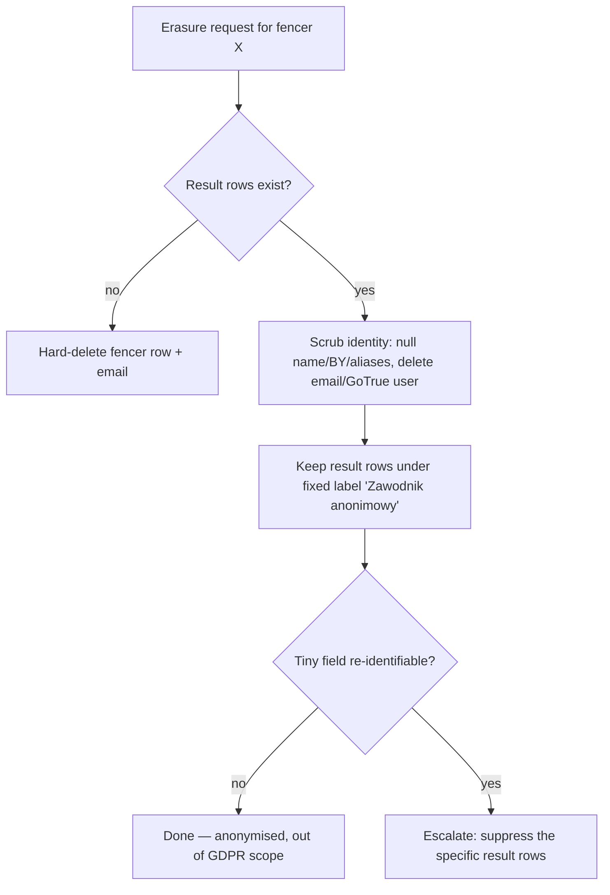

# ADR-078: GDPR Data Handling & Data-Subject Rights

**Status:** Proposed (draft — pending implementation)
**Date:** 2026-07-04
**Source:** Event Registration & Clean-Roster Seeding subsystem (spec §5.2); ADR-079, ADR-080

> **Scope & standing of this document.** This ADR is a precise, audit-legible
> data-protection *design rationale* with citations to the operative law
> (Regulation (EU) 2016/679 and the Polish Act of 10 May 2018), authored to be
> implementation-ready. Every Article reference links to its operative text in the
> References section. It is **not** a substitute for formal legal advice: before
> go-live SPWS should obtain a one-time review by Polish counsel or a Data
> Protection Officer, execute the Supabase Data Processing Agreement, and publish
> the privacy notice (*informacja RODO*) and Record of Processing Activities.

## Context

The Event Registration subsystem (ADR-079) has fencers **self-declare** personal
data — surname, first name, gender, birth year, and (for non-exact matches) an
email — so that the ranklist and the FTL seed carry clean, authoritative
identities. Publishing a public veterans ranking and collecting registrations
makes SPWS a **data controller** under Regulation (EU) 2016/679 (GDPR) and the
Polish Act of 10 May 2018 on the Protection of Personal Data (supervisory
authority: **UODO** — Urząd Ochrony Danych Osobowych).

This is true **already** — the existing ranklist holds names + birth years. The
new subsystem widens the collection (email, per-event registration) and therefore
requires an explicit, documented data-protection design. None of the data is
**special-category** data under Art. 9 (no health, biometric, etc.), so the
ordinary-personal-data regime applies — no heightened obligations and **no legal
requirement for application-level field encryption**.

Payment is **display-only bank transfer** (the association's IBAN is shown; the
fencer pays from their own bank). SPWS never stores, processes, or transmits
cardholder data, so the system is **entirely out of PCI-DSS scope**; PCI is not a
factor in any storage decision.

## Decision

Adopt a proportionate, minimisation-first data-protection design. The key
structural choice — enforced in ADR-079 — is that the registration subsystem is
**read-only against `tbl_fencer`**, so declared data lands only in an ephemeral
`tbl_registration` and never mutates the source of truth except through the
supervised ingestion pipeline. That containment is the backbone of every control
below.

### 1. Personal-data inventory

| Data element | Purpose | Lawful basis (Art. 6) | Storage | Retention |
|---|---|---|---|---|
| Surname, first name, gender, birth year | Ranking + age-category verification | Legitimate interest 6(1)(f) | `tbl_fencer` (durable), `tbl_registration` (ephemeral) | Ranking record durable; registration purged post-ingest |
| Weapon + category selections | Register the fencer for the event | Contract 6(1)(b) | `tbl_registration` | Purged after results ingested + reconciled |
| Email (only on non-exact match) | One-time verification (friction/accountability) | Legitimate interest 6(1)(f) | GoTrue auth (**not** `tbl_fencer`) | Transient; not persisted in domain tables |
| Salted email **hash** + request timestamps | Abuse defence (repeat erase/register) | Legal claims 17(3)(e) | `tbl_registration` / abuse log | Minimal, bounded |
| Club (free text) | Generate FTL seed files only | — (transient) | **Never stored** | Discarded after seed generation |
| Payment reference + paid/unpaid status | Reconcile the entry fee | Contract 6(1)(b) | `tbl_registration` | Purged with the registration |

Birth **date** is not collected (year-only suffices for the age category); full
DOB is an optional field used *only* to disambiguate a same-name-same-year
collision. Email lives in **GoTrue**, not `tbl_fencer`, keeping the ranking table
free of contact PII (data protection by design, Art. 25).

### 2. Controller / processor

- **Controller:** SPWS (determines purposes and means).
- **Processor:** Supabase (hosting/DB) — requires a Data Processing Agreement
  (Art. 28) and an **EU region** (Art. 44+ data-residency).
- **Recipient:** the event **organizer** receives the roster (names + categories)
  via the seed email (ADR-080) — a recipient under the event-running purpose,
  recorded in the ROPA.

### 3. Data-subject rights (Art. 12–22)

| Right | Article | How it is satisfied |
|---|---|---|
| Information / transparency | 13–14 | Privacy notice shown at collection (form Step 1 link) + acceptance gate before payment |
| Access | 15 | Self-service "Sprawdź zgłoszenie" (no login) + admin export |
| Rectification | 16 | **The birth-year reconciliation flow *is* rectification** (ADR-079), applied at ingestion |
| Erasure | 17 | Anonymise-and-keep (see §4) |
| Restriction | 18 | Admin flag suspends processing pending dispute |
| Portability | 20 | Registration record exportable (declared data) |
| Objection | 21 | Objection to the legitimate-interest ranking → routes into the erasure path |

The **acceptance gate** before payment is worded as *"I accept the participation
terms and acknowledge the privacy notice"* — a contract precondition plus Art. 13
transparency, **not** Art. 7 consent. Consent-or-no-service is invalid consent
(Art. 7(4)); genuine Art. 7 consent is reserved for **optional** processing
(photos, newsletter) as separate, non-blocking toggles.

### 4. Right to erasure — anonymise-and-keep (Art. 17)

**Legal crux.** [Pseudonymisation](https://gdpr-info.eu/art-4-gdpr/) (Art. 4(5) —
data no longer attributable to a subject *without additional information kept
separately*) **remains personal data** and does **not** satisfy an erasure request.
Only **anonymisation** — where re-identification is irreversibly impossible for
anyone, controller included ([Recital 26](https://gdpr-info.eu/recitals/no-26/);
[Article 29 Working Party Opinion 05/2014 on Anonymisation Techniques,
WP216](https://ec.europa.eu/justice/article-29/documentation/opinion-recommendation/files/2014/wp216_en.pdf)) —
takes data outside the Regulation and thereby fulfils
[Art. 17](https://gdpr-info.eu/art-17-gdpr/). A reversible "alias" that keeps a
lookup table is therefore **insufficient**: the scrub must destroy the mapping and
every identifying attribute. WP216 further warns that *singling out* a record from
context can defeat anonymisation — the basis for the small-field caveat below.

On an erasure request for fencer *X*, **scrub-in-place**:

- **Keep:** the internal surrogate `id_fencer` + the result rows (place, score,
  category) — so other fencers' historical standings and points are not disturbed
  (deleting a result would shift everyone who placed below *X*).
- **Irreversibly delete / null:** `txt_surname`, `txt_first_name`,
  `int_birth_year`, `json_name_aliases` (aliases identify too), the GoTrue user +
  email, and any registration rows.
- Display name becomes a **fixed shared label** ("Zawodnik anonimowy"), **not** a
  per-person reversible alias. A minimal `ts_erased` marker records that erasure
  occurred (accountability).

**Caveat:** in very small veteran fields a unique result may remain
re-identifiable from public context; the escalation path is full result
**suppression**.

**Erasure is not a ban.** It removes held data; the person may re-register (a fresh
contract). GDPR **forbids** a permanent identity-keyed "do-not-admit" blocklist
(that list would itself be retained personal data contradicting the erasure).

### 5. Abuse defence (Art. 12(5), Art. 17(3)(e))

A troll cycling erase → re-register → erase is handled by:

- **Art. 12(5):** refuse, or charge a reasonable fee for, "manifestly unfounded or
  excessive, in particular repetitive" requests.
- **Art. 17(3)(e):** retain a **minimal** abuse-defence log — a *salted hash* of
  the email + request timestamps (no readable identity) — to evidence repetition.
- Anonymise-and-keep makes each erasure **cheap and idempotent** (attribute-scrub,
  no ranking recompute), so a troll's effort exceeds ours — near-zero leverage.

### 6. Security (Art. 32)

Proportionate to ordinary personal data — satisfied by measures already present or
free: TLS in transit (HTTPS), at-rest encryption (Supabase default), RLS access
control (public insert via RPC, read-only entry-list view, admin-only writes),
admin MFA/TOTP (ADR-016), and email segregated in GoTrue. **No bespoke
application-level field encryption** is required for ordinary PII.

### 7. Records of processing (Art. 30), breach (Art. 33/34), consent (Art. 7)

- **ROPA:** maintain a register — purposes, categories, recipients (Supabase,
  organizer), retention, safeguards.
- **Breach:** notify UODO within 72 h where required; notify subjects on high risk.
- **Consent (optional only):** versioned + timestamped in `tbl_registration`
  (`txt_consent_version`, `ts_consent`).

## Consequences

- Adds `tbl_registration` (ephemeral, RLS-gated) and email in GoTrue; **no** email
  column on `tbl_fencer`.
- Erasure requires the anonymise-and-keep function + the small-field suppression
  escalation.
- Operational/paperwork obligations (not engineering): privacy notice (RODO), DPA
  with Supabase, EU-region confirmation, ROPA, retention job. A one-time local
  legal review is recommended; this ADR is the proportionate design, not legal
  advice.
- New FRs to be registered in the RTM during implementation (registration,
  erasure, retention, consent).

## References

**Primary legislation & authority**
- [Regulation (EU) 2016/679 (GDPR)](https://eur-lex.europa.eu/eli/reg/2016/679/oj) — consolidated official text (EUR-Lex).
- [Ustawa z dnia 10 maja 2018 r. o ochronie danych osobowych](https://isap.sejm.gov.pl/isap.nsf/DocDetails.xsp?id=WDU20180001000) — the Polish implementing Act (ISAP).
- [UODO](https://uodo.gov.pl/en) — Urząd Ochrony Danych Osobowych, the Polish supervisory authority.

**Cited provisions (each link resolves to the operative text; obligations paraphrased above)**
- [Art. 4(5)](https://gdpr-info.eu/art-4-gdpr/) — *pseudonymisation* (reversible; remains personal data).
- [Recital 26](https://gdpr-info.eu/recitals/no-26/) — *anonymous information* is outside the Regulation; re-identification test.
- [Art. 5](https://gdpr-info.eu/art-5-gdpr/) — principles: lawfulness, **minimisation** 5(1)(c), accuracy 5(1)(d), **storage limitation** 5(1)(e).
- [Art. 6](https://gdpr-info.eu/art-6-gdpr/) — lawful bases: **contract** 6(1)(b), **legitimate interests** 6(1)(f).
- [Art. 7](https://gdpr-info.eu/art-7-gdpr/) — conditions for consent; **7(4)** consent must be freely given.
- [Art. 9](https://gdpr-info.eu/art-9-gdpr/) — special-category data (**none** processed here).
- [Art. 12](https://gdpr-info.eu/art-12-gdpr/) — transparency + **12(5)** manifestly unfounded / excessive requests.
- [Art. 13](https://gdpr-info.eu/art-13-gdpr/) — information at the point of collection.
- Rights: [Art. 15](https://gdpr-info.eu/art-15-gdpr/) access · [16](https://gdpr-info.eu/art-16-gdpr/) rectification · [17](https://gdpr-info.eu/art-17-gdpr/) erasure (incl. **17(3)(e)** legal claims) · [18](https://gdpr-info.eu/art-18-gdpr/) restriction · [20](https://gdpr-info.eu/art-20-gdpr/) portability · [21](https://gdpr-info.eu/art-21-gdpr/) objection.
- [Art. 25](https://gdpr-info.eu/art-25-gdpr/) — data protection by design and by default.
- [Art. 28](https://gdpr-info.eu/art-28-gdpr/) — processor / Data Processing Agreement.
- [Art. 30](https://gdpr-info.eu/art-30-gdpr/) — records of processing (ROPA).
- [Art. 32](https://gdpr-info.eu/art-32-gdpr/) — security of processing (encryption named as an *example*, risk-based).
- [Art. 33](https://gdpr-info.eu/art-33-gdpr/) / [Art. 34](https://gdpr-info.eu/art-34-gdpr/) — breach notification (72 h to the authority).
- [Art. 44](https://gdpr-info.eu/art-44-gdpr/) — general principle for transfers / data residency.

**Guidance**
- [Article 29 Working Party, Opinion 05/2014 on Anonymisation Techniques (WP216)](https://ec.europa.eu/justice/article-29/documentation/opinion-recommendation/files/2014/wp216_en.pdf) — the authoritative treatment of anonymisation vs pseudonymisation and residual *singling-out* risk (underpins §4).

*Link note: `eur-lex.europa.eu` and `isap.sejm.gov.pl` are the authoritative sources; `gdpr-info.eu` is a widely-used convenience host of the article text.*

**Related ADRs:** ADR-079 (registration/identity, read-only invariant), ADR-080 (seeding + organizer recipient), ADR-016 (admin MFA), ADR-056 (BY reconciliation).
