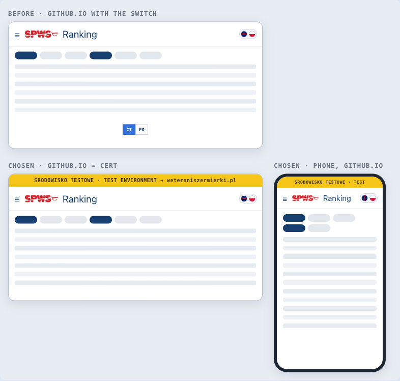

# ADR-109: The Environments Are Split by Host — github.io Is CERT, weteraniszermierki.pl Is PROD

**Status:** Accepted (proposed 2026-10-03; signed off by the user 2026-10-03, with Q8 decided A the same day). Implemented on LOCAL 2026-10-04 (plan steps 1–10); the release and the WordPress pages follow (steps 11–13).
**Date:** 2026-10-03
**Supersedes in part:** [ADR-009](009-cert-prod-runtime-toggle.md) — the runtime CERT/PROD toggle. Its single GitHub Pages site and its build-time credential injection stand.
**Relates to:** [ADR-090](090-prod-surface-as-wordpress-menu-item.md) (weteraniszermierki.pl is the PROD surface; amended the same day), [ADR-011](011-artifact-release-pipeline.md) (the release order below), [ADR-079](079-event-self-registration-identity.md) (`register.html` stays PROD), [ADR-041](041-edge-function-dispatch.md) (dispatch targets), [ADR-085](085-points-calculator-temporary-static-page.md), [ADR-092](092-scoring-table-annex-bilingual-static-page.md) and [ADR-102](102-published-pages-share-one-scoring-module.md) (the published documents)
**Development plan:** [`doc/plans/wordpress-ranking-points-table-brainstorm-2026-10-02.html`](../plans/wordpress-ranking-points-table-brainstorm-2026-10-02.html) — steps §04, tests §05 (WP.ENV.\*, WP.REL.01), definition of done §08, and Part II, the PROD manual.

## Context

ADR-009 served CERT and PROD from one GitHub Pages site, with a runtime CT/PD switch. `release.yml` injects both credential pairs into `index.html` (L121–124), so the switch shows on `fencer4life.github.io`. It injects the PROD pair only into `register.html` (L144–147) and into the published calculator and annex (L159–164).

ADR-090 then made `weteraniszermierki.pl` the public PROD surface, and the user decided on 3 October 2026 that the WordPress pages carry the ranking, the calendar, the calculator and the annex. With PROD on its own host, the switch on github.io has stopped being a convenience and become a hazard:

- an admin signed in on github.io can switch to PROD and act on it, from an address that looks like a test copy;
- the github.io calculator and annex read PROD under that same test-looking address.

One more fact shapes this decision. A release deploys GitHub Pages and CERT at the same time, and only PROD waits for the `production` approval. The WordPress pages load their code from Pages, so they run new code against the old PROD database until the approval. In run `36986509618` (2 October 2026) that gap was 84 seconds.

## Decision

1. **github.io is CERT.** The app opens on CERT only, with no CT/PD switch. Every github.io page that runs on the CERT pair carries a yellow TEST ribbon, which stays on screen and links to `weteraniszermierki.pl`. `index.html` keeps the PROD pair only for the read-only promotion state (`refreshPromotionState`); it is never selectable and never written to.
2. **weteraniszermierki.pl is PROD.** Every WordPress page holds the PROD pair only, and has no ribbon and no switch.
3. **`register.html` stays PROD on the file host, without a ribbon.** Fencers already hold links to it, and ADR-079 §6 gives it exactly one environment.
4. **The published documents are split by environment.**
   - The github.io copies of the calculator and the annex, at their present addresses, become CERT copies with the ribbon.
   - The PROD copies that the WordPress pages frame live under `embed/` on the same file host.
   - `release.yml` injects each environment into its own files, and a build guard fails the release if an `embed/` copy carries CERT credentials.
5. **Workflow dispatches target the host's own environment:** CERT from github.io, PROD from WordPress.
6. **The release order is kept, under a rule.** One Pages site serves both environments, so Pages still deploys before the PROD approval. The rule (Q8, decided A):
   - code that needs a new database object ships in the release *after* the one that creates it — the database first, the code that uses it next;
   - PROD is approved within minutes of CERT, and never left waiting.

**The chosen mocks** (W3; drawn, 3 October 2026). Before: github.io with the switch. Chosen: github.io as CERT under the ribbon, on a computer and on a phone. The PL/EN switch stays in the bar (ADR-090, amendment 2026-10-03, Q2 C).

## Alternatives considered

1. **Keep the switch.** Rejected: it lets an admin act on PROD from the test host, and it leaves public visitors on github.io reading PROD under a test-looking address.
2. **A second GitHub Pages site for PROD's files.** Rejected for now: it needs a second repository or account, or a custom address, and a custom address needs DNS access that nobody on the project holds.
3. **Serve PROD's files from the WordPress hosting.** Rejected: nobody on the project holds the hosting login.
4. **Make `deploy-pages` wait for `deploy-prod`.** Rejected: github.io is also CERT's front end, so CERT could no longer be checked in a browser before PROD is approved.

## Consequences

- **ADR-009's runtime toggle is superseded.** FR-42 is retired and replaced by FR-151. The single Pages site and the `sed` credential injection stand.
- **`dualEnv` now means two things.** The switch is gone, but the PROD read for promotion state stays. Tests WP.ENV.01–02 pin both behaviours, and WP.REL.01 pins the per-file injection.
- **Old github.io calculator bookmarks** now show CERT, under the ribbon. The numbers come from CERT's season settings, which are normally identical to PROD's.
- **LOCAL is unchanged.** The committed `index.html` already has an empty PROD pair, so LOCAL has no switch today.
- **The handbook's environments page** (`doc/handbook/operations/environments-and-release.html`) describes the two hosts and the Q8 rule. The release checklist in the plan's §12 carries the rule for operators.
