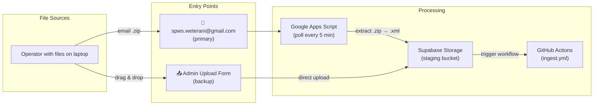
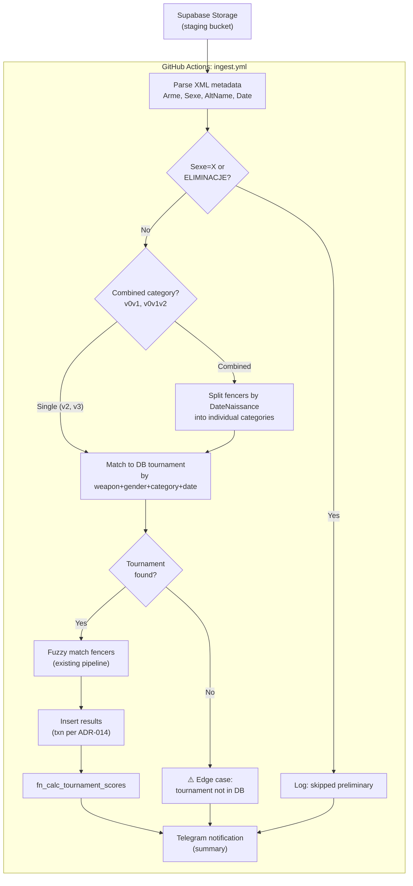
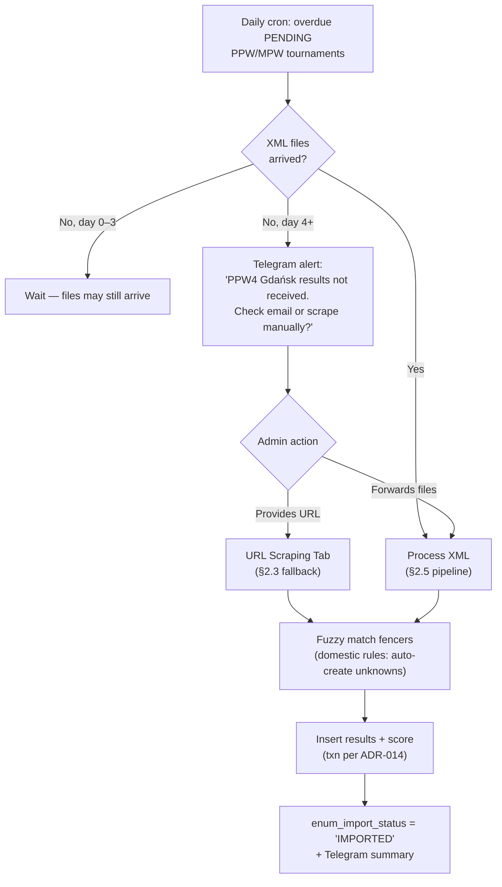
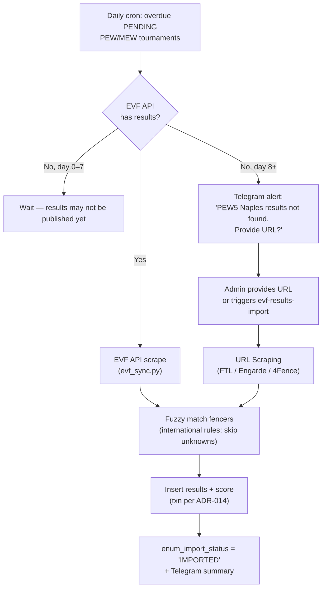
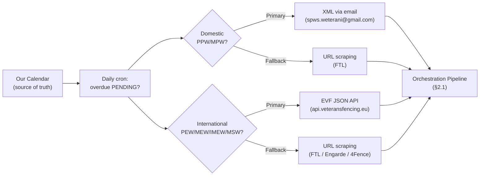
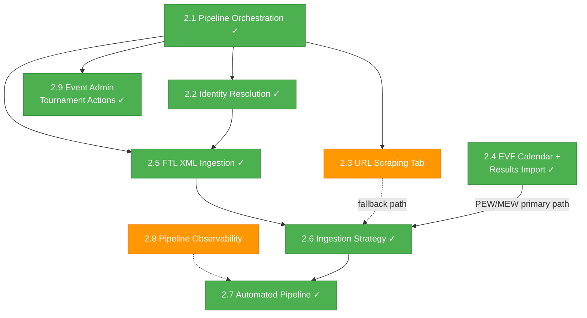

> **ARCHIVED** — This document is superseded by [Development History](../development_history.md) and the [Project Specification](../Project%20Specification.%20SPWS%20Automated%20Ranklist%20System.md). Kept for git history reference only.

# Go-to-PROD Plan — SPWS Automated Ranklist System

**Status:** Complete
**Date:** 2026-04-07 (updated)
**Predecessor:** [MVP Development Plan](MVP_development_plan.md) (M8–M10, completed 2026-04-04)

## 1. Overview

The MVP phase delivered all 30 sub-rankings with rolling score, admin auth, CRUD UI, calendar view, and a release pipeline (LOCAL → CERT → PROD). Post-MVP work has added:

- **EVF Calendar + Results Import** (ADR-028) — automated scraping of veteransfencing.eu via JSON API
- **Event-centric ingestion pipeline** (ADR-025) — Telegram-driven, atomic per-tournament
- **CERT → PROD promotion** (ADR-026) — schema fingerprint verification
- **Calendar UI color coding** — PEW (blue), IMEW/MEW/MSW/PSW (gold), 3-line slot boxes with city

This document tracks remaining scope for full production readiness.

## 2. Deferred Scope

### 2.1 Pipeline Orchestration (T9.11) — COMPLETE

**FRs:** FR-51, FR-70–85
**ADRs:** ADR-022, ADR-023, ADR-024, ADR-025, ADR-026, ADR-027

**Implemented:**
- `fn_ingest_tournament_results` — atomic delete+insert+score (ADR-022)
- `python/pipeline/` — orchestrator, db_connector, storage_handler, ingest_cli, notifications, promote, export_seed
- Event lifecycle: PLANNED → IN_PROGRESS (auto on ingest) → COMPLETED (admin) + rollback
- Combined category splitting with DOB resolution + PENDING flag for unresolvable (ADR-024)
- Event-centric routing: `fn_find_event_by_date()` + `fn_find_or_create_tournament()` (ADR-025)
- Telegram command interface: 16+ commands (lifecycle, review, storage, season, EVF, URLs, emergency)
- GAS email polling → Supabase Storage → GitHub Actions ingest workflow (ADR-023)
- CERT → PROD promotion with per-tournament error handling (ADR-026)
- Full-season seed export with name-based lookups + auto-commit (ADR-027)
- PPW4 Gdańsk data ingested E2E into CERT and promoted to PROD
- 25 pgTAP tests (10.1–10.24) + 20 pytest tests (test_orchestrator, test_ingest_cli)

### 2.2 Identity Resolution DB Wiring (FR-56, FR-57) — COMPLETE

**What exists:**
- `IdentityManager.svelte` — match candidate queue with status filter, confidence coloring (T9.7)
- `DisambiguationModal.svelte` — fencer selection with radio buttons, birth year display (T9.7)
- `fn_approve_match`, `fn_dismiss_match`, `fn_create_fencer_from_match` RPCs (migration 20260406000003)
- `vw_match_candidates` view (migration 20260406000004)
- 13 pgTAP tests for identity RPCs (supabase/tests/11_identity_resolution.sql)
- `api.ts` functions: `approveMatch()`, `dismissMatch()`, `createFencerFromMatch()`
- App.svelte callbacks wired: `handleApproveMatch`, `handleDismissMatch`, `handleCreateNewFencer`
- 15 vitest assertions (9.68–9.77 unit + 9.78–9.82 integration)
- CERT: 498 match candidates, all AUTO_MATCHED (no pending review needed)

### 2.3 URL Scraping Tab (FR-53, FR-54 partial)

**What exists:**
- TournamentImportModal + EventImportModal with file drop zones (T9.5, T9.6)
- All 4 scrapers tested and working (FTL, Engarde, 4Fence, CSV)

**What's needed:**
- Second tab in import modals: "Z adresu URL" (from URL) — designed in mockup `m8_tournaments.html`
- URL input field → auto-detect scraper platform → scrape → feed into orchestration pipeline
- Frontend validation (URL format, platform detection feedback)

### 2.4 EVF Calendar + Results Import (FR-58) — COMPLETE

**ADR-028:** Two data sources from veteransfencing.eu — calendar HTML and JSON API.

**Implemented:**
- `python/scrapers/evf_calendar.py` — calendar HTML parser (past+future pages, dedup by date+name)
- `python/scrapers/evf_results.py` — `EvfApiClient` (JSON API at `api.veteransfencing.eu/fe`)
  - Event discovery via `/events/competitions` endpoint (scans API IDs)
  - Results via POST with `{path, nonce, model}` body
  - Category mapping: EVF Cat 1-4 = SPWS V1-V4 (skip V0), team events metadata only
- `python/scrapers/evf_sync.py` — full season orchestrator with `--dry-run` mode
  - `sync_calendar()` — scrape → dedup → create events
  - `sync_results()` — discover API events → scrape → fuzzy match (diacritic folding) → ingest
- `fn_import_evf_events()` — bulk event+tournament creation (migration 20260406000008)
- `.github/workflows/evf-sync.yml` — cron every 3 days + manual dispatch
- Telegram commands: `evf-cal-import`, `evf-results-import <event>`, `evf-status`
- 10 pytest + 4 pgTAP tests
- **E2E validated:** 7 events scraped, 64 results ingested, 2 new events created on CERT

**Calendar UI (M11):**
- Color-coded event cards: PEW = light blue bg + blue left border, IMEW/MEW/MSW/PSW = light gold + gold border
- 3-line slot boxes in rolling progress: code/icon/city, type-colored
- PPW/MPW: solid green (completed) vs lighter green (future) with 📅 icon
- Card layout with proper borders/border-radius (replaced timeline dot layout)
- Mockup: `doc/mockups/m11_calendar_evf_colors.html`
- 6 new vitest tests (11.1–11.6)

### 2.5 FencingTime Live XML File Ingestion — COMPLETE

**FRs:** FR-51
**ADRs:** ADR-022, ADR-024
**Depends on:** Pipeline Orchestration (2.1 ✓), Identity Resolution DB Wiring (2.2 ✓)

**Implemented:**
- `python/scrapers/fencingtime_xml.py` — full XML parser (270 lines), basic + enriched modes
- Combined category splitting: DOB-based assignment, fencer_db fallback, PENDING for unresolvable
- `python/scrapers/file_import.py` — file format dispatcher (.xml, .xlsx, .xls, .json, .csv)
- Test fixtures: `single_category.xml`, `combined_v0v1.xml`, `no_dob.xml`
- 3 pytest test classes (test_fencingtime_xml) + orchestrator integration tests

Automated ingestion of FencingTime Live XML result files — the primary data format for Polish domestic tournaments (PPW/MPW).

#### 2.5.1 XML Format

Root element: `<CompetitionIndividuelle>` with attributes:
- `Arme` — weapon: `E` (Epee), `F` (Foil), `S` (Sabre)
- `Sexe` — gender: `M` (Male), `F` (Female), `X` (Mixed = preliminary, skip)
- `AltName` — contains age category: `v0`, `v1`, `v2`, `v3`, `v4`, or combined `v0v1`, `v0v1v2`
- `Annee` — season: `2025/2026`
- `Date` — tournament date: `21.02.2026`
- `TitreLong` — event name: `IV Puchar Polski Weteranów Gdańsk 2026`

Fencer elements: `<Tireur>` with `Nom`, `Prenom`, `DateNaissance`, `Classement` (final place), `Nation`, `Club`.

#### 2.5.2 Entry Points

Two paths for files to reach the system:



**Email path (primary):** Operator emails zip archive to `spws.weterani@gmail.com`. Google Apps Script polls inbox every 5 minutes, extracts `.xml` files from `.zip` attachments, uploads to Supabase Storage staging bucket, triggers GitHub Actions `ingest.yml`.

**Upload form (backup):** Admin drags & drops `.zip` or individual `.xml` files into the Admin UI upload form. Files go directly to Supabase Storage staging bucket, triggering the same pipeline.

#### 2.5.3 Processing Pipeline



#### 2.5.4 Combined Category Splitting

Some tournaments combine age categories (e.g., `v0v1` = V0 + V1 fencing together). One XML file produces results for multiple DB `tbl_tournament` records:

1. Parse `AltName` to extract combined categories (e.g., `v0v1` → `[V0, V1]`)
2. For each `<Tireur>`, use `DateNaissance` to determine actual age category via `birth_year_matches_category()`
3. Group fencers by resolved category
4. Import each group as a separate tournament result set, preserving relative placement within each category group

**Edge case:** If a fencer's `DateNaissance` is missing or doesn't match any of the combined categories → flag for admin review.

#### 2.5.5 Edge Cases Requiring Admin Intervention

| Edge Case | Detection | Admin Action | Telegram Alert |
|-----------|-----------|-------------|----------------|
| **Tournament not in DB** | No matching `tbl_tournament` for weapon+gender+category+date | Create event/tournament via CRUD UI, then re-trigger import | "⚠️ No DB tournament for: Epee M V3 2026-02-21 (Gdańsk). Create it and re-run." |
| **Missing DateNaissance in combined category** | `<Tireur>` has no `DateNaissance` in a `v0v1`/`v0v1v2` file | Assign fencer to correct category manually | "⚠️ 2 fencers without birth date in v0v1 file — can't split. Review needed." |
| **DateNaissance outside all combined categories** | Birth year doesn't match any of `v0`, `v1`, etc. in the combined set | Verify fencer data, assign category | "⚠️ KOWALSKI Jan (1995) doesn't fit v2/v3/v4 in combined file. Assign manually." |
| **Duplicate import** | Same event+date+weapon+gender+category already has `IMPORTED` status | Confirm re-import (ADR-014 delete+reimport) or skip | "ℹ️ Epee M V2 Gdańsk already imported. Re-import? (reply YES to confirm)" |
| **Unrecognized XML format** | Root element is not `<CompetitionIndividuelle>` or missing required attributes | Forward original file to admin for manual inspection | "❌ Unrecognized XML file: filename.xml — not FTL format." |
| **Zip contains non-XML files** | Files with extensions other than `.xml` in the archive | Log and skip non-XML; process valid XMLs | "ℹ️ Skipped 2 non-XML files from archive. Processed 15 XML files." |
| **Low fuzzy match confidence** | Existing pipeline behavior: match score 50–94 → PENDING | Review in Identity Manager UI (existing) | "⚠️ 3 fencers need identity review from Gdańsk import." |
| **Event exists, tournament missing** | Event found by date+name, but specific weapon/gender/category tournament not created | Create missing tournament(s) under existing event | "⚠️ Event 'PPW4 Gdańsk' exists but missing tournament: Foil F V1. Create it." |

### 2.6 Ingestion Strategy — Calendar-Driven Triggers

Our calendar (`tbl_event` / `tbl_tournament`) is the source of truth. Excel files are retired from the active pipeline — all new results come in via FTL XML file import, URL scraping, or EVF API import.

A daily scheduled GitHub Actions cron job (e.g., 08:00 UTC) queries for overdue tournaments:

```sql
SELECT t.*, e.date_start, e.txt_name
FROM tbl_tournament t
JOIN tbl_event e ON t.id_event = e.id
WHERE t.enum_import_status = 'PENDING'
  AND e.date_start < CURRENT_DATE
ORDER BY e.date_start;
```

For each overdue tournament, the system follows one of two paths based on tournament type.

#### 2.6.1 Domestic PPW/MPW — XML File Import (Primary) + URL Scraping (Fallback)

SPWS organizes these tournaments. The organizer has the FTL XML files and emails them to `spws.weterani@gmail.com`.



**Timeline:**
| Day | Action |
|-----|--------|
| 0 | Event takes place. Organizer may email XML files same day or next. |
| 1–3 | System waits. If XML arrives → auto-process via §2.5 pipeline. |
| 4 | Telegram alert to admin: "Results not received for [event]. Check email or provide URL." |
| 4+ | Admin either forwards the missing files or provides the FTL results URL as fallback. |

#### 2.6.2 International PEW/MEW/IMEW/MSW — EVF API (Primary) + URL Scraping (Fallback)

SPWS does not organize these. Results are available via two channels:

**Primary: EVF JSON API** (implemented — ADR-028)
- Automated via `evf-sync.yml` cron (every 3 days) or manual Telegram `evf-results-import`
- Scrapes `api.veteransfencing.eu/fe` for individual results
- Fuzzy matches against full SPWS fencer DB with diacritic folding
- Only ingests Polish fencer results (international rules from ADR-025)

**Fallback: URL scraping** (for events not on EVF, or if API fails)
- Admin provides results URL via Telegram or URL Scraping Tab
- FTL / Engarde / 4Fence auto-detection



**Timeline:**
| Day | Action |
|-----|--------|
| 0 | Event takes place abroad. |
| 1–2 | Wait for results to appear on EVF. |
| 3 | EVF cron runs `evf-sync.yml` — checks API for results. If found → auto-import. |
| 3–7 | If not found, next cron run retries. |
| 8 | Telegram alert: "Results not found for [event]. Provide URL or trigger evf-results-import." |
| 8+ | Admin provides URL or manually triggers EVF results fetch. |

**Telegram commands for EVF:**
| Command | Action |
|---------|--------|
| `evf-cal-import` | Manual calendar scrape (bypass 3-day schedule) |
| `evf-results-import <event>` | Manual result fetch + import for specific event |
| `evf-status` | Show past international events missing results |

#### 2.6.3 Summary: Two-Track Ingestion Model



> **Excel retired.** The `generate_season_seed.py` tool and Excel parsers remain in the repo for historical seed data but are not part of the active ingestion pipeline.

### 2.7 Automated Ingestion Pipeline (T9.14) — COMPLETE

**Implemented:**
- `ingest.yml` — GitHub Actions workflow: manual dispatch + GAS trigger via workflow_dispatch
- `evf-sync.yml` — EVF calendar + results cron (every 3 days)
- `promote.yml` — CERT → PROD promotion workflow
- `export-seed.yml` — seed export from CERT
- `populate-urls.yml` — tournament URL auto-population, supports CERT + PROD target (ADR-029)
- `scrape-tournament.yml` — scrape single tournament results from URL and ingest (ADR-029)
- GAS email polling (5-min interval) with auto-upload to Supabase Storage
- Telegram notifications on success/failure/edge cases (13+ notification types)
- Two-track ingestion: domestic XML-first (email), international EVF API-first
- Admin Telegram commands for lifecycle management (complete, rollback, promote, status)
- PROD read-only Telegram commands: `status-prod`, `results-prod`, `evf-status-prod`
- URL commands: `populate-urls`, `populate-urls-prod`, `t-scrape`

### 2.8 Pipeline Observability (NFR-10 partial)

**What exists:**
- Telegram alerting for pipeline failures (FR-32, test 3.6)

**What's needed:**
- Structured logging (JSON format) for all pipeline operations
- Log levels: INFO for normal flow, WARNING for skipped fencers, ERROR for failures
- Aggregated run summary (tournaments processed, fencers matched/skipped/created)

### 2.9 Event Admin — Tournament Actions Wiring — COMPLETE

**FRs:** FR-53, FR-54
**ADR:** ADR-029

**Button wiring status:**

| Button | UI | Handler | API | DB | Status |
|--------|----|---------|-----|-----|--------|
| Add/Edit/Delete Event | ✓ | ✓ | ✓ | ✓ | **COMPLETE** |
| Event Status Dropdown | ✓ | ✓ | ✓ | ✓ | **COMPLETE** |
| Delete Tournament (with confirm) | ✓ | ✓ | ✓ | ✓ | **COMPLETE** |
| Edit Tournament (code/url/status) | ✓ | ✓ | ✓ | ✓ | **COMPLETE** |
| Create Tournament | ✓ | ✓ | ✓ | ✓ | **COMPLETE** |
| Import Tournament (URL scrape) | ✓ | ✓ | GHA | ✓ | **COMPLETE** |

**Implemented:**
- Inline tournament edit form: code, url_results, import_status, status_reason
- Tournament create form: weapon, gender, category, type, url
- `fn_update_tournament` extended with `p_code` parameter (migration 20260407000001)
- `scrape_tournament.py` — URL scrape → parse → fuzzy match → ingest glue
- `scrape-tournament.yml` — GHA workflow for import
- Telegram `t-scrape <tournament_code>` command (fallback for UI import)
- Event URL 🔗 link visible in event row
- Confirmation dialogs on delete (event + tournament)
- Translated tooltips on all action buttons (PL + EN)
- 2 pgTAP tests (10.25–10.26), 4 vitest tests (9.83–9.86), 4 pytest tests (3.17a–d)

**Remaining (deferred):**
- `TournamentImportModal.svelte` / `EventImportModal.svelte` — file upload modals exist but not integrated (file-based import via email/GAS is primary path)

## 3. Architecture

### 3.1 Dependency Graph



**Legend:** 🟢 Done · 🟠 Ready (no blockers) · ⬜ Blocked (waiting on predecessors)

### 3.2 Remaining Work

```
2.3  URL Scraping Tab          — frontend "Z adresu URL" tab (fallback, low priority)
2.8  Pipeline Observability    — structured JSON logging (nice-to-have)
```

Items 2.1–2.2, 2.4–2.7, 2.9 are complete. Only 2.3 and 2.8 remain as optional enhancements.

## 4. Current Test Baseline

| Suite | Count | Files |
|-------|-------|-------|
| pgTAP | 236 | `supabase/tests/` (13 files) |
| pytest | 269 | `python/tests/` (20 files) |
| vitest | 201 | `frontend/tests/` (21 files) |
| Playwright | 7 | `frontend/e2e/` (1 file) |
| **Total** | **713** | |

## 5. RTM Coverage Summary

| Status | Count | FRs |
|--------|-------|-----|
| Covered | 59 | FR-01–FR-52, FR-55–FR-58, FR-59–FR-67 |
| Partial | 3 | FR-53, FR-54, NFR-10 |
| Not tested (NFR) | 4 | NFR-01, NFR-03, NFR-04, NFR-08 |
| Infrastructure | 2 | NFR-02, NFR-12 |

Full RTM: [Project Specification Appendix C](../Project%20Specification.%20SPWS%20Automated%20Ranklist%20System.md#appendix-c--requirements-traceability-matrix)

## 6. ADR Registry

| ADR | Title | Status |
|-----|-------|--------|
| ADR-022 | Ingestion DB Transaction Strategy | Accepted |
| ADR-023 | Email Ingestion via GAS + Storage | Accepted |
| ADR-024 | Combined Category Splitting | Accepted (DOB fix pending) |
| ADR-025 | Event-Centric Ingestion + Telegram Admin | Accepted |
| ADR-026 | CERT → PROD Promotion | Accepted |
| ADR-027 | Full-Season Seed Export | Accepted |
| ADR-028 | EVF Calendar + Results Import | Accepted |
| ADR-029 | Tournament URL Auto-Population + Admin CRUD | Accepted |

See [full ADR index](../adr/) and [Project Specification Appendix C](../Project%20Specification.%20SPWS%20Automated%20Ranklist%20System.md#appendix-c--requirements-traceability-matrix).
