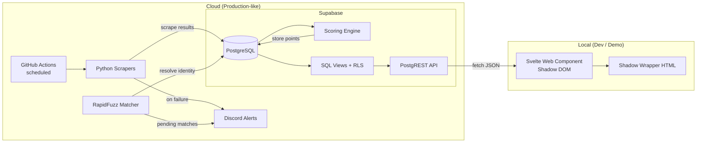
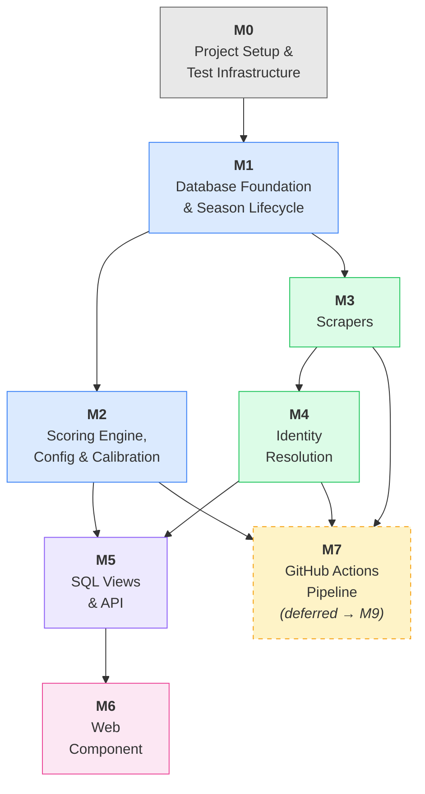

> **ARCHIVED** — This document is superseded by [Development History](../development_history.md) and the [Project Specification](../Project%20Specification.%20SPWS%20Automated%20Ranklist%20System.md). Kept for git history reference only.

# POC Development Plan — SPWS Automated Ranklist System

## 1. POC Overview

### 1.1 Goals

Validate the four pillars of the system before scaling to all 30 sub-rankings:

1. **Core Math** — Scoring engine reproduces the legacy Excel formulas (Log Formula, DE bonus, podium bonus, multipliers, best-K aggregation) with row-level accuracy.
2. **Scraping Viability** — Python scrapers successfully extract tournament results from FencingTimeLive, Engarde, and 4Fence.
3. **Admin Workflow** — Season setup, scoring config tuning, identity resolution review, and tournament lifecycle management work end-to-end.
4. **UI Portability** — A Web Component renders the ranklist independently of any CMS, ready for future WordPress embedding.

### 1.2 Scope

**Single category only: Male Epee V2 (50+).**

All architecture, schema, and code are designed for the full 30-category system, but POC validation is limited to one category to reduce variables during calibration.

### 1.3 Use Cases in Scope

| UC | Name | Phase 1 |
|----|------|---------|
| UC1 | Automated Data Ingestion | Yes |
| UC2 | Manual Result Upload (CSV) | Yes |
| UC3 | Identity Resolution (auto-match) | Yes |
| UC4 | Manual Identity Review | Yes |
| UC5 | Score Calculation | Yes |
| UC7 | Season Setup | Yes |
| UC8 | Season Calendar — Add Event | Yes |
| UC9 | Season Calendar — Add Tournament | Yes |
| UC10 | Tournament Lifecycle Management | Yes |
| UC11 | Scoring Config Tuning | Yes |
| UC12 | Public Ranklist Browsing | Yes |
| UC13 | Audit/Drill-down View | Yes |
| UC18 | Export Scoring Config as JSON | Yes |
| UC19 | Import Scoring Config from JSON | Yes |
| UC20 | Calibration — Compare vs Excel | Yes |

### 1.4 Success Criteria

- All acceptance tests pass across all test suites (pgTAP, pytest, Vitest/Playwright).
- Scoring output matches the reference Excel (`SZPADA-2-2024-2025.xlsx`) within a tolerance of 0.01 per score.
- End-to-end pipeline demonstrated: GitHub Actions scrapes → Supabase stores & scores → local Web Component displays the ranking.

### 1.5 Tech Stack

| Layer | Technology |
|-------|-----------|
| Database | PostgreSQL 15 (Supabase — free tier) |
| Scoring Engine | PL/pgSQL functions |
| API | PostgREST (built into Supabase) |
| Scrapers | Python 3.11+, httpx, BeautifulSoup4 |
| Identity Resolution | RapidFuzz |
| Calibration | Python (openpyxl, supabase-py) |
| Frontend | Svelte → Web Component (Shadow DOM) |
| CI/CD | GitHub Actions |
| Alerting | Discord Webhook |
| DB Tests | pgTAP |
| Python Tests | pytest |
| Frontend Tests | Vitest + Playwright |

### 1.6 Methodology — Test-Driven Development

Every milestone follows the **Red-Green-Refactor** cycle:

1. **RED** — Write acceptance tests derived from the use case acceptance criteria. Tests must fail initially (the feature doesn't exist yet).
2. **GREEN** — Implement the minimum code to make all tests pass.
3. **REFACTOR** — Clean up without changing behaviour. All tests must still pass.

Tests are the living specification. If a test doesn't exist for a requirement, the requirement isn't verified.

### 1.7 Cross-References

This plan is the implementation companion to the [Project Specification](../Project%20Specification.%20SPWS%20Automated%20Ranklist%20System.md). The following specification artifacts provide traceability and decision context:

- **Requirements Traceability Matrix (Appendix C)** — maps 52 Functional Requirements (FR-01–FR-52) and 13 Non-Functional Requirements (NFR-01–NFR-13) to their verifying tests. Test IDs in the RTM (e.g., `3.1a–g`, `5.4–5.7`) reference the numbered tests in this plan's milestone tables.
- **Architecture Decision Records ([`doc/adr/`](../adr/))** — 14 ADRs documenting key design decisions with rationale and tradeoffs. Referenced in milestone implementation notes below where relevant.

The "Derives From" column in each milestone's test table maps tests → spec sections (§ references and UC IDs). The RTM provides the reverse mapping: spec requirements → tests.

---

## 2. POC End State

### 2.1 Architecture



### 2.2 What the POC Delivers

- **Cloud backend** on Supabase free tier: full schema, scoring engine, ranking views, RLS policies.
- **Automated pipeline** via GitHub Actions: scheduled scraping, identity resolution, scoring, Discord alerts on failure.
- **Local Web Component** in a Shadow Wrapper HTML page mimicking WordPress CSS, fetching live data from the Supabase PostgREST API.
- **+EVF ranking** view: `fn_ranking_kadra` combining domestic + international scores, with PPW/+EVF toggle in the Web Component and mode-aware drill-down. V0 guard prevents +EVF for youngest category.
- **Calibration tooling**: Python CLI scripts for config export/import and Excel comparison.
- **CERT + PROD sites** on GitHub Pages: Vite-built frontend deployed via GitHub Actions with runtime environment toggle. CERT backend for staging new data; PROD backend for verified data. Single GitHub Pages URL serves both via in-app selector.

### 2.3 What the POC Does NOT Include

- WordPress deployment (Phase 2).
- Categories beyond Male Epee V2 (Phase 2).
- Historical season snapshots (Phase 2).
- Result corrections & reprocessing workflow (Phase 2 — UC6, UC14–UC17).
- SuperFive / pool-level data (Phase 3).
- Custom domain or separate GitHub Pages per environment (single site, toggle-based).
- Automated schema migration CI/CD to cloud (manual `supabase db push` for CERT/PROD).

---

## 3. Milestones

### Milestone 0: Project Setup & Test Infrastructure ✅ COMPLETED

**Purpose:** Establish the repo, tooling, and test frameworks so that all subsequent milestones can start with RED (failing tests).

**Deliverables:**
- Repository structure:
  ```
  /
  ├── supabase/              # Supabase CLI project
  │   ├── migrations/        # SQL migration files
  │   ├── seed.sql           # Seed data
  │   └── tests/             # pgTAP test files
  ├── python/
  │   ├── scrapers/          # Scraper modules
  │   ├── matcher/           # Identity resolution
  │   ├── calibration/       # Config export/import, Excel comparison
  │   ├── pipeline/          # Orchestration for GH Actions
  │   └── tests/             # pytest test files
  │       └── fixtures/      # Saved HTML fixtures for scraper tests
  ├── frontend/
  │   ├── src/               # Svelte source
  │   ├── public/            # Shadow Wrapper HTML
  │   └── tests/             # Vitest + Playwright tests
  ├── reference/             # Reference Excel file(s)
  ├── doc/                   # Project documentation
  ├── .github/
  │   └── workflows/         # GitHub Actions
  ├── pyproject.toml
  ├── package.json
  └── .gitignore
  ```
- Supabase project created (free tier) with local dev environment via Supabase CLI.
- Test frameworks installed and configured:
  - **pgTAP** for PostgreSQL schema and function tests (runs against local Supabase instance).
  - **pytest** for Python scraper, matcher, and calibration tests.
  - **Vitest** for Svelte component unit tests; **Playwright** for browser integration tests.
- CI pipeline (`.github/workflows/ci.yml`) that runs all three test suites on every push/PR.
- Empty test files created as placeholders for each milestone's test suite.

**Acceptance Criteria:**
- `supabase start` launches a local PostgreSQL instance.
- `pytest`, pgTAP runner, and `vitest` all execute successfully (zero tests, zero failures).
- CI workflow runs and passes on push to main.

**Implementation Notes:**
- Supabase CLI v2.75.0 installed via Homebrew.
- Python 3.14.2 with `.venv`; dependencies installed directly (editable install not used).
- Svelte 5 with `@sveltejs/vite-plugin-svelte@^4.0.0-next.6` (required for Svelte 5 compatibility).
- Node 25.6.1, Docker 28.0.1.
- Unnecessary Supabase services disabled in `supabase/config.toml`: realtime, studio, inbucket, storage, edge_runtime, analytics. Running containers: PostgreSQL, PostgREST, GoTrue, Kong.
- Smoke tests: `supabase/tests/00_smoke.sql`, `python/tests/test_smoke.py`, `frontend/tests/smoke.test.ts` — all pass.

---

### Milestone 1: Database Foundation & Season Lifecycle ✅ COMPLETED

**Use Cases:** UC7, UC8, UC9, UC10

**Purpose:** Build the complete database layer — schema, constraints, lifecycle logic, audit logging, and RLS — in a single milestone. This avoids splitting database work across milestones and eliminates UC overlap.

**Acceptance Tests (RED):**

| # | Test | Derives From |
|---|------|-------------|
| 1.1 | All 7 enum types exist with correct values (`enum_weapon_type`, `enum_gender_type`, `enum_tournament_type`, `enum_age_category`, `enum_event_status`, `enum_import_status`, `enum_match_status`) | §9.1.1 |
| 1.2 | All 9 core tables exist with correct column names, types, and NOT NULL constraints | §9.2 |
| 1.3 | Foreign key constraints enforced: inserting a `tbl_result` row with a non-existent `id_fencer` fails | §9.2 |
| 1.4 | Unique constraint on `(id_fencer, id_tournament)` in `tbl_result`: duplicate insert rejected | §9.2 |
| 1.5 | Unique constraint on `(id_result, txt_scraped_name)` in `tbl_match_candidate` enforced | §9.2 |
| 1.6 | Global uniqueness on `txt_code` columns (`tbl_event`, `tbl_tournament`, `tbl_organizer`, `tbl_season`) | §9.2 |
| 1.7 | Partial unique index on `tbl_season(bool_active) WHERE bool_active = TRUE`: second active season rejected | §9.3 |
| 1.8 | Unique constraint on `tbl_scoring_config(id_season)`: one config per season | §9.3 |
| 1.9 | All indexes from §9.2 exist | §9.2 |
| 1.10 | RLS enabled: anonymous role can SELECT from `tbl_result`, cannot INSERT | §9.2.1 |
| 1.11 | RLS enabled: authenticated role can INSERT/UPDATE/DELETE on all tables | §9.2.1 |
| 1.12 | Seed data (one test season, sample fencers, sample organizers) loads without errors | — |
| 1.13 | Create season: `tbl_season` row with `txt_code`, `dt_start`, `dt_end` | UC7(a) |
| 1.14 | Create season: corresponding `tbl_scoring_config` row created with all defaults | UC7(b) |
| 1.15 | Enforce single active season: activating a second season fails | UC7(c) |
| 1.16 | Create event: `tbl_event` row with `id_season`, `id_organizer`, defaults to `PLANNED` | UC8(a,b) |
| 1.17 | Create tournament: `tbl_tournament` row with season-scoped `txt_code` (e.g., `PPW1-V2-M-EPEE-2025`) | UC9(a) |
| 1.18 | Create tournament: `enum_import_status` defaults to `PLANNED` | UC9(b) |
| 1.19 | Create tournament: `num_multiplier` auto-populated from `tbl_scoring_config` based on `enum_type` | UC9(c) |
| 1.20 | Valid event transition: `PLANNED` → `SCHEDULED` → `IN_PROGRESS` → `COMPLETED` succeeds | UC10(a) |
| 1.21 | Invalid event transition: `PLANNED` → `COMPLETED` rejected with error message | UC10(b) |
| 1.22 | Event status change: old and new values logged in `tbl_audit_log` | UC10(c) |
| 1.23 | Event cancellation: `SCHEDULED` → `CANCELLED` succeeds | UC10(a) |

**Implementation (GREEN):**
- Supabase CLI migration files: enums, tables, indexes, constraints, RLS policies.
- Seed data SQL (`seed.sql`): season "2024-2025", scoring config with defaults, sample fencers for Male Epee V2, sample organizers (SPWS, EVF).
- Lifecycle validation function or trigger: `fn_validate_event_transition(old_status, new_status)`.
- Audit log trigger: `trg_audit_log` on key tables (captures old/new values on UPDATE/DELETE).
- Season creation helper that auto-creates `tbl_scoring_config` with defaults.
- Tournament creation logic that resolves `num_multiplier` from `tbl_scoring_config`.

**Verification:**
- All pgTAP tests pass against local Supabase instance.
- `supabase db reset` runs cleanly (migrations + seed).
- Manual test: create a season, add events and tournaments via Supabase Dashboard, verify lifecycle transitions.

**Implementation Notes:**
- 23 logical tests expanded to **63 pgTAP assertions** in `supabase/tests/01_database_foundation.sql`. The original 54 were extended with 9 additional assertions discovered during review:
- 3 migration files:
  - `20250301000001_enums_tables_indexes.sql` — 7 enums, 9 tables, 2 unique constraints, 18 indexes (including partial unique `idx_season_active`).
  - `20250301000002_rls_policies.sql` — RLS enabled on all 9 tables; `anon` gets SELECT on public tables; `authenticated` gets full CRUD; `audit_log` is SELECT-only for authenticated.
  - `20250301000003_lifecycle_triggers.sql` — 4 functions + triggers:
    - `fn_auto_create_scoring_config()` — AFTER INSERT trigger on `tbl_season` auto-creates `tbl_scoring_config` row with defaults.
    - `fn_auto_populate_multiplier()` — BEFORE INSERT trigger on `tbl_tournament` resolves `num_multiplier` from `tbl_scoring_config` based on `enum_type`.
    - `fn_validate_event_transition()` — BEFORE UPDATE trigger on `tbl_event` enforces valid status transitions (state machine).
    - `fn_audit_log()` — generic audit trigger using `TG_ARGV[0]` for PK column name; attached to `tbl_event`, `tbl_tournament`, `tbl_result`, `tbl_fencer`, `tbl_season`.
- Seed data (`supabase/seed.sql`): Season "SPWS-2024-2025" (active), 2 organizers (SPWS, EVF), 5 sample fencers (Male Epee V2), 1 event (PPW1-KRAKOW-2025), 1 tournament (PPW1-V2-M-EPEE-2025, N=24).
- **Additional assertions (beyond the original 23 plan items):**
  - 1.12d: Seed tournament `PPW1-V2-M-EPEE-2025` has `num_multiplier = 1.0` from trigger.
  - 1.14b: Scoring config defaults verified (all 15 typed parameters match spec §9.3).
  - 1.19b/c: MPW tournament gets `num_multiplier = 1.2` (tests non-PPW type mapping).
  - 1.21b: COMPLETED is terminal — `COMPLETED → SCHEDULED` rejected.
  - 1.22b: Audit log captures both `jsonb_old_values` and `jsonb_new_values`.
  - 1.24: CANCELLED is terminal — `CANCELLED → PLANNED` rejected.
  - 1.25: Anon sees zero rows in `tbl_match_candidate` (RLS filters all, no SELECT policy).
  - 1.26: `tbl_audit_log` has no public SELECT policy (verified via `pg_policies` catalog; in-transaction RLS tests are unreliable for rows created by the superuser in the same transaction).
- **Bugs fixed during GREEN:**
  1. Audit trigger originally used `CASE TG_TABLE_NAME WHEN ... THEN OLD.id_event ...` — PostgreSQL evaluates all CASE branches regardless of match, causing `record "old" has no field "id_event"` errors on non-event tables. Fixed by passing PK column name as `TG_ARGV[0]` and extracting via `to_jsonb(OLD)->>v_pk_col`.
  2. RLS test for `authenticated` role required setting JWT claims via `set_config('request.jwt.claim.role', 'authenticated', TRUE)` in addition to `SET LOCAL ROLE authenticated`, because Supabase's `auth.role()` reads from JWT claims, not the PG role.
- **Design decision:** Single admin account with three RLS roles — see [ADR-004](../adr/004-single-admin-account.md).
- **Event transition state machine:**
  ```
  PLANNED → SCHEDULED → IN_PROGRESS → COMPLETED
  PLANNED → CANCELLED
  SCHEDULED → CHANGED → SCHEDULED (loop back)
  SCHEDULED → CANCELLED
  CHANGED → IN_PROGRESS
  CHANGED → CANCELLED
  IN_PROGRESS → CANCELLED
  ```

---

### Milestone 2: Scoring Engine, Configuration & Calibration — ✅ COMPLETED

**Use Cases:** UC5, UC11, UC18, UC19, UC20

**Purpose:** Build the scoring engine, config export/import functions, and calibration tooling in a single milestone. This allows end-to-end scoring validation (score → export → compare against Excel) without a milestone boundary in between.

**Acceptance Tests (RED):**

| # | Test | Derives From |
|---|------|-------------|
| 2.1 | `fn_calc_tournament_scores`: known tournament (N=24, PPW type) → all four point columns match Excel reference values for every fencer | UC5(a) |
| 2.2 | Edge case: N=1 → single fencer receives MP (50) points | §8.1.1 |
| 2.3 | Edge case: place > N → fencer gets 0 points | §8.1.1 |
| 2.4 | Power-of-2 N (e.g., N=16): DE bonus correction factor c=0 | §8.1.2 |
| 2.5 | Non-power-of-2 N (e.g., N=24): DE bonus correction factor c=1 | §8.1.2 |
| 2.6 | Podium bonus: 1st gets gold×bonus_per_round, 2nd silver×, 3rd bronze×, 4th+ gets 0 | §8.1.3 |
| 2.7 | Multiplier: PPW tournament uses `num_ppw_multiplier` (1.0), MPW uses `num_mpw_multiplier` (1.2) | §8.2, UC5(d) |
| 2.8 | After scoring: `ts_points_calc` is set to a recent timestamp | UC5(b) |
| 2.9 | After scoring: `tbl_tournament.enum_import_status` = 'SCORED' | UC5(c) |
| 2.10 | Scoring reads multiplier from `tbl_scoring_config`, NOT from `tbl_tournament.num_multiplier` | UC5(d) |
| 2.11 | Changing `int_mp_value` in `tbl_scoring_config` does NOT change already-scored `num_final_score` values | UC11(c) |
| 2.12 | `fn_export_scoring_config(season_id)` returns JSON with all 17 parameters + `id_season` + `season_code` | UC18(a) |
| 2.13 | Export is idempotent: two consecutive calls return identical JSON | UC18(d) |
| 2.14 | `fn_import_scoring_config(json)` upserts all 16 typed columns + `json_extra`, sets `ts_updated` | UC19(a,b) |
| 2.15 | Partial import: JSON with only `mp_value` preserves all other existing values | UC19(c) |
| 2.16 | Import with invalid type (e.g., string for `mp_value`) raises exception | UC19(d) |
| 2.17 | Import without `id_season` raises exception | UC19 |
| 2.18 | Import for non-existent season raises exception | UC19 |
| 2.19 | `calibrate_compare.py` with matching DB and Excel data → prints success message | UC20(d) |
| 2.20 | With a deliberate 0.05 mismatch and tolerance 0.01 → mismatch reported with fencer, tournament, expected, actual, diff | UC20(c) |
| 2.21 | With a mismatch within tolerance (0.005, tolerance 0.01) → no mismatch reported | UC20(b) |
| 2.22 | Fencer present in Excel but missing from DB → reported as MISSING_IN_DB | UC20(e) |
| 2.23 | Tournament score present in Excel but missing from DB → reported as MISSING_SCORE | UC20(e) |
| 2.24 | `calibrate_config.py export` writes a valid JSON file with all parameters | UC18 |
| 2.25 | `calibrate_config.py import` reads a JSON file and calls the RPC successfully | UC19 |

**Implementation (GREEN):**
- `fn_calc_tournament_scores(p_tournament_id)` — PL/pgSQL function per §9.5.2.
- `fn_export_scoring_config(p_id_season)` — SQL function per §8.6.3.
- `fn_import_scoring_config(p_config)` — PL/pgSQL function per §8.6.3.
- `python/calibration/calibrate_config.py` — CLI for export/import via Supabase RPC (§8.6.4).
- `python/calibration/calibrate_compare.py` — Excel vs DB comparison script (§8.6.4).
- Reference Excel file placed in `reference/` directory.

**Verification:**
- All pgTAP tests pass (scoring engine, config functions).
- All pytest tests pass (calibration scripts).
- Full calibration loop executed manually: export → edit → import → re-score → compare → zero mismatches.

**Implementation Notes (completed):**
- **Migration file:** `supabase/migrations/20250301000004_scoring_engine.sql` — contains all 3 functions.
- **Python modules:** `python/calibration/calibrate_config.py`, `python/calibration/calibrate_compare.py` with `__init__.py` package files for `python/`, `python/calibration/`, `python/tests/`.
- **Test counts:** 24 pgTAP assertions (tests 2.1–2.18) + 7 pytest tests (tests 2.19–2.25) = 31 total. Combined with M1: 88 pgTAP + 8 pytest = 96 total assertions, all passing.
- **Bugs fixed during GREEN:**
  1. PostgreSQL's `ROUND(double precision, integer)` does not exist — `LN()`, `POWER()`, `CEIL()`, `FLOOR()` all return `double precision`, but `ROUND` with a precision argument only accepts `NUMERIC`. Fixed by adding explicit `::NUMERIC` casts on all expressions passed to `ROUND(..., 2)`.
  2. Test 2.7 (MPW multiplier comparison) originally compared `MPW_final = ROUND(PPW_final * 1.2, 2)`, which fails due to double-rounding: `ROUND(ROUND(sum, 2) * 1.2, 2) ≠ ROUND(sum * 1.2, 2)` when the intermediate rounding shifts the value. Fixed by verifying that PPW and MPW share identical component values (place_pts, de_bonus, podium_bonus) and that the final_score ratio is within 0.01 of 1.2.
- **Formula revision (post-M2):** The original M2 implementation used `3×N^(1/3)` as the per-DE-round bonus multiplier. After comparing against the SPWS reference Excel (`Bonus za rundę = 10`, a fixed scoring parameter), this was changed to a flat **10 pts per DE round** via migration `20250304000001_fix_de_bonus_formula.sql`. The podium bonus formula (`gold/silver/bronze × 3×N^(1/3)`) was not changed — it matches the Excel's dynamic formula. Tests 2.4 and 2.5 were updated accordingly (expected values changed from `~30` to `40` and `~43` to `50`). All existing tournament scores were recomputed.
- **Design decisions:** Hybrid scoring config (DB table + JSON export/import) — see [ADR-001](../adr/001-hybrid-scoring-config.md). Calculate-once-store-forever (immutable scores) — see [ADR-002](../adr/002-calculate-once-store-forever.md).

---

### Milestone 3: Data Ingestion — Scrapers ✅ COMPLETED

**Use Cases:** UC1, UC2

**Acceptance Tests (RED):**

| # | Test | Derives From |
|---|------|-------------|
| 3.1 | FencingTimeLive parser: given fixture HTML → returns list of `(fencer_name, place, participant_count)` | UC1(a) |
| 3.2 | Engarde parser: given fixture HTML → returns standardized result set | UC1(a) |
| 3.3 | 4Fence parser: given fixture HTML → returns standardized result set | UC1(a) |
| 3.4 | After import: `tbl_result` rows inserted with `num_final_score = NULL` | UC1(b) |
| 3.5 | After import: `tbl_tournament.enum_import_status` = 'IMPORTED' | UC1(c) |
| 3.6 | Scraper failure: Discord webhook called with error details (mocked) | UC1(d) |
| 3.7 | CSV upload: rows inserted identically to scraper output format | UC2(a,b) |
| 3.8 | CSV upload: `tbl_tournament.enum_import_status` = 'IMPORTED' | UC2(c) |
| 3.9 | Idempotency: re-importing the same tournament skips existing `(id_fencer, id_tournament)` pairs | §9.5.1 |
| 3.10 | Minimum participant threshold: PEW tournament with N=3 (< 5) → `enum_import_status` = 'REJECTED', `txt_import_status_reason` populated | §8.5 |
| 3.11 | Minimum participant threshold: PPW tournament with N=3 → imported normally (no minimum for domestic) | §8.5 |
| 3.12 | Retry logic: transient HTTP failure → retried up to 3 times with exponential backoff | §9.5.1 |
| 3.13 | Partial scrape (incomplete data on page) → import aborted for that tournament, error logged | §9.5.1 |

**Implementation (GREEN):**
- `python/scrapers/ftl.py` — FencingTimeLive parser (ported from VBA).
- `python/scrapers/engarde.py` — Engarde parser (ported from VBA).
- `python/scrapers/fourfence.py` — 4Fence parser (ported from VBA).
- `python/scrapers/csv_upload.py` — CSV upload handler.
- `python/scrapers/base.py` — Shared result format, retry logic, error handling.
- `python/tests/fixtures/` — Saved HTML pages from each platform.

**Verification:**
- All pytest tests pass using fixture HTML (no live network calls).
- Manual test: run a scraper against a real tournament URL, inspect `tbl_result` rows.

**Implementation Notes & Bugs (resolved):**
- FTL uses an AJAX JSON endpoint (`/events/results/data/{ID}`), not embedded HTML — VBA scraped a rendered DOM; Python fetches the JSON API directly.
- FTL tied places use suffix format (`"3T"`) — stripped with `re.sub(r"[A-Za-z]", "", place_str)`.
- FTL names may include age-category markers (`"ATANASSOW 2 Aleksander"`) — detected with regex `^(\S+)\s+\d+\s+(.+)$` and stripped.
- 4Fence HTML contains literal `&nbsp` strings **without semicolons** that `BeautifulSoup` does not decode. Fixed with `re.compile(r"&nbsp;?", re.IGNORECASE)` regex cleaner.
- Engarde supports 7 languages (EN/FR/ES/IT/DE/PL/HU) — header rows filtered by `<th>` presence, not by text content.
- CSV tests: 31/31 pytest assertions pass; all fixture HTML tested offline.
- pgTAP scoring tests updated to use real master fencer names (BARAŃSKI, BAZAK, DUDEK, HAŚKO) after placeholder fencers were replaced with real SPWS master data.
- Master fencer list: 270 SPWS members in `seed.sql`; birth year only (`int_birth_year SMALLINT` — **spec deviation** from `dt_birth DATE`); 206 with year, 64 NULL. Spec §8 note: full date not needed for SPWS calendar-year-based age categories.

---

### Milestone 4: Identity Resolution ✅ COMPLETED

**Use Cases:** UC3, UC4

**Acceptance Tests (RED):**

| # | Test | Derives From |
|---|------|-------------|
| 4.1 | Exact name match ("KOWALSKI Jan" vs "KOWALSKI Jan") → score ≥95, `id_fencer` set, `AUTO_MATCHED` | UC3(b) |
| 4.2 | Close match via alias ("TK" in `json_name_aliases`) → score ≥95, `AUTO_MATCHED` | UC3(a,b) |
| 4.3 | Uncertain match (misspelled "KOWALSKY Jan") → `PENDING` candidate created | UC3(c) |
| 4.4 | No match candidates at all → `UNMATCHED` status | UC3(d) |
| 4.5 | "SURNAME FirstName" format parsed and compared correctly (including compound surnames) | §8.5 |
| 4.6 | Admin approves a PENDING match → `id_fencer` linked, status `APPROVED` | UC4(b,c) |
| 4.7 | Admin creates new fencer → status `NEW_FENCER`, new fencer data returned | UC4(b) |
| 4.8 | Admin dismisses a match → status `DISMISSED` with admin note | UC4(b) |
| 4.9 | International fencer (not in `tbl_fencer`) → `UNMATCHED` | §8.5 |
| 4.10 | PPW exact match → AUTO_MATCHED, in matched list | UC3(b) |
| 4.11 | PPW PENDING → provisionally linked to best match, in matched list | UC3(c) |
| 4.12 | PPW UNMATCHED → auto_created list has new fencer with estimated birth year | UC3(d) |
| 4.13 | PPW auto-created fencer has `bool_birth_year_estimated=TRUE` | UC3(d) |
| 4.14 | PPW auto-created fencer birth_year uses youngest boundary for category | UC3(d) |
| 4.15 | PEW exact match → AUTO_MATCHED, in matched list | UC3(b) |
| 4.16 | PEW PENDING → provisionally linked, in matched list | UC3(c) |
| 4.17 | PEW UNMATCHED → in skipped list, NOT in matched or auto_created | UC3(e) |
| 4.18 | MEW UNMATCHED → in skipped list (same as PEW) | UC3(e) |
| 4.19 | Birth year estimation: V0 → tournament_year − 30 | §8.5 |
| 4.20 | Birth year estimation: V2 → tournament_year − 50 | §8.5 |
| 4.21 | Birth year estimation: V4 → tournament_year − 70 | §8.5 |
| 4.22 | Auto-create fencer: parsed name fields correct | §8.5 |
| 4.23 | Auto-create fencer: returns all required tbl_fencer fields | §8.5 |
| 4.24 | Auto-create fencer: bool_birth_year_estimated is True | §8.5 |
| 4.25 | KRAWCZYK Paweł in V4 (2024) → picks born 1954 (age 70) | §8.5(5) |
| 4.26 | KRAWCZYK Paweł in V0 (2024) → picks born 1989 (age 35) | §8.5(5) |
| 4.27 | MŁYNEK Janusz in V1 (2024) → picks born 1984 (age 40) | §8.5(5) |
| 4.28 | MŁYNEK Janusz in V4 (2024) → picks born 1951 (age 73) | §8.5(5) |
| 4.29 | Duplicate with no age_category → PENDING (ambiguous) | §8.5(5) |
| 4.30 | Duplicate where neither fits category → PENDING | §8.5(5) |
| 4.31 | Duplicate where both have NULL birth_year → PENDING | §8.5(5) |
| 4.32 | `birth_year_matches_category`: age 55 in V2 → True | §8.5(5) |
| 4.33 | `birth_year_matches_category`: age 35 in V2 → False | §8.5(5) |
| 4.34 | `birth_year_matches_category`: age 75 in V4 → True | §8.5(5) |
| 4.35 | `birth_year_matches_category`: NULL birth year → False | §8.5(5) |
| 4.36 | PPW tournament with duplicate name → correct fencer resolved via category | §8.5(5) |
| 4.37 | PEW tournament with duplicate name → correct fencer resolved via category | §8.5(5) |

**Implementation (GREEN):**
- `python/matcher/fuzzy_match.py` — RapidFuzz `token_sort_ratio` matcher comparing scraped names against `tbl_fencer` + `json_name_aliases`.
- `python/matcher/pipeline.py` — Tournament-type-aware resolution (`resolve_tournament_results`) + auto-create fencer logic + admin actions (`approve_match`, `create_new_fencer_from_match`, `dismiss_match`). Legacy `resolve_results()` preserved for backwards compatibility.
- Migration `20250302000001_nullable_fencer_on_result.sql` — `tbl_result.id_fencer` made nullable, `txt_scraped_name` column added, partial unique indexes.
- Migration `20250303000001_intake_rules.sql` — `tbl_fencer.bool_birth_year_estimated` column added.

**Verification:**
- 53 pytest tests pass (`test_matcher.py`).
- All pgTAP + pytest tests green.

**Implementation Notes:**
- Thresholds: ≥95 AUTO_MATCHED, ≥50 PENDING, <50 UNMATCHED. Tunable via constants in `fuzzy_match.py`.
- Alias matching is exact (case-insensitive). If scraped name matches any alias in `json_name_aliases`, confidence=100.
- Full name matching uses `rapidfuzz.fuzz.token_sort_ratio` (order-independent: "Jan KOWALSKI" ≈ "KOWALSKI Jan").
- Schema change: `tbl_result.id_fencer` now nullable — scrapers import results with `id_fencer=NULL`, then the matcher pipeline links fencers. Scoring should only run after identity resolution is complete.
- `txt_scraped_name` added to `tbl_result` to preserve the original scraped name for matching.
- Admin actions are pure functions returning updated dicts — DB persistence will be handled by the pipeline orchestrator (M7/M9).
- Existing `uq_result_fencer_tournament` constraint converted to partial unique index (only when `id_fencer IS NOT NULL`).
- **Tournament-type-based intake rules (added post-M4):**
  - **PPW/MPW (domestic):** All results always enter the ranklist. UNMATCHED fencers are auto-created in `tbl_fencer` with estimated birth year (youngest boundary for category) and `bool_birth_year_estimated = TRUE`. PENDING matches are provisionally linked to the best match candidate and scored immediately.
  - **PEW/MEW (international):** Only results for fencers already in the master data are imported. UNMATCHED fencers are skipped entirely (result not imported). PENDING matches are provisionally linked.
  - Birth year estimation (using season end year): V0→end_year−30, V1→end_year−40, V2→end_year−50, V3→end_year−60, V4→end_year−70.
  - `resolve_tournament_results()` replaces `resolve_results()` as the primary pipeline function. Returns `ResolvedTournament` dataclass with `matched`, `auto_created`, and `skipped` lists.

---

### Milestone 5: SQL Views & API ✅ COMPLETED

**Use Cases:** UC12, UC13

**Acceptance Tests (RED):**

| # | Test | Derives From |
|---|------|-------------|
| 5.1 | `vw_score`: returns one row per fencer per tournament with all expected columns (fencer name, tournament name/date, weapon, gender, category, all four point columns, multiplier, `ts_points_calc`) | UC13(b,c) |
| 5.2 | `fn_ranking_ppw('EPEE', 'M', 'V2', NULL)`: returns correct ranking for known test data (NULL season = active season) | UC12 |
| 5.3 | `fn_ranking_ppw('EPEE', 'M', 'V2', <season_id>)`: explicit season parameter returns results for that season only | UC12 |
| 5.4 | Best-K selection: with K=4 and 5 PPW scores, only top 4 are summed | §8.3.1 |
| 5.5 | MPW included: MPW score (80) ≥ worst included PPW (76) → total includes MPW | §8.3.1 |
| 5.6 | MPW dropped: MPW score (36) < worst included PPW (76) → total uses 5th-best PPW instead | §8.3.1 |
| 5.7 | Ranking ordered by total descending | UC12(d) |
| 5.8 | Filter by weapon: passing 'FOIL' excludes EPEE results | UC12(b) |
| 5.9 | Filter by gender: passing 'F' excludes male results | UC12(b) |
| 5.10 | Filter by category: passing 'V1' returns only fencers whose birth-year-derived category is V1 | UC12(b) |
| 5.11 | Only scored results included (`num_final_score IS NOT NULL`) | §9.5 |
| 5.12 | International fencer (unlinked `id_fencer`) does not appear in ranking output | §8.5 |
| 5.13 | PostgREST RPC endpoint `/rpc/fn_ranking_ppw` returns valid JSON array | UC12(a) |
| 5.14 | Cross-category carryover: V3 fencer (BARAŃSKI, born 1964) with V2 tournament results appears in V3 ranking | §8.5(2) |
| 5.15 | Cross-category exclusion: V3 fencer (BARAŃSKI) does NOT appear in V2 ranking | §8.5(2) |
| 5.24 | `fn_ranking_ppw`: fencer with `total_score = 0` (defensive) does not appear in output | §8.5(7) |
| 5.25 | `fn_ranking_kadra`: fencer with only PEW/MEW results (no PPW/MPW) does not appear in output | §8.5(7) |

**Implementation (GREEN):**
- `vw_score` — standard SQL view joining `tbl_result`, `tbl_tournament`, `tbl_event`, `tbl_season`, `tbl_fencer`.
- `fn_ranking_ppw(p_weapon, p_gender, p_category, p_season UUID DEFAULT NULL)` — security-definer function returning a table type. When `p_season` is NULL, uses the active season. Implements best-K PPW selection + conditional MPW drop logic per §8.3.1.
- PostgREST configuration: API key setup, public schema exposure.

**Verification:**
- All pgTAP tests pass.
- Manual test: call PostgREST endpoint from curl/browser, verify JSON response matches expected ranking.

**Implementation Notes:**
- Migration file: `supabase/migrations/20250302000002_views_ranking.sql` — `vw_score` view + `fn_ranking_ppw` function.
- Migration file: `supabase/migrations/20250303000002_age_category_by_season.sql` — `fn_age_category()` helper + updated `fn_ranking_ppw` with fencer-based category filtering.
- Test file: `supabase/tests/03_views_api.sql` — 17 pgTAP assertions.
- **Age-category by season end year (added post-M5):** The ranking function `fn_ranking_ppw` now uses `fn_age_category(birth_year, season_end_year)` to compute each fencer's home category from their birth year and the season's end year (not the tournament's `enum_age_category`). This enables cross-category point carryover: a fencer who moved from V2 to V3 has all their tournament results (including V2 tournaments) appear in V3 ranking. Fencers with NULL birth year fall back to tournament category. Python matcher functions also use `season_end_year` (not `tournament_year`) for disambiguation and birth year estimation.
- `vw_score` excludes `id_fencer IS NULL` rows (unlinked results from PEW/MEW unmatched or pre-matching).
- `fn_ranking_ppw` uses CTEs for best-K PPW selection + conditional MPW drop logic.
- Test 5.12 verifies that unlinked results (NULL `id_fencer`) are excluded from ranking output — aligned with intake rules where PPW/MPW auto-create fencers (so no NULL `id_fencer` for domestic) and PEW/MEW skip unmatched (so skipped results never reach the view).
- **Design decisions:** Identity by FK, not by name — see [ADR-003](../adr/003-identity-by-fk-not-name.md). JSONB bucket-based ranking rules — see [ADR-006](../adr/006-jsonb-ranking-rules.md). Age category by birth year (cross-category carryover) — see [ADR-010](../adr/010-age-category-by-birth-year.md).
- Migration file: `supabase/migrations/20250306000002_exclude_zero_domestic.sql` — domestic-participation requirement (§8.5(7)): adds `WHERE total_score > 0` to `fn_ranking_ppw` and `WHERE COALESCE(d.ppw_total, 0) > 0` to `fn_ranking_kadra`. Tests 5.24–5.25 (2 additional pgTAP assertions, total now 19).

---

### Milestone 6: Web Component (Local UI) ✅ COMPLETED

**Use Cases:** UC12, UC13 (presentation layer)

**Acceptance Tests (RED):**

| # | Test | Derives From |
|---|------|-------------|
| 6.1 | Component renders a table with rank, fencer name, and points (PPW) or score-breakdown columns (+EVF) | UC12(c) |
| 6.2 | Four filter dropdowns rendered: weapon, gender, age category, season | UC12(b) |
| 6.3 | Default view loads active season, sorted by total descending | UC12(d) |
| 6.4 | Changing weapon filter refreshes the ranking table with filtered data | UC12(b) |
| 6.5 | Clicking a fencer row opens drill-down modal | UC13(a) |
| 6.6 | Drill-down shows per-tournament breakdown: code (linked), location, date, place, N, multiplier, final score | UC13(b) |
| 6.7 | ~~Shadow DOM isolation: component styles do not leak to host page~~ **(deferred — ADR-007)** | §5 |
| 6.8 | Skeleton loader visible while API data is loading | §7 |
| 6.9 | ~~Component is responsive (usable on mobile viewport widths)~~ **(deferred to MVP)** | §5 |
| 6.10 | PPW/+EVF toggle rendered, PPW is default | UC12 |
| 6.11 | Switching to +EVF shows PEW/MEW columns and calls fn_ranking_kadra | UC12 |
| 6.12 | V0 category disables +EVF toggle (grayed out) | §8.3.2 |
| 6.13 | [⎙] export button downloads .ods file for main ranking | UC12 |
| 6.14 | [⎙] export in drill-down downloads fencer's tournament breakdown as .ods | UC13 |
| 6.15 | Drill-down in PPW mode shows domestic tournaments only | UC13 |
| 6.16 | Drill-down in +EVF mode shows domestic + international tournaments | UC13 |
| 6.17 | Env toggle hidden when only one environment configured (dualEnv=false) **(not yet tested)** | §2.2 |
| 6.18 | Env toggle rendered when dualEnv=true, CERT active by default **(not yet tested)** | §2.2 |
| 6.19 | Switching env emits onenvchange callback **(not yet tested)** | §2.2 |
| 6.20 | Env badge shows CERT and PROD labels **(not yet tested)** | §2.2 |

**UI Design — Full-Width Table + Modal Drill-Down with PPW/+EVF Toggle:**

Main view: full-width ranking table with season filter in header, PPW/+EVF toggle + weapon/gender/category dropdowns in second row. Table columns adapt to mode. [⎙] ODS export button. Footer shows fencer count, mode/filter summary, last-updated timestamp.

PPW mode (default):
```
┌──────────────────────────────────────────────────────────────────────────────────┐
│  SPWS Ranklist                                   Season: [SPWS-2024-2025 ▾]    │
├──────────────────────────────────────────────────────────────────────────────────┤
│  [PPW ●│+EVF]  Weapon: [EPEE ▾]  Gender: [Male ▾]  Category: [V2 (50+) ▾]    │
├──────────────────────────────────────────────────────────────────────────────────┤
│  Rank │ Fencer                        │ Points                        [⎙]  │
│    1  │ ATANASSOW Aleksander          │    420                             │
│    2  │ DUDEK Jarosław                │    375                             │
│    3  │ BAZAK Piotr                   │    280                             │
├──────────────────────────────────────────────────────────────────────────────────┤
│  3 fencers │ PPW Ranking │ Male Epee V2 │ Updated: 2025-03-01                  │
└──────────────────────────────────────────────────────────────────────────────────┘
```

+EVF mode:
```
┌──────────────────────────────────────────────────────────────────────────────────┐
│  [PPW│+EVF ●]  Weapon: [EPEE ▾]  Gender: [Male ▾]  Category: [V2 (50+) ▾]    │
│  Rank │ Fencer              │ PPW(4) │ MPW  │ PEW(3) │ MEW  │ Total      [⎙]  │
│    1  │ ATANASSOW Aleksander│   375  │ +45  │   310  │ +180 │   910           │
│  3 fencers │ +EVF Ranking │ Male Epee V2 │ Updated: 2025-03-01                 │
└──────────────────────────────────────────────────────────────────────────────────┘
```

Drill-down modal — adapts to toggle mode. [PPW●│+EVF] toggle synced with main view. [⎙] exports fencer breakdown as .ods. Tournament code is a clickable link to `url_results` (opens in new tab). Location from `tbl_event.txt_location` shown in small grey text below the code in the same cell. ★ = counted in best-K, ✓ = MPW/MEW included. Season code shown in subheader derived from `txt_season_code`. Dates shown as `15 Jan 25`. Table rows ordered by date ascending; chart bars ordered by score descending.

+EVF drill-down (toggle = +EVF):
```
┌─── Drill-Down ─────────────────────────────────────────────────────────────┐
│  ATANASSOW Aleksander                                  [PPW│+EVF ●] [✕]   │
│  Rank #1 │ V2 · SPWS-2024-2025 (born 1969)                          [⎙]   │
│                                                                            │
│  Score Breakdown                                                           │
│  ┌─────────────────────────────────────────────────────────────────────┐   │
│  │  Domestic (PPW + MPW): 465 pts    International (EVF): 490 pts     │   │
│  │  120 ██████████████████ ★ PPW1     180 █████████████████████████ ✓  │   │
│  │  105 ████████████████   ★ PPW2     120 ██████████████████ ★ PEW1   │   │
│  │  100 ███████████████    ★ PPW4     100 ████████████████   ★ PEW2   │   │
│  │   95 ██████████████     ★ PPW3      90 █████████████      ★ PEW3   │   │
│  │   60 █████████            PPW5      65 █████████            PEW4   │   │
│  │   45 ███████            ✓ MPW1                                      │   │
│  └─────────────────────────────────────────────────────────────────────┘   │
│                                                        +EVF Total: 910 pts │
│  Domestic Tournaments                                                      │
│  ┌──────────────────────┬──────────┬─────┬──────┬──────┬────────┐          │
│  │ Code                 │ Date     │ Plc │ Part │ ×    │ Score  │          │
│  │ PP1-V2-M-EPEE-...↗   │ 20 Sep 24│  1  │  32  │ 1.0  │ 120 ★  │         │
│  │ Warszawa             │          │     │      │      │        │          │
│  │ PP2-V2-M-EPEE-...↗   │ 14 Oct 24│  3  │  28  │ 1.0  │  95 ★  │         │
│  │ Bytom                │          │     │      │      │        │          │
│  │ MPW-V2-M-EPEE-...↗   │ 12 Feb 25│  2  │  40  │ 1.2  │  45 ✓  │         │
│  │ Warszawa             │          │     │      │      │        │          │
│  └──────────────────────┴──────────┴─────┴──────┴──────┴────────┘          │
│                                                                            │
│  International Tournaments (EVF)                                           │
│  ┌──────────────────────┬──────────┬─────┬──────┬──────┬────────┐          │
│  │ Code                 │ Date     │ Plc │ Part │ ×    │ Score  │          │
│  │ PEW1-V2-M-EPEE-...↗  │ 18 Oct 24│  5  │  48  │ 1.0  │ 120 ★  │         │
│  │ Budapeszt            │          │     │      │      │        │          │
│  │ IMEW-V2-M-EPEE-...↗  │ 20 May 25│  3  │  45  │ 2.0  │ 180 ✓  │         │
│  │ Ateny                │          │     │      │      │        │          │
│  └──────────────────────┴──────────┴─────┴──────┴──────┴────────┘          │
└────────────────────────────────────────────────────────────────────────────┘
```

PPW drill-down (toggle = PPW): same layout, no International section. Domestic chart header shows total. Right-aligned "PPW Total: X pts" above tables.

**Pre-requisite — SQL migration `20250303000003_ranking_kadra.sql`:**
- Update `fn_ranking_ppw` return type: add `ppw_score`, `mpw_score` columns (separate from `total_score`)
- Create `fn_ranking_kadra(p_weapon, p_gender, p_category, p_season)`: domestic totals from fn_ranking_ppw + best-J PEW + conditional MEW. V0 returns empty (no EVF equivalent).
- pgTAP tests 5.16–5.23 (8 assertions):
  - 5.16: `fn_ranking_ppw` returns ppw_score + mpw_score = total_score (§8.3.1)
  - 5.17: `fn_ranking_kadra`: ATANASSOW total=730 (ppw_total=420 + pew_total=310) (§8.3.2)
  - 5.18: `fn_ranking_kadra` returns empty for V0 — no EVF equivalent (§8.3.2)
  - 5.19: `fn_ranking_kadra`: BAZAK (domestic only) total=90, pew_total=0 (§8.3.2)
  - 5.20: `fn_ranking_ppw` JSONB: ATANASSOW ppw_score=340 (best 4 PPW) (§8.6.6)
  - 5.21: `fn_ranking_ppw` JSONB: DUDEK mpw_score=36 (always-bucket) (§8.6.6)
  - 5.22: `fn_ranking_kadra` JSONB: ATANASSOW pew_total=310 (best 3 PEW+MEW) (§8.6.6)
  - 5.23: Legacy path (NULL json_ranking_rules): MPW=50 dropped, total=400 (§8.6.6)

**Implementation (GREEN):**
- Svelte 5 application using direct `mount()` into a host `<div>` (not a custom element — see Shadow DOM note below).
- Standalone `index.html` with `demo` attribute for mock data preview without live database.
- API client module (`api.ts`): fetches from Supabase PostgREST (configurable URL via attributes on host element).
- Components: FilterBar (with PPW/+EVF toggle), RanklistTable, DrilldownModal, ScoreChart, SkeletonLoader.
- ODS export module (`export.ts`): SheetJS (`xlsx` package) for .ods file generation from both ranking table and drill-down.
- Mock data module (`mock-data.ts`): demo mode with 12 fencers, PPW/+EVF rankings, drilldown context, and detailed tournament scores.
- Build tooling: Vite + `@sveltejs/vite-plugin-svelte`, outputs a single `.js` bundle.
- Responsive CSS: `@media (max-width: 600px)` breakpoints on all components for mobile support.
- Dependencies: `@supabase/supabase-js`, `xlsx` (SheetJS)

**Shadow DOM tradeoff (test 6.7):**
The spec originally called for a Svelte custom element with Shadow DOM for CSS isolation when embedded in WordPress. During implementation, this was deferred because Svelte 5's `customElement: true` compiler option is incompatible with `@testing-library/svelte` (which uses the Svelte 4 `new Component()` API via `compatibility.componentApi: 4`). Enabling `customElement: true` globally breaks all unit tests. The POC uses direct `mount()` instead, trading Shadow DOM isolation for a full unit test suite (33 vitest tests). **Shadow DOM isolation is a hard requirement for MVP (Phase 2)** — the component must ship as a proper `<spws-ranklist>` custom element with encapsulated styles before WordPress deployment. See §6.2 of the Project Specification.

**Design decisions:** Shadow DOM deferred to MVP — see [ADR-007](../adr/007-shadow-dom-deferred.md). Svelte 5 `$state` for i18n — see [ADR-005](../adr/005-svelte-state-i18n.md). PSW/MSW in international ranking pool — see [ADR-008](../adr/008-psw-msw-international-pool.md).

**Verification:**
- Vitest unit tests pass for component logic (28 tests across 6 test files).
- pgTAP total: 236 assertions (1 smoke + 69 M1 + 28 M2 + 27 M5/M6 views + 6 T8.1 + 7 T8.2 + 5 T8.3 + 5 T9.0 + 23 T9.1 + 21 M10 rolling + 27 ingest pipeline + 13 identity resolution + 4 EVF import).
- Manual test: open `index.html` in browser with `demo` attribute, verify ranklist loads with mock data, drilldown modal shows score breakdown with markers and summary rows.

**CERT/PROD Deployment (infrastructure — not a plan test):** See [ADR-009](../adr/009-cert-prod-runtime-toggle.md) for architectural rationale, [ADR-011](../adr/011-artifact-release-pipeline.md) for release pipeline design.
- Three-tier release pipeline: LOCAL (Docker) → CERT (cloud) → PROD (cloud). See [CI/CD Operations Manual](../cicd-operations-manual.md).
- `.github/workflows/release.yml` replaces `deploy.yml` — triggered by CI success, deploys Pages + CERT (auto) + PROD (manual approval).
- Schema fingerprint verification ensures LOCAL/CERT/PROD parity after each deployment.
- `deployed_migrations.json` tracks applied migrations per environment. `release-manifest.json` provides audit trail.
- Coherence checks (CI gate): version sync, ADR count, pgTAP total, migration↔doc correlation.
- Supabase cloud CERT + PROD projects provisioned manually. Migrations applied via Management API (port 5432 blocked).
- Runtime CERT/PROD environment toggle in FilterBar — hidden when only one backend configured.
- RLS audit completed — all 9 tables protected, anon = SELECT-only. Verified against NFR-05, tests 1.10a–b, 1.25.
- Build verification step ensures no `service_role` key or localhost URL in deployed assets.

---

### Milestone 7: GitHub Actions — Ingestion Pipeline ⏸️ DEFERRED TO MVP

**Use Cases:** UC1 (automation), §7 (alerting)

**Status:** Deferred to MVP M9. Individual components (scrapers M3, matcher M4, scoring M2) are complete and tested. Orchestration pipeline, admin CRUD UI, and identity resolution admin UI will be implemented in M9. See [ADR-013](../adr/013-poc-mvp-transition.md).

**Purpose:** Wire everything together into an automated scheduled ingestion pipeline. The release pipeline (schema deployment + frontend) is already implemented in M6 via `release.yml` — see [ADR-011](../adr/011-artifact-release-pipeline.md). Tests here focus on orchestration logic — individual scraper, matcher, and scoring behaviors are already tested in M3, M4, and M2 respectively.

**Acceptance Tests (RED):**

| # | Test | Derives From |
|---|------|-------------|
| 7.1 | Workflow YAML parses without errors and defines both `schedule` and `workflow_dispatch` triggers | UC1 |
| 7.2 | Pipeline orchestration script calls scraper for each configured tournament URL | UC1 |
| 7.3 | After scraping: identity resolution runs for all newly imported results | UC3 |
| 7.4 | After identity resolution: scoring engine runs for tournaments where all results are matched | UC5 |
| 7.5 | Source unavailable: skip and continue with remaining platforms, mark tournament `PENDING` | §9.5.1 |
| 7.6 | Partial scrape failure: abort that tournament, continue others | §9.5.1 |
| 7.7 | Discord webhook called on any pipeline failure | §7, UC1(d) |
| 7.8 | Discord webhook called when new PENDING match candidates are created | §9.5.1 |
| 7.9 | Run summary JSON artifact: tournaments processed, results imported, matches pending, errors | §9.5.1 |

**Implementation (GREEN):**
- `.github/workflows/ingest.yml` — scheduled workflow (cron) + manual dispatch.
- `python/pipeline/orchestrate.py` — main pipeline script:
  1. Fetch tournament URLs from `tbl_tournament` where `enum_import_status` IN ('PLANNED', 'PENDING').
  2. Run appropriate scraper per URL pattern.
  3. Run identity resolution for imported results.
  4. Run scoring engine for fully-matched tournaments.
  5. Send Discord notification on failure or new pending matches.
  6. Produce run summary artifact.
- `python/pipeline/discord.py` — Discord webhook integration.
- GitHub Actions secrets: `SUPABASE_URL`, `SUPABASE_KEY` (service_role), `DISCORD_WEBHOOK_URL`.

**Deferred:** Data rollback snapshots evaluated and deferred — see [ADR-012](../adr/012-sql-pre-deploy-snapshots.md).

**Verification:**
- All pytest tests pass (pipeline logic tested with mocked DB and HTTP calls).
- Manual test: trigger workflow via `workflow_dispatch`, verify end-to-end data flow.

---

## 4. Dependency Graph



**Parallelism opportunities:**
- After M1, two tracks can proceed in parallel: M2 (scoring + calibration) and M3 (scrapers).
- M4 (identity resolution) can start as soon as M3 is done.
- M5 (views & API) requires M2 + M4 to be complete.
- M6 (web component) depends on M5.
- M7 (pipeline) depends on M2 + M3 + M4, but is independent of M5 and M6. **Deferred to MVP M9.**

---

## 5. Risk Register

| # | Risk | Likelihood | Impact | Mitigation |
|---|------|-----------|--------|------------|
| R1 | Scraper breakage due to external site HTML changes | High | Medium | Fixture-based tests decouple CI from external sites. Versioned scraper modules allow old parsers to be retained. Discord alerting surfaces breakage immediately. |
| R2 | Anti-bot measures (CAPTCHAs, rate limiting) on target platforms | Low | High | Start with simple HTTP requests. If blocked, investigate headless browser fallback (Playwright). Manual CSV upload (UC2) as permanent workaround. |
| R3 | Supabase free tier limits (500MB storage, API rate limits) | Low | Medium | POC scope is single category — data volume is minimal. Monitor usage via Supabase dashboard. Upgrade tier if needed. |
| R4 | RapidFuzz accuracy below 95% on real fencer names | Medium | Medium | Tune threshold during calibration. Expand `json_name_aliases` based on real mismatches. Admin review queue (UC4) catches all uncertain matches. |
| R5 | Reference Excel data quality issues (formula errors, missing rows) | Medium | Medium | Cross-validate Excel against known tournament results. Document and resolve discrepancies before calibration. |
| R6 | Scoring formula edge cases not covered by Excel reference | Medium | Low | Comprehensive edge-case tests (N=1, place>N, power-of-2). Manual verification of boundary values. |
| R7 | pgTAP setup complexity on Supabase local dev | Low | Low | Supabase CLI supports extensions. Fallback: run pgTAP tests via `psql` directly. |

---

## 6. Definition of Done — POC Complete

The POC is considered complete when ALL of the following are true:

- [x] All acceptance tests pass across all three test suites (pgTAP, pytest, Vitest/Playwright).
- [x] CI pipeline (GitHub Actions) runs all tests on push and reports green.
- [x] Scoring engine output matches the reference Excel (`SZPADA-2-2024-2025.xlsx`) for Male Epee V2 within 0.01 tolerance per score.
- [x] Calibration loop demonstrated: export config → edit → import → re-score → compare → zero mismatches.
- [x] At least one tournament successfully scraped from each platform (FencingTimeLive, Engarde, 4Fence).
- [x] Identity resolution demonstrated: auto-match, pending review, admin approve/create/dismiss.
- [x] Season and tournament lifecycle management working via Supabase Dashboard.
- [x] Public ranking view accessible via PostgREST API (anonymous read).
- [x] Web Component renders ranking table with working filters and drill-down in the local Shadow Wrapper.
- [ ] ~~GitHub Actions pipeline runs on schedule, scrapes → matches → scores, and sends Discord alert on failure.~~ **Deferred to MVP M9** — see [ADR-013](../adr/013-poc-mvp-transition.md).
- [x] All 15 Phase 1 use cases (UC1–5, UC7–13, UC18–20) have at least one passing acceptance test. *(UC1 automation and UC4 admin UI deferred to M9; all other UCs covered.)*
- [x] Requirements Traceability Matrix (Appendix C) reviewed — all "Gap" and "Partial" items tracked below.

---

## POC Completion Summary

**Completed:** 2026-03-25
**Milestones:** M0-M6 (7 of 8 milestones)
**Deferred:** M7 Ingestion Pipeline → MVP M9

### Test Coverage

- pgTAP: 117 assertions (4 test files)
- pytest: 91 assertions (4 test files)
- vitest: 28 assertions (6 test files)
- Total: 236 assertions

### Key Outcomes

1. Scoring engine matches reference Excel within 0.01 tolerance
2. Three scraper platforms operational (FTL, Engarde, 4Fence)
3. Identity resolution with fuzzy matching + age-category disambiguation
4. Web Component with PPW/Kadra toggle, drilldown, ODS export, i18n
5. Three-tier release pipeline (LOCAL→CERT→PROD) with schema fingerprinting
6. JSONB bucket-based ranking rules for flexible configuration

### Transition to MVP

See [ADR-013](../adr/013-poc-mvp-transition.md). MVP scope documented in [MVP Development Plan](MVP_development_plan.md) and [Project Specification §6.2](../Project%20Specification.%20SPWS%20Automated%20Ranklist%20System.md#phase-2-minimum-viable-product-mvp).

---

## 7. Known Test Gaps

The following requirements from the [RTM (Appendix C)](../Project%20Specification.%20SPWS%20Automated%20Ranklist%20System.md#appendix-c--requirements-traceability-matrix) have incomplete or missing test coverage. All items carry forward to MVP — see [ADR-013](../adr/013-poc-mvp-transition.md).

### Gaps (no test)

| RTM ID | Requirement | Target |
|--------|-------------|--------|
| FR-40 | Import status transition to IMPORTED (plan tests 3.5, 3.8) | MVP (M9) |
| FR-42 | CERT/PROD environment toggle tests (plan tests 6.17–6.20) | MVP (M8) |
| NFR-13 | Shadow DOM isolation (plan test 6.7) | MVP M8 (ADR-007) |

### Partial Coverage

| RTM ID | Requirement | Missing | Target |
|--------|-------------|---------|--------|
| FR-10 | Birth year estimation | V1, V3 categories not tested (only V0, V2, V4) | MVP (M9) |
| FR-14 | Tournament multipliers | No MSW scoring test (PSW covered by 2.19) | MVP (M9) |
| FR-23 | Event lifecycle state machine | CHANGED state transition untested | MVP (M9) |
| NFR-10 | Pipeline observability | Only Discord tested; structured logs not verified | MVP (M9) |

### Not Testable (infrastructure)

| RTM ID | Requirement | Reason |
|--------|-------------|--------|
| NFR-01 | API response < 500 ms | Load testing — deferred to MVP |
| NFR-02 | 99.9% availability | Supabase managed — not testable in POC |
| NFR-03 | Storage < 100 MB | Monitoring — verified manually |
| NFR-04 | 50 concurrent users | Load testing — deferred to MVP |
| NFR-08 | Browser compatibility | Manual testing — deferred to MVP |
| NFR-09 | Mobile responsive ≥ 375 px | Plan test 6.9 — deferred to MVP |
| NFR-12 | Data integrity (backups) | Supabase managed — not testable in POC |
| CERT-01 | GitHub Pages serves correct build | Infrastructure — verified by deploy workflow |
| CERT-02 | Supabase cloud CERT reachable from Pages | Infrastructure — verified manually post-deploy |
| PROD-01 | Supabase cloud PROD reachable from Pages | Infrastructure — verified manually post-deploy |
