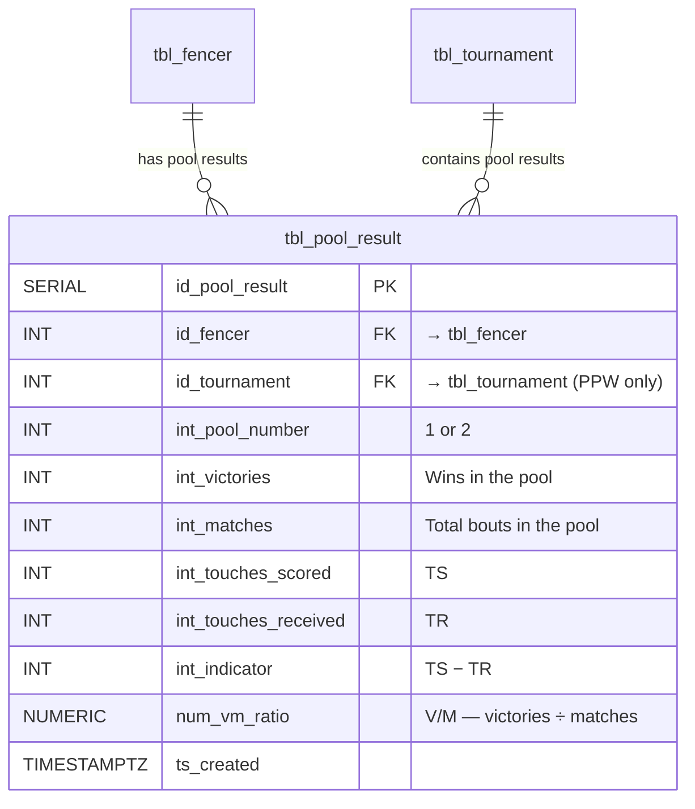

# SuperFive Pool Results (Phase 3 backlog)

*Extracted from Project Specification §9.8 + Appendix B in Phase 0.5 (2026-05-01). Implementation deferred to Phase 3.*

SuperFive is a separate ranking based on **pool-round performance** (not DE/placement results). It relates only to PPW pool rounds (Pool 1 and Pool 2). A dedicated table will store pool-level metrics.

## Proposed schema: `tbl_pool_result`

## Proposed view: `vw_ranking_superfive` (Phase 3)

- Filters to PPW tournaments only
- Aggregates pool metrics across the season
- Ranking criteria and aggregation rules to be defined during Phase 3 implementation

## Implementation note

SuperFive scraping requires different parsing logic than DE/placement results. Separate scraper modules will be developed in Phase 3.

## Cross-references

- Project Specification §9.8 (placeholder pointing here)
- Project Specification Phase 3 backlog (Implementation Phasing in `doc/development_history.md`)
