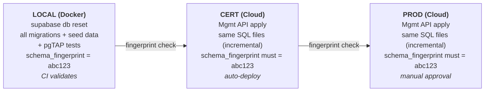
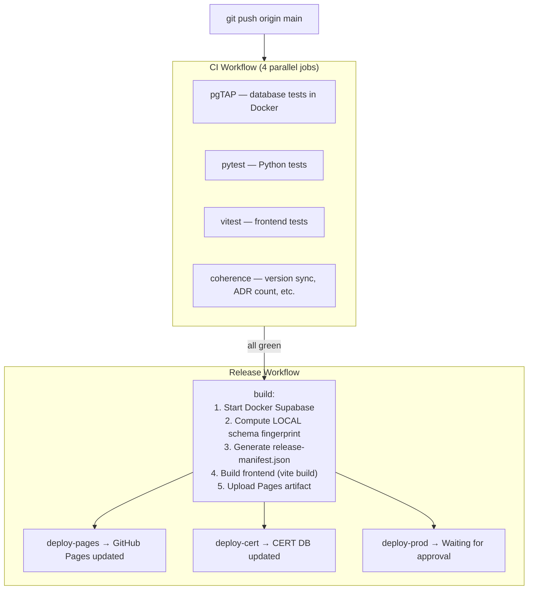

# CI/CD Operations Manual

This guide covers the three-tier release pipeline for the SPWS Automated Ranklist System.

## Architecture Overview



Two GitHub Actions workflows drive the pipeline:

| Workflow | File | Trigger | Purpose |
|----------|------|---------|---------|
| **CI** | `.github/workflows/ci.yml` | Push to `main` or PR | Run tests + coherence checks |
| **Release** | `.github/workflows/release.yml` | CI success on `main` | Build, deploy Pages, CERT, PROD |

---

## 1. One-Time GitHub Setup

These steps are done once in the GitHub web UI.

### 1.1 Create Environments

1. Go to your repo on GitHub: `https://github.com/Fencer4Life/spws-automated-ranklist`
2. Click **Settings** (top navigation bar, far right)
3. In the left sidebar, click **Environments**

**Create `cert` environment:**
1. Click **New environment**
2. Name: `cert`
3. Click **Configure environment**
4. Leave all protection rules **unchecked** (auto-deploy, no approval needed)
5. Click **Save protection rules**

**Create `production` environment:**
1. Click **New environment**
2. Name: `production`
3. Click **Configure environment**
4. Check **Required reviewers**
5. In the search box, type `Fencer4Life` and select yourself
6. Click **Save protection rules**

**`github-pages` environment:**
- Already exists from your Pages setup. No changes needed.

### 1.2 Add Repository Secrets

1. Go to **Settings** → **Secrets and variables** → **Actions**
2. Click **New repository secret** for each:

| Secret name | Where to get it | Value |
|-------------|----------------|-------|
| `SUPABASE_ACCESS_TOKEN` | https://supabase.com/dashboard/account/tokens → Generate new token | Your personal access token |
| `SUPABASE_CERT_REF` | Supabase dashboard → CERT project → Settings → General | `sdomfjncmfydlkygzpgw` |
| `SUPABASE_PROD_REF` | Supabase dashboard → PROD project → Settings → General | `ywgymtgcyturldazcpmw` |

**Keep existing secrets** (already configured):
- `SUPABASE_CERT_URL`
- `SUPABASE_CERT_ANON_KEY`
- `SUPABASE_PROD_URL`
- `SUPABASE_PROD_ANON_KEY`

---

## 2. Day-to-Day Workflow

### What happens when you push to main



### Step by step

1. **Make your changes locally** — code, migrations, tests, docs
2. **Test locally:**
   ```bash
   supabase db reset        # Reset local DB with all migrations + seed
   supabase test db          # Run pgTAP tests
   cd frontend && npm test   # Run vitest
   cd .. && pytest           # Run Python tests
   ```
3. **Commit and push:**
   ```bash
   git add <files>
   git commit -m "Your commit message"
   git push origin main
   ```
4. **Watch CI** — go to your repo → **Actions** tab → you'll see the "CI" workflow running
5. **If CI fails** — click the failed job to see the error, fix locally, push again
6. **If CI passes** — the "Release" workflow starts automatically

---

## 3. How to Approve PROD Deployment

After the Release workflow deploys to CERT, the PROD job waits for your approval.

### Step by step

1. **Go to Actions tab** in your GitHub repo
2. **Click the "Release" workflow run** (the most recent one)
3. You'll see something like:

   ```
   build          ✓ completed
   deploy-pages   ✓ completed
   deploy-cert    ✓ completed
   deploy-prod    ⏳ Waiting
   ```

4. **Click on `deploy-prod`** — you'll see a yellow banner:

   > **Review deployments**
   > This workflow is awaiting review. 1 environment needs approval.

5. **Click "Review deployments"**
6. **Check the `production` checkbox**
7. Optionally type a comment (e.g., "Verified on CERT, looks good")
8. **Click "Approve and deploy"**
9. The `deploy-prod` job starts running — watch it turn green ✓

### To reject a deployment

1. Follow steps 1-5 above
2. Instead of "Approve and deploy", click **"Reject"**
3. The PROD job is cancelled. CERT stays updated, PROD unchanged.

### How long do you have to approve?

GitHub environment approvals wait for **30 days** by default. No rush — approve when you're ready after verifying CERT.

### Quick reference

To approve the PROD deployment, go to your repo's **Actions** tab, click the "Release" run, click `deploy-prod`, then "Review deployments" → check `production` → "Approve and deploy".

---

## 4. Rollback & Skipping Releases

Rollback is **forward-only** — you push a new corrective migration through the full pipeline. There is no "undo" button.

### Why forward-only?

The Supabase Management API only supports running SQL queries — there is no `DROP MIGRATION` or `ROLLBACK` command. And since migrations may have already modified data (not just schema), reversing them safely requires explicit corrective SQL.

A SQL-level snapshot mechanism (automated pre-deploy backups in a `_backup` schema) was designed and evaluated but deferred — the complexity outweighed the practical value given that most migrations change the schema, which would block rollback. See [ADR-012](../doc/adr/012-sql-pre-deploy-snapshots.md) for the full analysis and preserved design.

### Can I skip a release that has a bug?

You can skip the **PROD promotion** — just don't approve it. Click **"Reject"** in the GitHub Actions UI and PROD stays untouched. But you cannot skip a migration once it's applied to CERT, because CERT auto-deploys.

**Typical bug-fix flow:**

1. Push to main → CI passes → CERT gets the migration automatically
2. You notice a bug on CERT
3. You **reject** the PROD deployment → PROD is safe
4. You write a corrective migration, push again
5. New pipeline: CI → CERT gets the fix → you verify → approve PROD

CERT is your safety net — it receives everything automatically so you can catch problems before they reach PROD.

### How to write a corrective migration

1. **Create a new migration file:**
   ```bash
   touch supabase/migrations/20250307000002_revert_bad_change.sql
   ```
   Write the reverse SQL (e.g., `DROP COLUMN`, `ALTER TABLE`, recreate the old function, etc.)

2. **Test locally:**
   ```bash
   supabase db reset      # Applies all migrations including the fix
   supabase test db        # Verify pgTAP tests pass
   ```

3. **Push:** `git push origin main`

4. The pipeline runs the fix through all tiers — CI validates, CERT gets the corrective migration, you verify, then approve PROD.

### What you cannot do

- **Roll back to a previous git SHA** — the cloud DB already has the old migration applied
- **Skip a migration** — they are applied in order
- **Delete a migration file** — the coherence checks and tracking would break

---

## 5. Checking Deployment Status

### Quick: What's deployed where?

Open `deployed_migrations.json` in your repo. It shows:

```json
{
  "cert": {
    "last_updated": "2026-03-22T15:30:00Z",
    "last_sha": "abc1234",
    "applied": ["migration1.sql", "migration2.sql", ...]
  },
  "prod": {
    "last_updated": "2026-03-22T16:00:00Z",
    "last_sha": "abc1234",
    "applied": ["migration1.sql", "migration2.sql", ...]
  }
}
```

### Detailed: Release manifest

Open `release-manifest.json` for the full picture:
- `schema_fingerprint` — proves schema parity
- `tests` — how many tests passed
- `deployed.cert` / `deployed.prod` — when each env was last updated

### Terminal commands

```bash
# Last 3 migrations on CERT
cat deployed_migrations.json | jq '.cert.applied[-3:]'

# Last 3 on PROD
cat deployed_migrations.json | jq '.prod.applied[-3:]'

# Are CERT and PROD in sync?
diff <(jq '.cert.applied' deployed_migrations.json) \
     <(jq '.prod.applied' deployed_migrations.json)
# No output = in sync. Output = differences.
```

### Live: GitHub Actions

Go to **Actions** tab → click the latest **Release** run → see all job statuses.

---

## 6. What To Do When Things Go Wrong

| Scenario | What you see | What to do |
|----------|-------------|------------|
| **CI test fails** | Red ✗ on one of the CI jobs | Click the failed job, read the error log, fix your code locally, push again |
| **Coherence check fails** | Red ✗ on "Coherence Checks" | Version mismatch, ADR count wrong, or pgTAP plan() sum wrong — see error message for details |
| **CERT migration fails** | Red ✗ on `deploy-cert` | SQL error in migration — check the error log, fix the SQL, push a corrective migration |
| **Fingerprint mismatch** | Red ✗ with "fingerprint mismatch" | Schema drift — the cloud DB doesn't match local. Check if someone applied manual SQL to the cloud |
| **PROD migration fails** | Red ✗ on `deploy-prod` | CERT is now ahead of PROD. Fix forward: push a corrective migration through the full pipeline |
| **Tracking commit fails** | Red ✗ on "Commit tracking" | Usually a git conflict. Go to Actions → click "Re-run failed jobs" |
| **Release doesn't trigger** | No Release run after CI passes | Check that CI ran on `main` branch (not a PR). You can also manually trigger: Actions → Release → "Run workflow" |

### Re-running failed jobs

1. Go to **Actions** → click the failed workflow run
2. Click **"Re-run failed jobs"** (top-right button)
3. This re-runs only the failed jobs, not the entire workflow

---

## 7. How to Add a New Database Migration

1. **Create the migration file:**
   ```bash
   # Naming convention: YYYYMMDDHHMMSS_description.sql
   # Example:
   touch supabase/migrations/20250307000001_add_some_feature.sql
   ```
   Write your SQL in this file.

2. **Test locally:**
   ```bash
   supabase db reset     # Apply all migrations from scratch
   supabase test db       # Run pgTAP tests
   ```

3. **Update pgTAP tests** if your migration changes behavior:
   - Add/update tests in `supabase/tests/`
   - Update the `SELECT plan(N)` number to match your assertion count
   - Update the "pgTAP total: N assertions" line in `doc/POC_development_plan.md`

4. **Commit and push:**
   ```bash
   git add supabase/migrations/20250307000001_add_some_feature.sql
   git add supabase/tests/  # if tests changed
   git add doc/             # if docs changed
   git commit -m "Add some feature migration"
   git push origin main
   ```

5. **The pipeline handles the rest:**
   - CI validates (pgTAP, pytest, vitest, coherence)
   - Release builds and deploys to Pages + CERT
   - You approve PROD deployment

---

## 8. Coherence Checks Explained

The coherence job runs 4 gates during CI:

| Gate | What it checks | If it fails |
|------|---------------|-------------|
| **Version sync** | `pyproject.toml` version == `package.json` version | Update the version that's out of sync |
| **ADR count** | Number of `doc/adr/*.md` files == number of ADR rows in spec Appendix C | Add the missing ADR row to the spec (or create the missing ADR file) |
| **pgTAP total** | Sum of all `SELECT plan(N)` in test files == "pgTAP total: N" in POC plan | Update the documented total in `doc/POC_development_plan.md` |
| **Migration↔doc sync** | New migration has corresponding spec/ADR/POC change | Warning only — add a doc update if applicable |

---

## 9. Schema Fingerprint

The schema fingerprint is an MD5 hash computed from your database's public schema (function definitions + table/column structure). It ensures that LOCAL, CERT, and PROD all have the exact same schema.

**How it works:**
1. During `build`, the pipeline starts Docker Supabase, applies all migrations, and computes the fingerprint
2. After deploying to CERT, it computes the CERT fingerprint via the Management API and compares
3. After deploying to PROD, same comparison

**If fingerprints don't match:** Someone has made manual changes to the cloud database outside of migrations. Investigate what changed and either:
- Add a migration to codify the change, or
- Revert the manual change on the cloud

---

## 10. Files Reference

| File | Purpose |
|------|---------|
| `.github/workflows/ci.yml` | CI pipeline: tests + coherence |
| `.github/workflows/release.yml` | Release pipeline: build → Pages → CERT → PROD |
| `deployed_migrations.json` | Tracks which migrations are applied to CERT/PROD |
| `release-manifest.json` | Release audit trail (SHA, fingerprint, test counts) |
| `scripts/schema-fingerprint.sh` | Compute schema fingerprint (local or cloud) |
| `scripts/check-new-migrations.sh` | Determine pending migrations for an environment |
| `scripts/apply-migrations.sh` | Apply SQL migrations via Supabase Management API |
| `scripts/update-tracking.sh` | Update tracking files after deployment |
| `scripts/generate-manifest.sh` | Generate release-manifest.json |
| `scripts/check-coherence.sh` | CI coherence gates |
