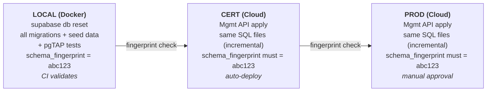
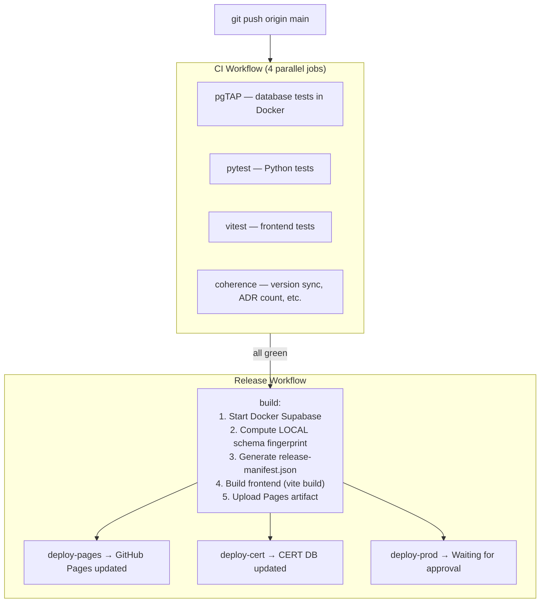

# CI/CD Operations Manual

This guide covers the three-tier release pipeline for the SPWS Automated Ranklist System.

## Architecture Overview



Two GitHub Actions workflows drive the pipeline:

| Workflow | File | Trigger | Purpose |
|----------|------|---------|---------|
| **CI** | `.github/workflows/ci.yml` | Push to `main` or PR | Run tests + coherence checks |
| **Release** | `.github/workflows/release.yml` | CI success on `main` | Build, deploy Pages, CERT, PROD |

---

## 1. One-Time GitHub Setup

These steps are done once in the GitHub web UI.

### 1.1 Create Environments

1. Go to your repo on GitHub: `https://github.com/Fencer4Life/spws-automated-ranklist`
2. Click **Settings** (top navigation bar, far right)
3. In the left sidebar, click **Environments**

**Create `cert` environment:**
1. Click **New environment**
2. Name: `cert`
3. Click **Configure environment**
4. Leave all protection rules **unchecked** (auto-deploy, no approval needed)
5. Click **Save protection rules**

**Create `production` environment:**
1. Click **New environment**
2. Name: `production`
3. Click **Configure environment**
4. Check **Required reviewers**
5. In the search box, type `Fencer4Life` and select yourself
6. Click **Save protection rules**

**`github-pages` environment:**
- Already exists from your Pages setup. No changes needed.

### 1.2 Add Repository Secrets

1. Go to **Settings** → **Secrets and variables** → **Actions**
2. Click **New repository secret** for each:

| Secret name | Where to get it | Value |
|-------------|----------------|-------|
| `SUPABASE_ACCESS_TOKEN` | https://supabase.com/dashboard/account/tokens → Generate new token | Your personal access token |
| `SUPABASE_CERT_REF` | Supabase dashboard → CERT project → Settings → General | `<your-cert-project-ref>` |
| `SUPABASE_PROD_REF` | Supabase dashboard → PROD project → Settings → General | `<your-prod-project-ref>` |

**Keep existing secrets** (already configured):
- `SUPABASE_CERT_URL`
- `SUPABASE_CERT_ANON_KEY`
- `SUPABASE_PROD_URL`
- `SUPABASE_PROD_ANON_KEY`

---

## 1.3 Credentials & secrets — the three trust zones

Secrets are split across **three isolated zones**. The browser never holds a privileged secret; every
privileged action is performed server-side (CI runner or Edge Function). No secret is committed to git.

```
Browser (UI)            Edge Function (server)        Pipeline (CI runner / LOCAL)
─────────────           ──────────────────────        ────────────────────────────
anon key + URL          GH_DISPATCH_PAT, GH_REPO       service-role key + URL
admin JWT (Supabase     (Supabase function secrets)    FTL_USERNAME / FTL_PASSWORD
  Auth + MFA)           verifies caller JWT,           TELEGRAM_BOT_TOKEN / _CHAT_ID
RLS-gated, public         allowlists workflows,        read from os.environ
NO service-role / PAT      forwards workflow_dispatch   NO browser exposure
/ FTL creds               PAT never reaches browser
```

### Zone A — the UI (browser)

- The `<spws-ranklist>` web component receives the Supabase **URL + anon key** (and a soft `admin-password`)
  as **HTML attributes** ([frontend/src/main.ts](../frontend/src/main.ts): `supabase-cert-url/-key`,
  `supabase-prod-url/-key`, `admin-password`). `App.svelte` picks the CERT or PROD pair by
  `VITE_DEPLOY_ENV` and calls `initClient(url, key)` → `createClient` ([frontend/src/lib/api.ts](../frontend/src/lib/api.ts)).
- The key is always the **anon (public) key** — safe to ship in HTML; every read/write is gated by
  Postgres **RLS**. The service-role key is **never** in the bundle.
- **Admin authorization** is Supabase **Auth (GoTrue): email + password + TOTP MFA** → a JWT
  (`signIn` in `App.svelte`, `auth.step` sign_in → mfa_enroll/mfa_challenge). RLS admin policies enforce the
  JWT; the `admin-password` attribute only gates *showing* the admin affordance client-side, it is not the
  security boundary.
- **Privileged GitHub dispatch from the UI** (the ⬇ "import" / populate / re-ingest buttons) does **not**
  carry a PAT. It calls the `dispatch-workflow` Edge Function (Zone B) — ADR-041 / FR-99.

### Zone B — the Edge Function (`supabase/functions/dispatch-workflow`)

- Holds `GH_DISPATCH_PAT` (fine-grained, this repo, Actions read+write) and `GH_REPO` as **Supabase
  function secrets** (`Deno.env.get`, [index.ts](../supabase/functions/dispatch-workflow/index.ts)).
- Verifies the caller's Supabase JWT, checks the workflow against an **allowlist**
  (`populate-urls.yml`, `scrape-tournament.yml`, `phase5-event-runner.yml`, `regen-report.yml`,
  `ingest-event.yml`), then POSTs `workflow_dispatch` with `Authorization: Bearer <PAT>`.
- The **PAT never reaches the browser**. Set it with `supabase secrets set GH_DISPATCH_PAT=… GH_REPO=…`.

### Zone C — the pipeline (Python, CI runner or LOCAL)

All pipeline credentials are read from **`os.environ`** — there is **no `load_dotenv`**:

| Secret | Read by | Purpose |
|---|---|---|
| `SUPABASE_URL` + `SUPABASE_KEY` (**service-role**) | `ingest_cli`, `db_connector`, `promote.py` | full DB read/write (bypasses RLS) — server-side only |
| `FTL_USERNAME` / `FTL_PASSWORD` | `python/scrapers/ftl_auth.py` `get_authed_ftl_client` | log in to FencingTimeLive to scrape authed results pages |
| `TELEGRAM_BOT_TOKEN` / `TELEGRAM_CHAT_ID` | `TelegramNotifier` | operator alerts (never Discord) |

- **CI:** GitHub **repository secrets** are injected per-step via the workflow `env:` block, e.g.
  [ingest-event.yml](../.github/workflows/ingest-event.yml) maps `SUPABASE_KEY` ←
  `secrets.SUPABASE_{CERT,PROD}_SERVICE_ROLE_KEY` (chosen by the `target` input), plus `FTL_USERNAME`/
  `FTL_PASSWORD` and the Telegram pair. Add these to the GitHub secrets in §1.2.
- **LOCAL:** the same names live in the repo-root **`.env`** (git-ignored). Because nothing auto-loads it,
  you must export it into the shell before running the CLI:
  ```bash
  set -a; source .env; set +a       # exports FTL_USERNAME/PASSWORD, SUPABASE_URL/KEY (127.0.0.1), TELEGRAM…
  python -m python.pipeline.ingest_cli --flow ingest_domestic --event-code PPW3-2025-2026 \
      --season-end-year 2026 --from-url      # url_results populated inline (ADR-073 N14)
  ```
  LOCAL `.env` `SUPABASE_URL` must be `http://127.0.0.1:54321` — **never run `--replace` with CERT/PROD
  creds loaded** (it wipes the event before re-ingest).

**Rule of thumb:** anon key → browser; service-role key + FTL + Telegram → pipeline only; PAT → Edge Function
only. If a change would put any Zone-B/C secret into the browser bundle, it is wrong.

---

## 1.4 Rotating a credential when it stops working

Each secret lives in **one or more of four stores**. When a credential breaks, regenerate it at the source,
then update **every** store that holds it, then verify. The four stores:

| Store | Where | How to edit |
|---|---|---|
| **GitHub repo secrets** | repo → Settings → Secrets and variables → Actions | "Update" each secret (value only) |
| **Supabase function secrets** | per project (CERT + PROD) | `supabase secrets set NAME=value --project-ref <ref>` (or dashboard → Edge Functions → Manage secrets) |
| **LOCAL `.env`** | repo-root `.env` (git-ignored) | edit the line; re-run `set -a; source .env; set +a` |
| **UI embed** | the page that embeds `<spws-ranklist …>` (e.g. the WordPress page/HTML widget) | edit the `supabase-*-key` / `-url` attribute |

> ⚠ Never commit a secret. `.env` is git-ignored — keep it that way. After any rotation, the **old** value
> should be revoked at the source so a leaked copy is dead.

### Symptom → which credential

| Symptom | Credential | Stores to update |
|---|---|---|
| CI ingest/promote/recompute fails with 401 / "permission denied" / RLS error | `SUPABASE_*_SERVICE_ROLE_KEY` (Zone C) | GitHub secrets + LOCAL `.env` (`SUPABASE_KEY`) |
| `supabase db push` / migrate-deploy step fails auth | `SUPABASE_ACCESS_TOKEN` | GitHub secrets + LOCAL `.env` |
| UI loads nothing / "Invalid API key" / 401 in browser console | `SUPABASE_*_ANON_KEY` (Zone A) | UI embed attribute + GitHub secrets (`SUPABASE_CERT/PROD_ANON_KEY`, used to render the embed) |
| Admin can't sign in (but data loads) | Supabase **Auth** user (not a key) — reset password / re-enrol MFA in the dashboard | Supabase dashboard → Authentication → Users |
| FTL scrape: `FtlAuthError`, "Discovered 0 URLs", login-redirect, or "account suspended" | `FTL_USERNAME` / `FTL_PASSWORD` (Zone C) | GitHub secrets + LOCAL `.env` |
| UI ⬇ buttons: `Dispatch failed: Edge Function returned a non-2xx` / `gh_dispatch_failed` / 401 from GitHub | `GH_DISPATCH_PAT` (Zone B) | Supabase **function** secrets (CERT + PROD) |
| No Telegram alerts | `TELEGRAM_BOT_TOKEN` / `TELEGRAM_CHAT_ID` | GitHub secrets + LOCAL `.env` |

### Step-by-step per credential

**FTL_USERNAME / FTL_PASSWORD** (FencingTimeLive scrape login)
1. Log in to FencingTimeLive; if the password changed/expired, reset it on their site (or create a fresh account).
2. GitHub → repo secrets → update `FTL_USERNAME` and `FTL_PASSWORD`.
3. LOCAL `.env` → update both lines.
4. Verify (LOCAL): `set -a; source .env; set +a` then
   `python -c "from python.scrapers.ftl_auth import get_authed_ftl_client; get_authed_ftl_client(); print('OK')"`
   — prints `OK` on success, raises `FtlAuthError` on bad creds.

**SUPABASE service-role key** (pipeline DB writes — CERT/PROD)
1. Supabase dashboard → the project → Settings → API → **service_role** → *Reset* (or copy the rotated value).
2. GitHub → update `SUPABASE_CERT_SERVICE_ROLE_KEY` and/or `SUPABASE_PROD_SERVICE_ROLE_KEY`.
3. LOCAL `.env` (`SUPABASE_KEY`) only if you point LOCAL at a remote — normally LOCAL stays `127.0.0.1` (the
   local key from `supabase status`, which the dev stack regenerates on reset, never a remote service-role key).
4. Verify: re-run the affected workflow (Actions → Run workflow) or `python -m python.pipeline.ingest_cli …`.

**SUPABASE_ACCESS_TOKEN** (Supabase CLI — migration deploys)
1. https://supabase.com/dashboard/account/tokens → Generate new token (revoke the old one).
2. GitHub → update `SUPABASE_ACCESS_TOKEN`; LOCAL `.env` if you deploy from your machine.
3. Verify: `supabase projects list` (LOCAL) or re-run the deploy workflow.

**SUPABASE anon key** (UI, public)
1. Anon keys rotate only if you reset the project's JWT secret (Settings → API). Copy the new anon key.
2. Update the **UI embed** `supabase-cert-key` / `supabase-prod-key` attribute on the embedding page, and the
   GitHub `SUPABASE_*_ANON_KEY` secrets if the embed HTML is generated by a workflow.
3. Verify: hard-refresh the site; data loads, no 401 in the console.

**GH_DISPATCH_PAT** (Edge Function → GitHub dispatch)
1. GitHub → Settings → Developer settings → **Fine-grained PAT**: this repo only, **Actions: Read and write**;
   regenerate/replace the expiring one.
2. Set it on **both** Supabase projects hosting the function:
   `supabase secrets set GH_DISPATCH_PAT=<new> GH_REPO=<owner/repo> --project-ref <cert-ref>` and again with
   `<prod-ref>` (or dashboard → Edge Functions → Manage secrets). No redeploy needed — `Deno.env.get` reads it
   at invocation.
3. Verify: in the admin UI press a ⬇ button → expect success-with-link, not a 502.
   *(The GitHub **MCP** PAT in `.vscode/mcp.json` is a separate token for local GitHub API ops — rotate it
   there if MCP calls start failing; it is unrelated to the dispatch PAT.)*

**TELEGRAM_BOT_TOKEN / TELEGRAM_CHAT_ID**
1. Regenerate the bot token via **@BotFather** (`/revoke` → `/token`); the chat id only changes if you move the
   target chat/channel.
2. GitHub → update both; LOCAL `.env` likewise.
3. Verify: `set -a; source .env; set +a` then
   `curl -s "https://api.telegram.org/bot$TELEGRAM_BOT_TOKEN/getMe"` → `{"ok":true,…}`.

After any rotation, run `bash scripts/check-coherence.sh` (unaffected by secrets, but confirms the repo is
still consistent) and re-run the one workflow that failed to confirm green.

---

## 2. Day-to-Day Workflow

### What happens when you push to main



### Step by step

1. **Make your changes locally** — code, migrations, tests, docs
2. **Test locally:**
   ```bash
   ./scripts/reset-dev.sh    # Reset local DB + recreate admin user
   supabase test db          # Run pgTAP tests
   cd frontend && npm test   # Run vitest
   cd .. && pytest           # Run Python tests
   ```
3. **Commit and push:**
   ```bash
   git add <files>
   git commit -m "Your commit message"
   git push origin main
   ```
4. **Watch CI** — go to your repo → **Actions** tab → you'll see the "CI" workflow running
5. **If CI fails** — click the failed job to see the error, fix locally, push again
6. **If CI passes** — the "Release" workflow starts automatically

---

## 3. How to Approve PROD Deployment

After the Release workflow deploys to CERT, the PROD job waits for your approval.

### Step by step

1. **Go to Actions tab** in your GitHub repo
2. **Click the "Release" workflow run** (the most recent one)
3. You'll see something like:

   ```
   build          ✓ completed
   deploy-pages   ✓ completed
   deploy-cert    ✓ completed
   deploy-prod    ⏳ Waiting
   ```

4. **Click on `deploy-prod`** — you'll see a yellow banner:

   > **Review deployments**
   > This workflow is awaiting review. 1 environment needs approval.

5. **Click "Review deployments"**
6. **Check the `production` checkbox**
7. Optionally type a comment (e.g., "Verified on CERT, looks good")
8. **Click "Approve and deploy"**
9. The `deploy-prod` job starts running — watch it turn green ✓

### To reject a deployment

1. Follow steps 1-5 above
2. Instead of "Approve and deploy", click **"Reject"**
3. The PROD job is cancelled. CERT stays updated, PROD unchanged.

### How long do you have to approve?

GitHub environment approvals wait for **30 days** by default. No rush — approve when you're ready after verifying CERT.

### Quick reference

To approve the PROD deployment, go to your repo's **Actions** tab, click the "Release" run, click `deploy-prod`, then "Review deployments" → check `production` → "Approve and deploy".

---

## 4. Rollback & Skipping Releases

Rollback is **forward-only** — you push a new corrective migration through the full pipeline. There is no "undo" button.

### Why forward-only?

The Supabase Management API only supports running SQL queries — there is no `DROP MIGRATION` or `ROLLBACK` command. And since migrations may have already modified data (not just schema), reversing them safely requires explicit corrective SQL.

A SQL-level snapshot mechanism (automated pre-deploy backups in a `_backup` schema) was designed and evaluated but deferred — the complexity outweighed the practical value given that most migrations change the schema, which would block rollback. See [ADR-012](../doc/adr/012-sql-pre-deploy-snapshots.md) for the full analysis and preserved design.

### Can I skip a release that has a bug?

You can skip the **PROD promotion** — just don't approve it. Click **"Reject"** in the GitHub Actions UI and PROD stays untouched. But you cannot skip a migration once it's applied to CERT, because CERT auto-deploys.

**Typical bug-fix flow:**

1. Push to main → CI passes → CERT gets the migration automatically
2. You notice a bug on CERT
3. You **reject** the PROD deployment → PROD is safe
4. You write a corrective migration, push again
5. New pipeline: CI → CERT gets the fix → you verify → approve PROD

CERT is your safety net — it receives everything automatically so you can catch problems before they reach PROD.

### How to write a corrective migration

1. **Create a new migration file:**
   ```bash
   touch supabase/migrations/20250307000002_revert_bad_change.sql
   ```
   Write the reverse SQL (e.g., `DROP COLUMN`, `ALTER TABLE`, recreate the old function, etc.)

2. **Test locally:**
   ```bash
   supabase db reset      # Applies all migrations including the fix
   supabase test db        # Verify pgTAP tests pass
   ```

3. **Push:** `git push origin main`

4. The pipeline runs the fix through all tiers — CI validates, CERT gets the corrective migration, you verify, then approve PROD.

### What you cannot do

- **Roll back to a previous git SHA** — the cloud DB already has the old migration applied
- **Skip a migration** — they are applied in order
- **Delete a migration file** — the coherence checks and tracking would break

---

## 5. Checking Deployment Status

### Quick: What's deployed where?

Open `deployed_migrations.json` in your repo. It shows:

```json
{
  "cert": {
    "last_updated": "2026-03-22T15:30:00Z",
    "last_sha": "abc1234",
    "applied": ["migration1.sql", "migration2.sql", ...]
  },
  "prod": {
    "last_updated": "2026-03-22T16:00:00Z",
    "last_sha": "abc1234",
    "applied": ["migration1.sql", "migration2.sql", ...]
  }
}
```

### Detailed: Release manifest

Open `release-manifest.json` for the full picture:
- `schema_fingerprint` — proves schema parity
- `tests` — how many tests passed
- `deployed.cert` / `deployed.prod` — when each env was last updated

### Terminal commands

```bash
# Last 3 migrations on CERT
cat deployed_migrations.json | jq '.cert.applied[-3:]'

# Last 3 on PROD
cat deployed_migrations.json | jq '.prod.applied[-3:]'

# Are CERT and PROD in sync?
diff <(jq '.cert.applied' deployed_migrations.json) \
     <(jq '.prod.applied' deployed_migrations.json)
# No output = in sync. Output = differences.
```

### Live: GitHub Actions

Go to **Actions** tab → click the latest **Release** run → see all job statuses.

---

## 6. What To Do When Things Go Wrong

| Scenario | What you see | What to do |
|----------|-------------|------------|
| **CI test fails** | Red ✗ on one of the CI jobs | Click the failed job, read the error log, fix your code locally, push again |
| **Coherence check fails** | Red ✗ on "Coherence Checks" | Version mismatch, ADR count wrong, or pgTAP plan() sum wrong — see error message for details |
| **CERT migration fails** | Red ✗ on `deploy-cert` | SQL error in migration — check the error log, fix the SQL, push a corrective migration |
| **Fingerprint mismatch** | Red ✗ with "fingerprint mismatch" | Schema drift — the cloud DB doesn't match local. Check if someone applied manual SQL to the cloud |
| **PROD migration fails** | Red ✗ on `deploy-prod` | CERT is now ahead of PROD. Fix forward: push a corrective migration through the full pipeline |
| **Tracking commit fails** | Red ✗ on "Commit tracking" | Usually a git conflict. Go to Actions → click "Re-run failed jobs" |
| **Release doesn't trigger** | No Release run after CI passes | Check that CI ran on `main` branch (not a PR). You can also manually trigger: Actions → Release → "Run workflow" |

### Re-running failed jobs

1. Go to **Actions** → click the failed workflow run
2. Click **"Re-run failed jobs"** (top-right button)
3. This re-runs only the failed jobs, not the entire workflow

---

## 7. How to Add a New Database Migration

1. **Create the migration file:**
   ```bash
   # Naming convention: YYYYMMDDHHMMSS_description.sql
   # Example:
   touch supabase/migrations/20250307000001_add_some_feature.sql
   ```
   Write your SQL in this file.

2. **Test locally:**
   ```bash
   supabase db reset     # Apply all migrations from scratch
   supabase test db       # Run pgTAP tests
   ```

3. **Update pgTAP tests** if your migration changes behavior:
   - Add/update tests in `supabase/tests/`
   - Update the `SELECT plan(N)` number to match your assertion count
   - Update the "pgTAP total: N assertions" line in `doc/archive/POC_development_plan.md`

4. **Commit and push:**
   ```bash
   git add supabase/migrations/20250307000001_add_some_feature.sql
   git add supabase/tests/  # if tests changed
   git add doc/             # if docs changed
   git commit -m "Add some feature migration"
   git push origin main
   ```

5. **The pipeline handles the rest:**
   - CI validates (pgTAP, pytest, vitest, coherence)
   - Release builds and deploys to Pages + CERT
   - You approve PROD deployment

---

## 8. Coherence Checks Explained

The coherence job runs 4 gates during CI:

| Gate | What it checks | If it fails |
|------|---------------|-------------|
| **Version sync** | `pyproject.toml` version == `package.json` version | Update the version that's out of sync |
| **ADR count** | Number of `doc/adr/*.md` files == number of ADR rows in spec Appendix C | Add the missing ADR row to the spec (or create the missing ADR file) |
| **pgTAP total** | Sum of all `SELECT plan(N)` in test files == "pgTAP total: N" in POC plan | Update the documented total in `doc/archive/POC_development_plan.md` |
| **Migration↔doc sync** | New migration has corresponding spec/ADR/POC change | Warning only — add a doc update if applicable |

---

## 9. Schema Fingerprint

The schema fingerprint is an MD5 hash computed from your database's public schema (function definitions + table/column structure). It ensures that LOCAL, CERT, and PROD all have the exact same schema.

**How it works:**
1. During `build`, the pipeline starts Docker Supabase, applies all migrations, and computes the fingerprint
2. After deploying to CERT, it computes the CERT fingerprint via the Management API and compares
3. After deploying to PROD, same comparison

**If fingerprints don't match:** Someone has made manual changes to the cloud database outside of migrations. Investigate what changed and either:
- Add a migration to codify the change, or
- Revert the manual change on the cloud

---

## 10. Telegram Admin Commands

The Telegram bot (`@spws_ranklist_bot`) is the primary admin interface for event lifecycle management. Commands are polled every 5 minutes by a Google Apps Script (GAS) timer.

### Event lifecycle flow

```
Ingest XML → /status → /complete → /promote → PROD + seed export
                         ↕           ↕
                      /rollback    /delete
```

### Command reference

| Command | Action | Side effects |
|---------|--------|-------------|
| `/status <event>` | Show event status, tournament/result/pending counts | Read-only |
| `/complete <event>` | Mark event COMPLETED on CERT | CERT DB only |
| `/rollback <event>` | Delete all tournaments + results, reset to PLANNED | CERT DB only |
| `/delete <event>` | Rollback **and** delete the `tbl_event` row itself (use for phantom / erroneous events) | CERT DB only |
| `/promote <event>` | Copy CERT event data to PROD | PROD updated + **seed export to git** (ADR-036) |
| `/results <event>` | Show top 3 per tournament | Read-only |
| `/pending <event>` | Show PENDING match candidates | Read-only |
| `/missing <event>` | Show expected but missing tournament categories | Read-only |
| `/ranking <weapon> <gender> <cat>` | Show top 5 in domestic ranking | Read-only |
| `/overview` | Show all events in active season | Read-only |
| `/pause` | Pause email polling | GAS flag |
| `/resume` | Resume email polling | GAS flag |
| `/export-seed` | Manual seed export from PROD | Triggers `export-seed.yml` |

### rollback vs delete — which to use

- **`/rollback`** — the safe default. Use when you want to **re-ingest** the same event (e.g. the scraper got bad data, you fix the source, then re-import). The event row stays, children are wiped, status returns to PLANNED. `fn_rollback_event(prefix)` RPC.
- **`/delete`** — stricter. Use when the event **should not exist at all** (wrong txt_code, duplicate caused by a scraper dedup bug, data from a different season, etc.). Wipes children AND removes the event row. Must be re-created via calendar scraper or CRUD if needed again. `fn_delete_event(prefix)` RPC (ADR-025 amendment, FR-95, migration `20260421000001_fn_delete_event.sql`).

### Seed export (ADR-036)

Seed files are exported **only after `/promote`** — when PROD has the latest data. The `promote.yml` workflow:
1. Runs `promote.py` (CERT → PROD data transfer)
2. Runs `export_seed.py --ref <PROD>` (monolithic PROD dump)
3. Commits `seed_prod_YYYY-MM-DD.sql` to git with `[skip ci]`

Manual export: send `/export-seed` or trigger `export-seed.yml` via GitHub Actions.

Local mirror: `./scripts/mirror-prod.sh` (export + reset + verify).

### Outbound notifications from `evf-sync.yml` (ADR-028 / ADR-039)

The EVF scraper fires unsolicited messages directly to the admin chat (no GAS round-trip). These are *informational* — none require a reply. All messages use `parse_mode=HTML`.

| Trigger | Template | Emitter |
|---|---|---|
| Calendar imported new events | `<b>EVF Calendar</b>\n{N} new event(s) imported\nURL fields: inv={...} reg={...} deadline={...}` | `sync_calendar` after `fn_import_evf_events`. |
| URL refresh sweep complete | `<b>EVF URL refresh</b>\nTouched: {N}, refreshed: {N}` | `sync_calendar` after `fn_refresh_evf_event_urls`. |
| Per-event diff after results scrape | `<b>EVF vs CERT: {name}</b>\n<pre>{cert_code}</pre>\nEVF SPWS: {N}  \|  CERT: {N}\nMatch: {N}  \|  EVF-only: {N}  \|  CERT-only: {N}\n{N} new results ingested` | `_compare_and_ingest` per event. |
| New CERT event auto-created from EVF results | `<b>EVF Import</b>\n<pre>{cert_code}</pre>\n{name}\nCreated event + <b>{N}</b> results ingested` | `_compare_and_ingest` when no in-scope CERT row matched. |
| Calendar HTML + API both unreachable | `<b>EVF Calendar FAILED</b>\n<pre>{exception}</pre>` | `sync_calendar` on `RuntimeError` from `scrape_full_season_calendar`. |
| **Logical-integrity self-heal (ADR-039 Step 0 rev 2)** | `<b>EVF Sync self-heal (Step 0)</b>\n<pre>healed dates: {codes} \| demoted→PLANNED: {codes}</pre>` | `sync_calendar` resolved one or more future-COMPLETED rows: *healed dates* = real date recovered from the event URL (`url_event` populated, status stays COMPLETED); *demoted→PLANNED* = no date recoverable, so the impossible COMPLETED was rolled back to PLANNED (the event URL / date get filled later by the calendar / populate-urls flow). Informational — the sync continues. Optional follow-up: confirm a demoted row eventually gets its `url_event` populated. |
| Workflow-level failure (any non-zero exit) | `EVF sync FAILED. Check: {gh_actions_url}` | `evf-sync.yml`'s `Notify failure` step (curl, plain text). |

Stale-event filtering (ADR-039 Step 1) is logged to stdout only — no Telegram message — to avoid notification noise on routine cron runs. The filtered count appears in the GH Actions log as `Stale-gate: skipping N CERT event(s) outside the 30-day window or COMPLETED`.

---

## 11. Environment Sync (ADR-036)

The system has three environments. Data flows one way: **PROD → local** and **PROD → CERT**.

```
PROD (source of truth)
  │
  ├──→ LOCAL  (via mirror-prod.sh)
  │
  └──→ CERT   (via seed-remote.sh)
```

### Prerequisites

| Credential | What it is | Where stored |
|-----------|------------|--------------|
| `SUPABASE_ACCESS_TOKEN` | Supabase org-level Management API token | `~/.supabase_token` (local file, chmod 600) |
| `SUPABASE_PROD_REF` | PROD project reference ID | Hardcoded in scripts as `ywgymtgcyturldazcpmw` |
| `SUPABASE_CERT_REF` | CERT project reference ID | Hardcoded in scripts as `sdomfjncmfydlkygzpgw` |

**To get the access token:** Go to https://supabase.com/dashboard/account/tokens → copy an active token → save to `~/.supabase_token`.

**Other requirements:**
- Docker running (for local PostgreSQL)
- Supabase CLI installed (`supabase start` has been run at least once)
- Python venv set up (`.venv/` with httpx installed)

---

### Operation A: Mirror PROD → LOCAL

**When to use:** After promoting new data to PROD, or when your local DB is stale/broken.

**What it does:** Exports all PROD data to a timestamped SQL file, resets local DB from migrations, loads the dump, creates admin user, and verifies table counts match PROD.

```bash
./scripts/mirror-prod.sh
```

**Step-by-step (if running manually):**

1. Export PROD data:
   ```bash
   ./scripts/export-prod.sh
   ```
   Creates `supabase/seed_prod_YYYY-MM-DD.sql` and updates symlink `seed_prod_latest.sql`.

2. Reset local DB:
   ```bash
   ./scripts/reset-dev.sh
   ```
   Applies all migrations + loads `seed_prod_latest.sql` + creates admin user (`admin@spws.local` / `admin123`).

3. Verify:
   ```bash
   export SUPABASE_ACCESS_TOKEN="$(cat ~/.supabase_token)"
   python3 -m pytest python/tests/test_prod_mirror.py -v
   ```
   All 7 tables must match PROD counts.

4. Run tests:
   ```bash
   supabase test db
   ```

**Duration:** ~2 minutes (export ~60s, reset ~30s, verify ~30s).

**Local admin credentials:** `admin@spws.local` / `admin123` (always recreated by reset-dev.sh).

---

### Operation B: Sync CERT from PROD

**When to use:** After CERT has diverged from PROD (e.g., after a rollback or data corruption), and you want CERT to match PROD exactly.

**What it does:** Truncates all CERT data tables and re-seeds from the local dump file. After this, CERT = PROD = LOCAL.

**Prerequisite:** Run Operation A first (so local has the latest PROD dump).

```bash
export SUPABASE_ACCESS_TOKEN="$(cat ~/.supabase_token)"
export SUPABASE_REF=sdomfjncmfydlkygzpgw
./scripts/seed-remote.sh
```

**Step-by-step:**

1. Ensure local dump is current:
   ```bash
   ./scripts/export-prod.sh
   ```

2. Push dump to CERT:
   ```bash
   export SUPABASE_ACCESS_TOKEN="$(cat ~/.supabase_token)"
   export SUPABASE_REF=sdomfjncmfydlkygzpgw
   ./scripts/seed-remote.sh
   ```

3. Verify (optional):
   ```bash
   python -m python.tools.audit_results --env cert --pol-only
   ```

**Safety:** The script refuses to run against PROD without `--force` flag.

**Duration:** ~30 seconds (truncate + single API call with full dump).

---

### Operation C: Force-sync PROD from LOCAL (DANGEROUS)

**When to use:** NEVER under normal circumstances. Only if PROD data is catastrophically corrupted and you have a known-good local dump.

```bash
export SUPABASE_ACCESS_TOKEN="$(cat ~/.supabase_token)"
export SUPABASE_REF=ywgymtgcyturldazcpmw
./scripts/seed-remote.sh --force
```

**The `--force` flag is required because this overwrites PROD.**

---

### Data audit

To check for discrepancies between environments and source URLs:

```bash
export SUPABASE_ACCESS_TOKEN="$(cat ~/.supabase_token)"

# Audit CERT against source tournament URLs
python -m python.tools.audit_results --env cert --pol-only

# Audit PROD
python -m python.tools.audit_results --env prod --pol-only

# Audit local
python -m python.tools.audit_results --env local --pol-only
```

---

### Troubleshooting

| Issue | Cause | Fix |
|-------|-------|-----|
| `Illegal header value b'Bearer '` | Token not loaded | Ensure `~/.supabase_token` exists and `SUPABASE_ACCESS_TOKEN` is exported |
| `401 Unauthorized` | Token expired or revoked | Generate new token at supabase.com/dashboard/account/tokens, save to `~/.supabase_token` |
| `502 Bad gateway` | Supabase API outage | Wait 5 minutes and retry |
| Mirror test fails (count mismatch) | Stale dump | Re-run `./scripts/export-prod.sh` then `./scripts/reset-dev.sh` |
| Identity Manager shows empty | `tbl_match_candidate` not loaded | Re-run mirror (dump includes match candidates since ADR-036) |
| Refusing to seed PROD | Safety check | Add `--force` flag (only if you're absolutely sure) |

---

## 12. Files Reference

| File | Purpose |
|------|---------|
| `.github/workflows/ci.yml` | CI pipeline: tests + coherence |
| `.github/workflows/release.yml` | Release pipeline: build → Pages → CERT → PROD |
| `deployed_migrations.json` | Tracks which migrations are applied to CERT/PROD |
| `release-manifest.json` | Release audit trail (SHA, fingerprint, test counts) |
| `scripts/schema-fingerprint.sh` | Compute schema fingerprint (local or cloud) |
| `scripts/check-new-migrations.sh` | Determine pending migrations for an environment |
| `scripts/apply-migrations.sh` | Apply SQL migrations via Supabase Management API |
| `scripts/update-tracking.sh` | Update tracking files after deployment |
| `scripts/generate-manifest.sh` | Generate release-manifest.json |
| `scripts/check-coherence.sh` | CI coherence gates |
| `scripts/export-prod.sh` | Export PROD to monolithic seed file (ADR-036) |
| `scripts/mirror-prod.sh` | Full PROD → local mirror: export + reset + verify |
| `scripts/seed-remote.sh` | Truncate + re-seed remote DB from seed file |
| `scripts/update-test-values.sh` | Update pgTAP expected values from local DB |
| `.github/workflows/promote.yml` | CERT → PROD promotion + seed export |
| `.github/workflows/export-seed.yml` | Manual seed export from PROD or CERT |
| `scripts/gas_email_ingestion.js` | GAS Telegram bot + email ingestion |
| `.github/workflows/regen-report.yml` | Phase 5.5: re-render verdict full.md, upload to Storage, Telegram-send |
| `.github/workflows/phase5-event-runner.yml` | Phase 5.5: run unified Phase-5 pipeline against tbl_event.url_results, drafts + Storage + Telegram |
| `python/pipeline/storage_md.py` | Phase 5.5: staging-reports bucket I/O wrapper (ADR-058) |
| `python/pipeline/md_writer.py` | Phase 5.5: verdict .md target router (local/storage/both/none) (ADR-058+061) |
| `python/pipeline/parity_delta.py` | Phase 5.5: EVF parity delta .md renderer (ADR-060) |

---

## 13. Phase 5.5 — Verdict `.md` Persistence + Telegram Delivery (ADR-058 / 059 / 060 / 061)

After a Phase-5 ingestion (email XML or event URL), the operator receives the verdict `.md` directly on Telegram and reads it in their Obsidian vault. No admin-UI navigation needed for routine verdict reading.

### Architecture

```
EMAIL XML   →  GAS  →  xml-inbox/staging  →  ingest.yml             ┐
                                                                     │
EVENT URL   →  admin UI  →  dispatch-workflow  →  phase5-event-runner.yml  │ ──>  run_pipeline + DraftStore  ──>  staging-reports/{event_code}/full.md  ──>  Telegram sendDocument
                                                                     │                                          (Supabase Storage, private bucket)        (operator phone → Obsidian)
EVENT URL   →  Telegram /stage  →  GAS  →  phase5-event-runner.yml  ┘

Operator alias mutation in admin UI:
  fn_split/transfer/discard  ──>  cascade scoring  ──>  regen-report.yml  ──>  Storage replace + Telegram

Daily 03:00 UTC cron:
  evf-parity-sweep.yml  ──>  if drift, parity_delta.render → staging-reports/{event_code}/deltas/{ts}.md → Telegram (delta caption)
                       ──>  if no drift, silent
```

### One-time CERT/PROD setup

1. Create the `staging-reports` Supabase Storage bucket via dashboard OR `supabase storage create staging-reports --public=false` against the project. Migration `20260503000003` is a no-op on LOCAL; for CERT/PROD the bucket must be created manually (or via `supabase db push` if storage is enabled at the schema level).
2. Verify RLS policy `staging_reports_authenticated_read` exists (the migration creates it once `storage.objects` is present).
3. Verify the `dispatch-workflow` edge function allowlist includes `phase5-event-runner.yml` and `regen-report.yml` (Phase 5.5 deploy).
4. Confirm secrets present: `SUPABASE_CERT_URL`, `SUPABASE_CERT_SERVICE_ROLE_KEY`, `SUPABASE_PROD_URL`, `SUPABASE_PROD_SERVICE_ROLE_KEY`, `FTL_USERNAME`, `FTL_PASSWORD`, `TELEGRAM_BOT_TOKEN`, `TELEGRAM_CHAT_ID` — all already required by existing workflows.

### Telegram operator commands cheat-sheet

| Command | Action | Workflow / API |
|---|---|---|
| `/stage <event_code>` | Run Phase-5 pipeline against `tbl_event.url_results`; drafts + `full.md` + Telegram | `phase5-event-runner.yml` |
| `/regen <event_code>` | Re-render `full.md` from current DB state; replace + Telegram | `regen-report.yml` |
| `/parity <event_code>` | Run EVF parity check for one event; sends delta `.md` if drift | `evf-parity-sweep.yml` (single-event mode) |
| `/verdict <event_code>` | Re-fetch `staging-reports/<X>/full.md` from Storage and Telegram-send | direct Storage download via service-role |

Auto-delivered documents (no command needed):
- `<event_code>-full.md` — after first ingestion + each operator-driven regen
- `<event_code>-delta-<yyyyMMdd_HHmmss>.md` — after EVF parity sweep that found drift

### Disaster recovery

| Symptom | Recovery |
|---------|----------|
| Storage `staging-reports/<X>/full.md` accidentally deleted | Telegram `/regen <X>` (re-renders from DB) |
| Bucket wiped entirely | Recreate via `supabase storage create staging-reports --public=false`, then `/regen <X>` per event |
| Telegram message lost / cleared | `/verdict <X>` re-fetches the latest `full.md` from Storage and re-sends |
| Edge function returns "invalid_workflow" | Confirm allowlist update was deployed (`supabase functions deploy dispatch-workflow`) |
| Workflow fails with "invalid event_code" | event_code must match `^[A-Z0-9_-]+$` (validated at workflow + Storage level) |

### LOCAL operator workflow (unchanged)

Per ADR-061, LOCAL workflow is preserved verbatim:
- `python -m python.tools.phase5_runner --event-code <X>` writes `doc/staging/<X>.md` (filesystem only)
- No Telegram fired (token absent on LOCAL by default)
- No Storage upload (bucket migration is a no-op when `storage.buckets` table doesn't exist)
- Admin UI alias triage improvements work against LOCAL DB; the operator continues to rerun `phase5_report` from shell after triage sessions
- To exercise CERT-style behaviour from LOCAL: pass `--md-target=storage` + `--send-telegram` and set the env vars (against a test bot)
