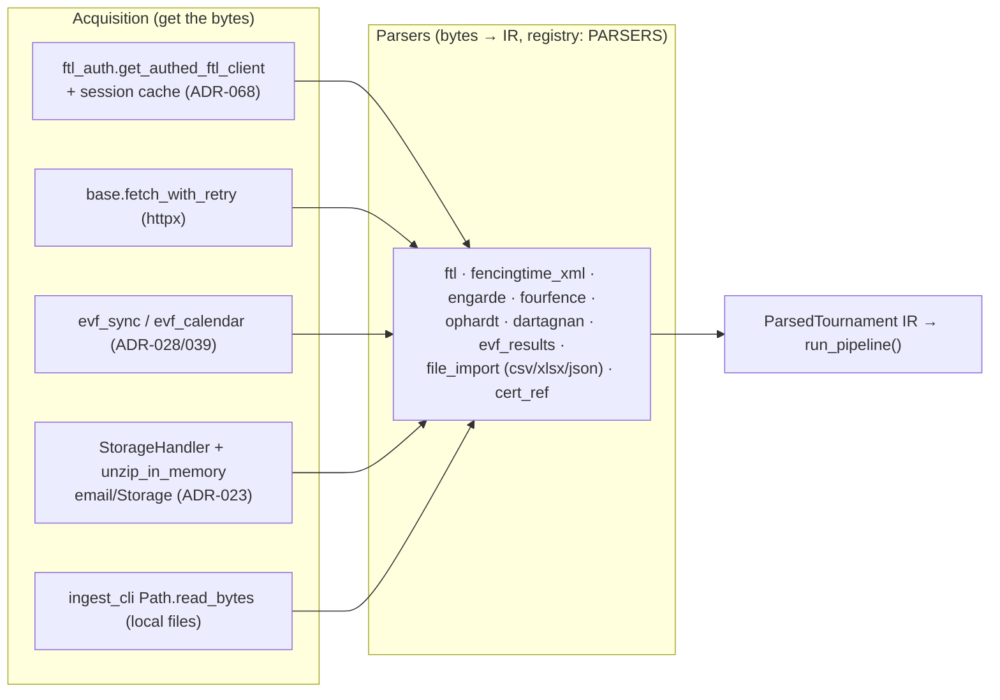

# Ingestion Pipeline — Design & Code Map

**Status:** Living design document · **Scope:** the end-to-end ingestion pipeline (sources → live ranked results)
**Audience:** maintainers who need to see *every code chunk*, what it does, and *why* (ADR rationale).

> **DB schema is intentionally NOT detailed here.** For the schema (tables, columns, enums,
> triggers, views) see the single source of truth — the
> [Project Specification §9](Project%20Specification.%20SPWS%20Automated%20Ranklist%20System.md) ER diagram —
> and the schema-bearing ADRs ([ADR-055](adr/055-ingest-traceability.md) provenance/history columns,
> [ADR-049](adr/049-joint-pool-split-flag.md) `bool_joint_pool_split`, [ADR-050](adr/050-unified-ingestion-pipeline.md)
> `tbl_*_draft` + `tbl_result` provenance). This document maps the **code**; it only *references* the schema.

---

## 0. Legend — every abbreviation used in this document

Read this first if any token below is unfamiliar. Grouped for scanning.

### 0.1 Domain — tournament types & age categories
| Abbr. | Meaning | Short description | Read more |
|-------|---------|-------------------|-----------|
| SPWS | *Stowarzyszenie Polskich Weteranów Szermierzy* | Polish Veterans Fencing Association — the org this system serves; its own data authority | [CLAUDE.md](../CLAUDE.md) |
| PPW | Puchar Polski Weteranów (individual) | Domestic individual veterans' cup — admits **everyone** | [ADR-066](adr/066-min-participants-ingestion-gate.md) |
| MPW | Mistrzostwa Polski Weteranów (individual) | Polish veterans' individual championship (domestic) | Spec §3 |
| PEW | (Polish) European Veterans event | International individual European event — **POL-only** intake | [ADR-038](adr/038-evf-intake-polish-only.md) |
| MEW | World/Masters European Veterans event | International event — POL-only intake | [ADR-038](adr/038-evf-intake-polish-only.md) |
| MSW | Masters/World veterans event | International event — POL-only intake | [ADR-008](adr/008-psw-msw-international-pool.md) |
| PSW | Puchar Świata Weteranów | World-cup veterans event (international pool) | [ADR-008](adr/008-psw-msw-international-pool.md) |
| IMEW / DMEW | Individual / Team European Veterans | Individual (scores) alternates yearly with Team (no scoring) | [ADR-021](adr/021-imew-biennial-carry-over.md) |
| GP | Grand Prix | Domestic ranking-bearing series | Spec §8 |
| Kadra | National squad ranking | Aggregate ranking (PPW + best international) | Spec §8.3 |
| V0–V4 | Veteran age categories | 5 age bands (V0 youngest … V4 oldest), derived from birth year | [ADR-010](adr/010-age-category-by-birth-year.md), [ADR-056](adr/056-vcat-from-birthyear.md) |
| V-cat | Veteran category | Shorthand for "one of V0–V4" | [ADR-056](adr/056-vcat-from-birthyear.md) |
| EPEE / FOIL / SABRE | The three weapons | `enum_weapon_type` values | Spec §9 |
| M / F | Male / Female | `enum_gender_type` values | [ADR-033](adr/033-fencer-gender-identity-enhancements.md) |

### 0.2 Data sources & external systems
| Abbr. | Meaning | Short description | Read more |
|-------|---------|-------------------|-----------|
| FTL | FencingTimeLive | Live results API/site (JSON + CSV); a primary domestic source | [ADR-065](adr/065-ftl-per-fencer-vcat-marker-check.md), [ADR-068](adr/068-ftl-www-host-and-session-cache.md) |
| FT XML | FencingTime XML export | Offline XML result file (FencingTime desktop) | [ADR-067](adr/067-structural-pool-only-skip-unified-xml-ingest.md) |
| Engarde | Engarde service | HTML results provider | [scrapers/engarde.py](../python/scrapers/engarde.py) |
| 4Fence / 4F | 4fence.com / 4fence.world | HTML results provider | [scrapers/fourfence.py](../python/scrapers/fourfence.py) |
| Ophardt | Ophardt / fencingworldwide | HTML results provider with native athlete IDs | [scrapers/ophardt.py](../python/scrapers/ophardt.py) |
| Dartagnan | dartagnan.org/com | Legacy JSON results API (kept for re-ingest) | [scrapers/dartagnan.py](../python/scrapers/dartagnan.py) |
| EVF | European Veterans Fencing | veteransfencing.eu — calendar + results API; **backup source** verified by parity | [ADR-028](adr/028-evf-calendar-results-import.md), [ADR-053](adr/053-evf-parity-gate.md) |
| FIE | Fédération Internationale d'Escrime | International fencing federation (context for international events) | Spec §3 |
| cert_ref | Certified reference snapshot | Frozen DB snapshot used as a parser when no live URL exists | [ADR-050](adr/050-unified-ingestion-pipeline.md) |
| GAS | Google Apps Script | Gmail-polling email-ingestion bridge | [ADR-023](adr/023-email-ingestion-gas-storage.md) |
| POL | Poland / Polish nationality | Nationality filter token for international intake | [ADR-038](adr/038-evf-intake-polish-only.md) |

### 0.3 Architecture, code & data formats
| Abbr. | Meaning | Short description | Read more |
|-------|---------|-------------------|-----------|
| IR | Intermediate Representation | The uniform `ParsedTournament`/`ParsedResult` every parser emits | [ir.py](../python/pipeline/ir.py), [ADR-050](adr/050-unified-ingestion-pipeline.md) |
| RPC | Remote Procedure Call | A callable PL/pgSQL function exposed to the app (e.g. `fn_commit_event_draft`) | [§6](#6-code-chunk-reference-table) |
| PL/pgSQL | Procedural Language / PostgreSQL | PostgreSQL's stored-procedure language | [supabase/migrations/](../supabase/migrations/) |
| FK | Foreign Key | DB reference; identity is by FK, not name | [ADR-003](adr/003-identity-by-fk-not-name.md) |
| CLI | Command-Line Interface | `ingest_cli.py` / `review_cli.py` entry points | [§6](#6-code-chunk-reference-table) |
| UUID | Universally Unique Identifier | The `run_id` keying a draft batch | [ADR-050](adr/050-unified-ingestion-pipeline.md) |
| DOB / BY | Date of Birth / Birth Year | Drives V-cat derivation | [ADR-010](adr/010-age-category-by-birth-year.md) |
| DE | Direct Elimination | Tableau bonus component in scoring | [ADR-001](adr/001-hybrid-scoring-config.md) |
| RapidFuzz | (library name) | Fuzzy string-matching library used by the matcher | [matcher/fuzzy_match.py](../python/matcher/fuzzy_match.py) |
| TEE | "tee" write pattern | Phase-0 dual-write to new + legacy identity tables | [ADR-050](adr/050-unified-ingestion-pipeline.md) |
| XML / CSV / XLSX / JSON / HTML | file/data formats | Source artifact formats handled by parsers | [scrapers/](../python/scrapers/) |
| Telegram | (product) | Bot used for all operator alerting (never Discord) | [ADR-059](adr/059-telegram-document-delivery.md) |

### 0.4 Pipeline-specific terms
| Term | Meaning | Short description | Read more |
|------|---------|-------------------|-----------|
| Draft / `run_id` | Staged ingest batch | Rows in `tbl_*_draft` not yet live, keyed by a UUID | [ADR-050](adr/050-unified-ingestion-pipeline.md) |
| Joint pool | One physical pool, several V-cats | Sibling tournaments sharing `url_results`; counted per-V-cat | [ADR-049](adr/049-joint-pool-split-flag.md) |
| Pool-only / pool-round | Qualifier without a tableau | Structurally detected; not scored | [ADR-057](adr/057-pool-round-structural-detection.md), [ADR-067](adr/067-structural-pool-only-skip-unified-xml-ingest.md) |
| Parity gate | EVF cross-check | POL count + placement + score ±0.5 after commit | [ADR-053](adr/053-evf-parity-gate.md) |
| 3-way diff | Source vs CERT vs new-LOCAL | Operator review buckets before commit | [three_way_diff.py](../python/pipeline/three_way_diff.py) |
| HaltError / halt reason | Stage abort signal | A stage raises it to stop the pipeline with a reason code | [types.py](../python/pipeline/types.py) |
| AUTO_MATCH / PENDING / UNMATCHED / AUTO_CREATED | Match outcomes | Matcher classification by confidence + intake rules | [matcher/pipeline.py](../python/matcher/pipeline.py) |
| Stage 8b / cascade | PEW event-code recompute | Post-commit rename when weapon assignment shifts | [ADR-046](adr/046-pew-weapon-suffix.md) |

### 0.5 Process, governance & environments
| Abbr. | Meaning | Short description | Read more |
|-------|---------|-------------------|-----------|
| ADR | Architecture Decision Record | A numbered decision doc; the "why" behind each chunk | [doc/adr/](adr/), Spec Appendix C |
| FR / NFR | Functional / Non-Functional Requirement | Numbered requirements in the spec | Spec §3, RTM |
| UC | Use Case | Numbered user scenario | Spec §3 |
| RTM | Requirements Traceability Matrix | FR ↔ ADR ↔ test ↔ code mapping | [requirements-traceability-matrix.md](requirements-traceability-matrix.md) / Spec |
| Spec | Project Specification | The single source of truth | [Project Specification](Project%20Specification.%20SPWS%20Automated%20Ranklist%20System.md) |
| TDD | Test-Driven Development | Acceptance tests written before code | [doc/claude/testing.md](claude/testing.md) |
| pgTAP / pytest / vitest | test frameworks | DB / Python / frontend test suites | [doc/claude/testing.md](claude/testing.md) |
| POC / MVP | Proof of Concept / Minimum Viable Product | Completed early build phases | [development_history.md](development_history.md) |
| LOCAL / CERT / PROD | the three environments | Dev → certification → production deploy tiers | [ADR-011](adr/011-artifact-release-pipeline.md), [cert-prod-environments](../CLAUDE.md) |

---

## 1. Business Requirements (start here)

The pipeline exists to keep **30 sub-rankings** (3 weapons × 2 genders × 5 age categories V0–V4) up to
date automatically, from many incompatible external result sources, with near-zero data error because
**SPWS is its own authority** — a wrong domestic result propagates into the ranklist permanently with no
upstream to correct it ([memory: EVF predominance / SPWS near-perfect]).

| # | Business rule | Where it lives in code | Why (ADR) |
|---|---------------|------------------------|-----------|
| BR-1 | Ingest results from FTL, Engarde, 4Fence, Ophardt, FencingTime XML, EVF API, CSV/XLSX/JSON, and a cert_ref snapshot | `python/scrapers/*` + `PARSERS` registry | [ADR-050](adr/050-unified-ingestion-pipeline.md) |
| BR-2 | **Domestic** events (PPW/MPW) admit **everyone**, incl. foreign guests; unmatched names are auto-created | `s6_resolve_identity` + `matcher/pipeline.py` | [ADR-020](adr/020-seed-generator-domestic-auto-create.md), [ADR-038](adr/038-evf-intake-polish-only.md) |
| BR-3 | **International** events (PEW/MEW/MSW) admit **POL-only**; non-Polish rows dropped before matching | `s6_resolve_identity` (domestic/international branch) | [ADR-038](adr/038-evf-intake-polish-only.md) |
| BR-4 | Identity is by durable **FK**, never by mutable name | `tbl_result.id_fencer`, matcher | [ADR-003](adr/003-identity-by-fk-not-name.md) |
| BR-5 | Age category derives from **birth year** and season end year | `s0`, `s7_split_by_vcat`, `fn_age_categories_batch` | [ADR-010](adr/010-age-category-by-birth-year.md), [ADR-056](adr/056-vcat-from-birthyear.md) |
| BR-6 | Re-import is **atomic** (delete-old + insert-new + re-score in one transaction) | `fn_ingest_tournament_results`, `fn_commit_event_draft` | [ADR-014](adr/014-delete-reimport-strategy.md), [ADR-022](adr/022-ingestion-db-transaction.md) |
| BR-7 | Combined physical pools must be **split per V-cat**, but counted per V-cat | `s3`/`s4`/`s5`/`s7_split_by_vcat`, commit RPC | [ADR-024](adr/024-combined-category-splitting.md), [ADR-049](adr/049-joint-pool-split-flag.md) |
| BR-8 | Minimum-participant gate applies **at ingestion**, not scoring | `s7_validate` | [ADR-066](adr/066-min-participants-ingestion-gate.md) |
| BR-9 | Every committed row carries **provenance** (scraped name, confidence, method, parser, source URL) | `tbl_result` provenance cols + history tables | [ADR-050](adr/050-unified-ingestion-pipeline.md), [ADR-055](adr/055-ingest-traceability.md) |
| BR-10 | A human reviews a **diff** before anything goes live (draft-then-commit) | `review_cli.py`, `three_way_diff.py`, draft tables | [ADR-050](adr/050-unified-ingestion-pipeline.md) |
| BR-11 | EVF is a **backup source**, verified by a post-commit parity gate | `evf_parity.py`, `commit_lifecycle.py` | [ADR-053](adr/053-evf-parity-gate.md) |

Use-case coverage: UC1–UC4 (ingest, manual upload, identity resolution, manual review), UC23 (re-import),
UC24–UC31 (orchestration, EVF sync, email, Telegram, URL auto-population). FRs: FR-53/54, FR-58,
FR-71/72/73, FR-75/76/77, FR-79–85, FR-92, FR-96/97.

---

## 2. Guiding Principles (cross-cutting ADRs)

These shape *every* chunk below; stated once so the detail reads coherently.

- **Draft-then-commit.** Nothing touches live tables until an operator commits a `run_id`. — [ADR-050](adr/050-unified-ingestion-pipeline.md)
- **One IR contract.** All 9 parsers emit the same `ParsedTournament`/`ParsedResult`. — [ADR-050](adr/050-unified-ingestion-pipeline.md)
- **Halt-by-exception.** A stage raises `HaltError`; the orchestrator records `halt_reason` and stops. Non-halt exceptions are bugs and propagate. — `orchestrator.run_pipeline`
- **Structural detection over name-regex.** Pool-only / pool-round / bracket detection use data structure, not name matching. — [ADR-057](adr/057-pool-round-structural-detection.md), [ADR-067](adr/067-structural-pool-only-skip-unified-xml-ingest.md)
- **Atomicity & idempotency.** Delete+reload in one transaction; re-running a source is safe. — [ADR-014](adr/014-delete-reimport-strategy.md), [ADR-022](adr/022-ingestion-db-transaction.md)
- **Full traceability.** Per-row provenance + bounded (cap-6) per-parent history. — [ADR-055](adr/055-ingest-traceability.md)

> **ADR registry note:** ADR-051 and ADR-054 do **not** exist (reserved/skipped). The ingestion-relevant
> ADRs are listed in full in [§7](#7-adr-cross-reference-every-ingestion-relevant-decision).

---

## 3. THE BIG CHART — every code chunk, named, with its ADR

Read top-to-bottom. Each node is a real module/class/function (file path in [§6](#6-code-chunk-reference-table)).
`(ADR-NNN)` on a node is the decision that explains *why it exists*.

```mermaid
flowchart TB
    %% ============ ENTRY ============
    subgraph ENTRY["Entry points (CLI / review)"]
        CLI["ingest_cli.py<br/>--event-code · --commit-draft · --discard-draft<br/>--list-drafts · --resume-run-id"]
        REVIEW["review_cli.py :: ReviewSession<br/>interactive source-of-truth choice + run_iteration()<br/>(ADR-050 Phase 4)"]
    end

    %% ============ SOURCES + PARSERS ============
    subgraph SRC["Source layer — scrapers/ (one IR per source) (ADR-050)"]
        direction LR
        P_FTX["fencingtime_xml.parse()<br/>FT XML; Poule-no-Tableau = pool-only (ADR-067)"]
        P_FTL["ftl.parse_json() / parse_csv()<br/>per-fencer V-cat marker (ADR-065)<br/>www-host + session cache (ADR-068)"]
        P_ENG["engarde.parse_html()"]
        P_4F["fourfence.parse_html()"]
        P_OPH["ophardt.parse_results()"]
        P_DAR["dartagnan.parse_rankings()"]
        P_EVF["evf_results.parse_results()<br/>POL-only + parity payload (ADR-038/053)"]
        P_FILE["file_import.parse()<br/>CSV/XLSX/JSON"]
        P_CERT["cert_ref.parse()<br/>snapshot fallback, skips URL checks (ADR-050)"]
        REG["scrapers/__init__.py :: PARSERS{}<br/>SourceKind → parser (registry, ADR-050)"]
    end

    %% ============ IR ============
    subgraph IR["Intermediate Representation — pipeline/ir.py"]
        IR_T["ParsedTournament<br/>results[], weapon, gender, category_hint,<br/>raw_pool_size, is_pool_only_qualifier"]
        IR_R["ParsedResult<br/>source_row_id, fencer_name, place,<br/>fencer_country, birth_year, raw_age_marker"]
        IR_ID["make_synthetic_id()<br/>stable id for source-less parsers"]
        IR_SK["SourceKind enum (9 sources)"]
    end

    %% ============ EVF SYNC (discovery) ============
    subgraph EVFSYNC["EVF calendar/results sync (scheduled discovery)"]
        EVF_CAL["evf_calendar.py<br/>scrape calendar; self-heal stale COMPLETED (ADR-039)"]
        EVF_SYNC["evf_sync.py<br/>2-phase: discover events → fetch results (ADR-028)"]
    end

    %% ============ PIPELINE STAGES ============
    subgraph PIPE["Stage machine — pipeline/orchestrator.run_pipeline() over stages.py"]
        direction TB
        S0["s0_reconcile_roster<br/>create NEW fencers (exact match) + reconcile<br/>birth-year conflicts to band midpoint<br/>(ADR-056/010/038/050)"]
        S1["s1_validate_ir<br/>IR schema checks; pool-only skip<br/>HALT: IR_INVALID / POOL_ROUND_DETECTED (ADR-067)"]
        S2["s2_resolve_event<br/>map to active-season event by code/date<br/>HALT: EVENT_NOT_RESOLVED / EVENT_AMBIGUOUS (ADR-025)"]
        S3["s3_detect_combined_pool<br/>flag multi-V-cat from raw_age_marker (ADR-024)"]
        S4["s4_split_via_batch<br/>V-cat split by DOB via fn_age_categories_batch<br/>HALT: SPLITTER_UNRESOLVED (ADR-024/047)"]
        S5["s5_detect_joint_pool<br/>flag siblings sharing url_results (ADR-049)"]
        S6["s6_resolve_identity<br/>fuzzy match → AUTO_MATCH/PENDING/UNMATCHED;<br/>domestic auto-create vs intl POL-only<br/>HALT: V0_PROHIBITED_ON_INTERNATIONAL<br/>(ADR-003/020/038/064/034)"]
        S7["s7_validate<br/>count + min-participants + URL→data 6-field check<br/>HALT: COUNT_MISMATCH / URL_DATA_MISMATCH<br/>(ADR-052/066)"]
        S7P["s7_pool_round_check<br/>structural gender-mix detection<br/>HALT: POOL_ROUND_DETECTED (ADR-057/063)"]
        S7V["s7_split_by_vcat<br/>final V-cat from birth_year / bracket label (ADR-056)"]
        S0 --> S1 --> S2 --> S3 --> S4 --> S5 --> S6 --> S7 --> S7P --> S7V
    end

    %% ============ MATCHER ============
    subgraph MATCH["Identity matcher — matcher/"]
        FUZZ["fuzzy_match.find_best_match()<br/>RapidFuzz + diacritic fold + age tiebreak<br/>≥95 AUTO · 50-95 PENDING · &lt;50 UNMATCHED"]
        MPIPE["pipeline.resolve_tournament_results()<br/>domestic vs international intake rules<br/>estimate_birth_year() midpoint anchors (ADR-056)"]
        FGENDER["asymmetric F-bracket gender filter (ADR-064)"]
    end

    %% ============ CONTEXT + OVERRIDES ============
    subgraph CTX["Shared state — pipeline/types.py + overrides.py"]
        PCTX["PipelineContext<br/>carries stage outputs + halt state"]
        HALT["HaltReason enum"]
        OVR["Overrides (5 YAML surfaces):<br/>identity · splitter · url · match_method · joint_pool"]
    end

    %% ============ DRAFT LAYER ============
    subgraph DRAFT["Draft staging — pipeline/draft_store.py (ADR-050 Phase 2)"]
        DS["DraftStore<br/>write_tournament_drafts / write_result_drafts<br/>read · list · commit · discard · dry_run"]
        DD["draft_diff.py<br/>dry-run markdown formatter"]
        TWD["three_way_diff.py<br/>Source vs CERT vs new-LOCAL → 4 buckets<br/>+ confidence histogram"]
        ALIAS["alias_writeback.py<br/>pending alias capture (ADR-050 Phase 3)"]
        DTBL[("tbl_tournament_draft / tbl_result_draft<br/>keyed by run_id — schema: see ADR-050")]
    end

    %% ============ COMMIT RPCs ============
    subgraph COMMIT["Commit layer — PL/pgSQL RPCs"]
        F_DRY["fn_dry_run_event_draft(jsonb)<br/>stateless validate + count (no writes)"]
        F_DISC["fn_discard_event_draft(run_id)<br/>delete drafts + audit row"]
        F_COMMIT["fn_commit_event_draft(run_id)<br/>drafts→live; flag joint-pool siblings;<br/>per-V-cat count (ADR-049 amend);<br/>append cap-6 history (ADR-055); run scoring"]
        F_INGEST["fn_ingest_tournament_results()<br/>legacy atomic delete+insert+score (ADR-014/022)"]
        F_SCORE["fn_calc_tournament_scores()<br/>place pts + DE bonus + podium (ADR-001/002)"]
        F_AGE["fn_age_categories_batch()<br/>birth years → V-cats (ADR-010/056)"]
    end

    %% ============ POST-COMMIT ============
    subgraph POST["Post-commit hooks — pipeline/commit_lifecycle.run_post_commit_hooks()"]
        H_PEW["Stage 8b: pew_recompute_event_code()<br/>cascade rename on weapon mismatch (ADR-046)"]
        H_PAR["evf_parity.check_parity()<br/>POL count + placement + score ±0.5 (ADR-053)"]
        H_PROM["promote_evf_published() / annotate_parity_fail()<br/>PASS→EVF_PUBLISHED · FAIL→annotate (ADR-053)"]
        H_PCNT["participant_count_validation.py<br/>post-commit URL re-count HALT (ADR-069)"]
        H_TG["notifications.py → Telegram<br/>(ADR-059 doc delivery; Telegram not Discord)"]
    end

    %% ============ LIVE ============
    LIVE[("LIVE: tbl_tournament / tbl_result / tbl_fencer<br/>+ ingest_history + audit_log<br/>schema → Spec §9 / ADR-055")]
    DBC["db_connector.py :: DbConnector<br/>all DB I/O for the Python side"]

    %% ---- EDGES ----
    CLI --> REVIEW
    EVF_CAL --> EVF_SYNC --> P_EVF
    P_FTX & P_FTL & P_ENG & P_4F & P_OPH & P_DAR & P_EVF & P_FILE & P_CERT --> REG
    REG --> IR_T
    IR_T -.contains.-> IR_R
    IR_SK -.tags.-> IR_T
    IR_ID -.fills.-> IR_R
    REVIEW --> S0
    IR_T --> S0
    OVR -.feeds.-> S0
    PCTX -.threads through.-> PIPE
    HALT -.raised by.-> PIPE
    S6 --> FUZZ
    FUZZ --> MPIPE
    FGENDER -.filters.-> FUZZ
    S4 -.calls.-> F_AGE
    S7V --> DS
    DS --> DTBL
    DS -.preview.-> DD
    REVIEW -.renders.-> TWD
    S6 -.captures.-> ALIAS
    DS -->|commit| F_COMMIT
    DS -->|dry_run| F_DRY
    DS -->|discard| F_DISC
    F_COMMIT --> F_SCORE
    F_INGEST --> F_SCORE
    F_COMMIT --> LIVE
    F_COMMIT --> POST
    H_PEW --> H_PAR --> H_PROM
    POST -.notifies.-> H_TG
    H_PCNT -.guards.-> LIVE
    DBC -.executes.-> COMMIT
    DBC -.reads/writes.-> LIVE
```

---

## 4. How to read the flow (one paragraph)

A **source** is fetched (or discovered via EVF sync) and handed to its **parser**, which emits a uniform
`ParsedTournament` **IR**. `run_pipeline()` threads a `PipelineContext` through stages **S0→S7_split_by_vcat**,
each either enriching the context or raising `HaltError`. Surviving results are written to **draft tables**
under a `run_id`; an operator inspects the **3-way diff** and runs `--commit-draft`. `fn_commit_event_draft`
atomically promotes drafts to **live tables**, flags joint-pool siblings, appends history, and re-scores.
**Post-commit hooks** then handle the PEW cascade rename, the EVF parity gate, the participant-count
re-check, and Telegram notification.

---

## 5. Stage-by-stage detail (execution order)

Order is the literal `_STAGE_NAMES` tuple in `orchestrator.py`.

| # | Function (`stages.py`) | What it does | Halts with | Why (ADR) |
|---|------------------------|--------------|------------|-----------|
| S0 | `s0_reconcile_roster` | Creates new fencers by **exact** match (not fuzzy); reconciles conflicting birth years to band midpoint (estimate kept, CONFIRMED downgraded) — **before** matching | — (never halts) | [050](adr/050-unified-ingestion-pipeline.md)/[056](adr/056-vcat-from-birthyear.md)/[010](adr/010-age-category-by-birth-year.md)/[038](adr/038-evf-intake-polish-only.md) |
| S1 | `s1_validate_ir` | IR structural validation; structural pool-only skip | `IR_INVALID`, `POOL_ROUND_DETECTED` | [067](adr/067-structural-pool-only-skip-unified-xml-ingest.md) |
| S2 | `s2_resolve_event` | Resolve to an active-season event by code or date | `EVENT_NOT_RESOLVED`, `EVENT_AMBIGUOUS` | [025](adr/025-event-centric-ingestion-telegram.md) |
| S3 | `s3_detect_combined_pool` | Detect multi-V-cat physical pool from `raw_age_marker` | — | [024](adr/024-combined-category-splitting.md) |
| S4 | `s4_split_via_batch` | Split combined pool by DOB via `fn_age_categories_batch` | `SPLITTER_UNRESOLVED` | [024](adr/024-combined-category-splitting.md)/[047](adr/047-vcat-invariant-trigger-and-splitter-consolidation.md) |
| S5 | `s5_detect_joint_pool` | Flag siblings sharing `url_results` as a joint pool | — | [049](adr/049-joint-pool-split-flag.md) |
| S6 | `s6_resolve_identity` | Fuzzy match; domestic auto-create vs international POL-only | `V0_PROHIBITED_ON_INTERNATIONAL` | [003](adr/003-identity-by-fk-not-name.md)/[020](adr/020-seed-generator-domestic-auto-create.md)/[038](adr/038-evf-intake-polish-only.md)/[064](adr/064-asymmetric-gender-filter-matcher.md)/[034](adr/034-cross-gender-tournament-scoring.md) |
| S7 | `s7_validate` | Count check, min-participants gate, URL→data 6-field validation | `COUNT_MISMATCH`, `URL_DATA_MISMATCH`, `PARTICIPANT_COUNT_MISMATCH` | [052](adr/052-url-data-validation.md)/[066](adr/066-min-participants-ingestion-gate.md) |
| S7b | `s7_pool_round_check` | Structural pool-round detection via gender-mix signal | `POOL_ROUND_DETECTED` | [057](adr/057-pool-round-structural-detection.md)/[063](adr/063-polish-plural-and-grupy-zbiorcze.md) |
| S7c | `s7_split_by_vcat` | Final per-result V-cat from birth year / bracket label | — | [056](adr/056-vcat-from-birthyear.md) |

---

## 6. Code-chunk reference table (file paths)

### Entry & orchestration
| Chunk | Path | Role |
|-------|------|------|
| `ingest_cli.py` | [python/pipeline/ingest_cli.py](../python/pipeline/ingest_cli.py) | CLI: ingest files, commit/discard/list/resume drafts |
| `review_cli.py :: ReviewSession` | [python/pipeline/review_cli.py](../python/pipeline/review_cli.py) | Interactive review + `run_iteration()` |
| `orchestrator.run_pipeline` | [python/pipeline/orchestrator.py](../python/pipeline/orchestrator.py) | Stage dispatcher (halt-by-exception) |
| `orchestrator.process_xml_file` | [python/pipeline/orchestrator.py](../python/pipeline/orchestrator.py) | **Deprecated** legacy direct-write path |

### Parsers (registry `scrapers/__init__.py :: PARSERS`)
| SourceKind | Function | Path |
|------------|----------|------|
| FENCINGTIME_XML | `parse` | [python/scrapers/fencingtime_xml.py](../python/scrapers/fencingtime_xml.py) |
| FTL | `parse_json` / `parse_csv` | [python/scrapers/ftl.py](../python/scrapers/ftl.py) (auth: [ftl_auth.py](../python/scrapers/ftl_auth.py)) |
| ENGARDE | `parse_html` | [python/scrapers/engarde.py](../python/scrapers/engarde.py) |
| FOURFENCE | `parse_html` | [python/scrapers/fourfence.py](../python/scrapers/fourfence.py) |
| OPHARDT_HTML | `parse_results` | [python/scrapers/ophardt.py](../python/scrapers/ophardt.py) |
| DARTAGNAN | `parse_rankings` | [python/scrapers/dartagnan.py](../python/scrapers/dartagnan.py) |
| EVF_API | `parse_results` | [python/scrapers/evf_results.py](../python/scrapers/evf_results.py) |
| FILE_IMPORT | `parse` | [python/scrapers/file_import.py](../python/scrapers/file_import.py) |
| CERT_REF | `parse` | [python/scrapers/cert_ref.py](../python/scrapers/cert_ref.py) |
| (EVF discovery) | calendar/sync | [evf_calendar.py](../python/scrapers/evf_calendar.py), [evf_sync.py](../python/scrapers/evf_sync.py) |

### IR, context, overrides, matcher
| Chunk | Path | Role |
|-------|------|------|
| `ParsedTournament` / `ParsedResult` / `SourceKind` / `make_synthetic_id` | [python/pipeline/ir.py](../python/pipeline/ir.py) | The uniform IR contract |
| `PipelineContext` / `HaltReason` / `Overrides` | [python/pipeline/types.py](../python/pipeline/types.py) | Threaded state + 5 override surfaces |
| `overrides.py` | [python/pipeline/overrides.py](../python/pipeline/overrides.py) | YAML override loader/validator |
| `fuzzy_match.find_best_match` | [python/matcher/fuzzy_match.py](../python/matcher/fuzzy_match.py) | RapidFuzz scoring + tiebreak |
| `pipeline.resolve_tournament_results` / `estimate_birth_year` | [python/matcher/pipeline.py](../python/matcher/pipeline.py) | Intake rules + BY estimate |
| `name_classify.py` / `age_split.py` | [python/pipeline/name_classify.py](../python/pipeline/name_classify.py), [age_split.py](../python/pipeline/age_split.py) | Name pairing, DOB→V-cat banding |

### Draft, diff, commit, post-commit
| Chunk | Path | Role |
|-------|------|------|
| `DraftStore` | [python/pipeline/draft_store.py](../python/pipeline/draft_store.py) | Draft I/O + RPC wrappers |
| `three_way_diff.py` / `draft_diff.py` / `parity_delta.py` | [three_way_diff.py](../python/pipeline/three_way_diff.py), [draft_diff.py](../python/pipeline/draft_diff.py), [parity_delta.py](../python/pipeline/parity_delta.py) | Operator-facing diffs |
| `alias_writeback.py` | [python/pipeline/alias_writeback.py](../python/pipeline/alias_writeback.py) | Pending alias capture/writeback |
| `commit_lifecycle.run_post_commit_hooks` | [python/pipeline/commit_lifecycle.py](../python/pipeline/commit_lifecycle.py) | Stage 8b + parity gate + notify |
| `evf_parity.py` / `evf_parity_sweep.py` | [evf_parity.py](../python/pipeline/evf_parity.py), [evf_parity_sweep.py](../python/pipeline/evf_parity_sweep.py) | Parity check + scheduled sweep |
| `participant_count_validation.py` | [python/pipeline/participant_count_validation.py](../python/pipeline/participant_count_validation.py) | Post-commit URL re-count gate |
| `url_validation.py` / `url_reachability.py` | [url_validation.py](../python/pipeline/url_validation.py), [url_reachability.py](../python/pipeline/url_reachability.py) | URL→data + liveness checks |
| `notifications.py` | [python/pipeline/notifications.py](../python/pipeline/notifications.py) | Telegram delivery |
| `db_connector.DbConnector` | [python/pipeline/db_connector.py](../python/pipeline/db_connector.py) | All Python↔DB I/O |
| `promote.py` | [python/pipeline/promote.py](../python/pipeline/promote.py) | CERT→PROD / EVF promotion |

### Commit-layer RPCs (PL/pgSQL — function names only; schema → ADR-050/049/055)
| RPC | Defining migration | Role |
|-----|--------------------|------|
| `fn_commit_event_draft(run_id)` | [20260604000001](../supabase/migrations/20260604000001_adr049_amend_per_vcat_count.sql) (latest) | drafts→live, joint-pool flag, per-V-cat count, history, scoring |
| `fn_discard_event_draft(run_id)` | [20260501000004](../supabase/migrations/20260501000004_phase2_draft_tables.sql) | delete drafts + audit |
| `fn_dry_run_event_draft(jsonb)` | [20260501000004](../supabase/migrations/20260501000004_phase2_draft_tables.sql) | stateless validate/count |
| `fn_ingest_tournament_results()` | [20260501000001](../supabase/migrations/20260501000001_phase0_schema_prep.sql) | legacy atomic delete+insert+score |
| `fn_calc_tournament_scores()` | [20250301000004](../supabase/migrations/20250301000004_scoring_engine.sql) | scoring engine |
| `fn_age_categories_batch()` | [20260501000001](../supabase/migrations/20260501000001_phase0_schema_prep.sql) | birth years → V-cats |

---

## 6.1 Data sources — what they are, how they are sourced, and which code implements them

A "source" has **two code chunks**: an **acquisition** chunk that *gets the bytes* (HTTP fetch, authenticated
session, local file read, or Supabase Storage download) and a **parser** chunk that turns those bytes into the
uniform IR. The acquisition layer is shared; the parser is per-source (the `PARSERS` registry).

### Acquisition layer (shared "how the bytes arrive")
| Chunk | Path | What it does |
|-------|------|--------------|
| `base.fetch_with_retry()` (async, httpx) | [scrapers/base.py](../python/scrapers/base.py) | Generic HTTP GET with retry/back-off for HTML/JSON sources |
| `base.detect_platform()` | [scrapers/base.py](../python/scrapers/base.py) | Infers which source a URL belongs to (FTL/Engarde/4Fence/…) |
| `ftl_auth.get_authed_ftl_client()` | [scrapers/ftl_auth.py](../python/scrapers/ftl_auth.py) | Logs in to FTL, returns an authenticated `httpx.Client`; CSRF + login-redirect handling |
| `ftl_auth.normalize_ftl_url()` + session cache (`reset_session_cache`, `_connect_sid_expiry`) | [scrapers/ftl_auth.py](../python/scrapers/ftl_auth.py) | apex→`www` host rewrite; expiry-based shared session cache ([ADR-068](adr/068-ftl-www-host-and-session-cache.md)) |
| `evf_calendar.py` | [scrapers/evf_calendar.py](../python/scrapers/evf_calendar.py) | Scrapes veteransfencing.eu calendar; self-heals stale COMPLETED rows ([ADR-039](adr/039-stale-event-gate.md)) |
| `evf_sync.py` | [scrapers/evf_sync.py](../python/scrapers/evf_sync.py) | 2-phase orchestrator: discover events → fetch results per competition ([ADR-028](adr/028-evf-calendar-results-import.md)) |
| `StorageHandler` + `unzip_in_memory()` | [pipeline/storage_handler.py](../python/pipeline/storage_handler.py) | Lists/downloads the Supabase `staging/` bucket and unzips email-delivered `.zip`/`.xml` ([ADR-023](adr/023-email-ingestion-gas-storage.md)) |
| local file read (`Path.read_bytes`) in `ingest_cli` | [pipeline/ingest_cli.py](../python/pipeline/ingest_cli.py) | Reads on-disk source artifacts passed on the CLI |

### Source-by-source map
| Source | What it is | Acquisition chunk | Parser chunk (→ IR) | Source kind / notes (ADR) |
|--------|-----------|-------------------|---------------------|---------------------------|
| **FencingTimeLive (FTL)** | Live results API (JSON) + CSV download; primary domestic source | `ftl_auth.get_authed_ftl_client` + `base.fetch_with_retry` | `ftl.parse_json` / `ftl.parse_csv` | `FTL` — per-fencer V-cat marker [ADR-065](adr/065-ftl-per-fencer-vcat-marker-check.md); host/cache [ADR-068](adr/068-ftl-www-host-and-session-cache.md); bracket filter [ADR-062](adr/062-spws-bracket-name-filter.md) |
| **FencingTime XML** | Offline XML export from FencingTime desktop | local file read / Storage | `fencingtime_xml.parse` | `FENCINGTIME_XML` — structural pool-only skip [ADR-067](adr/067-structural-pool-only-skip-unified-xml-ingest.md) |
| **Engarde** | engarde-service HTML result pages | `base.fetch_with_retry` | `engarde.parse_html` | `ENGARDE` |
| **4Fence** | 4fence.com / 4fence.world HTML results | `base.fetch_with_retry` | `fourfence.parse_html` | `FOURFENCE` — URL auto-population [ADR-029](adr/029-tournament-url-auto-population.md) |
| **Ophardt** | fencingworldwide / ophardt.online HTML; native athlete IDs | `base.fetch_with_retry` | `ophardt.parse_results` | `OPHARDT_HTML` |
| **Dartagnan** | dartagnan.org/com JSON API (legacy) | httpx in module | `dartagnan.parse_rankings` | `DARTAGNAN` — kept for historical re-ingest |
| **EVF API** | veteransfencing.eu results API; **backup** source | `evf_sync.py` → `evf_results` fetch | `evf_results.parse_results` | `EVF_API` — POL-only [ADR-038](adr/038-evf-intake-polish-only.md); parity gate [ADR-053](adr/053-evf-parity-gate.md) |
| **File import (CSV/XLSX/JSON)** | Operator-uploaded local files | local file read / Storage | `file_import.parse` (delegates to `csv_upload.py`, `xlsx_parser.py`, `json_parser.py`) | `FILE_IMPORT` |
| **cert_ref snapshot** | Frozen certified-DB snapshot used when no live URL exists | DB read via `DbConnector` | `cert_ref.parse` | `CERT_REF` — skips URL→data checks [ADR-050](adr/050-unified-ingestion-pipeline.md) |
| **Email (GAS) intake** | Gmail → Apps Script → Supabase Storage `.zip`/`.xml` | `StorageHandler` + `unzip_in_memory` (`--from-storage`) | routes to the matching parser above | feeds the above [ADR-023](adr/023-email-ingestion-gas-storage.md) |

> **Helpers that every source shares** (in [scrapers/base.py](../python/scrapers/base.py)):
> `prepare_result_rows`, `filter_existing_results`, `check_min_participants` ([ADR-066](adr/066-min-participants-ingestion-gate.md)),
> `validate_parse_results`, and `send_telegram_alert`.

---

## 7. ADR cross-reference (every ingestion-relevant decision)

| ADR | Title | Touches |
|-----|-------|---------|
| [003](adr/003-identity-by-fk-not-name.md) | Identity by FK, not name | matcher, `tbl_result.id_fencer` |
| [010](adr/010-age-category-by-birth-year.md) | Age category by birth year | S0, S7c, `fn_age_categories_batch` |
| [014](adr/014-delete-reimport-strategy.md) | Delete + re-import | commit RPC, `fn_ingest_tournament_results` |
| [020](adr/020-seed-generator-domestic-auto-create.md) | Domestic auto-create | S6, matcher |
| [022](adr/022-ingestion-db-transaction.md) | Atomic ingest transaction | commit RPC |
| [023](adr/023-email-ingestion-gas-storage.md) | Email ingestion (GAS + Storage) | upstream intake |
| [024](adr/024-combined-category-splitting.md) | Combined-category splitting | S3, S4 |
| [025](adr/025-event-centric-ingestion-telegram.md) | Event-centric ingestion + Telegram | S2, CLI, notifications |
| [028](adr/028-evf-calendar-results-import.md) | EVF calendar + results import | evf_calendar/evf_sync |
| [029](adr/029-tournament-url-auto-population.md) | Tournament URL auto-population | URL handling |
| [034](adr/034-cross-gender-tournament-scoring.md) | Cross-gender tournament scoring | S6, pool-round |
| [038](adr/038-evf-intake-polish-only.md) | EVF intake POL-only | S0, S6 |
| [039](adr/039-stale-event-gate.md) | Stale-event gate / self-heal | evf_calendar |
| [046](adr/046-pew-weapon-suffix.md) | PEW weapon-letter suffix / cascade | post-commit Stage 8b |
| [047](adr/047-vcat-invariant-trigger-and-splitter-consolidation.md) | V-cat invariant + splitter consolidation | S4, V-cat trigger |
| [048](adr/048-source-vs-db-audit-and-phantom-rows.md) | Source-vs-DB audit / phantom rows | audit |
| [049](adr/049-joint-pool-split-flag.md) | Joint-pool split flag (per-V-cat count) | S5, commit RPC |
| [050](adr/050-unified-ingestion-pipeline.md) | **Unified ingestion pipeline (master)** | whole pipeline |
| [052](adr/052-url-data-validation.md) | URL→data validation | S7 |
| [053](adr/053-evf-parity-gate.md) | EVF backup-source + parity gate | post-commit |
| [055](adr/055-ingest-traceability.md) | Ingest traceability (provenance + history) | commit RPC, schema |
| [056](adr/056-vcat-from-birthyear.md) | V-cat from birth year (+ Stage 0) | S0, S7c, matcher |
| [057](adr/057-pool-round-structural-detection.md) | Pool-round structural detection | S7b |
| [058](adr/058-staging-reports-storage-bucket.md) | Staging-reports storage bucket | diff/md output |
| [059](adr/059-telegram-document-delivery.md) | Telegram document delivery | notifications |
| [060](adr/060-evf-parity-delta-md.md) | EVF parity delta MD | parity_delta |
| [061](adr/061-local-parity-and-telegram-commands.md) | LOCAL parity + Telegram commands | review/notify |
| [062](adr/062-spws-bracket-name-filter.md) | SPWS bracket name filter | FTL discovery |
| [063](adr/063-polish-plural-and-grupy-zbiorcze.md) | Polish plural + GRUPY ZBIORCZE | S7b |
| [064](adr/064-asymmetric-gender-filter-matcher.md) | Asymmetric gender filter (matcher) | S6/matcher |
| [065](adr/065-ftl-per-fencer-vcat-marker-check.md) | FTL per-fencer V-cat marker check | ftl parser |
| [066](adr/066-min-participants-ingestion-gate.md) | Min-participants ingestion gate | S7 |
| [067](adr/067-structural-pool-only-skip-unified-xml-ingest.md) | Structural pool-only skip + unified XML | S1, FT XML parser |
| [068](adr/068-ftl-www-host-and-session-cache.md) | FTL www-host + session cache | ftl parser |
| [069](adr/069-participant-count-url-validator.md) | Participant-count URL validator | post-commit |

*Scoring/config ADRs that the commit step triggers:* [001](adr/001-hybrid-scoring-config.md) (hybrid scoring config), [002](adr/002-calculate-once-store-forever.md) (calculate-once). *(ADR-051 and ADR-054 do not exist.)*

---

## 8. End-to-end worked example (FTL → PPW4)

1. `ingest_cli --event-code PPW4-SPWS-2025-2026 results.xml --season-end-year 2026`
2. `ftl.parse_json` → `ParsedTournament` IR (via `PARSERS`).
3. `run_pipeline`: S0 reconciles roster → S1–S5 validate/resolve/split → S6 matches identities → S7 validates count + URL → S7b pool-round → S7c assigns V-cats.
4. `DraftStore.write_*` stages rows under a `run_id`; operator reviews the **3-way diff**.
5. `ingest_cli --commit-draft <run_id>` → `fn_commit_event_draft`: drafts→live, joint-pool flag, **per-V-cat count** (ADR-049 amend), cap-6 history, `fn_calc_tournament_scores`.
6. Post-commit: PEW cascade (if needed) → EVF parity gate (EVF events) → participant-count re-check → Telegram.

---

## 9. Maintenance

This is a **code map**, not the source of truth for schema or decisions. When the pipeline changes:
- update the relevant ADR (and Spec Appendix C) first — see [doc/claude/documenting.md](claude/documenting.md);
- then refresh §3 (chart), §5 (stage table), §6 (paths), §7 (ADR list) here.
Verify chunk names against source before editing (this project requires verify-before-claim).
