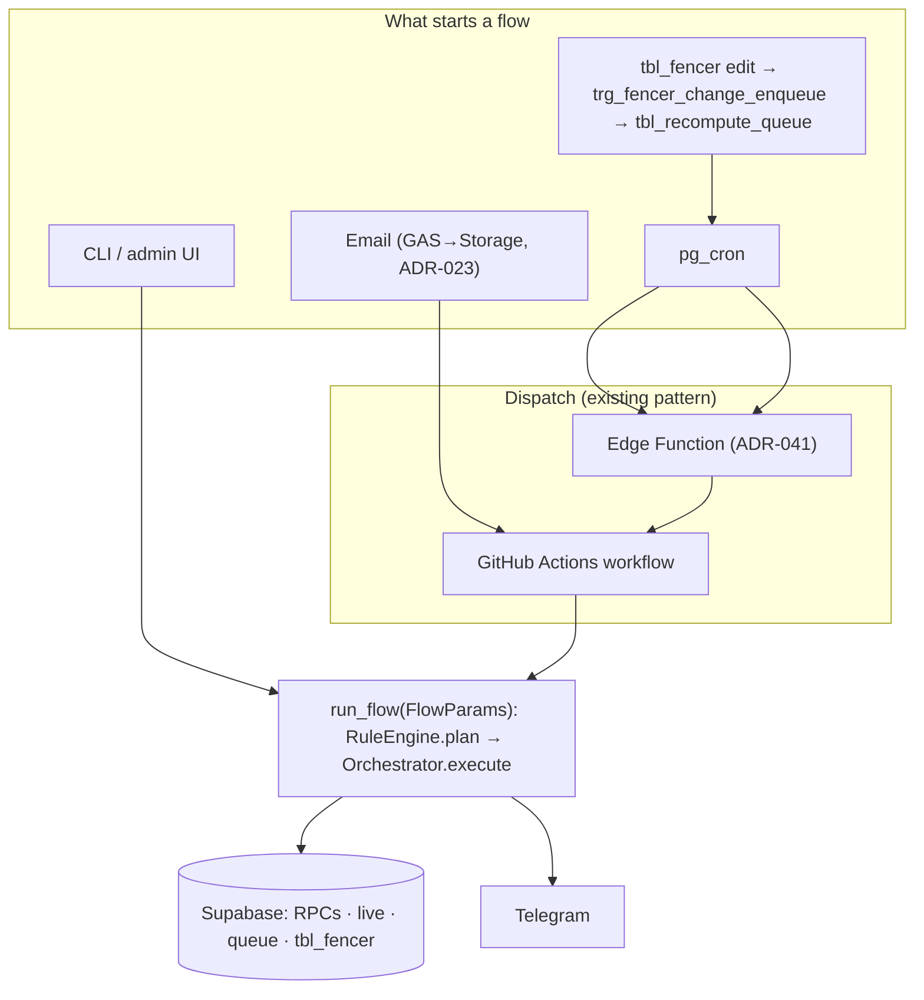

# Ingestion Pipeline — NEW Design (proposed)

**Status:** 🟡 **DESIGN / PROPOSED** — target architecture, not yet implemented.
**Supersedes:** the as-is map in [ingestion-pipeline-design.md](ingestion-pipeline-design.md) (keep that as the "current" reference until this lands).
**Shape:** a **rule-driven plugin pipeline**. Three layers, one direction:

> **RuleBook + RuleEngine → ExecutionPlan → Orchestrator → Plugins (incl. ResolveFencers) → CDC-triggered Recompute / Dedup**

The sequence of plugins for any scenario (a **Flow**) is resolved **declaratively, before execution**, by a rule
engine. A generic orchestrator then runs that plan **one direction only**, plugin by plugin. Each plugin
encapsulates one concern. Master-data governance + identity resolution is a single plugin — **`ResolveFencers`**
— that runs **early**, so every downstream structural step operates on a governed roster, not raw scrape data.
Corrections to master data **auto-recompute** the affected tournaments — re-deriving V-cats and re-scoring from stored data, no source re-fetch, no re-match.

> **DB schema is referenced, not detailed here** — see [Project Specification §9](Project%20Specification.%20SPWS%20Automated%20Ranklist%20System.md) and schema ADRs ([049](adr/049-joint-pool-split-flag.md), [050](adr/050-unified-ingestion-pipeline.md), [055](adr/055-ingest-traceability.md)). New objects (`tbl_recompute_queue`, `tbl_flow_rule`) are named; column detail is deferred to the implementing migration.

> **Markers:** ⚑ = **new** · ◑ = **changed** (existing logic reshaped into a plugin) · (unmarked) = reused as-is.

---

## 0. Legend — every abbreviation used in this document

### 0.1 Architecture terms (NEW design)
| Term | Meaning | Short description | Read more |
|------|---------|-------------------|-----------|
| **Plugin** ⚑ | unit of logic | a self-contained step implementing the `IngestPlugin` contract | §4.1, §5 |
| **Orchestrator** ⚑ | the runner | generic, domain-ignorant; executes a plan one-directionally | §4.2 |
| **Flow** ⚑ | named scenario | the 4 domestic flows: `INGEST_DOMESTIC`, `RECOMPUTE_DOMESTIC`, `DEDUP_SWEEP`, `POST_COMMIT` (international `FRESH_INGEST_INTERNATIONAL`/`EVF_SYNC` deferred §12) | §6 |
| **FlowParams** ⚑ | pre-execution inputs | everything knowable before running (flow, source, env, mode) | §4.3 |
| **Rule / RuleBook** ⚑ | declarative sequencing | a Rule = a named flow = ordered `Step`s; the RuleBook = `dict[Flow → Rule]` | §4.3, §6 |
| **RuleEngine** ⚑ | the planner | resolves `FlowParams → ExecutionPlan` before execution | §4.3 |
| **ExecutionPlan** ⚑ | resolved sequence | immutable, DAG-validated, inspectable ordered plugin list | §4.3 |
| **Context** ⚑ | forward payload | the data that flows one direction through plugins | §4.1 |
| **Services** ⚑ | injected deps | `db`, `config`, `matcher`, `notifier` handed to each plugin | §4.1 |
| **effects** ⚑ | side-effect declaration | `{}` pure / `master_data` / `live` / `external` | §4.1 |
| **Middleware** ⚑ | cross-cutting wrapper | timing, logging, provenance, escalate→Telegram, around every plugin | §4.4 |
| **Plugin kind** ⚑ | plugin type | one of Source / Gate / Transform / Mutator / Reactor | §4.1a |
| **Reactor** ⚑ | event-driven plugin kind | observes a signal → emits a Flow (e.g. `SelfHealing`) | §4.1a |
| **Signal** ⚑ | domain event | emitted by Mutators (`master_data.changed`, `live.committed`), observed by Reactors | §4.1a |
| **DAG validation** ⚑ | plan-time check | every `reads` key is produced by an earlier plugin's `writes` | §4.2 |
| **ResolveFencers** ⚑ | the roster plugin | owner of *name → governed fencer*; merged S0⊕S6; runs early | §5.1 |
| **MDM** ⚑ | Master Data Management | governing `tbl_fencer` as a deduplicated entity store | §5.1 |
| **CDC** ⚑ | Change Data Capture | trigger that records which events a master-data edit affects | §8 |
| **Recompute** ⚑ | re-derive from stored data | after a master-data change: re-derive V-cats + re-score the affected **event** (`RECOMPUTE_DOMESTIC`); **no source, no re-match** | [014](adr/014-delete-reimport-strategy.md), §8 |
| **Debounce / watermark** ⚑ | coalescing | wait N min after the last edit, then one recompute covers all queued events | §8 |
| **Fixpoint** ⚑ | convergence | recompute settles (change-gated trigger + idempotent recompute) | §8 |
| **Fault** ⚑ | recoverable problem | `ctx.fault(kind)` — never a halt; auto-resolved inline so the flow reaches Commit | §5.2, [074](adr/074-no-halt-fault-resolution.md) |
| **REMEDIATIONBOOK** ⚑ | fault policy | `dict[FaultKind → Remediation]` (RuleBook sibling): inline fix + escalation policy | §5.2, [074](adr/074-no-halt-fault-resolution.md) |
| **Escalate** ⚑ | the error plugin | post-commit Telegram, last resort, informational; never blocks | §5.2, [074](adr/074-no-halt-fault-resolution.md) |

### 0.2 Domain — tournament types & age categories
| Abbr. | Meaning | Short description | Read more |
|-------|---------|-------------------|-----------|
| SPWS | Polish Veterans Fencing Association | the org; its own data authority | [CLAUDE.md](../CLAUDE.md) |
| PPW / MPW | Puchar / Mistrzostwa Polski Weteranów | domestic individual cup / championship — admit **everyone** | [066](adr/066-min-participants-ingestion-gate.md) |
| PEW / MEW / MSW / PSW | European / World / Masters / World-cup veterans | international events — **POL-only** intake | [038](adr/038-evf-intake-polish-only.md), [008](adr/008-psw-msw-international-pool.md) |
| V0–V4 / V-cat | veteran age categories | 5 age bands, derived from birth year | [010](adr/010-age-category-by-birth-year.md), [056](adr/056-vcat-from-birthyear.md) |
| EPEE/FOIL/SABRE · M/F | weapons · genders | `enum_weapon_type` · `enum_gender_type` | Spec §9, [033](adr/033-fencer-gender-identity-enhancements.md) |

### 0.3 Data sources & external systems
| Abbr. | Meaning | Short description | Read more |
|-------|---------|-------------------|-----------|
| FTL · FT XML | FencingTimeLive · FencingTime XML | live API/CSV · offline export; primary domestic | [065](adr/065-ftl-per-fencer-vcat-marker-check.md), [067](adr/067-structural-pool-only-skip-unified-xml-ingest.md) |
| Engarde · 4Fence · Ophardt · Dartagnan | HTML/JSON providers | per-source scrapers | [scrapers/](../python/scrapers/) |
| EVF | European Veterans Fencing | calendar + API; **backup** source, parity-verified | [028](adr/028-evf-calendar-results-import.md), [053](adr/053-evf-parity-gate.md) |
| cert_ref · GAS · POL · FIE | snapshot · Google Apps Script · Poland · int'l federation | fallback parser · email bridge · nationality filter | [050](adr/050-unified-ingestion-pipeline.md), [023](adr/023-email-ingestion-gas-storage.md), [038](adr/038-evf-intake-polish-only.md) |

### 0.4 Architecture, formats & governance
| Abbr. | Meaning | Short description | Read more |
|-------|---------|-------------------|-----------|
| IR | Intermediate Representation | uniform `ParsedTournament`/`ParsedResult` every parser emits | [ir.py](../python/pipeline/ir.py), [050](adr/050-unified-ingestion-pipeline.md) |
| RPC · PL/pgSQL · FK | callable DB function · Postgres proc language · Foreign Key | identity by FK not name | [003](adr/003-identity-by-fk-not-name.md) |
| CLI · UUID · DOB/BY · DE | command line · unique id · birth date/year · double elimination | entry points · `run_id` · drives V-cat · scoring bonus | §7 |
| RapidFuzz · XML/CSV/XLSX/JSON/HTML | fuzzy lib · data formats | matcher · source artifact formats | [matcher/](../python/matcher/) |
| ADR · FR/NFR · UC · RTM | decision record · requirements · use case · traceability | the "why" + requirement map | [doc/adr/](adr/), Spec |
| TDD · pgTAP/pytest/vitest | test-first · test frameworks | DB / Python / frontend suites | [testing.md](claude/testing.md) |
| LOCAL/CERT/PROD · Telegram | three environments · bot | dev→cert→prod tiers · alerting (never Discord) | [011](adr/011-artifact-release-pipeline.md), [059](adr/059-telegram-document-delivery.md) |

---

## 1. Business Requirements (start here)

The pipeline keeps **30 sub-rankings** current from many incompatible sources, near-error-free because
**SPWS is its own authority**. The NEW design adds: **full automation** (no human gate), **master data as the
foundation**, and **self-healing** (a correction propagates automatically).

| # | Business rule | Where in the architecture | Why (ADR) |
|---|---------------|---------------------------|-----------|
| BR-1 | Ingest FTL, Engarde, 4Fence, Ophardt, FT XML, EVF API, CSV/XLSX/JSON, cert_ref | `ParseSource` plugin + `PARSERS` | [050](adr/050-unified-ingestion-pipeline.md) |
| BR-2 | Domestic (PPW/MPW) admit **everyone**; unmatched auto-created | `INGEST_DOMESTIC` → `ResolveFencers(intake=DOMESTIC)` | [020](adr/020-seed-generator-domestic-auto-create.md), **070** |
| BR-3 *(deferred §12)* | International (PEW/MEW/MSW) admit **POL-only** | `FRESH_INGEST_INTERNATIONAL` → `ResolveFencers(intake=INTERNATIONAL)` | [038](adr/038-evf-intake-polish-only.md) |
| BR-4 | Identity by durable **FK**, never name | `ResolveFencers`, `tbl_result.id_fencer` | [003](adr/003-identity-by-fk-not-name.md) |
| BR-5 | Age category from **birth year** + season | `ResolveFencers` governs BY; `SplitByAge`/`AssignFinalVcat` consume it | [010](adr/010-age-category-by-birth-year.md), [056](adr/056-vcat-from-birthyear.md) |
| BR-6 | Re-import **atomic & idempotent** | `Commit` plugin (atomic `fn_write_event`) | [014](adr/014-delete-reimport-strategy.md), [022](adr/022-ingestion-db-transaction.md) |
| BR-7 | Combined pools split + counted per V-cat | `SplitByAge`/`DetectJointPool`/`AssignFinalVcat`, commit RPC | [024](adr/024-combined-category-splitting.md), [049](adr/049-joint-pool-split-flag.md) |
| BR-8 | Min-participant check at **ingestion** — sub-min bracket **auto-dropped**, never halts | `ValidateCounts` plugin (fault `BELOW_MIN`) | [066](adr/066-min-participants-ingestion-gate.md), **074** |
| BR-9 | Every committed row carries **provenance** | `StampProvenance` middleware + history | [050](adr/050-unified-ingestion-pipeline.md), [055](adr/055-ingest-traceability.md) |
| **BR-10′** ⚑ | **No human review gate** — auto-decide by calibrated confidence; ties bias to create-then-dedup | `ResolveFencers` policy + auto-`Commit` | **ADR-070** |
| **BR-11′** ⚑ | **Master data is the foundation** — clean, deduped, BY-coherent roster, resolved **early** | `ResolveFencers` plugin + `DEDUP_SWEEP` flow | **ADR-071** |
| **BR-12** ⚑ | **A master-data change auto-recomputes the affected event**, debounced into one rerun | CDC trigger → `RECOMPUTE_DOMESTIC` flow | **ADR-072** |
| **BR-13** ⚑ | **Source retention** — re-ingest can use retained bytes when the live URL is dead (`source=retained`) | `ParseSource` (`source_artifact_path`) | [050](adr/050-unified-ingestion-pipeline.md), **ADR-072** |
| **BR-14** ⚑ | **Sequence is declarative & inspectable before execution** | RuleEngine → ExecutionPlan | **ADR-073** |
| **BR-15′** ⚑ | **No hard halt** — a domain problem auto-resolves inline (`REMEDIATIONBOOK`); flow always commits; Telegram escalation is informational last-resort | gates `ctx.fault` + `Escalate` plugin | **ADR-074** |

UC coverage: UC1–UC4, UC23–UC31 **minus** the manual-review gate (UC4 becomes an audit view, not a gate).

---

## 2. Guiding Principles

- **Rule-driven sequencing.** What runs, and in what order, is resolved from declarative rules **before**
  execution — not hardcoded. Adding a scenario = adding rules. — **ADR-073**
- **One direction.** Data flows forward through `Context`; a plugin never calls another plugin or the
  orchestrator. A fault does **not** stop forward motion — it is recorded and auto-resolved inline (below).
  Post-commit is a *separate* forward pass.
- **One concern per plugin, dependencies injected.** Single responsibility; all I/O via `Services`; testable
  in isolation. — **ADR-073**
- **Master data first — resolved first.** `ResolveFencers` runs *before* every structural step — even
  before `DetectCombinedPool` — so combined-pool detection, splitting, joint-pool detection, and V-cat
  assignment all operate on a **governed** roster (authoritative birth years), never raw scrape markers.
  Trust is established first, then consumed. — **ADR-071**
- **Full automation, asymmetric safety.** No human gate; bias every uncertain call toward the *recoverable*
  failure (create-new + later dedup) over the *unrecoverable* one (wrong link). — **ADR-070/071**
- **No hard halt — resolve-and-converge.** A domain problem is a `ctx.fault`, not a halt: the gate applies
  the explicit `REMEDIATIONBOOK` fix inline (drop a sub-min bracket, skip a pool round, accept-and-flag a
  count mismatch) and the flow **runs on to a committed state**. Telegram escalation is informational and
  last-resort, *after* commit. Only true infra `Abort` stops a run, and it is retried. — **ADR-074**, §5.2
- **Change-triggered idempotent recompute.** Master-data edits are the trigger; `RECOMPUTE_DOMESTIC`
  re-derives V-cats and re-scores the affected **event** from stored data (no source, no re-match); the loop
  converges to a fixpoint. — **ADR-072**, [014](adr/014-delete-reimport-strategy.md)
- **One IR · structural-over-regex · full traceability.** Unchanged. — [050](adr/050-unified-ingestion-pipeline.md)/[057](adr/057-pool-round-structural-detection.md)/[067](adr/067-structural-pool-only-skip-unified-xml-ingest.md)/[055](adr/055-ingest-traceability.md)

> ADR-051/054 do not exist. New: **ADR-070** (ResolveFencers / auto-resolution, no gate), **ADR-071** (MDM + dedup), **ADR-072** (CDC recompute), **ADR-073** (plugin + rule-engine architecture), **ADR-074** (no hard halt — fault resolution + Escalate). Amends [050](adr/050-unified-ingestion-pipeline.md) (stages → plugins; review gate removed) and [056](adr/056-vcat-from-birthyear.md) (Stage-0 absorbed into `ResolveFencers`); ADR-074 reverses the halt-by-exception model of [050](adr/050-unified-ingestion-pipeline.md)/[057](adr/057-pool-round-structural-detection.md)/[067](adr/067-structural-pool-only-skip-unified-xml-ingest.md) and amends [038](adr/038-evf-intake-polish-only.md)/[066](adr/066-min-participants-ingestion-gate.md)/[069](adr/069-participant-count-url-validator.md).

---

## 3. THE BIG CHART — three layers, plugins named, with ADRs

⚑ new · ◑ changed. `(ADR-NNN)` = why a node exists. Note `ResolveFencers` runs **first of the core**, even before `DetectCombinedPool`. The chart shows `INGEST_DOMESTIC`'s plugin order; `RECOMPUTE_DOMESTIC` reuses `AssignFinalVcat`+`Commit`, `DEDUP_SWEEP` runs `ResolveFencers` whole-roster, `POST_COMMIT` is the reactor-fired tail (§6). No node halts — faults auto-resolve inline (§5.2). International flows are deferred (§12).

```mermaid
flowchart TB
    %% ===== LAYER 1: RULE ENGINE (plan time) =====
    subgraph L1["1 · Rule Engine (plan time) — ADR-073"]
        direction TB
        RB["⚑ RuleBook — 4 domestic FLOWS + REMEDIATIONBOOK<br/>INGEST_DOMESTIC · RECOMPUTE_DOMESTIC · DEDUP_SWEEP · POST_COMMIT<br/>code-defined, optionally tbl_flow_rule per ADR-006"]
        FP["⚑ FlowParams (flow · source · env · organizer)"]
        RE["⚑ RuleEngine.plan(FlowParams)<br/>look up flow → prune steps by predicate → validate DAG"]
        EP["⚑ ExecutionPlan (ordered · immutable · inspectable)"]
        RB --> RE
        FP --> RE --> EP
    end

    %% ===== LAYER 2: ORCHESTRATOR (run time) =====
    subgraph L2["2 · Orchestrator (run time) — ADR-073"]
        ORC["⚑ execute(plan, ctx, svc)<br/>for each plugin: applies? → middleware(run) → trace<br/>faults auto-resolved inline · NEVER halts · ONE DIRECTION ONLY"]
        MW["⚑ middleware: Timing · Log ·<br/>StampProvenance (ADR-055) · EscalateToTelegram (ADR-059/074)"]
        MW -.wraps.-> ORC
    end

    %% ===== LAYER 3: PLUGINS (logic) — execution order =====
    subgraph L3["3 · Plugins (logic) — one concern each"]
        direction TB
        P1["ParseSource ⚑◑ · Source<br/>PARSERS dispatch + retain bytes (ADR-050)"]
        P2["ValidateIR ◑ · Gate<br/>structural + pool-only skip (ADR-067)"]
        P3["ResolveEvent ◑ · Transform<br/>event/season/organizer/domestic (ADR-025)"]
        P4["⭐ ResolveFencers ⚑◑ · Mutator (MERGED S0⊕S6 — runs FIRST of the core)<br/>exact→fuzzy(policy)→create · reconcile BY · alias writeback · dedup<br/>intake=DOMESTIC: create unmatched, V0 ok · emits master_data changed (ADR-003/010/020/056/064/070)"]
        P5["DetectCombinedPool ◑ · Transform<br/>from GOVERNED birth years (ADR-024)"]
        P6["SplitByAge ◑ · Transform<br/>group by GOVERNED birth year (ADR-024/047)"]
        P7["DetectJointPool ◑ · Transform<br/>siblings (ADR-049)"]
        P8["ValidateCounts ◑ · Gate<br/>count + min · sub-min bracket auto-dropped (ADR-052/066)"]
        P9["DetectPoolRound ◑ · Gate<br/>gender-mix · auto-skips bracket (ADR-057/063)"]
        P10["AssignFinalVcat ◑ · Transform<br/>V-cat from reconciled BY (ADR-056)"]
        P12["Commit ◑ · Mutator<br/>atomic delete-old+insert+score → live; emits live committed (ADR-014/022/049/055)"]
        P1-->P2-->P3-->P4-->P5-->P6-->P7-->P8-->P9-->P10-->P12
    end

    %% ===== REACTORS (event-driven, OUTSIDE the forward plan) =====
    subgraph RX["⚑ Reactors — observe a signal, emit a Flow (ADR-072)"]
        SH["⚑ SelfHealing (kind: Reactor)<br/>on master_data.changed → emits RECOMPUTE_DOMESTIC (debounced)<br/>impl: trg_fencer_change_enqueue → tbl_recompute_queue → worker"]
        PCR["PostCommit (kind: Reactor)<br/>on live.committed → emits POST_COMMIT"]
    end

    %% ===== POST_COMMIT flow (domestic members) =====
    subgraph PC["POST_COMMIT flow (domestic)"]
        PCx["ParticipantCount (ADR-069) →<br/>Notify + Escalate last resort (ADR-059/074)"]
    end

    %% ===== STATE =====
    LIVE[("LIVE: tbl_tournament / tbl_result → ranking views (auto-reflect)")]
    ROSTER[("tbl_fencer — governed roster")]
    EDITM["manual tbl_fencer edit / DEDUP_SWEEP"]

    EP --> ORC --> L3
    ROSTER --> P4
    P4 -. mutates and emits master_data changed .-> ROSTER
    P4 -. governed BY .-> P5
    P12 --> LIVE
    P12 -. emits live committed .-> PCR
    PCR -. emits POST_COMMIT flow .-> PC
    ROSTER -. master_data changed .-> SH
    EDITM -. master_data changed .-> SH
    SH -. emits RECOMPUTE_DOMESTIC per event .-> EP
```



---

## 4. Architecture core

### 4.1 The plugin contract

```python
class IngestPlugin(Protocol):
    name:    str
    reads:   frozenset[str]    # Context keys consumed
    writes:  frozenset[str]    # Context keys produced — and the ONLY keys it may write
    effects: frozenset[str]    # side-effects: {} pure | {"master_data"} | {"live"} | {"external"}

    def applies(self, ctx: Context) -> bool: ...        # explicit "if needed" guard (data-derived)
    def run(self, ctx: Context, svc: Services) -> None: # forward-only; write only declared keys; idempotent
        ...                                             # ctx.fault(kind, detail) → auto-resolve inline + keep going; ctx.warn(...) soft note
```

**Invariants (what makes it maintainable + safely re-runnable):**

| Invariant | Buys |
|-----------|------|
| Forward-only (no plugin calls another / the orchestrator) | one-directional flow; no hidden coupling |
| Write-discipline (only keys in `writes`) | plugins can't clobber each other; declarations stay honest |
| Effects honesty (`effects` declared) | recompute reasons about what re-runs; signals know which Mutator fired |
| Idempotent / deterministic | recompute & re-ingest are safe; self-healing loop converges |
| Dependency injection (I/O via `svc`) | trivially mockable; swap matcher for a calibration variant |

**Outcomes** recorded in `ctx.trace`: **RAN** · **SKIPPED** (`applies()` false) · **FAULT** (`ctx.fault` — auto-resolved inline per the `REMEDIATIONBOOK` rule, **flow continues**). Plus `ctx.warn()` soft diagnostics. A flow aborts **only** on a true infra `Abort` (DB down), which is retried — never a human gate.

`Context` = the forward payload (IR + accumulated keys + trace + warnings). `Services` = injected `db`, `config`, `matcher`, `calibration`, `notifier`.

### 4.1a Plugin kinds (types)

Every plugin declares a `kind`. The kind determines its contract and where it runs.

| Kind | Runs | Contract | Members |
|------|------|----------|---------|
| **Source** | first, in the plan | produces the initial Context | `ParseSource`, `LoadCommitted` |
| **Gate** | in the plan | pure check; records `ctx.fault`, **never halts** (ADR-074) | `ValidateIR`, `ValidateCounts`, `DetectPoolRound`, `ParticipantCount` |
| **Transform** | in the plan | pure; enriches Context; records `ctx.fault` if underivable | `ResolveEvent`, `DetectCombinedPool`, `SplitByAge`, `DetectJointPool`, `AssignFinalVcat` |
| **Mutator** | in the plan | persists state and **emits a signal** | `ResolveFencers`, `Commit`, `Notify`, `Escalate` (deferred §12: `PewCascade`, `EvfParity`) |
| **Reactor** | **outside** the plan | **observes a signal → emits a Flow** | **`SelfHealing`**, `PostCommit` |

**The event seam:** *Mutators emit signals; Reactors turn signals into Flows.* This is how the loop closes
with **no back-edges** in the forward pipeline — `ResolveFencers` (Mutator) emits `master_data.changed`;
`SelfHealing` (Reactor) observes it and emits `Flow.RECOMPUTE_DOMESTIC`.

Reactors use a different contract from forward-flow plugins (`on`/`emits`/`react` instead of `reads`/`writes`/`run`):

```python
class Reactor(Protocol):           # kind = REACTOR — event-driven, not in the forward plan
    name:  str
    on:    frozenset[str]          # signals observed, e.g. {"master_data.changed"}
    emits: Flow                    # the flow it triggers, e.g. Flow.RECOMPUTE_DOMESTIC
    def react(self, signal: Signal, svc: Services) -> None: ...   # (debounced) → run_flow(emits, …)
```

`SelfHealing.on = {"master_data.changed"}`, `emits = RECOMPUTE_DOMESTIC` — its implementation is the CDC trigger +
`tbl_recompute_queue` + debounced worker (§8), exactly as `Commit`'s implementation is an RPC.
`PostCommit.on = {"live.committed"}`, `emits = POST_COMMIT`.

### 4.2 The orchestrator (generic, domain-ignorant)

```python
class Orchestrator:
    def execute(self, plan: ExecutionPlan, ctx: Context, svc: Services) -> Context:
        for plugin in plan.plugins:
            if not plugin.applies(ctx):
                ctx.trace.skipped(plugin.name); continue
            try:
                compose(self.middleware, plugin.run)(ctx, svc)   # cross-cutting wraps pure plugin
                ctx.trace.ran(plugin.name)                       # plugins call ctx.fault() internally; never halts here
            except Abort as a:
                ctx.abort(plugin.name, a); break                 # ONLY genuine infra failure (retried, no human gate)
        return ctx                                               # always reaches Commit; faults auto-resolved inline
```

`ExecutionPlan.validate_dag()` (run at plan time, §4.3) guarantees every plugin's `reads` were produced by an earlier plugin's `writes` — **mis-ordering fails before a single row is touched.**

### 4.3 The rule engine (sequence resolved before execution)

```python
class Flow(str, Enum):
    # ── Full domestic automated pipeline (first-run scope) ──
    INGEST_DOMESTIC="ingest_domestic"; RECOMPUTE_DOMESTIC="recompute_domestic"
    DEDUP_SWEEP="dedup_sweep"; POST_COMMIT="post_commit"
    # ── Deferred — international only (§12): FRESH_INGEST_INTERNATIONAL, EVF_SYNC ──

@dataclass(frozen=True)
class FlowParams:                       # everything knowable BEFORE execution
    flow: Flow; source_kind: SourceKind | None = None
    environment: str = "LOCAL"; organizer_hint: str | None = None

# A RULE = a named FLOW = an ordered sequence of plugin calls (the RuleBook, §6).
@dataclass(frozen=True)
class Step:
    plugin: str                                     # name → looked up in the PLUGINS registry
    when:   Callable[[FlowParams], bool] = always   # PLAN-TIME gate on FlowParams
    params: dict = field(default_factory=dict)      # plugin params, e.g. source="retained"

@dataclass(frozen=True)
class Rule:
    flow: Flow; description: str
    steps: tuple[Step, ...]                          # ORDER = execution order

class RuleEngine:                       # executes a RULE from the RuleBook
    def plan(self, params: FlowParams) -> ExecutionPlan:
        rule  = self.rulebook[params.flow]                  # look up the named FLOW
        steps = [s for s in rule.steps if s.when(params)]   # plan-time pruning
        plan  = ExecutionPlan(params, rule.flow, steps, self.plugins)
        plan.validate_dag(self.plugins)                     # reads ⊆ earlier writes; fail fast
        return plan                                         # immutable · inspectable · loggable
```

`plan.describe()` prints the resolved sequence without running anything — sequence is *determined before execution*, testable on its own ("flow X with params Y ⇒ plugins Z").

### 4.4 Middleware (cross-cutting, keeps plugins pure)

`Timing` · `StructuredLog` · `StampProvenance` ([055](adr/055-ingest-traceability.md)) · `EscalateToTelegram` ([059](adr/059-telegram-document-delivery.md)/**074**). Each wraps every `plugin.run`, so plugins stay pure domain logic.

---

## 5. Plugin catalog (execution order)

| Plugin | Kind | `applies()` | `effects` | Encapsulates | Fault → auto-resolution (ADR-074) | ADR |
|--------|------|-------------|-----------|--------------|-----------------------------------|-----|
| `ParseSource` ⚑◑ | Source | always | pure (+retain) | `PARSERS` dispatch, source retention | — | [050](adr/050-unified-ingestion-pipeline.md) |
| `ValidateIR` ◑ | Gate | always | pure | structural checks, pool-only skip | `IR_INVALID` → skip artifact; `POOL_ROUND` → skip bracket | [067](adr/067-structural-pool-only-skip-unified-xml-ingest.md) |
| `ResolveEvent` ◑ | Transform | always | pure (db read) | event/season/organizer/domestic | `EVENT_NOT_RESOLVED` → Abort + escalate (cannot ingest into a nonexistent event) | [025](adr/025-event-centric-ingestion-telegram.md) |
| **`ResolveFencers`** ⭐⚑◑ | **Mutator** | always; `intake` param | **`master_data`** | **merged S0⊕S6**, runs first of the core — owns *name → governed fencer* (see §5.1); obeys the flow's **`intake`** param (DOMESTIC; INTERNATIONAL deferred §12 — no internal organizer branch); **emits `master_data.changed`** | none on domestic (V0 allowed); intl V0-exclusion deferred §12 | [003](adr/003-identity-by-fk-not-name.md)/[010](adr/010-age-category-by-birth-year.md)/[020](adr/020-seed-generator-domestic-auto-create.md)/[056](adr/056-vcat-from-birthyear.md)/[064](adr/064-asymmetric-gender-filter-matcher.md)/**070** |
| `DetectCombinedPool` ◑ | Transform | always | pure | multi-V-cat detection from **governed** BY spread | — | [024](adr/024-combined-category-splitting.md) |
| `SplitByAge` ◑ | Transform | combined only | pure (db read) | group rows by **governed** birth year (`fn_age_categories_batch`) | `SPLITTER_UNRESOLVED` → keep combined + escalate | [024](adr/024-combined-category-splitting.md)/[047](adr/047-vcat-invariant-trigger-and-splitter-consolidation.md) |
| `DetectJointPool` ◑ | Transform | siblings/override | pure | sibling grouping | — | [049](adr/049-joint-pool-split-flag.md) |
| `ValidateCounts` ◑ | Gate | always | pure (url read) | count + min-participants (from `event.is_domestic`) + URL→data | `BELOW_MIN` → drop bracket; `COUNT_MISMATCH`/`URL_DATA_MISMATCH` → accept + escalate | [052](adr/052-url-data-validation.md)/[066](adr/066-min-participants-ingestion-gate.md) |
| `DetectPoolRound` ◑ | Gate | always | pure (db read) | structural gender-mix | `POOL_ROUND` → skip bracket | [057](adr/057-pool-round-structural-detection.md)/[063](adr/063-polish-plural-and-grupy-zbiorcze.md) |
| `AssignFinalVcat` ◑ | Transform | always | pure | per-result V-cat from reconciled BY | — | [056](adr/056-vcat-from-birthyear.md) |
| `Commit` ◑ | **Mutator** | always | `live` | **atomic delete-old + insert + score → live** (idempotent, no draft); **emits `live.committed`** | — | [014](adr/014-delete-reimport-strategy.md)/[022](adr/022-ingestion-db-transaction.md)/[049](adr/049-joint-pool-split-flag.md)/[055](adr/055-ingest-traceability.md) |

**Reactors (kind: Reactor — event-driven, run *outside* the forward plan):**
`SelfHealing` — on `master_data.changed` → emits `Flow.RECOMPUTE_DOMESTIC` (debounced; impl = CDC trigger + `tbl_recompute_queue` + worker, §8). The trigger is **column-aware**: BY / merge / nationality → `RECOMPUTE_DOMESTIC`; name/alias edits → no historical action (FK is durable) — **ADR-072** ·
`PostCommit` — on `live.committed` → emits `Flow.POST_COMMIT`.

**POST_COMMIT flow plugins (domestic):** `ParticipantCount` (Gate, [069](adr/069-participant-count-url-validator.md) — now a **fault**, not a halt, per **ADR-074**) · `Notify` (Mutator/external, [059](adr/059-telegram-document-delivery.md)) · `Escalate` (Mutator/external — Telegram last resort, **ADR-074**). Deferred (§12): `PewCascade` ([046](adr/046-pew-weapon-suffix.md)), `EvfParity` ([053](adr/053-evf-parity-gate.md)).

**`RECOMPUTE_DOMESTIC` source:** `LoadCommitted` (Source) — loads the affected **event's** stored, FK-linked results across its V-cat brackets for re-derivation (no fetch, no re-match).

### 5.1 `ResolveFencers` — the heart (merged S0⊕S6, runs early)

`ResolveFencers` owns the `tbl_fencer` entity store; resolving a result row to an FK is a side-output of
governing that store. **It runs first of the core steps — even before `DetectCombinedPool`** — so
combined-pool detection, splitting, joint-pool detection, and V-cat assignment all consume *governed*
birth years, not raw scrape markers. Because it precedes them, its own per-row V-cat comes from
`category_hint` / per-fencer `raw_age_marker` / source birth year — **not** from `splits`. Two internal
phases (still *one* plugin — all name→fencer logic in one maintainable place):

```
authoritative vcat(r) = category_hint  (single-cat bracket)
                      || per-fencer raw_age_marker (combined-pool FTL markers)
                      || vcat_of(source birth_year)            # NOT splits — SplitByAge runs later

PHASE A — settle the roster (exact only, high precision):
  id = exact_match(r)                         # post-fold equality (ADR-003) — ~0 false positives
  if id: AUTO_MATCHED(exact); if vcat conflicts stored BY → reconcile to band midpoint (ADR-056)

PHASE B — resolve the remainder (fuzzy, against the now-reconciled roster):
  best = find_best_match(r, age=vcat, bracket_gender=parsed.gender)          # ADR-064 — domestic: gender-filter on
  if best.conf ≥ AUTO_LINK_THRESHOLD and age-band+gender corroborate:
      link; AUTO_MATCHED(fuzzy); fn_update_fencer_aliases(id, r.name)        # exact next run
  else: create_fencer(by = midpoint(vcat)); AUTO_CREATED                     # ADR-020 — domestic admits everyone, V0 ok
  # DEFERRED §12 (intake=INTERNATIONAL): bracket_gender=None; vcat==V0 → ctx.fault(V0_EXCLUDE) drops the row (ADR-038/074 — exclusion, NOT a halt); UNMATCHED → EXCLUDED
→ writes ctx.matches (row → id_fencer + governed birth_year + method + confidence); effects: master_data
```

- **Why first:** every downstream structural decision (`DetectCombinedPool`, `SplitByAge`, `DetectJointPool`, `AssignFinalVcat`) then consumes the **governed** birth year `ResolveFencers` emits. In particular `DetectCombinedPool` detects combined-ness from the governed BY spread rather than from source age markers — more robust for events whose source omitted markers (the fencers' governed BYs are still known), and it removes the failure mode of splitting on a wrong scraped BY (which would otherwise need a human to fix → defeats full automation).
- **Why two phases:** exact matches settle birth years *before* any fuzzy tiebreak relies on them.
- **Asymmetric safety:** a wrong link is unrecoverable corruption (BR-9); a duplicate is recoverable by the dedup sweep. Bias to create-over-uncertain-link.
- **Same code, two entry points:** the per-bracket `ResolveFencers` plugin and the whole-roster `DEDUP_SWEEP` flow run the *same* dedup/reconcile logic — there is **no separate MDM subsystem**.
- **Triggers self-healing:** because its `effects` is `master_data`, every create/merge/reconcile fires the CDC trigger (§8).

### 5.2 No-halt fault resolution — the `REMEDIATIONBOOK` + `Escalate`

The pipeline **never hard-halts** on a domain problem. A gate/transform that hits one calls
`ctx.fault(kind, detail)`; the orchestrator does **not** stop. The fault is resolved by an explicit,
declarative policy — the **`REMEDIATIONBOOK`** (a sibling of the RuleBook, so error policy stays out of
hidden `if`s inside plugins) — applied **inline**, so the flow runs on to `Commit`. Only `Abort` (genuine
infra failure, e.g. DB down) breaks a run, and it is retried — never gated by a human.

```python
class FaultKind(str, Enum):
    BELOW_MIN; COUNT_MISMATCH; POOL_ROUND; SPLITTER_UNRESOLVED; IR_INVALID; URL_DATA_MISMATCH

class Escalation(str, Enum):  NEVER; ON_LOSS; ALWAYS    # when to Telegram — informational, last resort

@dataclass(frozen=True)
class Remediation:
    auto:     Callable        # deterministic inline fix: drop_bracket / skip_bracket / accept_parsed / ...
    escalate: Escalation      # last-resort Telegram, AFTER the event has committed

# Domestic policy — small and explicit. No V0 rule here: domestic admits V0 (V0-exclusion is international, §12).
REMEDIATIONBOOK = {
  FaultKind.BELOW_MIN:           Remediation(auto=drop_bracket,   escalate=ON_LOSS),  # ADR-066
  FaultKind.POOL_ROUND:          Remediation(auto=skip_bracket,   escalate=ON_LOSS),  # ADR-057/063
  FaultKind.COUNT_MISMATCH:      Remediation(auto=accept_parsed,  escalate=ALWAYS),   # ADR-052/069 — needs eyes
  FaultKind.URL_DATA_MISMATCH:   Remediation(auto=accept_parsed,  escalate=ALWAYS),   # ADR-052
  FaultKind.SPLITTER_UNRESOLVED: Remediation(auto=keep_combined,  escalate=ALWAYS),   # rare: governed BY should prevent it
  FaultKind.IR_INVALID:          Remediation(auto=skip_artifact,  escalate=ALWAYS),   # ADR-067
}
```

- **`Escalate`** — the "error plugin" (Mutator, `effects: external`). It runs **last**, as part of
  `POST_COMMIT`'s `Notify`, *after* the event is already committed in its best automatically-resolved state.
  It sends a Telegram message **only** for faults whose policy is `ALWAYS`, or `ON_LOSS` when the inline fix
  actually dropped data. It asks a human to look — it **never blocks** the pipeline.
- **Self-healing is the other half.** A problem that needs a *different flow* (a master-data correction →
  re-derive an event) is **not** a fault — it travels the Mutator→signal→Reactor seam (`master_data.changed`
  → `SelfHealing` → `RECOMPUTE_DOMESTIC`, §8). Faults fix the *current* run inline; self-healing fixes
  *other* events asynchronously. Together: full automation, no gate. — **ADR-070/074**

---

## 6. The RuleBook — the domestic pipeline (4 flows)

A **Rule** is a named **FLOW**: an ordered sequence of plugin calls that encodes one piece of business
logic. The **RuleBook** is the set of *all flows we support* — it is the executable statement of the
business logic. It references plugins by name from a separate **PLUGINS** registry (the "plugin list" — each
plugin defined once, §5). The RuleEngine executes a flow by looking up its Rule and running its steps.

### 6.1 Two registries (RuleBook ≠ plugin list)

```python
# PLUGINS — each plugin defined ONCE (kind + contract). The "plugin list" = §5 catalog.
PLUGINS: dict[str, PluginSpec] = { "ParseSource": PluginSpec("ParseSource", kind=Source, ...), ... }

# A RULE = a named FLOW = an ordered sequence of plugin calls.
@dataclass(frozen=True)
class Step:
    plugin: str                                     # name → looked up in PLUGINS
    when:   Callable[[FlowParams], bool] = always   # PLAN-TIME gate (FlowParams)
    params: dict = field(default_factory=dict)      # plugin params, e.g. source="retained"

@dataclass(frozen=True)
class Rule:
    flow: Flow; description: str
    steps: tuple[Step, ...]                          # ORDER = execution order

RULEBOOK: dict[Flow, Rule] = { ... }                 # ALL supported flows (§6.2)
```

### 6.2 The RuleBook — the domestic pipeline (4 flows)

The full domestic automated pipeline is **four flows + two reactors**. No human gate anywhere; every
gate auto-resolves inline (§5.2) so each flow always reaches `Commit`. The international flows are
deferred (§12) — none of them can touch a domestic event.

```python
RULEBOOK = {

  # ── 1. Keep the active season current ────────────────────────────────────
  Flow.INGEST_DOMESTIC: Rule(Flow.INGEST_DOMESTIC,
    "Ingest an active-season SPWS (PPW/MPW) event: admit everyone, auto-create unmatched, V0 "
    "allowed, combined pools split + counted per V-cat. Never halts — gates auto-resolve inline.",
    steps=(
      Step("ParseSource"),          # Source — source="live" (default) | "retained" (dead URL)
      Step("ValidateIR"),           # Gate  — structural; auto-skips a pool-only/unrankable bracket
      Step("ResolveEvent"),         # Transform — event/season/organizer; sets is_domestic
      Step("ResolveFencers", params={"intake": "DOMESTIC"}),  # Mutator — exact→fuzzy→create; reconcile BY; gender-filter on; emits master_data.changed
      Step("DetectCombinedPool"),   # Transform — from GOVERNED birth years
      Step("SplitByAge"),           # Transform — applies() only if combined
      Step("DetectJointPool"),      # Transform — sibling grouping (ADR-049)
      Step("ValidateCounts"),       # Gate  — min from event.is_domestic; sub-min bracket auto-dropped, never halts
      Step("DetectPoolRound"),      # Gate  — auto-skips a gender-mixed pool round, never halts
      Step("AssignFinalVcat"),      # Transform — per-result V-cat from reconciled BY
      Step("Commit"),               # Mutator — atomic delete-old + insert + score → live; emits live.committed
    )),

  # ── 2. Self-heal an event after a birth-year / identity correction ────────
  Flow.RECOMPUTE_DOMESTIC: Rule(Flow.RECOMPUTE_DOMESTIC,
    "Re-derive + re-score an AFFECTED EVENT after a master-data change. Event-granular: a BY change "
    "can relocate a result between the event's V-cat brackets, so the whole event is the unit (a "
    "single bracket can't absorb a relocation — the moving result is stored under its OLD bracket). "
    "Works from stored, FK-linked results — no source, no re-match. Never halts. Auto-fired by the "
    "SelfHealing reactor on master_data.changed.",
    steps=(
      Step("LoadCommitted"),        # Source — ALL of the event's FK-linked results across its V-cat brackets (+ stored joint-pool flags + is_domestic)
      Step("AssignFinalVcat"),      # Transform — re-derive each result's V-cat from the corrected BY (re-partitions the event)
      Step("ValidateCounts"),       # Gate  — sub-min bracket auto-dropped, never halts
      Step("Commit"),               # Mutator — re-partition into V-cat brackets (create/drop), recount, re-score; emits live.committed
    )),

  # ── 3. Whole-roster dedup + BY reconcile (the source of self-healing) ─────
  Flow.DEDUP_SWEEP: Rule(Flow.DEDUP_SWEEP,
    "Whole-roster master-data maintenance: dedup duplicate fencers + reconcile conflicting birth "
    "years. Each merge/reconcile emits master_data.changed, which the SelfHealing reactor turns into "
    "RECOMPUTE_DOMESTIC for every affected event — the sort IS the rebuild.",
    steps=(
      Step("ResolveFencers", params={"scope": "whole_roster"}),   # Mutator — fn_merge_fencers; emits master_data.changed
      Step("Notify"),                                             # Mutator/external
    )),

  # ── 4. Validate + notify after every commit (fired by PostCommit reactor) ─
  Flow.POST_COMMIT: Rule(Flow.POST_COMMIT,
    "Fired by the PostCommit reactor on live.committed — from BOTH INGEST_DOMESTIC and "
    "RECOMPUTE_DOMESTIC, so ParticipantCount re-validates after a recompute too. Validates and notifies.",
    steps=(
      Step("ParticipantCount"),     # Gate  — URL participant-count validator (ADR-069); fault auto-flags, never halts
      Step("Notify"),               # Mutator/external — Telegram summary; Escalate if a fault needs eyes
    )),
}
```

### 6.3 Plan-time vs run-time conditionality (two levers, kept apart)

- **`Step.when`** gates at **plan time** on `FlowParams` (knowable before execution) — e.g. a step that runs only `when organizer_hint == "EVF"` (used by the deferred international flows, §12). No domestic step is plan-time-gated; `when` exists for the deferred flows. The RuleEngine drops a non-matching step from the plan entirely.
- **`plugin.applies(ctx)`** gates at **run time** on `Context` data (only knowable after parsing) — e.g. `SplitByAge` only when the resolved pool is combined. The step is in the plan; the orchestrator SKIPs it.

The RuleBook lists every step that *could* run; `when` prunes before, `applies()` prunes during.

### 6.4 Resolved plans (engine output, before execution)

| Flow | `RuleEngine.plan(...)` → ExecutionPlan |
|------|----------------------------------------|
| `INGEST_DOMESTIC` | Parse → ValidateIR → ResolveEvent → **ResolveFencers(DOMESTIC)** → DetectCombinedPool → SplitByAge → DetectJointPool → ValidateCounts → DetectPoolRound → AssignFinalVcat → Commit |
| `RECOMPUTE_DOMESTIC` | LoadCommitted (whole event) → AssignFinalVcat → ValidateCounts → Commit (re-partition + recount + re-score affected event; no source, no re-match) |
| `DEDUP_SWEEP` | ResolveFencers (whole-roster) → Notify |
| `POST_COMMIT` | ParticipantCount → Notify (fired by PostCommit reactor on live.committed — from both INGEST_DOMESTIC and RECOMPUTE_DOMESTIC) |

> **Self-healing loop:** `DEDUP_SWEEP` (or a BY reconcile inside `INGEST_DOMESTIC`) emits `master_data.changed` → `SelfHealing` reactor → `RECOMPUTE_DOMESTIC` per affected event → its `Commit` emits `live.committed` → `PostCommit` reactor → `POST_COMMIT`. No back-edges; `Commit`'s `effects=live` (not `master_data`) is what makes the loop converge.
> Re-ingesting an existing event (corrected source, or new parse/match logic) is just `INGEST_DOMESTIC` run again — `Commit` is idempotent (delete-old + insert). Pass `source=retained` only when the live URL is dead.
> Deferred international flows (`FRESH_INGEST_INTERNATIONAL`, `EVF_SYNC`) — see §12.

### 6.5 Example execution traces

**Flow A — INGEST_DOMESTIC, single-cat PPW (FTL):**
```
FlowParams(INGEST_DOMESTIC, source=FTL, env=LOCAL, organizer="SPWS")
ParseSource RAN · ValidateIR RAN · ResolveEvent RAN(domestic)
ResolveFencers RAN(10 exact, 1 reconciled BY, 1 created → matches[] with governed BY)
DetectCombinedPool RAN(False — governed BYs all V2) · SplitByAge SKIPPED(applies=False) · DetectJointPool RAN
ValidateCounts RAN · DetectPoolRound RAN · AssignFinalVcat RAN · Commit RAN → live (atomic) → emits live.committed
→ PostCommit reactor → POST_COMMIT: ParticipantCount RAN · Notify RAN(Telegram)
```

**Flow B — INGEST_DOMESTIC, a bracket falls below min (NO HALT):**
```
... ValidateCounts RAN → PPW3-V4-foil-F has 2 entries < min → ctx.fault(BELOW_MIN)
    → REMEDIATIONBOOK: auto-drop that bracket, escalate=ON_LOSS → CONTINUE
AssignFinalVcat RAN(remaining brackets) · Commit RAN → live (atomic)
→ POST_COMMIT: ParticipantCount RAN · Notify RAN(Telegram: "PPW3-V4-foil-F dropped 2<min — FYI, last resort")
Flow COMPLETED. No halt, no sign-off, no human gate.
```

**Flow C — RECOMPUTE_DOMESTIC after a birth-year correction (self-healing):**
```
Edit tbl_fencer: 1 fencer BY moves V2→V3 → trg enqueues affected EVENT {PPW4} (dedup by id_event)
→ DEBOUNCE_WINDOW quiet → worker claims batch
run_flow(RECOMPUTE_DOMESTIC, event=PPW4) → LoadCommitted(ALL PPW4 results across its V-cat brackets)
  → AssignFinalVcat(this fencer now V3) → ValidateCounts(no bracket below min) → Commit
  → result re-partitioned out of V2-épée-M into V3-épée-M (bracket created if absent); both recounted + re-scored
  → Commit effects=live (NOT master_data) ⇒ does not re-trigger SelfHealing ⇒ loop converges. No source, no re-match.
→ POST_COMMIT: ParticipantCount RAN · Notify RAN(Telegram) → loop quiesces
```

**Flow D — DEDUP_SWEEP (bootstrap & maintenance):**
```
FlowParams(DEDUP_SWEEP) → plan = ResolveFencers(whole_roster) → Notify
ResolveFencers RAN(merges 4 dup pairs via fn_merge_fencers) → emits master_data.changed → SelfHealing enqueues affected events
→ RECOMPUTE_DOMESTIC auto-runs per affected event. The sort IS the rebuild.
```

---

## 7. Code-chunk reference (proposed file layout)

| Path | Kind | Role |
|------|------|------|
| `python/pipeline/core/contract.py` ⚑ | new | `IngestPlugin`, `Context`, `Services`, `Halt`, `Middleware` |
| `python/pipeline/core/orchestrator.py` ◑ | reshaped | `Orchestrator.execute`, `compose`, trace |
| `python/pipeline/engine/rulebook.py` ⚑ | new | `RULEBOOK` (`dict[Flow → Rule]`) + `PLUGINS` registry — the flows & plugin specs |
| `python/pipeline/engine/rule_engine.py` ⚑ | new | `RuleEngine.plan`, `ExecutionPlan`, `validate_dag` |
| `python/pipeline/engine/flows.py` ⚑ | new | `Flow`, `FlowParams` |
| `python/pipeline/plugins/*.py` ⚑◑ | reshaped | one module per plugin (`parse_source`, `validate_ir`, …, `resolve_fencers`, …, `commit`) |
| `python/pipeline/plugins/post_commit/*.py` ◑ | reshaped | `pew_cascade`, `evf_parity`, `participant_count`, `notify` |
| `python/pipeline/middleware/*.py` ⚑ | new | `timing`, `structured_log`, `stamp_provenance`, `halt_to_telegram` |
| `python/pipeline/run.py` ⚑ | new | `run_flow(params, ctx, svc)` — the single entry point |
| `python/pipeline/recompute/worker.py` ⚑ | new | debounced queue drainer → `run_flow(RECOMPUTE_DOMESTIC)` |
| `matcher/` · `scrapers/` · `db_connector.py` | reused | matcher, parsers (+`source_artifact_path`), DB I/O — see [current §6/§6.1](ingestion-pipeline-design.md#6-code-chunk-reference-table) |

**New DB objects:** `tbl_recompute_queue`, `trg_fencer_change_enqueue`, `fn_enqueue_affected_events`, `fn_merge_fencers`, optional `tbl_flow_rule`. `Commit` writes live atomically via `fn_write_event` (delete-old + insert + score in one transaction, ADR-022). **The draft tables and the `fn_commit_event_draft` / `fn_discard_event_draft` / `fn_dry_run_event_draft` RPCs are removed — there is no review gate to stage for.** Existing RPCs (`fn_calc_tournament_scores`, `fn_age_categories_batch`, `fn_update_fencer_aliases`) reused unchanged.

**Data sources** (acquisition + parser per source) are unchanged — see [current design §6.1](ingestion-pipeline-design.md#61-data-sources--what-they-are-how-they-are-sourced-and-which-code-implements-them). Only addition: `ParseSource` persists `source_artifact_path` so a dead-URL event can be re-ingested from retained bytes (`source=retained`, BR-13). `LoadCommitted` (`RECOMPUTE_DOMESTIC`'s source) reads stored results, not artifacts.

---

## 8. Deployment & triggers — putting the chain into action

Every scenario funnels through one entry point — `run_flow(params, ctx, svc)` (§4 → resolves a plan →
executes it). Deployment is therefore mostly **wiring triggers to flows**, reusing existing infrastructure
(GitHub Actions, pg_cron, Edge-Function dispatch [ADR-041](adr/041-edge-function-dispatch.md), Telegram, three-tier release [ADR-011](adr/011-artifact-release-pipeline.md)).



| Trigger | Flow | Mechanism |
|---------|------|-----------|
| Operator CLI / UI button | `INGEST_DOMESTIC` | `python -m pipeline.run --flow ingest_domestic …` |
| Email with results (SPWS) | `INGEST_DOMESTIC` | GAS → Storage → `ingest` workflow → `run_flow` ([023](adr/023-email-ingestion-gas-storage.md)) |
| `tbl_fencer` edited (BY / merge / nationality) | `RECOMPUTE_DOMESTIC` (per affected event) | CDC trigger → queue → **debounced** worker via pg_cron → Edge Function ([041](adr/041-edge-function-dispatch.md)) |
| Scheduled | `DEDUP_SWEEP` | pg_cron / scheduled GitHub Action |
| Every `live.committed` | `POST_COMMIT` | `PostCommit` reactor fires a separate post-commit run |
| *Deferred (§12)* | `EVF_SYNC` | existing `evf-sync` workflow → `FRESH_INGEST_INTERNATIONAL` per discovered event |

**Debounce / batching (several corrections → one rerun):** edits land in `tbl_fencer` immediately and bump a
`ts_last_master_change` watermark; only the recompute is deferred. The worker drains **only when quiet ≥
`DEBOUNCE_WINDOW`**, claims the PENDING set (edits during a drain queue for the next window), and recomputes
each affected event **once** (queue dedups by `id_event`) — reading the fully-corrected roster. Optional Telegram
`flush now` / `hold` move the watermark. **Fixpoint:** trigger fires only on real change + recompute is
idempotent ⇒ the loop settles.

**Environments:** `FlowParams.environment` carries LOCAL/CERT/PROD; rules can gate by env (e.g. no auto
`DEDUP_SWEEP` on PROD without a CERT pass). DB objects migrate LOCAL → CERT → PROD via the normal release.

---

## 9. ADR cross-reference

Existing ingestion ADRs unchanged (see [current §7](ingestion-pipeline-design.md#7-adr-cross-reference-every-ingestion-relevant-decision)): 003, 010, 014, 020, 022, 023, 024, 025, 028, 029, 034, 038, 039, 046, 047, 048, 049, 050, 052, 053, 055, 056, 057, 058, 059, 060, 061, 062, 063, 064, 065, 066, 067, 068, 069. (051/054 do not exist.)

**New / amended:**
| ADR | Title | Status | Touches |
|-----|-------|--------|---------|
| [ADR-070](adr/070-resolve-fencers-auto-resolution.md) ⚑ | `ResolveFencers` auto-resolution (merged S0⊕S6, runs early), no human gate | proposed | `ResolveFencers` plugin, auto-`Commit` |
| [ADR-071](adr/071-mdm-dedup-sweep.md) ⚑ | MDM + eventual-consistency dedup (`DEDUP_SWEEP`, `fn_merge_fencers`) | proposed | `ResolveFencers` whole-roster mode |
| [ADR-072](adr/072-cdc-recompute-debounce.md) ⚑ | Master-data-change-triggered idempotent recompute (CDC queue + debounce) | proposed | trigger, queue, worker, `RECOMPUTE_DOMESTIC` flow |
| [ADR-073](adr/073-plugin-rule-engine-architecture.md) ⚑ | Plugin + rule-engine ingestion architecture | proposed | contract, orchestrator, RuleEngine, flows |
| [ADR-074](adr/074-no-halt-fault-resolution.md) ⚑ | No hard halt — `REMEDIATIONBOOK` fault resolution + `Escalate` (Telegram last resort) | proposed | orchestrator, gates, `REMEDIATIONBOOK`, `Escalate` |
| [ADR-050](adr/050-unified-ingestion-pipeline.md) | Unified ingestion pipeline | **amend** | stages → plugins; **draft-then-review removed** — `Commit` writes live atomically (reverts to ADR-022); DRY_RUN dropped |
| [ADR-056](adr/056-vcat-from-birthyear.md) | V-cat from birth year (Stage 0) | **amend** | Stage-0 absorbed into `ResolveFencers`; now runs early |
| [ADR-038](adr/038-evf-intake-polish-only.md) / [057](adr/057-pool-round-structural-detection.md) / [066](adr/066-min-participants-ingestion-gate.md) / [067](adr/067-structural-pool-only-skip-unified-xml-ingest.md) / [069](adr/069-participant-count-url-validator.md) | (various halts) | **amend (ADR-074)** | halt → `ctx.fault`: V0-international → exclude; below-min → drop; pool-round/IR → skip; count-mismatch → accept + escalate. No hard halt. |
| [ADR-006](adr/006-jsonb-ranking-rules.md) | JSONB rules in DB | **precedent** | optional `tbl_flow_rule` for configurable RuleBook |

---

## 10. Build order & verification (TDD, RED first)

1. **Core + engine** — `contract.py`, `orchestrator.py`, `rule_engine.py`, `rulebook.py`, `run.py`. Tests: planner ("flow X ⇒ sequence Z", incl. `ResolveFencers` before `SplitByAge`), DAG-validation rejects mis-order, orchestrator skip/**fault**/trace (never halts; only infra `Abort` breaks a run).
2. **Plugins from existing stages + no-halt** — wrap current `stages.py` logic into plugins; RuleBook reproduces today's behaviour, but **every former `Halt` becomes a `ctx.fault`** resolved inline via `REMEDIATIONBOOK`; `Escalate` fires per policy. **Parity gate:** old vs new produce byte-identical output on the same inputs. Tests: below-min → drop → commit; count-mismatch → accept + escalate; flow reaches `Commit` despite a fault; `Escalate` only per policy.
3. **ResolveFencers merge + reorder** — fold S0+S6 into `ResolveFencers`, move it before the split, switch `SplitByAge` to read governed BY; add auto-link policy + calibrate `AUTO_LINK_THRESHOLD`. Tests: exact-link / fuzzy-link / create / reconcile / two-phase BY settling / split-uses-governed-BY; calibration regression bounding false-link rate.
4. **Recompute + re-ingest** — `RECOMPUTE_DOMESTIC` flow (`LoadCommitted` whole event + re-score the affected event) + `source_artifact_path` retention so an `INGEST_DOMESTIC` flow can re-ingest a dead-URL event (`source=retained`). Tests: recompute twice == once (idempotence); boundary-crossing BY re-partitions to the correct bracket; re-ingest replaces cleanly.
5. **CDC + dedup** — `tbl_recompute_queue`, `trg_fencer_change_enqueue`, `fn_enqueue_affected_events`, `fn_merge_fencers`, debounced worker, dispatch. Tests: trigger fires only on real change + enqueues correct events (pgTAP); debounce/claim/coalesce + recompute-to-quiescence (pytest).
6. **Docs:** ADR-070/071/072/073/074; amend ADR-050/056/038/066/067/069; RTM rows (FR-112–117); spec Appendix C; fold this file into [ingestion-pipeline-design.md](ingestion-pipeline-design.md) as the new current state.

**End-to-end check:** seed a roster with a known duplicate + a wrong BY → run `DEDUP_SWEEP` → confirm merge + reconcile + auto-`RECOMPUTE_DOMESTIC` of affected events; ingest two events → confirm exact-match + correct V-cats derived from governed BY; then correct one BY and merge two duplicates in quick succession → confirm **one** debounced recompute re-derives exactly the affected events and the ranklist matches the hand-computed expectation. Confirm a below-min bracket auto-drops (no halt) and surfaces in the Telegram escalation.

---

## 11. Open knobs (decide before implementation)
- `DEBOUNCE_WINDOW` (recommend ~2 min) and whether to ship `flush now` / `hold` (recommended).
- `AUTO_LINK_THRESHOLD` — set by calibration, not by guess.
- RuleBook **code-defined** (ship first) vs **`tbl_flow_rule`** DB-backed ([ADR-006](adr/006-jsonb-ranking-rules.md) pattern) for deploy-free flow changes.
- Recompute dispatch latency: pg_cron cadence (recommended) vs `LISTEN/NOTIFY` daemon (near-real-time).
- ~~ADR-070/071/072/073 as four ADRs vs one umbrella~~ — **resolved:** shipped as five separate ADRs (070–074), 2026-06-14.

---

## 12. Deferred — international only (NOT needed for the domestic pipeline)

The domestic pipeline (§6) is complete and fully automated on its own — ingest, self-heal, validate,
notify. The **only** deferred items are **international-event** machinery; none of it can touch an SPWS
domestic (PPW/MPW) event. Each slots in later as a new RuleBook entry / plugin with **no change** to the
orchestrator or the domestic plugins (that's the whole point of the rule engine). Full sketches live in
git history `cfff30b`.

| Deferred | Why it is international, not domestic | Slots in later as |
|----------|--------------------------------------|-------------------|
| `FRESH_INGEST_INTERNATIONAL` | EVF/FIE intake: POL-only, V0 **excluded** (not halted), min=5 — domestic admits **everyone incl. V0** | a Rule reusing the domestic plugins with `intake=INTERNATIONAL` |
| `EVF_SYNC` | scrapes the **EVF (European)** calendar → one international ingest per discovered event | a Rule + `EvfDiscover` source |
| `PewCascade` ([046](adr/046-pew-weapon-suffix.md)) | **PEW = European** veterans events (weapon-suffix cascade); domestic events are PPW/MPW | a `POST_COMMIT` step gated `when organizer == EVF` |
| `EvfParity` ([053](adr/053-evf-parity-gate.md)) | parity-checks against the **EVF API** — moot for SPWS events, where SPWS *is* the authority | a `POST_COMMIT` step gated `when organizer == EVF` |

**In scope and required** for the full domestic automated pipeline: the 4 flows (`INGEST_DOMESTIC`,
`RECOMPUTE_DOMESTIC`, `DEDUP_SWEEP`, `POST_COMMIT`), the 2 reactors (`SelfHealing`, `PostCommit`), the CDC
recompute queue + debounce, inline fault auto-resolution driven by the `REMEDIATIONBOOK` + `Escalate`
(Telegram, last resort). Nothing here halts; the pipeline always runs to a committed, notified state.
