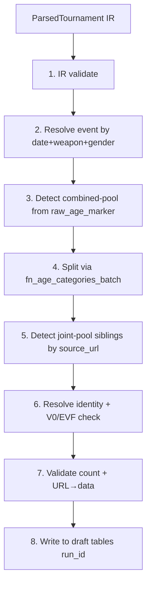

# Phase 3 — Stages 1-7 + alias writeback + 3-way diff + interactive CLI (L) ✅ DONE 2026-05-02

**Prerequisites:** Phase 2 ([p2-drafts.md](p2-drafts.md)) — draft tables + dry-run loop in place. ✅ shipped.

**Status:** All deliverables shipped on `main`. pgTAP 457 → 465 (+8 alias writeback), pytest 422 → 505 (+83 across 6 new test modules), vitest unchanged at 332.

## Goal

The unified pipeline body: stages 1-7 of the 11-stage flow. Per-event interactive review CLI. 3-way diff (Source / cert_ref / draft). Alias write-back. Matcher tuning loop.

## Locked design decisions (Phase 3 micro-RFC, 2026-05-02)

| Q | Decision | Notes |
|---|---|---|
| Q1 | Override YAML — 5 surfaces (identity, splitter, URL, match-method, joint-pool) | EVF V0 ack deliberately omitted: V0 + EVF = data corruption per R005b, fix upstream; no override path. |
| Q2 | Procedural pipeline + shared `PipelineContext` dataclass | Stages are free functions in `python/pipeline/stages.py`. Halt-by-exception (`HaltError`). |
| Q3 | Adapter shim for `process_xml_file` → keep untouched | Clarified: legacy function gets a deprecation note; Phase 6 deletes it. The "shim" framing was wrong. |
| Q4 | Separate `python/pipeline/review_cli.py` module | Own arg surface; no breaking change to `ingest_cli.py`. |
| Q5 | 3-way diff in pure Python | One language end-to-end; events are tens-of-rows so SQL JOIN performance is moot. |

## Pipeline stages (1-7 land here; 8-11 in Phase 4)

## Deliverables (all shipped 2026-05-02)

### Foundation — `python/pipeline/types.py`

✅ Single source of truth for pipeline data shape:
- `HaltError` + `HaltReason` enum (8 reasons)
- `Overrides` + 5 typed sub-classes (`IdentityOverride`, `SplitterOverrides`, `UrlOverride`, `MatchMethodOverride`, `JointPoolOverride`)
- `PipelineContext` dataclass — every stage's read/write contract documented in field annotations
- `StageMatchResult` — one identity-resolution result per row, with `alternatives` for ambiguous matches

8 pytest assertions (P3.T1-P3.T8) in `test_pipeline_types.py`.

### Override YAML parser — `python/pipeline/overrides.py`

✅ `load_for_event(event_code, overrides_dir=None) -> Overrides`. Validates:
- All 5 sections; missing file or empty file → empty `Overrides`
- Identity: must have `id_fencer` XOR `create_fencer` (mutually exclusive)
- Match-method: `force_method` must be in `{PENDING, AUTO_MATCHED, AUTO_CREATED, EXCLUDED}`
- Unknown top-level keys → `WARNING` log (forward-compat)
- Malformed YAML → `OverrideValidationError` with file path in message

15 pytest assertions (P3.OV1-P3.OV15). PyYAML promoted to runtime dep.

### Migration — `fn_update_fencer_aliases`

✅ `supabase/migrations/20260502000001_phase3_fn_alias_writeback.sql`:
- `fn_update_fencer_aliases(p_id_fencer INT, p_alias TEXT) RETURNS JSONB`
- Initializes NULL `json_name_aliases` as single-element array
- Appends to existing array, deduplicates case-insensitively
- Trims whitespace before storing/comparing
- Empty/whitespace-only alias rejected (warning + return current array)
- Returns updated array as JSONB

8 pgTAP assertions in `supabase/tests/28_alias_writeback.sql`.

### Pipeline stages — `python/pipeline/stages.py`

✅ Seven free functions, each `s_X(ctx, db) -> None`. Halts via `HaltError`.

| Stage | Reads | Writes | Halts on |
|---|---|---|---|
| `s1_validate_ir` | `ctx.parsed` | — | empty results, missing parsed_date/weapon/gender |
| `s2_resolve_event` | `ctx.parsed.parsed_date` | `ctx.event` | no event for date in active season |
| `s3_detect_combined_pool` | `ctx.parsed.results[].raw_age_marker` | `ctx.is_combined_pool` | (never) |
| `s4_split_via_batch` | `ctx.is_combined_pool`, `ctx.overrides.splitter` | `ctx.splits` | unresolved birth_year, under-30 fencer |
| `s5_detect_joint_pool` | `ctx.overrides.joint_pool` | `ctx.joint_pool_siblings` | (never) |
| `s6_resolve_identity` | `ctx.parsed`, `ctx.event`, `ctx.overrides`, `ctx.splits` | `ctx.matches` | V0 + (EVF\|FIE) per R005b |
| `s7_validate` | `ctx.parsed.raw_pool_size`, `ctx.matches` | `ctx.count_validation` | count diff > 1 |

29 pytest assertions in `test_pipeline_stages.py` (per-stage isolation + dispatcher tests).

### Orchestrator dispatcher — `python/pipeline/orchestrator.py`

✅ `run_pipeline(parsed, overrides, db, season_end_year) -> PipelineContext`. Stages resolved by name from `stages` module (so `monkeypatch.setattr(stages, name, fn)` works in tests). `HaltError` caught + halt fields populated; unexpected exceptions propagate. Legacy `process_xml_file` kept untouched with a deprecation note pointing to `run_pipeline`.

### DbConnector extensions — `python/pipeline/db_connector.py`

✅ Added:
- `find_event_by_code(event_code)` — review_cli lookup
- `fetch_cert_rows_for_event(event_code)` — 3-way diff source (Phase 3 stub returning `[]`; Phase 4 wires the cert_ref query)
- `call_age_categories_batch(birth_years, season_end_year)` — Stage 4 batch RPC wrapper

### 3-way diff — `python/pipeline/three_way_diff.py`

✅ `classify(source, cert, new_local) -> str` — 4-bucket logic per `project_cert_prod_not_baseline.md` semantics:
- `all-three-agree` (could share a bug; visual scan only)
- `new-corrects-cert` (new pipeline removed a CERT bug — desired output)
- `source-changed-only` (upstream changed; new pipeline missed)
- `three-way-disagreement` (red alert)

Equality: id_fencer-preferred, fencer_name-fallback (case-insensitive). `build_diff(source, cert, draft) -> [DiffRow]` joins by `place`. `confidence_histogram(matches) -> {bin: count}` for matcher-tuning visibility (7 bins). `render_markdown(...)` → markdown with bucket summary, per-bucket detail tables, histogram table. `write_diff(event_code, content, staging_dir)` writes to `doc/staging/<event_code>.diff.md`.

12 pytest assertions in `test_three_way_diff.py`.

### Interactive CLI — `python/pipeline/review_cli.py`

✅ `ReviewSession` class with injectable prompt + output (testable without stdin). Lifecycle:
1. `show_event_summary()` — fetch event by code, display dates/status/url
2. `prompt_source_choice()` — 4 choices (recorded URL / paste URL / paste path / EVF API) + skip
3. `fetch_source(choice)` — dispatches to `Fetcher` (URL / path / EVF API)
4. `run_iteration(parsed)` — overrides hot-reloaded → run_pipeline → write drafts → 3-way diff written
5. `prompt_action()` — commit / discard / iterate
6. `commit()` / `discard()` — invokes `DraftStore` RPCs

CLI entry: `python -m pipeline.review_cli <event_code>`. Frozen-snapshot source-of-truth deferred to Phase 4 per master plan boundary (needs ADR-051).

15 pytest assertions in `test_review_cli.py` (incl. EVF API path per `project_evf_predominance.md` correction — EVF events are predominant, source-of-truth on EVF site).

### End-to-end integration test — `python/tests/test_pipeline_integration.py`

✅ 4 integration tests against live LOCAL Supabase (skip cleanly when unreachable, matching the `test_ir.py` pattern):
- `test_run_pipeline_resolves_event_for_active_season_date` — S2 against PPW1-2025-2026
- `test_run_pipeline_completes_through_s7` — full S1-S7 chain GREEN, no halt
- `test_draftstore_write_read_discard_round_trip` — DraftStore lifecycle through Phase 2 RPCs
- `test_three_way_diff_renders_for_pipeline_output` — full stack: pipeline → diff → markdown file

## Risk gate (all met 2026-05-02)

- ✅ Pipeline runs end-to-end against a real active-season event with no halt.
- ✅ 3-way diff renders to `doc/staging/<event_code>.diff.md` (test_three_way_diff_renders_for_pipeline_output).
- ✅ Interactive CLI completes a full event loop (ReviewSession.run() returns terminal state).
- ✅ Matcher config hot-reloads via per-iteration `load_for_event()` call (overrides re-read each iteration).
- ✅ All three test suites GREEN (pgTAP 465, pytest 505+2 skip, vitest 332).

## Deferred to Phase 4 (per master plan boundaries, not time pressure)

- **Frozen-snapshot source-of-truth** — needs ADR-051.
- **Production fetcher wiring** — `Fetcher` raises `NotImplementedError` for `fetch_url` / `fetch_path` / `fetch_evf_api`; tests inject mocks. Phase 4 wires the existing scrapers (FT-XML / FTL / Engarde / 4Fence / Dartagnan / Ophardt / file_import / EVF API) to the Fetcher methods.
- **`fetch_cert_rows_for_event` query** — returns `[]` in Phase 3 (cert_ref is populated in Phase 4 via `scripts/load-cert-ref.sh`). Phase 4 wires the actual cert_ref join.
- **EVF parity gate (R011)** — Phase 4 ADR-053.
- **URL→data deep validation** (full re-fetch + cross-check, R009/ADR-052) — Phase 4.

## Cross-references

- Master plan: [now-we-have-a-precious-wren.md](/Users/aleks/.claude/plans/now-we-have-a-precious-wren.md)
- Predecessor: [p2-drafts.md](p2-drafts.md)
- Successor: [p4-commit-ui.md](p4-commit-ui.md) — Stage 8 (commit) + frozen snapshot + EVF parity gate + alias UI
- Implements rules: R001 (combined-pool, S4), R002 (joint-pool, S5), R005b (V0/EVF, S6), R006 (auto-create domestic, S6)
