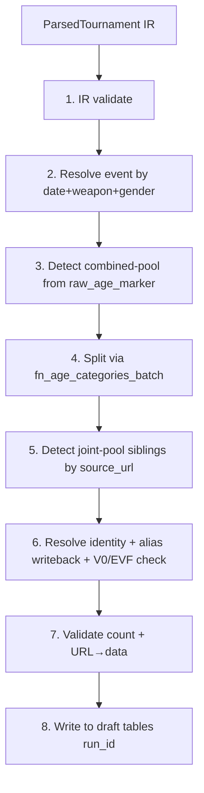

# Phase 3 — Stages 1-7 + alias writeback + 3-way diff + interactive CLI (L)

**Prerequisites:** Phase 2 ([p2-drafts.md](p2-drafts.md)) — draft tables + dry-run loop in place.

## Goal

The unified pipeline body: stages 1-7 of the 11-stage flow. Per-event interactive review CLI. 3-way diff (Source / cert_ref / draft). Alias write-back. Matcher tuning loop.

## Pipeline stages (1-7 land here; 8-11 in Phase 4)

## Deliverables

### Orchestrator rewrite

- [python/pipeline/orchestrator.py](../../../python/pipeline/orchestrator.py) rewritten as **stage-based pipeline**.

### Stage internals

- **Stage 4** calls `fn_age_categories_batch` (one RPC per pool, **not** per fencer).
- **Stage 6** alias writeback: `fn_update_fencer_aliases(p_id_fencer INT, p_alias TEXT)` appends after each `USER_CONFIRMED` decision.
- **Stage 6** populates `MatchResult.alternatives` for ambiguous matches; diff renders top-N candidates.
- **Stage 7** URL→data validation enforcement (ADR-052).

### Override format

- New: `doc/overrides/<event_code>.yaml` — manual identity mappings, splitter hints, URL overrides.
- **Schema must be locked** before any Phase 5 events use overrides (open risk #2 in master).

### Interactive source-of-truth CLI

`ingest_cli.py review-event <event_code>` walks events one at a time. Per event:

1. Show event details, recorded URLs, CERT (= `cert_ref`) summary.
2. Prompt for source-of-truth choice:
   - `[1]` Use recorded URL
   - `[2]` Paste different URL
   - `[3]` Paste XML path
   - `[4]` EVF API (if `organizer = EVF`)
   - `[5]` Frozen snapshot
   - `[q]` Skip

### 3-way diff format

- Per-event diff at `doc/staging/<event_code>.diff.md`.
- Three columns per result row:
  - **Source** (live URL/file/EVF)
  - **CERT** (`cert_ref` schema)
  - **New LOCAL** (draft tables)
- SQL queries join `public.tbl_*_draft` ↔ `cert_ref.tbl_*` ↔ parsed-IR.
- Highlight rows where any pair disagrees; group by:
  - `agree-3`
  - `source-changed`
  - `pipeline-regression`
  - `new-bug`
- Append: confidence-distribution histogram for matcher quality review.

### New file

- `python/pipeline/three_way_diff.py` — generates Source/CERT/LOCAL diff markdown.

### Matcher tuning loop

- Per-event diff includes confidence-distribution histogram and top borderline cases.
- Operator edits `python/matcher/config.yaml` (thresholds, Polish normalizations, nicknames); orchestrator hot-reloads on next iteration.
- Final tuned config shipped at end of rebuild.

### Test coverage

- pytest + pgTAP coverage for **each stage**.

### Files modified

- [python/matcher/pipeline.py](../../../python/matcher/pipeline.py) — alias writeback, alternatives.
- [python/matcher/fuzzy_match.py](../../../python/matcher/fuzzy_match.py) — alternatives population.

## Risk gate

- Dry-run on **5 known-good events** produces 3-way diffs with **zero true-positive divergence** vs `cert_ref` data.
- Interactive CLI completes a full event loop end-to-end.
- Matcher config edits take effect on re-run (hot-reload works).

## Cross-references

- Master plan: [now-we-have-a-precious-wren.md](/Users/aleks/.claude/plans/now-we-have-a-precious-wren.md)
- Predecessor: [p2-drafts.md](p2-drafts.md)
- Successor: [p4-commit-ui.md](p4-commit-ui.md) — picks up at Stage 8 (commit) + adds frozen-snapshot + parity gate + alias UI
- Implements rules: R001 (combined-pool), R002 (joint-pool), R005 (POL-only), R005b (V0/EVF), R006 (auto-create domestic), R009 (URL→data), R011 (source priority)
