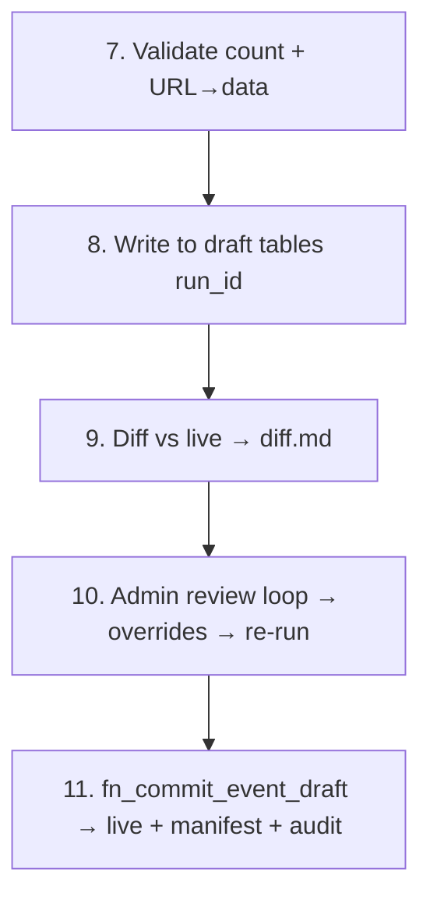

# Phase 4 — Commit path + frozen snapshot + EVF parity gate + alias UI (L)

**Prerequisites:** Phase 3 ([p3-pipeline.md](p3-pipeline.md)) — Stages 1-7 + interactive CLI in place.

## Goal

Stages 8-11 of the pipeline (commit path). Frozen-snapshot mode for events with no live source. EVF parity gate (transitive trust). New alias-management UI shipped alongside the existing identity UI.

## Pipeline stages 8-11

## Deliverables

### Commit path

- Stages 8-11 commit path implementation.
- `fn_commit_event_draft` already exists from Phase 2; this phase wires the orchestrator to it and adds Telegram notification on commit.

### Frozen snapshot

- `FROZEN_SNAPSHOT` detection in **Stage 0** (skips parsing, copies tournaments + results from PROD seed via `python/pipeline/copy_from_prod.py`).
- New file: `python/pipeline/copy_from_prod.py`.
- Pipeline degenerates to: copy `cert_ref.tbl_tournament` + `cert_ref.tbl_result` rows into `tbl_*_draft` with `tbl_event.txt_source_status = 'FROZEN_SNAPSHOT'`; diff shows only CERT vs LOCAL (Source column = ∅); approve → commit.

### EVF parity gate (ADR-053)

Post-commit, for **EVF-organized events only**, run an EVF API parity check with three sub-checks:

1. POL count matches.
2. Placements match.
3. Score within ±0.5 tolerance.

On parity failure: set `tbl_event.enum_status = 'SCORED'` with notes in `tbl_event.txt_parity_notes`.

### Notifications

- Telegram notification on commit.

### Test coverage

- pgTAP coverage for `fn_commit_event_draft` happy path **and** parity gate.

### Frontend — new alias-management UI (stands up alongside existing identity UI)

- New mockup `doc/mockups/m11_fencer_aliases.html` with **🇬🇧/🇵🇱 toggle** (per [feedback_lang_toggle.md](/Users/aleks/.claude/projects/-Users-aleks-coding-SPWSranklist/memory/feedback_lang_toggle.md)).
- New view `vw_fencer_aliases` exposing `(id_fencer, txt_first_name, txt_surname, json_name_aliases, ts_last_alias_added)`.
- New RPCs (admin-only RLS):
  - `fn_add_fencer_alias`
  - `fn_revoke_fencer_alias`
  - `fn_list_fencer_aliases`
- New Svelte component [frontend/src/components/FencerAliasManager.svelte](../../../frontend/src/components/FencerAliasManager.svelte) — list fencers with alias counts, expand to see alias list, add/revoke alias inline.
- [frontend/src/lib/api.ts](../../../frontend/src/lib/api.ts) — add wrappers for the three new RPCs.
- [frontend/src/lib/types.ts](../../../frontend/src/lib/types.ts) — add `FencerWithAliases` type.
- [frontend/src/App.svelte](../../../frontend/src/App.svelte) — add route alongside existing `IdentityManager` route (both coexist in Phase 4; old one removed in Phase 6).
- vitest coverage in [frontend/tests/api.test.ts](../../../frontend/tests/api.test.ts).

### Migrations

- `supabase/migrations/2026MMDD_alias_management.sql` (`vw_fencer_aliases` + 3 RPCs).

## Risk gate

- Single test event commits cleanly.
- Joint-pool flag set correctly.
- Parity gate failures correctly route to `SCORED` status with `txt_parity_notes` populated.
- Alias UI loads, lists fencers with aliases, add/revoke round-trips through DB.

## Cross-references

- Master plan: [now-we-have-a-precious-wren.md](/Users/aleks/.claude/plans/now-we-have-a-precious-wren.md)
- Predecessor: [p3-pipeline.md](p3-pipeline.md)
- Successor: [p5-execute.md](p5-execute.md) — operational rebuild uses the full commit pipeline
- Implements rules: R010 (frozen snapshot)
- ADRs introduced/amended here: ADR-051 (frozen snapshot), ADR-053 (EVF parity)
