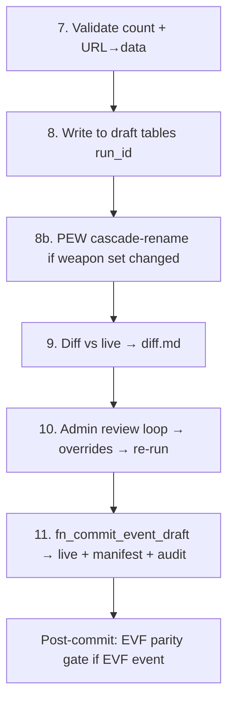

# Phase 4 — Commit path + EVF parity gate + alias UI (L)

**Prerequisites:** Phase 3 ([p3-pipeline.md](p3-pipeline.md)) — Stages 1-7 + interactive CLI in place.

## Goal

Stages 8-11 of the pipeline (commit path). EVF parity gate that auto-promotes EVF events from `ENGINE_COMPUTED` to `EVF_PUBLISHED` when EVF API agrees with our engine. New alias-management UI shipped alongside the existing identity UI.

## Pipeline stages 8-11

## Deliverables

### Commit path

- Stages 8-11 commit path implementation.
- `fn_commit_event_draft` already exists from Phase 2; this phase wires the orchestrator to it and adds Telegram notification on commit.
- **Stage 8b (NEW)** — for PEW events whose child-tournament weapon set changed, post-commit cascade-rename via `fn_pew_weapon_letters` (per ADR-046).

### Cert_ref fallback as a parser

- New parser module `python/pipeline/parsers/cert_ref_parser.py` — reads `cert_ref.tbl_tournament` + `cert_ref.tbl_result` rows for an event and produces `ParsedTournament` IR.
- Registered as the 9th parser. When operator picks `[5]` in review CLI, the parser produces IR; pipeline runs Stages 1-11 normally; engine computes points; commit is identical to any other source.
- Stage 7 (URL→data validation) skipped for `[5]` since there's no URL to validate.
- No special status — events sourced from `[5]` end up at `txt_source_status = 'ENGINE_COMPUTED'` like every other event.

### EVF parity gate (ADR-053)

Two-state `txt_source_status` enum:
- `ENGINE_COMPUTED` — engine output, default.
- `EVF_PUBLISHED` — points overwritten with EVF API's authoritative numbers, post-parity-pass.

DB-level CHECK enforces SPWS/FIE cannot have `EVF_PUBLISHED`.

Parity gate runs automatically post-commit for EVF-organized events. Three sub-checks:
1. POL count match.
2. Placements match (absolute, foreigners-as-gaps).
3. Score within ±0.5 tolerance per fencer.

On PASS: auto-promote — overwrite `tbl_result.num_*_score` with EVF's verbatim, flip `txt_source_status = 'EVF_PUBLISHED'`, audit log, Telegram.
On FAIL: stay `ENGINE_COMPUTED`, set `txt_parity_notes`, Telegram alert with all failing fencers.

Daily cron `python -m pipeline.evf_parity_sweep` walks `txt_organizer = 'EVF' AND txt_source_status = 'ENGINE_COMPUTED'` events and probes EVF API. 30-day retry window, then annotate "EVF API empty after 30 days" and stop.

### URL→data validation (ADR-052)

Stage 7 implementation: opportunistic per-field comparison between scraped metadata and event row.

| Field | Behavior |
|---|---|
| Date (±1 day tol) | Halt |
| Weapon | Halt for non-PEW; flag-for-rename for PEW (Stage 8b) |
| Gender | Halt |
| Age category | Halt; skipped on combined-pool sources |
| Country (ISO-3 normalize) | Halt |
| City (alias-table normalize) | Halt |
| Name | Warn only |

New artifacts:
- `python/pipeline/url_validation.py` — Stage 7 implementation.
- `python/pipeline/city_aliases.yaml` — alias map seed.
- Override YAML gains `url_overrides.city` as 6th surface.

### Notifications

Single-channel Telegram activity log. All triggers:
- 📨 Routine commit
- ✅ Promotion to EVF_PUBLISHED
- 🚨 Parity FAIL (all failing fencers listed)
- 🚨 Stage 7 halt (with mismatch field)
- ℹ️ EVF API empty 30d annotation
- 📊 Daily cron sweep summary

Within-event batching: commit + parity-pass + cascade-rename in one pipeline run = single combined message.

### Test coverage

- pgTAP — `txt_source_status` CHECK constraint, parity-promote happy path, parity-fail annotation, alias-uniqueness trigger.
- pytest — `evf_parity` (3 sub-checks), `evf_parity_sweep` cron logic, `url_validation` per-field, cert_ref-parser IR shape, alias RPCs (transfer/create-from/discard).
- vitest — `FencerAliasManager.svelte` view + three actions, modal flows.

### Frontend — new alias-management UI

- New mockup `doc/mockups/m11_fencer_aliases.html` with **🇬🇧/🇵🇱 toggle** (per [feedback_lang_toggle.md](/Users/aleks/.claude/projects/-Users-aleks-coding-SPWSranklist/memory/feedback_lang_toggle.md)).
- New view `vw_fencer_aliases` exposing all fencers with `(id_fencer, txt_first_name, txt_surname, json_name_aliases, alias_count, ts_last_alias_added)`. UI defaults to filter `alias_count > 0`.
- New RPCs (admin-only RLS):
  - `fn_list_fencer_aliases` — read for the UI.
  - `fn_add_fencer_alias` — matcher-only (review CLI ingest path), kept from subplan.
  - `fn_transfer_fencer_alias(p_from, p_to, p_alias)` — atomic move + reassign `tbl_result.id_fencer` + scoring recompute on both fencers + audit.
  - `fn_split_fencer_from_alias(p_from, p_alias, p_new_fencer_data)` — create fencer (via `CreateFencerModal` reuse) + atomic move + reassign + scoring recompute + audit.
  - `fn_discard_fencer_alias_and_results(p_from, p_alias)` — tombstone alias on `json_revoked_aliases` + hard-delete affected `tbl_result` rows + scoring recompute + audit.
- New Svelte component `frontend/src/components/FencerAliasManager.svelte` — list fencers (default-filtered to `alias_count > 0`), expand to alias chips, three actions per chip: **Transfer** (reuses `FencerSearchModal.svelte`), **Create new fencer** (reuses `CreateFencerModal.svelte`), **Discard** (preview + confirm).
- All three operations show preview before commit (which `tbl_result` rows affected, scoring delta).
- Alias UI is view + correction only — no free-text alias input. Aliases originate exclusively from matcher decisions during ingestion.
- New schema column `tbl_fencer.json_revoked_aliases jsonb DEFAULT '[]'` — matcher consults to skip auto-rebinding tombstoned strings to the same fencer.
- Cross-fencer alias uniqueness invariant — trigger-enforced (no alias string appears on more than one fencer's `json_name_aliases`).
- [frontend/src/lib/api.ts](../../../frontend/src/lib/api.ts) — add wrappers for the four UI-facing RPCs.
- [frontend/src/lib/types.ts](../../../frontend/src/lib/types.ts) — add `FencerWithAliases` type.
- [frontend/src/App.svelte](../../../frontend/src/App.svelte) — add route alongside existing `IdentityManager` (both coexist in Phase 4; old one removed in Phase 6).
- vitest coverage in [frontend/tests/api.test.ts](../../../frontend/tests/api.test.ts).

### Migrations

- `2026MMDD_evf_parity_lifecycle.sql` — add `tbl_event.txt_source_status` (ENGINE_COMPUTED / EVF_PUBLISHED), `tbl_event.txt_parity_notes`, CHECK constraint per ADR-053. Replaces the old phase0 enum.
- `2026MMDD_alias_management.sql` — `vw_fencer_aliases` + 5 RPCs + `tbl_fencer.json_revoked_aliases` column + cross-fencer alias-uniqueness trigger.

## Risk gate

- Single test event commits cleanly through Stages 8-11.
- Joint-pool flag set correctly post-commit.
- Parity-PASS on a known-good EVF event flips status to `EVF_PUBLISHED` and overwrites engine points.
- Parity-FAIL on a synthetic divergence keeps event at `ENGINE_COMPUTED` with `txt_parity_notes` populated.
- Alias UI loads, lists fencers with aliases, transfer/create/discard each round-trip through DB and audit-log correctly.
- Stage 7 halts on each of the six halt fields when seeded with a synthetic mismatch.
- DB CHECK rejects `SPWS event with txt_source_status = 'EVF_PUBLISHED'`.

## Cross-references

- Master plan: [now-we-have-a-precious-wren.md](/Users/aleks/.claude/plans/now-we-have-a-precious-wren.md)
- Predecessor: [p3-pipeline.md](p3-pipeline.md)
- Successor: [p5-execute.md](p5-execute.md) — operational rebuild uses the full commit pipeline
- Implements rules: R009 (URL→data validation, ADR-052), R011 (EVF parity, ADR-053)
- ADRs introduced/amended here: ADR-052 (URL→data validation), ADR-053 (EVF parity gate + EVF_PUBLISHED promotion). ADR-051 was reserved for frozen-snapshot but the concept was retired 2026-05-02 (cert_ref fallback became just-another-parser).
